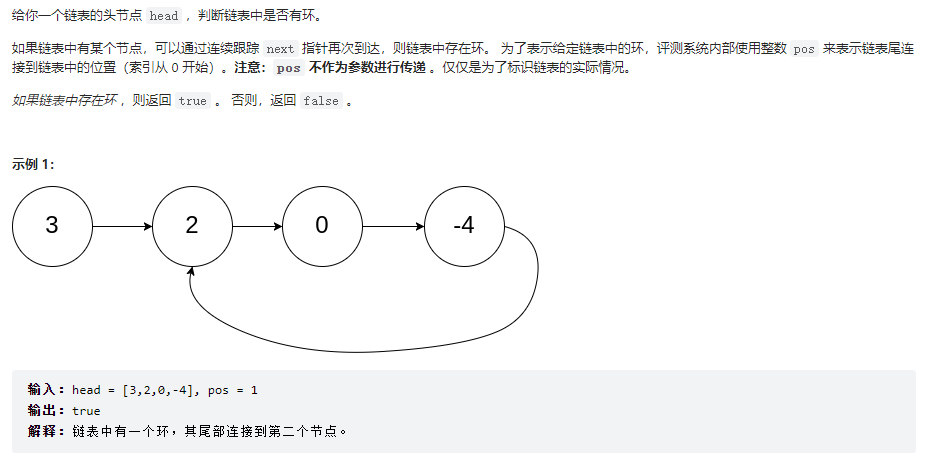
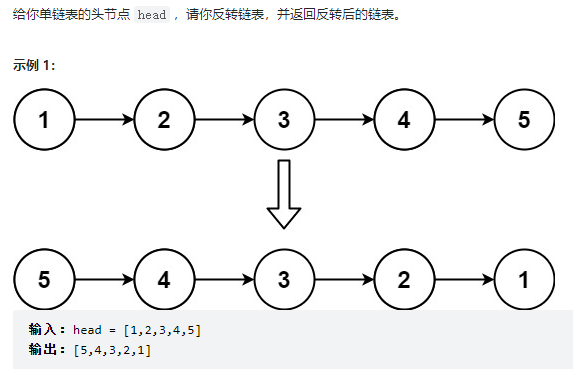
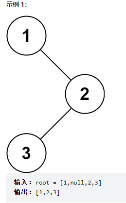
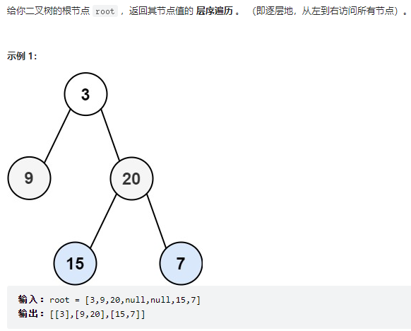
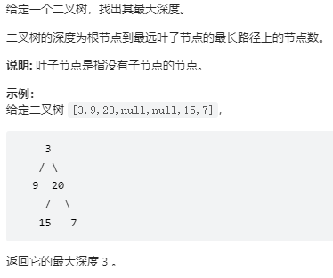
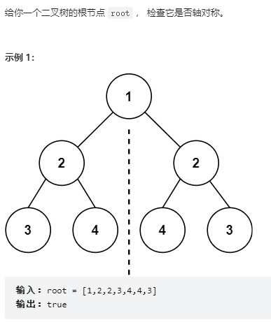
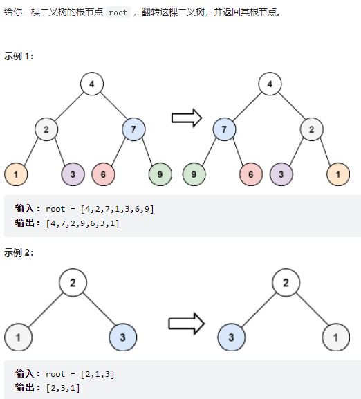
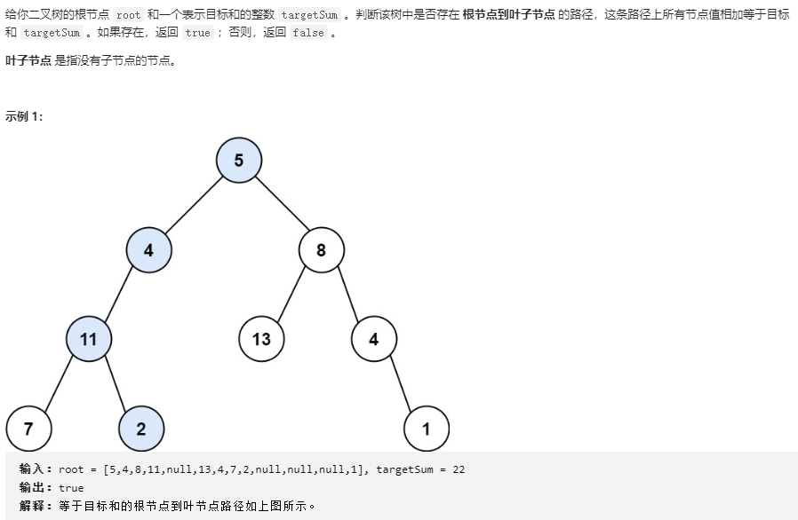
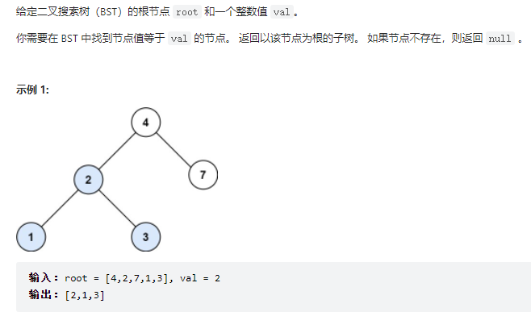
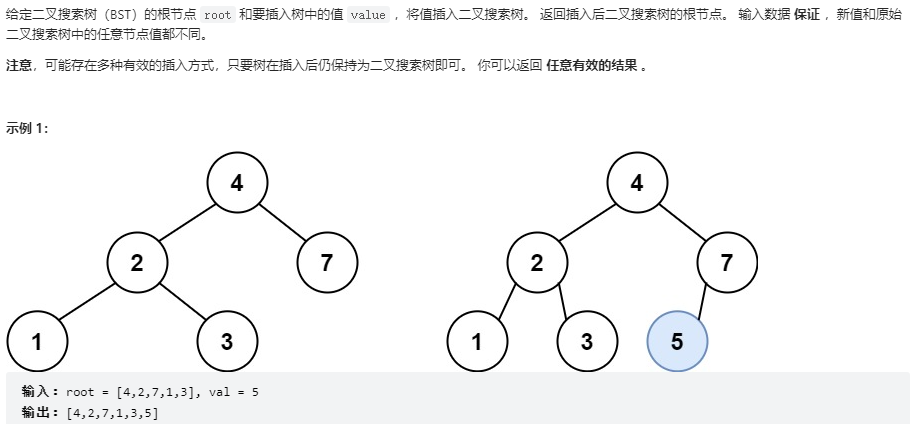

## 1.数组

## 2.链表
### 2.1 环形链表

思路：使用快慢指针，当快指针追上慢指针，为环形链表。
```java
/**
 * Definition for singly-linked list.
 * class ListNode {
 *     int val;
 *     ListNode next;
 *     ListNode(int x) {
 *         val = x;
 *         next = null;
 *     }
 * }
 */
public class Solution {
    public boolean hasCycle(ListNode head) {
        if(head==null || head.next==null)
            return false;
        //快指针，一次前进两个节点
        ListNode fast = head;
        //慢指针，一次前进一个节点
        ListNode low = head;
        while(fast!=null&&fast.next!=null){
            fast=fast.next.next;
            low=low.next;
            if(fast==low)
                return true;
        }
        return false;
    }
}
```
### 2.2 链表反转

#### 栈实现

#### 头插法

####　就地反转法

#### 递归法

## 3.栈

## 4.队列

## 5.二叉树
### 5.1 二叉树的遍历
给出一个二叉树的根节点root，分别用前序遍历、中序遍历、后续遍历返回它的节点值。
```java
/**
 * Definition for a binary tree node.
 * public class TreeNode {
 *     int val;
 *     TreeNode left;
 *     TreeNode right;
 *     TreeNode() {}
 *     TreeNode(int val) { this.val = val; }
 *     TreeNode(int val, TreeNode left, TreeNode right) {
 *         this.val = val;
 *         this.left = left;
 *         this.right = right;
 *     }
 * }
 *输入：root = [1,null,2,3]
 *输出：[1,2,3]
 */
```

#### 前序遍历
```java
//递归法
class Solution {
    List<Integer> list = new ArrayList<>(); 
    public List<Integer> preorderTraversal(TreeNode root) {        
        digui(root);
        return list;
    }

    public void digui(TreeNode root){
        if(root == null) return;
        list.add(root.val);
        digui(root.left);
        digui(root.right);
    }
}

//迭代法
class Solution {
    public List<Integer> preorderTraversal(TreeNode root) {
        List<Integer> list = new ArrayList<>();        
        diedai(root,list);
        return list;
    }
    public void diedai(TreeNode root,List list){
        //创建栈，保存父节点
        Stack<TreeNode> stack = new Stack<>();
        while(root!=null || !stack.isEmpty()){
            while(root!=null){
                //list.add(root.val);
                stack.add(root);
                root=root.left;
            }
            //弹栈，打印右子树
            root=stack.pop();
        }
    }
}
```

#### 中序遍历
```java
//递归法
class Solution {
    List<Integer> list = new ArrayList<>();
    public List<Integer> inorderTraversal(TreeNode root) {
        digui(root);
        return list;
    }
    public void digui(TreeNode root){
        if(root==null) return;
        
        digui(root.left);
        list.add(root.val);
        digui(root.right);
    }
}

//迭代法
class Solution {
    List<Integer> list = new ArrayList<>();
    public List<Integer> inorderTraversal(TreeNode root) {
        diedai(root,list);
        return list;
    }
    public void diedai(TreeNode root,List list){
        Stack<TreeNode> stack = new Stack<>();
        while(root!=null || !stack.isEmpty()){
            if(root!=null){
                stack.push(root);
                root=root.left;
            }else{
                root=stack.pop();
                list.add(root.val);
                root=root.right;
            }
        }
    }
}
```

#### 后序遍历
```java
 //递归法
class Solution {
    ArrayList<Integer> list = new ArrayList<>();
    public List<Integer> postorderTraversal(TreeNode root) {
        digui(root);
        return list;
    }
    public void digui(TreeNode root){
        if(root==null){
            return;  
        }  
        digui(root.left);
        digui(root.right);
        list.add(root.val);
    }
}
 //迭代法
class Solution {
    public List<Integer> postorderTraversal(TreeNode root) {
    List<Integer> list = new ArrayList<>();        
        diedai(root,list);
        return list;
    }

    public void diedai(TreeNode root,List list){
        //创建栈，保存父节点
        Stack<TreeNode> stack = new Stack<>();
        //上一访问节点
        TreeNode pre = null;
        while(root!=null || !stack.isEmpty()){
            while(root!=null){
                stack.push(root);
                root=root.left;
            }
            root=stack.pop();
            if(root.right==null||pre==root.right){
                list.add(root.val);
                pre=root;
                root=null;
            }else{
                //右子树未访问到根，父节点再次入栈，访问右子树
                stack.push(root);
                root=root.right;
            }
        }
    }
}
```

### 5.2 二叉树的层序遍历

```java
/**
 * Definition for a binary tree node.
 * public class TreeNode {
 *     int val;
 *     TreeNode left;
 *     TreeNode right;
 *     TreeNode() {}
 *     TreeNode(int val) { this.val = val; }
 *     TreeNode(int val, TreeNode left, TreeNode right) {
 *         this.val = val;
 *         this.left = left;
 *         this.right = right;
 *     }
 * }
 */
class Solution {
    List<List<Integer>> relist = new ArrayList<List<Integer>>();
    public List<List<Integer>> levelOrder(TreeNode root) {
        // 迭代法（借助队列）
        //way01(root);
        // 递归法
        way02(root,0);
        return relist;  
    }
    public void way01(TreeNode node){
        if(node == null) return;
        Queue<TreeNode> que = new LinkedList<TreeNode>();
        que.offer(node);

        while(!que.isEmpty()){
            List<Integer> list = new ArrayList<>();
            int len = que.size();
            while(len > 0){
                TreeNode cur = que.peek();
                list.add(cur.val);
                if(cur.left!=null) que.offer(cur.left);
                if(cur.right!=null) que.offer(cur.right);
                len--;
            }
            relist.add(list);
        }
    }

    public void way02(TreeNode node,int deep){
        if(node == null) return;
        deep++;

        if(relist.size()<deep){
            List<Integer> list = new ArrayList<>();
            relist.add(list);
        }
        relist.get(deep-1).add(node.val);

        way02(node.left,deep);
        way02(node.right,deep);
    }
}
```

### 5.3  二叉树的最大深度

```java
/**
 * Definition for a binary tree node.
 * public class TreeNode {
 *     int val;
 *     TreeNode left;
 *     TreeNode right;
 *     TreeNode() {}
 *     TreeNode(int val) { this.val = val; }
 *     TreeNode(int val, TreeNode left, TreeNode right) {
 *         this.val = val;
 *         this.left = left;
 *         this.right = right;
 *     }
 * }
 */
class Solution {
    public int maxDepth(TreeNode root) {
        // 递归法
        return digui(root);
        //迭代法，使用层序遍历
        //return diedai(root);

    }

    public int digui(TreeNode root){
        if(root == null) return 0;

        int leftdepth = digui(root.left);
        int rightdepth = digui(root.right);
        //return math.max(leftdepth, rightdepth) + 1;
        return (leftdepth > rightdepth ? leftdepth:rightdepth) + 1;
    }
    public int diedai(TreeNode root){
        if(root == null) return 0;
        Queue<TreeNode> que = new LinkedList<TreeNode>();
        int depth = 0;
        que.offer(root);

        while(!que.isEmpty()){
            depth++;
            int dsize = que.size();
            for(int i=0;i<dsize;i++){
                TreeNode cur = que.poll();

                if(cur.left!=null) que.offer(cur.left);
                if(cur.right!=null) que.offer(cur.right);
            }
        }
        return depth;
    }
}
```

### 5.4 对称二叉树

```java
/**
 * Definition for a binary tree node.
 * public class TreeNode {
 *     int val;
 *     TreeNode left;
 *     TreeNode right;
 *     TreeNode() {}
 *     TreeNode(int val) { this.val = val; }
 *     TreeNode(int val, TreeNode left, TreeNode right) {
 *         this.val = val;
 *         this.left = left;
 *         this.right = right;
 *     }
 * }
 */
class Solution {
    public boolean isSymmetric(TreeNode root) {
        //迭代法
        //return diedai(root);
        //递归法
        return digui(root.left,root.right);
    }

    public boolean diedai(TreeNode node){
        if(node == null) return false;
        Queue<TreeNode> que = new LinkedList<>();
        que.offer(node.left);
        que.offer(node.right);

        while(!que.isEmpty()){
            TreeNode node1 = que.poll();
            TreeNode node2 = que.poll();
            if (node1 == null && node2 == null) {
                continue;
            }
            if(node1==null || node2==null || node1.val != node2.val)
                return false;
            que.offer(node1.left);
            que.offer(node2.right);
            que.offer(node1.right);
            que.offer(node2.left);
        }
        return true;
    }
    public boolean digui(TreeNode left,TreeNode right){       
        if (left == null && right != null) {
            return false;
        }
        if (left != null && right == null) {
            return false;
        }
        if (left == null && right == null) {
            return true;
        }
        if (left.val != right.val) {
            return false;
        }   
        boolean in_b = digui(left.left,right.right);
        boolean out_b = digui(left.right,right.left);
        return in_b && out_b;
    }
}
```

### 5.5 翻转二叉树

- 思路：交换头节点的左右子节点，再按层次依次交换节点的两个子节点。
```java
/**
 * Definition for a binary tree node.
 * public class TreeNode {
 *     int val;
 *     TreeNode left;
 *     TreeNode right;
 *     TreeNode() {}
 *     TreeNode(int val) { this.val = val; }
 *     TreeNode(int val, TreeNode left, TreeNode right) {
 *         this.val = val;
 *         this.left = left;
 *         this.right = right;
 *     }
 * }
 */
class Solution {
    public TreeNode invertTree(TreeNode root) {
        // //迭代法
        // if(root==null) return root;
        // Queue<TreeNode> que = new LinkedList<>();
        // que.offer(root);
        // while(!que.isEmpty()){
        //     int size = que.size();
        //     while(size-- > 0){
        //         TreeNode node = que.poll();
        //         TreeNode tmp = node.left;
        //         node.left = node.right;
        //         node.right = tmp;

        //         if(node.left!=null) que.offer(node.left);
        //         if(node.right!=null) que.offer(node.right);
        //     }
        // }
        // return root;
        //递归法
        if(root==null) return root;
        if(root.left!=null || root.right!=null){
            TreeNode tmp = root.left;
            root.left = root.right;
            root.right = tmp;

            root.left = invertTree(root.left);
            root.right = invertTree(root.right);
        }

        return root;

    }
}
```

### 5.6 路径总和

- 思路：
  - 迭代法：使用两个栈，一个栈储存节点，一个栈储存迭代到该节点值的和，节点出栈，判断是否是最后一个节点及和满足条件，有子节点，子节点、迭代到该节点的和入栈，继续出栈/入栈操作。
  - 递归法：目标值随递归依次减去节点值，到叶子节点值为0时。返回true。注意判断递归结果，为true时才返回ture。
```java
/**
 * Definition for a binary tree node.
 * public class TreeNode {
 *     int val;
 *     TreeNode left;
 *     TreeNode right;
 *     TreeNode() {}
 *     TreeNode(int val) { this.val = val; }
 *     TreeNode(int val, TreeNode left, TreeNode right) {
 *         this.val = val;
 *         this.left = left;
 *         this.right = right;
 *     }
 * }
 */
 // 迭代法
// class Solution {
//     public boolean hasPathSum(TreeNode root, int targetSum) {
//         if(root==null) return false;
//         Stack<TreeNode> stack1 = new Stack<>();
//         Stack<Integer> stack2 = new Stack<>();

//         stack1.push(root);
//         stack2.push(root.val);

//         while(!stack1.isEmpty()){
//             int size = stack1.size();
//             for(int i=0;i<size;i++){
//                 TreeNode node = stack1.pop();
//                 int sum = stack2.pop();

//                 if(node.left==null && node.right==null && sum==targetSum) return true;
//                 if(node.left != null){
//                     stack1.push(node.left);
//                     stack2.push(sum+node.left.val);
//                 }
//                 if(node.right != null){
//                     stack1.push(node.right);
//                     stack2.push(sum+node.right.val);
//                 }
//             }
//         }
//         return false;
//     }
// }

//递归法
class Solution {
    public boolean hasPathSum(TreeNode root, int targetSum) {
        if(root==null) return false;
        int sum = targetSum-root.val;
        if(root.left==null && root.right==null && sum==0) return true;

        if(root.left != null){
            if(hasPathSum(root.left,sum)) return true;
        }
        if(root.right != null){
            if(hasPathSum(root.right,sum)) return true;
        }

        return false;
        
    }
}
```

### 5.7 二叉搜索树中的搜索

```java
/**
 * Definition for a binary tree node.
 * public class TreeNode {
 *     int val;
 *     TreeNode left;
 *     TreeNode right;
 *     TreeNode() {}
 *     TreeNode(int val) { this.val = val; }
 *     TreeNode(int val, TreeNode left, TreeNode right) {
 *         this.val = val;
 *         this.left = left;
 *         this.right = right;
 *     }
 * }
 */
class Solution {
    public TreeNode searchBST(TreeNode root, int val) {
        //迭代法
        //return diedai(root,val);
        //递归法
        return digui(root,val);

    }
    public TreeNode diedai(TreeNode root,int num){
        Stack<TreeNode> stack = new Stack<>();
        while(root!=null || !stack.isEmpty()){
            while(root!=null){
               if(root.val==num) return root;
               stack.push(root);
               root=root.left;
            }
            root=stack.pop().right;
        }
        return null;
    }
    public TreeNode digui(TreeNode root,int num){
        if(root==null) return null;
        if(root.val==num) return root;
        TreeNode n1 = digui(root.left,num);
        if(n1!=null) return n1;
        TreeNode n2 = digui(root.right,num);
        if(n2!=null) return n2;

        return null;
    }
}
```

### 5.8 二叉搜索树中的插入操作

```java
/**
 * Definition for a binary tree node.
 * public class TreeNode {
 *     int val;
 *     TreeNode left;
 *     TreeNode right;
 *     TreeNode() {}
 *     TreeNode(int val) { this.val = val; }
 *     TreeNode(int val, TreeNode left, TreeNode right) {
 *         this.val = val;
 *         this.left = left;
 *         this.right = right;
 *     }
 * }
 */
class Solution {
    public TreeNode insertIntoBST(TreeNode root, int val) {
        //迭代法
        //return diedai(root,val);
        //递归法
        return digui(root,val);
    }
    public TreeNode diedai(TreeNode root,int val){
        TreeNode in_node = new TreeNode(val);
        if(root == null) return in_node;
        TreeNode cur = root;
        while(cur!=null){
            TreeNode tmp = cur.val>val?cur.left:cur.right;
            if(tmp==null){
                if(cur.val>val){
                    cur.left=in_node;
                    break;
                }else{
                    cur.right=in_node;
                    break;
                }
            }else{
                cur=tmp;
            }
        }
        
        return root;

    }
    public TreeNode digui(TreeNode root,int val){
        TreeNode in_node = new TreeNode(val);
        if(root == null) return in_node;
        TreeNode cur = root;
        if(cur.val>val){
            cur.left = digui(cur.left,val);
        }else{
            cur.right = digui(cur.right,val);
        }
        return root;
        
    }
}
```

## 6.排序

## 7.查找

## 8.图