## 1.数组
### 1.1 二分查找
#### 写法一：左闭右闭
定义 target 是在一个在左闭右闭的区间里，也就是[left, right] 。

- while (left <= right) 要使用 <= ，因为left == right是有意义的，所以使用 <=
- if (nums[middle] > target) right 要赋值为 middle - 1，因为当前这个nums[middle]一定不是target，那么接下来要查找的左区间结束下标位置就是 middle - 1
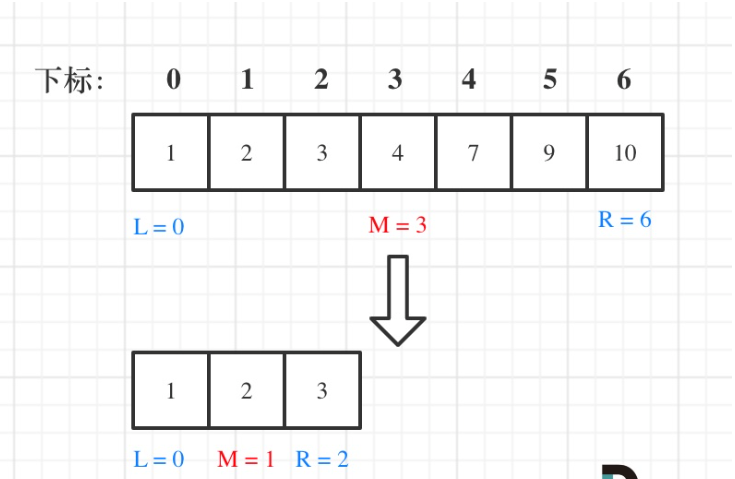

```java
class Solution {
    public int search(int[] nums, int target) {
        int min = 0;
        int max = nums.length-1;
        //左闭右闭
        while(min<=max){
            int mid = (min+max)/2;
            if(nums[mid]==target)
                return mid;
            else if(nums[mid]>target)
                max = mid-1;
            else if(nums[mid]<target)
                min = mid+1;
        }
        return -1;
    }
}
```

#### 写法二：左闭右开
定义 target 是在一个在左闭右开的区间里，也就是[left, right) 。

- while (left < right)，这里使用 < ,因为left == right在区间[left, right)是没有意义的
- if (nums[middle] > target) right 更新为 middle，因为当前nums[middle]不等于target，去左区间继续寻找，而寻找区间是左闭右开区间，所以right更新为middle，即：下一个查询区间不会去比较nums[middle]

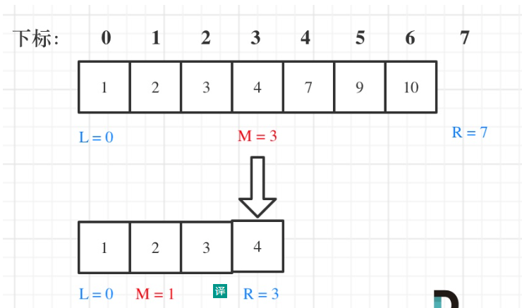

```java
class Solution {
    public int search(int[] nums, int target) {
        //左闭右开
        int min = 0;
        int max = nums.length;
        while(min<max){
            int mid = (min+max)/2;
            if(nums[mid] == target)
                return mid;
            else if(nums[mid]<target)
                min = mid + 1;
            else if(nums[mid]>target)
                max = mid;
        }
        return -1;
    }
}
```

## 2.链表
- 链表结构的更改依靠指针指向以及节点值的变化，如`head.next = head.next.next`将头结点指向其下下节点，或`head.val = 2`将头结点的值改为2。
- 指针之间的赋值并不能改变表结构，只能改变指针的指向，如`cur = head`将cur指向head。 
### 2.1 环形链表

思路：使用快慢指针，当快指针追上慢指针，为环形链表。
```java
/**
 * Definition for singly-linked list.
 * class ListNode {
 *     int val;
 *     ListNode next;
 *     ListNode(int x) {
 *         val = x;
 *         next = null;
 *     }
 * }
 */
public class Solution {
    public boolean hasCycle(ListNode head) {
        if(head==null || head.next==null)
            return false;
        //快指针，一次前进两个节点
        ListNode fast = head;
        //慢指针，一次前进一个节点
        ListNode low = head;
        while(fast!=null&&fast.next!=null){
            fast=fast.next.next;
            low=low.next;
            if(fast==low)
                return true;
        }
        return false;
    }
}
```
### 2.2 链表反转

```java
public class ListNode {
     int val;
     ListNode next;
     ListNode() {}
     ListNode(int val) { this.val = val; }
     ListNode(int val, ListNode next) { this.val = val; this.next = next; }
}
```
#### 栈实现
```java
class Solution {
    public ListNode reverseList(ListNode head) {
        if(head == null || head.next == null) return head;
        //创建栈
        Stack<Integer> stack = new Stack<>();
        while(head!=null){
            //节点值入栈
            stack.push(head.val);
            head = head.next;
        }
        //新建头结点
        ListNode res = new ListNode(-1);
        ListNode cur = res;

        while(!(stack.isEmpty())){
            //出栈，赋值给每个新节点
            cur.next = new ListNode(stack.pop());
            cur = cur.next;
            
        }
        return res.next;
    }
```
#### 头插法
```java
class Solution {
    public ListNode reverseList(ListNode head) {
        if(head == null || head.next == null) return head;
        //新建头结点及下一节点
        ListNode res = new ListNode(-1);
        ListNode cur = res.next;
        
        while(head!=null){
            //新建节点
            ListNode tmp = new ListNode(head.val);
            //将节点tmp插入res结点与其下一节点之间
            tmp.next = cur;
            res.next = tmp;
            //将cur标志指向tmp(res的下一节点)
            cur = tmp;
            head = head.next;

        }
        return res.next;
    }
```
#### 就地反转法
```java
class Solution {
    public ListNode reverseList(ListNode head) {
    if(head == null || head.next == null) return head;
        ListNode newhead = head;
        ListNode head_next = head.next;
        while(head_next!=null){
            head.next = head.next.next;
            head_next.next = newhead;
            newhead = head_next;
            head_next = head.next;
        }
        return newhead;
    }
```
#### 递归法
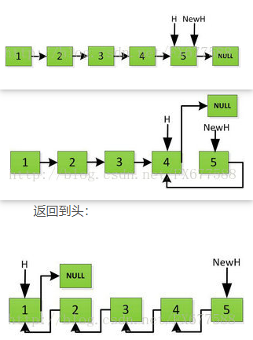
```java
class Solution {
    public ListNode reverseList(ListNode head) {
    if (head == null || head.next == null)return head;
        ////一直循环到链尾 
        ListNode newhead = way4_digui(head.next);
        ////翻转链表的指向
        head.next.next = head;
        //记得赋值NULL，防止链表错乱
        head.next = null;
        ////新链表头永远指向的是原链表的链尾
        return newhead;
    }
```
## 3.栈

## 4.队列

## 5.二叉树
### 5.1 二叉树的遍历
给出一个二叉树的根节点root，分别用前序遍历、中序遍历、后续遍历返回它的节点值。
```java
/**
 * Definition for a binary tree node.
 * public class TreeNode {
 *     int val;
 *     TreeNode left;
 *     TreeNode right;
 *     TreeNode() {}
 *     TreeNode(int val) { this.val = val; }
 *     TreeNode(int val, TreeNode left, TreeNode right) {
 *         this.val = val;
 *         this.left = left;
 *         this.right = right;
 *     }
 * }
 *输入：root = [1,null,2,3]
 *输出：[1,2,3]
 */
```

#### 前序遍历
```java
//递归法
class Solution {
    List<Integer> list = new ArrayList<>(); 
    public List<Integer> preorderTraversal(TreeNode root) {        
        digui(root);
        return list;
    }

    public void digui(TreeNode root){
        if(root == null) return;
        list.add(root.val);
        digui(root.left);
        digui(root.right);
    }
}

//迭代法
class Solution {
    public List<Integer> preorderTraversal(TreeNode root) {
        List<Integer> list = new ArrayList<>();        
        diedai(root,list);
        return list;
    }
    public void diedai(TreeNode root,List list){
        //创建栈，保存父节点
        Stack<TreeNode> stack = new Stack<>();
        while(root!=null || !stack.isEmpty()){
            while(root!=null){
                //list.add(root.val);
                stack.add(root);
                root=root.left;
            }
            //弹栈，打印右子树
            root=stack.pop();
        }
    }
}
```

#### 中序遍历
```java
//递归法
class Solution {
    List<Integer> list = new ArrayList<>();
    public List<Integer> inorderTraversal(TreeNode root) {
        digui(root);
        return list;
    }
    public void digui(TreeNode root){
        if(root==null) return;
        
        digui(root.left);
        list.add(root.val);
        digui(root.right);
    }
}

//迭代法
class Solution {
    List<Integer> list = new ArrayList<>();
    public List<Integer> inorderTraversal(TreeNode root) {
        diedai(root,list);
        return list;
    }
    public void diedai(TreeNode root,List list){
        Stack<TreeNode> stack = new Stack<>();
        while(root!=null || !stack.isEmpty()){
            if(root!=null){
                stack.push(root);
                root=root.left;
            }else{
                root=stack.pop();
                list.add(root.val);
                root=root.right;
            }
        }
    }
}
```

#### 后序遍历
```java
 //递归法
class Solution {
    ArrayList<Integer> list = new ArrayList<>();
    public List<Integer> postorderTraversal(TreeNode root) {
        digui(root);
        return list;
    }
    public void digui(TreeNode root){
        if(root==null){
            return;  
        }  
        digui(root.left);
        digui(root.right);
        list.add(root.val);
    }
}
 //迭代法
class Solution {
    public List<Integer> postorderTraversal(TreeNode root) {
    List<Integer> list = new ArrayList<>();        
        diedai(root,list);
        return list;
    }

    public void diedai(TreeNode root,List list){
        //创建栈，保存父节点
        Stack<TreeNode> stack = new Stack<>();
        //上一访问节点
        TreeNode pre = null;
        while(root!=null || !stack.isEmpty()){
            while(root!=null){
                stack.push(root);
                root=root.left;
            }
            root=stack.pop();
            if(root.right==null||pre==root.right){
                list.add(root.val);
                pre=root;
                root=null;
            }else{
                //右子树未访问到根，父节点再次入栈，访问右子树
                stack.push(root);
                root=root.right;
            }
        }
    }
}
```

### 5.2 二叉树的层序遍历

```java
/**
 * Definition for a binary tree node.
 * public class TreeNode {
 *     int val;
 *     TreeNode left;
 *     TreeNode right;
 *     TreeNode() {}
 *     TreeNode(int val) { this.val = val; }
 *     TreeNode(int val, TreeNode left, TreeNode right) {
 *         this.val = val;
 *         this.left = left;
 *         this.right = right;
 *     }
 * }
 */
class Solution {
    List<List<Integer>> relist = new ArrayList<List<Integer>>();
    public List<List<Integer>> levelOrder(TreeNode root) {
        // 迭代法（借助队列）
        //way01(root);
        // 递归法
        way02(root,0);
        return relist;  
    }
    public void way01(TreeNode node){
        if(node == null) return;
        Queue<TreeNode> que = new LinkedList<TreeNode>();
        que.offer(node);

        while(!que.isEmpty()){
            List<Integer> list = new ArrayList<>();
            int len = que.size();
            while(len > 0){
                TreeNode cur = que.peek();
                list.add(cur.val);
                if(cur.left!=null) que.offer(cur.left);
                if(cur.right!=null) que.offer(cur.right);
                len--;
            }
            relist.add(list);
        }
    }

    public void way02(TreeNode node,int deep){
        if(node == null) return;
        deep++;

        if(relist.size()<deep){
            List<Integer> list = new ArrayList<>();
            relist.add(list);
        }
        relist.get(deep-1).add(node.val);

        way02(node.left,deep);
        way02(node.right,deep);
    }
}
```

### 5.3  二叉树的最大深度

```java
/**
 * Definition for a binary tree node.
 * public class TreeNode {
 *     int val;
 *     TreeNode left;
 *     TreeNode right;
 *     TreeNode() {}
 *     TreeNode(int val) { this.val = val; }
 *     TreeNode(int val, TreeNode left, TreeNode right) {
 *         this.val = val;
 *         this.left = left;
 *         this.right = right;
 *     }
 * }
 */
class Solution {
    public int maxDepth(TreeNode root) {
        // 递归法
        return digui(root);
        //迭代法，使用层序遍历
        //return diedai(root);

    }

    public int digui(TreeNode root){
        if(root == null) return 0;

        int leftdepth = digui(root.left);
        int rightdepth = digui(root.right);
        //return math.max(leftdepth, rightdepth) + 1;
        return (leftdepth > rightdepth ? leftdepth:rightdepth) + 1;
    }
    public int diedai(TreeNode root){
        if(root == null) return 0;
        Queue<TreeNode> que = new LinkedList<TreeNode>();
        int depth = 0;
        que.offer(root);

        while(!que.isEmpty()){
            depth++;
            int dsize = que.size();
            for(int i=0;i<dsize;i++){
                TreeNode cur = que.poll();

                if(cur.left!=null) que.offer(cur.left);
                if(cur.right!=null) que.offer(cur.right);
            }
        }
        return depth;
    }
}
```

### 5.4 对称二叉树

```java
/**
 * Definition for a binary tree node.
 * public class TreeNode {
 *     int val;
 *     TreeNode left;
 *     TreeNode right;
 *     TreeNode() {}
 *     TreeNode(int val) { this.val = val; }
 *     TreeNode(int val, TreeNode left, TreeNode right) {
 *         this.val = val;
 *         this.left = left;
 *         this.right = right;
 *     }
 * }
 */
class Solution {
    public boolean isSymmetric(TreeNode root) {
        //迭代法
        //return diedai(root);
        //递归法
        return digui(root.left,root.right);
    }

    public boolean diedai(TreeNode node){
        if(node == null) return false;
        Queue<TreeNode> que = new LinkedList<>();
        que.offer(node.left);
        que.offer(node.right);

        while(!que.isEmpty()){
            TreeNode node1 = que.poll();
            TreeNode node2 = que.poll();
            if (node1 == null && node2 == null) {
                continue;
            }
            if(node1==null || node2==null || node1.val != node2.val)
                return false;
            que.offer(node1.left);
            que.offer(node2.right);
            que.offer(node1.right);
            que.offer(node2.left);
        }
        return true;
    }
    public boolean digui(TreeNode left,TreeNode right){       
        if (left == null && right != null) {
            return false;
        }
        if (left != null && right == null) {
            return false;
        }
        if (left == null && right == null) {
            return true;
        }
        if (left.val != right.val) {
            return false;
        }   
        boolean in_b = digui(left.left,right.right);
        boolean out_b = digui(left.right,right.left);
        return in_b && out_b;
    }
}
```

### 5.5 翻转二叉树

- 思路：交换头节点的左右子节点，再按层次依次交换节点的两个子节点。
```java
/**
 * Definition for a binary tree node.
 * public class TreeNode {
 *     int val;
 *     TreeNode left;
 *     TreeNode right;
 *     TreeNode() {}
 *     TreeNode(int val) { this.val = val; }
 *     TreeNode(int val, TreeNode left, TreeNode right) {
 *         this.val = val;
 *         this.left = left;
 *         this.right = right;
 *     }
 * }
 */
class Solution {
    public TreeNode invertTree(TreeNode root) {
        // //迭代法
        // if(root==null) return root;
        // Queue<TreeNode> que = new LinkedList<>();
        // que.offer(root);
        // while(!que.isEmpty()){
        //     int size = que.size();
        //     while(size-- > 0){
        //         TreeNode node = que.poll();
        //         TreeNode tmp = node.left;
        //         node.left = node.right;
        //         node.right = tmp;

        //         if(node.left!=null) que.offer(node.left);
        //         if(node.right!=null) que.offer(node.right);
        //     }
        // }
        // return root;
        //递归法
        if(root==null) return root;
        if(root.left!=null || root.right!=null){
            TreeNode tmp = root.left;
            root.left = root.right;
            root.right = tmp;

            root.left = invertTree(root.left);
            root.right = invertTree(root.right);
        }

        return root;

    }
}
```

### 5.6 路径总和

- 思路：
  - 迭代法：使用两个栈，一个栈储存节点，一个栈储存迭代到该节点值的和，节点出栈，判断是否是最后一个节点及和满足条件，有子节点，子节点、迭代到该节点的和入栈，继续出栈/入栈操作。
  - 递归法：目标值随递归依次减去节点值，到叶子节点值为0时。返回true。注意判断递归结果，为true时才返回ture。
```java
/**
 * Definition for a binary tree node.
 * public class TreeNode {
 *     int val;
 *     TreeNode left;
 *     TreeNode right;
 *     TreeNode() {}
 *     TreeNode(int val) { this.val = val; }
 *     TreeNode(int val, TreeNode left, TreeNode right) {
 *         this.val = val;
 *         this.left = left;
 *         this.right = right;
 *     }
 * }
 */
 // 迭代法
// class Solution {
//     public boolean hasPathSum(TreeNode root, int targetSum) {
//         if(root==null) return false;
//         Stack<TreeNode> stack1 = new Stack<>();
//         Stack<Integer> stack2 = new Stack<>();

//         stack1.push(root);
//         stack2.push(root.val);

//         while(!stack1.isEmpty()){
//             int size = stack1.size();
//             for(int i=0;i<size;i++){
//                 TreeNode node = stack1.pop();
//                 int sum = stack2.pop();

//                 if(node.left==null && node.right==null && sum==targetSum) return true;
//                 if(node.left != null){
//                     stack1.push(node.left);
//                     stack2.push(sum+node.left.val);
//                 }
//                 if(node.right != null){
//                     stack1.push(node.right);
//                     stack2.push(sum+node.right.val);
//                 }
//             }
//         }
//         return false;
//     }
// }

//递归法
class Solution {
    public boolean hasPathSum(TreeNode root, int targetSum) {
        if(root==null) return false;
        int sum = targetSum-root.val;
        if(root.left==null && root.right==null && sum==0) return true;

        if(root.left != null){
            if(hasPathSum(root.left,sum)) return true;
        }
        if(root.right != null){
            if(hasPathSum(root.right,sum)) return true;
        }

        return false;
        
    }
}
```

### 5.7 二叉搜索树中的搜索

```java
/**
 * Definition for a binary tree node.
 * public class TreeNode {
 *     int val;
 *     TreeNode left;
 *     TreeNode right;
 *     TreeNode() {}
 *     TreeNode(int val) { this.val = val; }
 *     TreeNode(int val, TreeNode left, TreeNode right) {
 *         this.val = val;
 *         this.left = left;
 *         this.right = right;
 *     }
 * }
 */
class Solution {
    public TreeNode searchBST(TreeNode root, int val) {
        //迭代法
        //return diedai(root,val);
        //递归法
        return digui(root,val);

    }
    public TreeNode diedai(TreeNode root,int num){
        Stack<TreeNode> stack = new Stack<>();
        while(root!=null || !stack.isEmpty()){
            while(root!=null){
               if(root.val==num) return root;
               stack.push(root);
               root=root.left;
            }
            root=stack.pop().right;
        }
        return null;
    }
    public TreeNode digui(TreeNode root,int num){
        if(root==null) return null;
        if(root.val==num) return root;
        TreeNode n1 = digui(root.left,num);
        if(n1!=null) return n1;
        TreeNode n2 = digui(root.right,num);
        if(n2!=null) return n2;

        return null;
    }
}
```

### 5.8 二叉搜索树中的插入操作

```java
/**
 * Definition for a binary tree node.
 * public class TreeNode {
 *     int val;
 *     TreeNode left;
 *     TreeNode right;
 *     TreeNode() {}
 *     TreeNode(int val) { this.val = val; }
 *     TreeNode(int val, TreeNode left, TreeNode right) {
 *         this.val = val;
 *         this.left = left;
 *         this.right = right;
 *     }
 * }
 */
class Solution {
    public TreeNode insertIntoBST(TreeNode root, int val) {
        //迭代法
        //return diedai(root,val);
        //递归法
        return digui(root,val);
    }
    public TreeNode diedai(TreeNode root,int val){
        TreeNode in_node = new TreeNode(val);
        if(root == null) return in_node;
        TreeNode cur = root;
        while(cur!=null){
            TreeNode tmp = cur.val>val?cur.left:cur.right;
            if(tmp==null){
                if(cur.val>val){
                    cur.left=in_node;
                    break;
                }else{
                    cur.right=in_node;
                    break;
                }
            }else{
                cur=tmp;
            }
        }
        
        return root;

    }
    public TreeNode digui(TreeNode root,int val){
        TreeNode in_node = new TreeNode(val);
        if(root == null) return in_node;
        TreeNode cur = root;
        if(cur.val>val){
            cur.left = digui(cur.left,val);
        }else{
            cur.right = digui(cur.right,val);
        }
        return root;
        
    }
}
```

## 6.排序
### 6.1 快速排序
[快速排序——JAVA实现](https://blog.csdn.net/u014241071/article/details/81565148?ops_request_misc=%257B%2522request%255Fid%2522%253A%2522165171746416782350995883%2522%252C%2522scm%2522%253A%252220140713.130102334.pc%255Fall.%2522%257D&request_id=165171746416782350995883&biz_id=0&utm_medium=distribute.pc_search_result.none-task-blog-2~all~first_rank_ecpm_v1~rank_v31_ecpm-8-81565148.142^v9^pc_search_result_cache,157^v4^control&utm_term=%E5%BF%AB%E9%80%9F%E6%8E%92%E5%BA%8Fjava&spm=1018.2226.3001.4187)

例：对初始序列“6 1 2 7 9 3 4 5 10 8”进行快速排序。
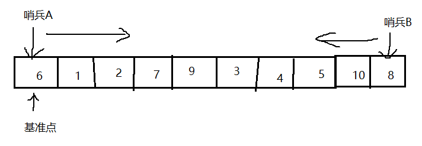
思路：
1.找一个基准数（6），定义两个变量哨兵A和哨兵B，分别在指向序列两端，哨兵A从左往右查找比6大的数，哨兵B从右往左查找比6小的数。因为基准数设置在最左边，所以哨兵B（B--）先开始行动，找到5，哨兵B停留在5，随后哨兵A（A++）找到7，停留在7。
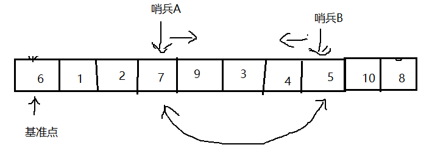
2.交换哨兵A与哨兵B的值，继续向内查找，哨兵B停留在4，哨兵A停留在9。
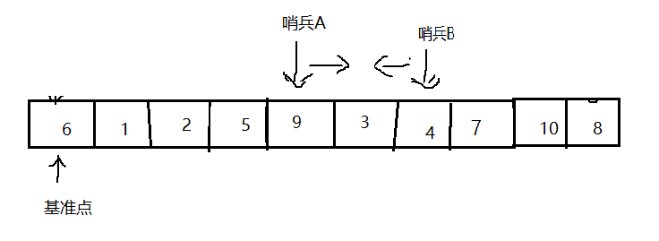
3.交换哨兵A与哨兵B的值，继续向内查找，哨兵B停留在3，哨兵A与哨兵B相遇，本轮查找结束，由于3小于基准数，3与6交换。
到此第一轮“探测”结束。此时以基准数6为分界点，6左边的数都小于等于6，6右边的数都大于等于6。探测的过程，其实是哨兵B找小于基准数的数，而哨兵A找大于基准数的数，直到A和B碰头为止。
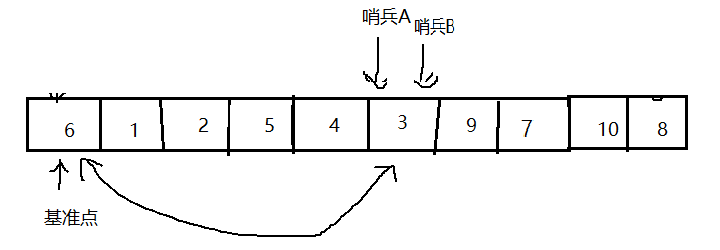
4.将原来的序列，以6为分界点拆分成了两个序列，左边的序列是“3 1 2 5 4”，右边的序列是“9 7 10 8”。用1、2、3步分别处理两个序列。
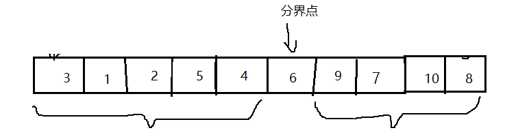
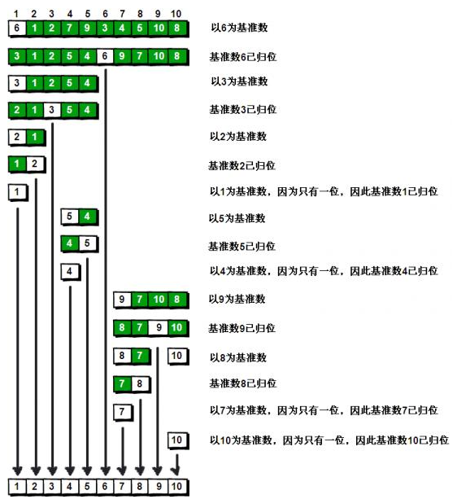

```java
public class QuickSortDemo {
    public static void main(String[] args) {
        int[] arr = {10,34,11,2,4,12,4,3,12};

        digui(arr,0,arr.length-1);
    }
    private static void digui(int[] arr, int A, int B) {
        //数组长度小于2，直接返回
        if(A > B) return;
        int low = A;
        int high = B;
        //向内探测循环
        while (A < B){
            while(arr[B] >= arr[low] && A < B) B--;
            while(arr[A] <= arr[low] && A < B) A++;
            if(A < B){
                int tmp = arr[A];
                arr[A] = arr[B];
                arr[B] = tmp;
            }
        }
        //A、B在相同位置
        int tmp = arr[low];
        arr[low] = arr[A];
        arr[A] = tmp;
        //拆分
        digui(arr,low,A-1);
        digui(arr,A+1,high);
    }
}

```

### 6.2 归并排序
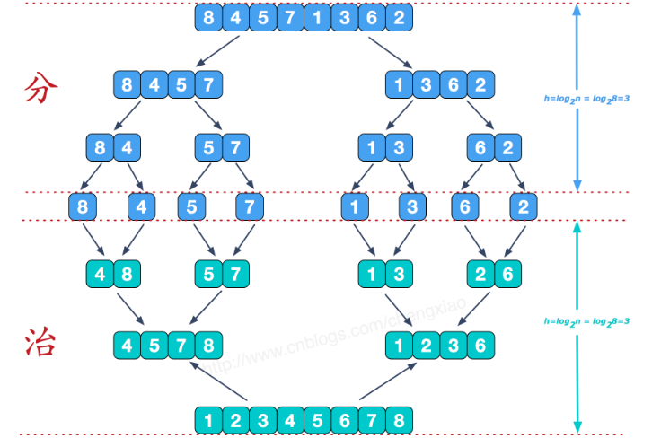

合并相邻有序子序列

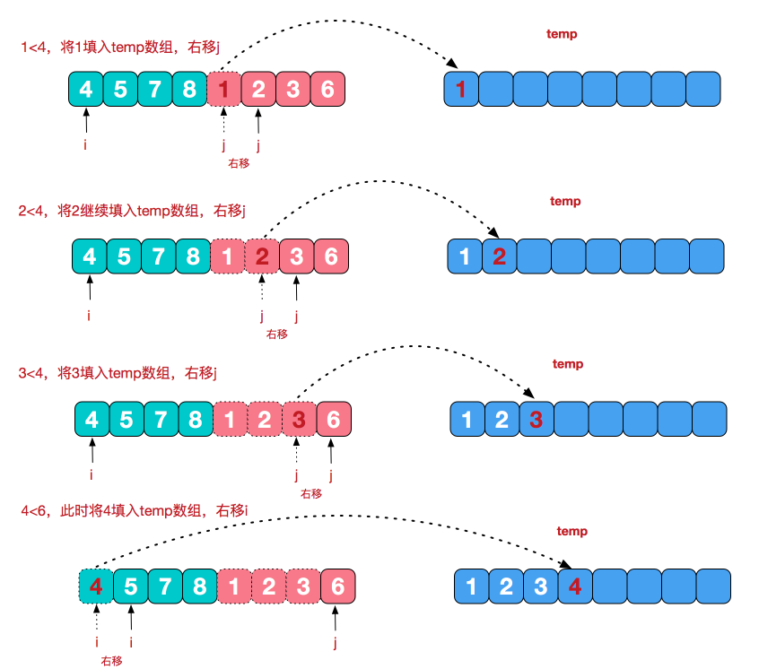
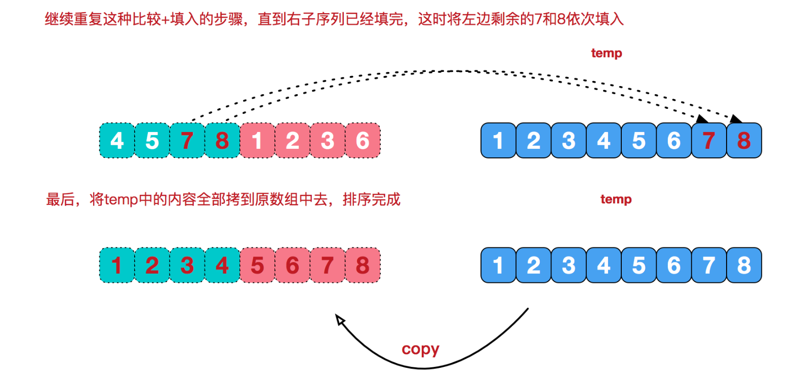
```java
public class Test {

    public static void main(String[] args) {
        int[] arr = {11,44,23,67,88,65,34,48,9,12};
        int[] tmp = new int[arr.length];    //新建一个临时数组存放
        mergeSort(arr,0,arr.length-1,tmp);
        for(int i=0;i<arr.length;i++){
            System.out.print(arr[i]+" ");
        }
    }
    // 治
    public static void merge(int[] arr,int low,int mid,int high,int[] tmp){
        int i = 0;
        int j = low,k = mid+1;  //左边序列和右边序列起始索引
        while(j <= mid && k <= high){
            if(arr[j] < arr[k]){
                tmp[i++] = arr[j++];
            }else{
                tmp[i++] = arr[k++];
            }
        }
        //若左边序列还有剩余，则将其全部拷贝进tmp[]中
        while(j <= mid){
            tmp[i++] = arr[j++];
        }

        while(k <= high){
            tmp[i++] = arr[k++];
        }
        // 将tmp中排序过的值替换arr中无序的值
        for(int t=0;t<i;t++){
            arr[low+t] = tmp[t];
        }
    }
    // 分
    public static void mergeSort(int[] arr,int low,int high,int[] tmp){
        if(low<high){
            int mid = (low+high)/2;
            mergeSort(arr,low,mid,tmp); //对左边序列进行归并排序
            mergeSort(arr,mid+1,high,tmp);  //对右边序列进行归并排序
            merge(arr,low,mid,high,tmp);    //合并两个有序序列
        }
    }
}
```
## 7.查找

## 8.图

## 9.解题思路与方法
### 9.1 递归
递归算法的时间复杂度=递归的次数 * 每次递归中的操作次数。
递归算法的空间复杂度 = 每次递归的空间复杂度 * 递归深度。
递归三部曲：
- 确定递归函数，返回值以及参数
- 确定终止条件
- 确定单层递归的逻辑

### 9.2 双指针法
通过两个指针在一个for循环下完成两个for循环的工作。

## 10 算法复杂度分析
### 10.1 什么是时间复杂度
*时间复杂度是一个函数，它定性描述该算法的运行时间。*
假设算法的问题规模为n，那么操作单元数量便用函数f(n)来表示，随着数据规模n的增大，算法执行时间的增长率和f(n)的增长率相同，这称作为算法的渐近时间复杂度，简称时间复杂度，记为 O(f(n))。

#### 什么是大O
算法导论给出的解释：*大O用来表示上界的*，当用它作为算法的最坏情况运行时间的上界，就是对任意数据输入的运行时间的上界。

快速排序是O(nlogn)，但严格从大O的定义来讲，快速排序的时间复杂度应该是O(n^2)。这个就是业内的一个默认规定，这里说的O代表的就是一般情况，而不是严格的上界。
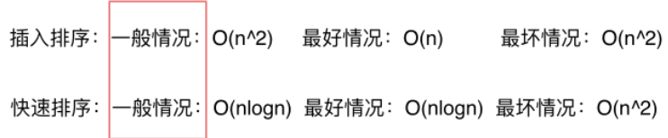

*算法的时间复杂度是多少指的都是一般情况。*

#### 不同数据规模的差异
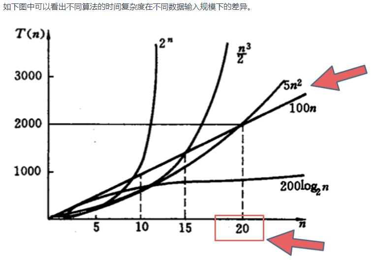
在决定使用哪些算法的时候，不是时间复杂越低的越好（因为简化后的时间复杂度忽略了常数项等等），要考虑数据规模，如果数据规模很小甚至可以用O(n^2)的算法比O(n)的更合适（在有常数项的时候）。

*大O是数据量级突破一个点且数据量级非常大的情况下所表现出的时间复杂度，这个数据量也就是常数项系数已经不起决定性作用的数据量。*

间复杂度都是省略常数项系数的，是因为一般情况下都是默认数据规模足够的大，基于这样的事实，给出的算法时间复杂的的一个排行如下所示：
O(1)常数阶 < O(logn)对数阶 < O(n)线性阶 < O(n^2)平方阶 < O(n^3)立方阶 < O(2^n)指数阶

#### 复杂表达式的化简
如
```
O(2*n^2 + 10*n + 1000)
```
- 去掉运行时间中的加法常数项 
```
O(2*n^2 + 10*n)
```
- 去掉常数系数
```
O(n^2 + n)
```
- 只保留保留最高项，去掉数量级小一级的n
```
O(n^2)
```
所以这个算法的算法时间复杂度是O(n^2)。

### 10.2 空间复杂度
是对一个算法在运行过程中占用内存空间大小的量度，记做S(n)=O(f(n)。

空间复杂度(Space Complexity)记作S(n) 依然使用大O来表示。利用程序的空间复杂度，可以对程序运行中需要多少内存有个预先估计。