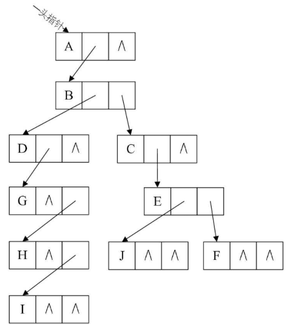

# 数据结构基础

## 1.数据结构绪论
### 1.1 基本概念和术语
- 数据：是描述客观事物的符号，是计算机中可以操作的对象，是能被计算机识别，并输入给计算机处理的符号集合。
- 数据元素：是组成数据的、有一定意义的基本单位，在计算机中通常作为整体处理。也被称为记录。
- 数据项：一个数据元素可以由若干个数据项组成。
- 数据对象：是性质相同的数据元素的集合，是数据的子集。
- 数据结构：是相互之间存在一种或多种特定关系的数据元素的集合。

### 1.2 逻辑结构与物理结构
#### 1.2.1 逻辑结构
逻辑结构：是指数据对象中数据元素之间的相互关系。
逻辑结构分为以下四种：
- 集合结构：集合结构中的数据元素除了同属于一个集合外，它们之间没有其他关系。

- 线性结构：线性结构中的数据元素之间是一对一的关系。

- 树形结构：树形结构中的数据元素之间存在一种一对多的层次关系。

- 图形结构：图形结构的数据元素是多对多的关系。

#### 1.2.2 物理结构
物理结构：是指数据的逻辑结构在计算机中的存储形式。
数据元素的存储结构形式有两种：顺序存储和链式存储。

- 顺序存储结构：是把数据元素存放在地址连续的存储单元里，其数据间的逻辑关系和物理关系是一致的。

- 链式存储结构：是把数据元素存放在任意的存储单元里，这组存储单元可以是连续的，也可以是不连续的。数据元素的存储关系并不能反映其逻辑关系，因此需要用一个指针存放数据元素的地址，这样通过地址就可以找到相关联数据元素的位置。

### 1.3 抽象数据类型
数据类型：是指一组性质相同的值的集合及定义在此集合上的一些操作的总称。

抽象数据类型（Abstract Data Type，ADT）：是指一个数学模型及定义在该模型上的一组操作。抽象数据类型的定义仅取决于它的一组逻辑特性，而与其在计算机内部如何表示和实现无关。

### 1.4 总结

## 2.算法
算法是解决特定问题求解步骤的描述，在计算机中表现为指令的有限序列，并且每条指令表示一个或多个操作。

### 2.1 算法的特性
算法具有五个基本特性：输入、输出、有穷性、确定性和可行性。

- 有穷性：指算法在执行有限的步骤之后，自动结束而不会出现无限循环，并且每一个步骤在可接受的时间内完成。
- 确定性：算法的每一步骤都具有确定的含义，不会出现二义性。算法在一定条件下，只有一条执行路径，相同的输入只能有唯一的输出结果。算法的每个步骤被精确定义而无歧义。
- 可行性：算法的每一步都必须是可行的，也就是说，每一步都能够通过执行有限次数完成。可行性意味着算法可以转换为程序上机运行，并得到正确的结果。

### 2.2 算法设计的要求
好的算法，应该具有正确性、可读性、健壮性、高效率和低存储量的特征。

- 正确性：算法的正确性是指算法至少应该具有输入、输出和加工处理无歧义性、能正确反映问题的需求、能够得到问题的正确答案。

算法的“正确”通常在用法上有很大的差别，大体分为以下四个层次。
1.算法程序没有语法错误。
2.算法程序对于合法的输入数据能够产生满足要求的输出结果。
3.算法程序对于非法的输入数据能够得出满足规格说明的结果。
4.算法程序对于精心选择的，甚至刁难的测试数据都有满足要求的输出结果。

- 可读性：算法设计的另一目的是为了便于阅读、理解和交流。
- 健壮性：当输入数据不合法时，算法也能做出相关处理，而不是产生异常或莫名其妙的结果。
- 时间效率高和存储量低。

### 2.3 算法效率的度量方法

- 事后统计方法（有缺陷，不采纳）：这种方法主要是通过设计好的测试程序和数据，利用计算机计时器对不同算法编制的程序的运行时间进行比较，从而确定算法效率的高低。
- 事前分析估算方法（常用）：在计算机程序编制前，依据统计方法对算法进行估算。

### 2.4 函数的渐近增长
函数的渐近增长：给定两个函数f(n)和g(n)，如果存在一个整数N，使得对于所有的n>N，f(n)总是比g(n)大，那么，我们说f(n)的增长渐近快于g(n)。

如果我们可以对比这几个算法的关键执行次数函数的渐近增长性，基本就可以分析出：某个算法，随着n的增大，它会越来越优于另一算法，或者越来越差于另一算法。这其实就是事前估算方法的理论依据，通过算法时间复杂度来估算算法时间效率。

### 2.5 算法时间复杂度
#### 2.5.1 算法时间复杂度定义
在进行算法分析时，语句总的执行次数T(n)是关于问题规模n的函数，进而分析T(n)随n的变化情况并确定T(n)的数量级。算法的时间复杂度，也就是算法的时间量度，记作：T(n)=O(f(n))。它表示随问题规模n的增大，算法执行时间的增长率和f(n)的增长率相同，称作算法的渐近时间复杂度，简称为时间复杂度。其中f(n)是问题规模n的某个函数。

这样用大写O( )来体现算法时间复杂度的记法，我们称之为大O记法。

一般情况下，随着n的增大，T(n)增长最慢的算法为最优算法。

#### 2.5.2 推导大O阶方法
推导大O阶：

1．用常数1取代运行时间中的所有加法常数。 
2．在修改后的运行次数函数中，只保留最高阶项。 
3．如果最高阶项存在且不是1，则去除与这个项相乘的常数。

#### 2.5.3 常见的时间复杂度
常见的时间复杂度如表：

### 2.6 最坏情况与平均情况
最坏情况运行时间是一种保证，那就是运行时间将不会再坏了。在应用中，这是一种最重要的需求，通常，除非特别指定，我们提到的运行时间都是最坏情况的运行时间。

平均运行时间是所有情况中最有意义的，因为它是期望的运行时间。也就是说，我们运行一段程序代码时，是希望看到平均运行时间的。

对算法的分析，一种方法是计算所有情况的平均值，这种时间复杂度的计算方法称为平均时间复杂度。另一种方法是计算最坏情况下的时间复杂度，这种方法称为最坏时间复杂度。一般在没有特殊说明的情况下，都是指最坏时间复杂度。

### 2.7 算法空间复杂度
算法的空间复杂度通过计算算法所需的存储空间实现，算法空间复杂度的计算公式记作：S(n)=O(f(n))，其中，n为问题的规模，f(n)为语句关于n所占存储空间的函数。

通常，我们都使用“时间复杂度”来指运行时间的需求，使用“空间复杂度”指空间需求。当不用限定词地使用“复杂度”时，通常都是指时间复杂度。

## 3 线性表
线性表（List）：零个或多个数据元素的`有限` `序列`。

### 3.1 线性表的顺序存储结构
线性表的顺序存储结构，指的是用一段地址连续的存储单元依次存储线性表的数据元素。

描述顺序存储结构需要三个属性：

存储空间的起始位置：数组data，它的存储位置就是存储空间的存储位置。
线性表的最大存储容量：数组长度MaxSize。
线性表的当前长度：length。

##### 数组长度与线性表长度区别
数组的长度是存放线性表的存储空间的长度，存储分配后这个量一般是不变的。
线性表的长度是线性表中数据元素的个数，随着线性表插入和删除操作的进行，这个量是变化的。

#### 3.1.1 顺序存储结构的插入与删除
##### 插入操作
插入算法的思路：
如果插入位置不合理，抛出异常；
如果线性表长度大于等于数组长度，则抛出异常或动态增加容量；
从最后一个元素开始向前遍历到第i个位置，分别将它们都向后移动一个位置；
将要插入元素填入位置i处； ?表长加1。

##### 删除操作
删除算法的思路：
如果删除位置不合理，抛出异常；
取出删除元素；
从删除元素位置开始遍历到最后一个元素位置，分别将它们都向前移动一个位置；
表长减1。

#### 3.1.2 线性表顺序存储结构的优缺点

### 3.2 线性表的链式存储结构
线性表的链式存储结构的特点是用一组任意的存储单元存储线性表的数据元素，这组存储单元可以是连续的，也可以是不连续的。

##### 头指针与头结点的异同

### 3.3 单链表
##### 单链表的读取
获得链表第i个数据的算法思路：

1.声明一个指针p指向链表第一个结点，初始化j从1开始； 
2.当j < i时，就遍历链表，让p的指针向后移动，不断指向下一结点，j累加1； 
3.若到链表末尾p为空，则说明第i个结点不存在； 
4.否则查找成功，返回结点p的数据。

##### 单链表的插入

假设存储元素e的结点为s，要实现结点p、p->next和s之间逻辑关系的变化，只需将结点s插入到结点p和p->next之间即可。

如果先p->next=s;再s->next=p->next;会怎么样？因为此时第一句会使得将p->next给覆盖成s的地址了。那么s->next=p->next，其实就等于s->next=s，这样真正的拥有a
i+1数据元素的结点就没了上级。这样的插入操作就是失败的，造成了临场掉链子的尴尬局面。所以这两句是无论如何不能反的。

单链表第i个数据插入结点的算法思路： 
1.声明一指针p指向链表头结点，初始化j从1开始；
2.当j < i时，就遍历链表，让p的指针向后移动，不断指向下一结点，j累加1； 
3.若到链表末尾p为空，则说明第i个结点不存在； 
4.否则查找成功，在系统中生成一个空结点s； 
5.将数据元素e赋值给s->data； 
6.单链表的插入标准语句s->next=p->next;p->next=s； 
7.返回成功。

##### 单链表的删除

单链表第i个数据删除结点的算法思路：
1.声明一指针p指向链表头结点，初始化j从1开始； 
2.当j< i时，就遍历链表，让p的指针向后移动，不断指向下一个结点，j累加1； 
3.若到链表末尾p为空，则说明第i个结点不存在； 
4.否则查找成功，将欲删除的结点p->next赋值给q； 
5.单链表的删除标准语句p->next=q->next； 
6.将q结点中的数据赋值给e，作为返回； 
7.释放q结点； 
8.返回成功。

##### 单链表的整表创建
单链表整表创建的算法思路：
1.声明一指针p和计数器变量i； 
2.初始化一空链表L； 
3.让L的头结点的指针指向NULL，即建立一个带头结点的单链表； 
4.循环：
生成一新结点赋值给p；
随机生成一数字赋值给p的数据域p->data；
将p插入到头结点与前一新结点之间。

##### 单链表的整表删除
单链表整表删除的算法思路如下：
1.声明一指针p和q； 
2.将第一个结点赋值给p； 
3.循环：
将下一结点赋值给q；
释放p；
将q赋值给p。

### 3.4 单链表结构与顺序存储结构优缺点

### 3.5 静态链表
让数组的元素都是由两个数据域组成，data和cur。也就是说，数组的每个下标都对应一个data和一个cur。数据域data，用来存放数据元素，也就是通常我们要处理的数据；而cur相当于单链表中的next指针，存放该元素的后继在数组中的下标，我们把cur叫做游标。

我们把这种用数组描述的链表叫做静态链表，这种描述方法还有起名叫做游标实现法。

##### 静态链表的优缺点

### 3.6 循环链表
将单链表中终端结点的指针端由空指针改为指向头结点，就使整个单链表形成一个环，这种头尾相接的单链表称为单循环链表，简称循环链表（circular linked list）。

- 循环链表带有头结点的空链表如图

- 对于非空的循环链表就如图

### 3.7 双向链表
双向链表（double linkedlist）是在单链表的每个结点中，再设置一个指向其前驱结点的指针域。所以在双向链表中的结点都有两个指针域，一个指向直接后继，另一个指向直接前驱。

- 双向链表的循环带头结点的空链表如图

- 非空的循环的带头结点的双向链表如图

- 在插入和删除时，需要更改两个指针变量,顺序不能写反。

- 删除结点p，只需要下面两步骤，如图

## 4 栈与队列
### 4.1 栈
栈（stack）是限定仅在表尾进行插入和删除操作的线性表。
我们把允许插入和删除的一端称为栈顶（top），另一端称为栈底（bottom），不含任何数据元素的栈称为空栈。栈又称为后进先出（LastIn First Out）的线性表，简称LIFO结构。

#### 4.1.1 栈的顺序存储结构及实现
栈的顺序存储其实也是线性表顺序存储的简化，我们简称为顺序栈。线性表是用数组来实现的，下标为0的一端作为栈底比较好，因为首元素都存在栈底，变化最小，所以让它作栈底。

当栈存在一个元素时，top等于0，因此通常把空栈的判定条件定为top等于-1。

##### 两栈共享空间
数组有两个端点，两个栈有两个栈底，让一个栈的栈底为数组的始端，即下标为0处，另一个栈为数组的末端，即下标为数组长度n-1处。这样，两个栈如果增加元素，就是两端点向中间延伸。

用这样的数据结构，通常都是当两个栈的空间需求有相反关系时，也就是一个栈增长时另一个栈在缩短的情况。

#### 4.1.2 栈的链式存储结构及实现
栈的链式存储结构，简称为链栈。
栈只是栈顶来做插入和删除操作，栈顶放在链表的头部还是尾部呢？由于单链表有头指针，而栈顶指针也是必须的，那干吗不让它俩合二为一呢，所以比较好的办法是把栈顶放在单链表的头部（如图4-6-1所示）。另外，都已经有了栈顶在头部了，单链表中比较常用的头结点也就失去了意义，通常对于链栈来说，是不需要头结点的。

对于链栈来说，基本不存在栈满的情况，除非内存已经没有可以使用的空间，对于空栈来说，链表原定义是头指针指向空，那么链栈的空其实就是top=NULL的时候。

对比一下顺序栈与链栈，它们在时间复杂度上是一样的，均为O(1)。对于空间性能，顺序栈需要事先确定一个固定的长度，可能会存在内存空间浪费的问题，但它的优势是存取时定位很方便，而链栈则要求每个元素都有指针域，这同时也增加了一些内存开销，但对于栈的长度无限制。所以它们的区别和线性表中讨论的一样，如果栈的使用过程中元素变化不可预料，有时很小，有时非常大，那么最好是用链栈，反之，如果它的变化在可控范围内，建议使用顺序栈会更好一些。

#### 4.1.3 栈的应用——递归
一个直接调用自己或通过一系列的调用语句间接地调用自己的函数，称做递归函数。

每个递归定义必须至少有一个条件，满足时递归不再进行，即不再引用自身而是返回值退出。
迭代和递归的区别是：迭代使用的是循环结构，递归使用的是选择结构。递归能使程序的结构更清晰、更简洁、更容易让人理解，从而减少读懂代码的时间。但是大量的递归调用会建立函数的副本，会耗费大量的时间和内存。迭代则不需要反复调用函数和占用额外的内存。

#### 4.1.4 栈的应用——四则运算表达式求值
对于“9+(3-1)×3+10÷2”，如果要用后缀表示法应该是什么样子：“9 3 1-3*+102/+”，这样的表达式称为后缀表达式，叫后缀的原因在于所有的符号都是在要运算数字的后面出现。

后缀表达式：9 3 1-3*+10 2/+

规则：从左到右遍历表达式的每个数字和符号，遇到是数字就进栈，遇到是符号，就将处于栈顶两个数字出栈，进行运算，运算结果进栈，一直到最终获得结果。

##### 中缀表达式转后缀表达式
我们把平时所用的标准四则运算表达式，即“9+(3-1)×3+10÷2”叫做中缀表达式。因为所有的运算符号都在两数字的中间，现在我们的问题就是中缀到后缀的转化。

中缀表达式“9+(3-1)×3+10÷2”转化为后缀表达式“9 3 1-3*+10 2/+”。

规则：从左到右遍历中缀表达式的每个数字和符号，若是数字就输出，即成为后缀表达式的一部分；若是符号，则判断其与栈顶符号的优先级，是右括号或优先级不高于栈顶符号（乘除优先加减）则栈顶元素依次出栈并输出，并将当前符号进栈，一直到最终输出后缀表达式为止。

要想让计算机具有处理我们通常的标准（中缀）表达式的能力，最重要的就是两步： 1.将中缀表达式转化为后缀表达式（栈用来进出运算的符号）。 2.将后缀表达式进行运算得出结果（栈用来进出运算的数字）。

### 4.2 队列
队列（queue）是只允许在一端进行插入操作，而在另一端进行删除操作的线性表。
队列是一种先进先出（First In First Out）的线性表，简称FIFO。允许插入的一端称为队尾，允许删除的一端称为队头。

#### 4.2.1 循环队列
线性表有顺序存储和链式存储，栈是线性表，所以有这两种存储方式。同样，队列作为一种特殊的线性表，也同样存在这两种存储方式。
队列的这种头尾相接的顺序存储结构称为循环队列。

##### 队列顺序存储的不足

为了避免当只有一个元素时，队头和队尾重合使处理变得麻烦，所以引入两个指针，front指针指向队头元素，rear指针指向队尾元素的下一个位置，这样当front等于rear时，此队列不是还剩一个元素，而是空队列。

假设这个队列的总个数不超过5个，但目前如果接着入队的话，因数组末尾元素已经占用，再向后加，就会产生数组越界的错误，可实际上，我们的队列在下标为0和1的地方还是空闲的。我们把这种现象叫做“假溢出”。

##### 循环队列的定义
队列的这种头尾相接的顺序存储结构称为循环队列。

若队列的最大尺寸为QueueSize，那么队列满的条件是(rear+1)%QueueSize==front（取模“%”的目的就是为了整合rear与front大小为一个问题）。

#### 4.2.2 队列的链式存储结构及实现

队列的链式存储结构，其实就是线性表的单链表，只不过它只能尾进头出而已，我们把它简称为链队列。为了操作上的方便，我们将队头指针指向链队列的头结点，而队尾指针指向终端结点。

空队列时，front和rear都指向头结点。

在可以确定队列长度最大值的情况下，建议用循环队列，如果你无法预估队列的长度时，则用链队列。

## 5 树
### 5.1 树的定义
树（Tree）是n（n≥0）个结点的有限集。n=0时称为空树。在任意一棵非空树中：（1）有且仅有一个特定的称为根（Root）的结点；（2）当n＞1时，其余结点可分为m（m＞0）个互不相交的有限集T 1 、T 2 、……、T m ，其中每一个集合本身又是一棵树，并且称为根的子树（SubTree）。
#### 5.1.1 结点分类
树的结点包含一个数据元素及若干指向其子树的分支。结点拥有的子树数称为结点的度（De-gree）。度为0的结点称为叶结点（Leaf）或终端结点；度不为0的结点称为非终端结点或分支结点。除根结点之外，分支结点也称为内部结点。树的度是树内各结点的度的最大值。

#### 5.1.2 结点间关系
结点的子树的根称为该结点的孩子（Child），相应地，该结点称为孩子的双亲（Parent）。嗯，为什么不是父或母，叫双亲呢？呵呵，对于结点来说其父母同体，唯一的一个，所以只能把它称为双亲了。同一个双亲的孩子之间互称兄弟（Sibling）。结点的祖先是从根到该结点所经分支上的所有结点。

#### 5.1.3 树的其他相关概念
结点的层次（Level）从根开始定义起，根为第一层，根的孩子为第二层。若某结点在第l层，则其子树就在第l+1层。其双亲在同一层的结点互为堂兄弟。显然图6-2-6中的D、E、F是堂兄弟，而G、H、I与J也是堂兄弟。树中结点的最大层次称为树的深度（Depth）或高度，当前树的深度为4。

如果将树中结点的各子树看成从左至右是有次序的，不能互换的，则称该树为有序树，否则称为无序树。

森林（Forest）是m（m≥0）棵互不相交的树的集合。对树中每个结点而言，其子树的集合即为森林。对于图6-2-1中的树而言，图6-2-2中的两棵子树其实就可以理解为森林。

对比线性表与树的结构，它们有很大的不同：

### 5.2 树的储存结构
双亲表示法、孩子表示法、孩子兄弟表示法。
#### 5.2.1 双亲表示法
data是数据域，存储结点的数据信息。而parent是指针域，存储该结点的双亲在数组中的下标。由于根结点是没有双亲的，所以根结点的位置域设置为-1。增加一个结点最左边孩子的域，叫长子域，如果没有孩子的结点，这个长子域就设置为-1。

但如果结点的孩子很多，超过了2个。我们又关注结点的双亲、又关注结点的孩子、还关注结点的兄弟，而且对时间遍历要求还比较高，那么我们还可以把此结构扩展为有双亲域、长子域、再有右兄弟域。

#### 5.2.2 孩子表示法
- 方案一：
指针域的个数就等于树的度

其中data是数据域。child1到childd是指针域，用来指向该结点的孩子结点。

缺点：如果树中各结点的度相差很大时，会造成空间浪费。

- 方案二：
每个结点指针域的个数等于该结点的度，专门取一个位置来存储结点指针域的个数

data为数据域，degree为度域，也就是存储该结点的孩子结点的个数，child1到childd为指针域，指向该结点的各个孩子的结点。

缺点：由于各个结点的链表是不相同的结构，加上要维护结点的度的数值，在运算上就会带来时间上的损耗。

- 结合单链表
孩子表示法。具体办法是，把每个结点的孩子结点排列起来，以单链表作存储结构，则n个结点有n个孩子链表，如果是叶子结点则此单链表为空。然后n个头指针又组成一个线性表，采用顺序存储结构，存放进一个一维数组中。

data是数据域，存储某结点的数据信息。firstchild是头指针域，存储该结点的孩子链表的头指针。
child是数据域，用来存储某个结点在表头数组中的下标。next是指针域，用来存储指向某结点的下一个孩子结点的指针。

- 结合双亲表示法

#### 5.2.3 孩子兄弟表示法
任意一棵树，它的结点的第一个孩子如果存在就是唯一的，它的右兄弟如果存在也是唯一的。因此，我们设置两个指针，分别指向该结点的第一个孩子和此结点的右兄弟。
data是数据域，firstchild为指针域，存储该结点的第一个孩子结点的存储地址，right-sib是指针域，存储该结点的右兄弟结点的存储地址。

增加一个parent指针域来解决快速查找双亲的问题，转化为二叉树

### 5.3 二叉树
#### 5.3.1 二叉树的特点
二叉树的特点有：
每个结点最多有两棵子树，所以二叉树中不存在度大于2的结点。

二叉树具有五种基本形态： 1.空二叉树。 2.只有一个根结点。 3.根结点只有左子树。 4.根结点只有右子树。 5.根结点既有左子树又有右子树。

#### 5.3.2 特殊二叉树
- 斜树
所有的结点都只有左子树的二叉树叫左斜树。所有结点都是只有右子树的二叉树叫右斜树。这两者统称为斜树。
- 满二叉树
在一棵二叉树中，如果所有分支结点都存在左子树和右子树，并且所有叶子都在同一层上，这样的二叉树称为满二叉树。
满二叉树的特点有：
  - （1）叶子只能出现在最下一层。
  - （2）非叶子结点的度一定是2。
  - （3）在同样深度的二叉树中，满二叉树的结点个数最多，叶子数最多。

- 完全二叉树
对一棵具有n个结点的二叉树按层序编号，如果编号为i（1≤i≤n）的结点与同样深度的满二叉树中编号为i的结点在二叉树中位置完全相同，则这棵二叉树称为完全二叉树，完全二叉树的所有结点与同样深度的满二叉树，它们按层序编号相同的结点，是一一对应的。
完全二叉树的特点：
    - （1）叶子结点只能出现在最下两层。
    - （2）最下层的叶子一定集中在左部连续位置。
    - （3）倒数二层，若有叶子结点，一定都在右部连续位置。
    - （4）如果结点度为1，则该结点只有左孩子，即不存在只有右子树的情况。
    - （5）同样结点数的二叉树，完全二叉树的深度最小。

### 5.4 二叉树的性质
性质1：在二叉树的第i层上至多有2 i-1 个结点（i≥1）。
性质2：深度为k的二叉树至多有2 k -1个结点（k≥1）。
性质3：对任何一棵二叉树T，如果其终端结点数为n 0 ，度为2的结点数为n 2 ，则n 0 =n 2 +1。
性质4：具有n个结点的完全二叉树的深度为|log 2 n+1|（|x|表示不大于x的最大整数）。
性质5：如果对一棵有n个结点的完全二叉树（其深度为）的结点按层序编号（从第1层到第层，每层从左到右），对任一结点i（1≤i≤n）有：
1．如果i=1，则结点i是二叉树的根，无双亲；如果i>1，则其双亲是结点。
2．如果2i>n，则结点i无左孩子（结点i为叶子结点）；否则其左孩子是结点2i。
3．如果2i+1>n，则结点i无右孩子；否则其右孩子是结点2i+1。

### 5.5 二叉树的储存结构
#### 5.5.1 二叉树的顺序存储结构
二叉树的顺序存储结构就是用一维数组存储二叉树中的结点，并且结点的存储位置，也就是数组的下标要能体现结点之间的逻辑关系，比如双亲与孩子的关系，左右兄弟的关系等。

对于一般的二叉树，尽管层序编号不能反映逻辑关系，但是可以将其按完全二叉树编号，只不过，把不存在的结点设置为“∧”而已。
考虑一种极端的情况，一棵深度为k的右斜树，它只有k个结点，却需要分配2k-1个存储单元空间，这显然是对存储空间的浪费，所以，顺序存储结构一般只用于完全二叉树。

#### 5.5.1 二叉链表
链式存储结构：二叉树每个结点最多有两个孩子，所以为它设计一个数据域和两个指针域是比较自然的想法，我们称这样的链表叫做二叉链表。

如果有需要，还可以再增加一个指向其双亲的指针域，那样就称之为三叉链表。

### 5.6 遍历二叉树
二叉树的遍历（traversing binary tree）是指从根结点出发，按照某种次序依次访问二叉树中所有结点，使得每个结点被访问一次且仅被访问一次。
这里有两个关键词：访问和次序。

#### 5.6.1 二叉树遍历方法
对于计算机来说，它只有循环、判断等方式来处理，也就是说，它只会处理线性序列，遍历方法是在把树中的结点变成某种意义的线性序列，这就给程序的实现带来了好处。
另外不同的遍历提供了对结点依次处理的不同方式，可以在遍历过程中对结点进行各种处理。

- 前序遍历
规则是若二叉树为空，则空操作返回，否则先访问根结点，然后前序遍历左子树，再前序遍历右子树。遍历的顺序为：ABDGH-CEIF。

- 中序遍历
规则是若树为空，则空操作返回，否则从根结点开始（注意并不是先访问根结点），中序遍历根结点的左子树，然后是访问根结点，最后中序遍历右子树。遍历的顺序为：GDHBAE-ICF。

- 后序遍历
规则是若树为空，则空操作返回，否则从左到右先叶子后结点的方式遍历访问左右子树，最后是访问根结点。遍历的顺序为：GHDBIEFCA。

- 层序遍历
规则是若树为空，则空操作返回，否则从树的第一层，也就是根结点开始访问，从上而下逐层遍历，在同一层中，按从左到右的顺序对结点逐个访问。遍历的顺序为：ABCDEFGHI。

已知前序遍历序列和中序遍历序列，可以唯一确定一棵二叉树。
已知后序遍历序列和中序遍历序列，可以唯一确定一棵二叉树。

### 5.7 二叉树的建立
为了能让每个结点确认是否有左右孩子，对它进行了扩展，也就是将二叉树中每个结点的空指针引出一个虚结点，其值为一特定值，比如“#”。称这种处理后的二叉树为原二叉树的扩展二叉树。扩展二叉树就可以做到一个遍历序列确定一棵二叉树了。比如前序遍历序列为AB#D##C##。

用“#”代替空指针，指针域利用不充分，容易造成空间浪费。
其实建立二叉树，也是利用了递归的原理。只不过在原来应该是打印结点的地方，改成了生成结点、给结点赋值的操作而已。

### 5.8 线索二叉树
指向前驱和后继的指针称为线索，加上线索的二叉链表称为线索链表，相应的二叉树就称为线索二叉树（Threaded Binary Tree）。对二叉树以某种次序遍历使其变为线索二叉树的过程称做是线索化。

（空心箭头实线为前驱，虚线黑箭头为后继）

增加判断child指向孩子还是前后：

ltag为0时指向该结点的左孩子，为1时指向该结点的前驱。
rtag为0时指向该结点的右孩子，为1时指向该结点的后继。

线索化的实质就是将二叉链表中的空指针改为指向前驱或后继的线索。由于前驱和后继的信息只有在遍历该二叉树时才能得到，所以线索化的过程就是在遍历的过程中修改空指针的过程。

和双向链表结构一样，在二叉树线索链表上添加一个头结点，如图所示，并令其lchild域的指针指向二叉树的根结点（图中的①），其rchild域的指针指向中序遍历时访问的最后一个结点（图中的②）。反之，令二叉树的中序序列中的第一个结点中，lchild域指针和最后一个结点的rchild域指针均指向头结点（图中的③和④）。这样定义的好处就是我们既可以从第一个结点起顺后继进行遍历，也可以从最后一个结点起顺前驱进行遍历。

线索二叉链表充分利用了空指针域的空间（这等于节省了空间），又保证了创建时的一次遍历就可以终生受用前驱后继的信息（这意味着节省了时间）。所以在实际问题中，如果所用的二叉树需经常遍历或查找结点时需要某种遍历序列中的前驱和后继，那么采用线索二叉链表的存储结构就是非常不错的选择。

### 5.9 树、森林与二叉树的转换
#### 5.9.1 树转换为二叉树
将树转换为二叉树的步骤如下 1.加线。在所有兄弟结点之间加一条连线。 2.去线。对树中每个结点，只保留它与第一个孩子结点的连线，删除它与其他孩子结点之间的连线。 3.层次调整。以树的根结点为轴心，将整棵树顺时针旋转一定的角度，使之结构层次分明。注意第一个孩子是二叉树结点的左孩子，兄弟转换过来的孩子是结点的右孩子。

#### 5.9.2 森林转换为二叉树
森林是由若干棵树组成的，所以完全可以理解为，森林中的每一棵树都是兄弟，可以按照兄弟的处理办法来操作。步骤如下： 1.把每个树转换为二叉树。 2.第一棵二叉树不动，从第二棵二叉树开始，依次把后一棵二叉树的根结点作为前一棵二叉树的根结点的右孩子，用线连接起来。当所有的二叉树连接起来后就得到了由森林转换来的二叉树。

#### 5.9.3 二叉树转换为树
二叉树转换为树是树转换为二叉树的逆过程，也就是反过来做而已。如图所示。步骤如下： 1.加线。若某结点的左孩子结点存在，则将这个左孩子的右孩子结点、右孩子的右孩子结点、右孩子的右孩子的右孩子结点……左孩子的n个右孩子结点都作为此结点的孩子。将该结点与这些右孩子结点用线连接起来。 2.去线。删除原二叉树中所有结点与其右孩子结点的连线。 3.层次调整。使之结构层次分明。

#### 5.9.4 二叉树转换为森林
判断一棵二叉树能够转换成一棵树还是森林，标准很简单，那就是只要看这棵二叉树的根结点有没有右孩子，有就是森林，没有就是一棵树。那么如果是转换成森林，步骤如下： 1.从根结点开始，若右孩子存在，则把与右孩子结点的连线删除，再查看分离后的二叉树，若右孩子存在，则连线删除……，直到所有右孩子连线都删除为止，得到分离的二叉树。 2.再将每棵分离后的二叉树转换为树即可。

#### 5.9.5 树与森林的遍历
树的遍历分为两种方式。 1.一种是先根遍历树，即先访问树的根结点，然后依次先根遍历根的每棵子树。 2.另一种是后根遍历，即先依次后根遍历每棵子树，然后再访问根结点。比如二叉树转换为树图中右下方的树，它的先根遍历序列为ABEFCDG，后根遍历序列为EFBCGDA。

森林的遍历也分为两种方式： 1.前序遍历：先访问森林中第一棵树的根结点，然后再依次先根遍历根的每棵子树，再依次用同样方式遍历除去第一棵树的剩余树构成的森林。比如上图下面三棵树的森林，前序遍历序列的结果就是ABCDEFGHJI。 2.后序遍历：是先访问森林中第一棵树，后根遍历的方式遍历每棵子树，然后再访问根结点，再依次同样方式遍历除去第一棵树的剩余树构成的森林。比如上图下面三棵树的森林，后序遍历序列的结果就是BCDAFEJHIG。

当以二叉链表作树的存储结构时，树的先根遍历和后根遍历完全可以借用二叉树的前序遍历和中序遍历的算法来实现。

### 5.10 赫夫曼树
#### 5.10.1 赫夫曼树定义与原理
从树中一个结点到另一个结点之间的分支构成两个结点之间的路径，路径上的分支数目称做路径长度。二叉树a中，根结点到结点D的路径长度就为4，二叉树b中根结点到结点D的路径长度为2。树的路径长度就是从树根到每一结点的路径长度之和。二叉树a的树路径长度就为1+1+2+2+3+3+4+4=20。二叉树b的树路径长度就为1+2+3+3+2+1+2+2=16。

如果考虑到带权的结点，结点的带权的路径长度为从该结点到树根之间的路径长度与结点上权的乘积。树的带权路径长度为树中所有叶子结点的带权路径长度之和。假设有n个权值{w 1 ,w 2 ,...,w n }，构造一棵有n个叶子结点的二叉树，每个叶子结点带权w k ，每个叶子的路径长度为l k ，我们通常记作，则其中带权路径长度WPL最小的二叉树称做赫夫曼树。

（注：树结点间的边相关的数叫做权Weight）

二叉树a的WPL=5×1+15×2+40×3+30×4+10×4=315
二叉树b的WPL=5×3+15×3+40×2+30×2+10×2=220

叉树b这样的树是如何构造出来的，这样的二叉树是不是就是最优的赫夫曼树呢？

1．先把有权值的叶子结点按照从小到大的顺序排列成一个有序序列，即：A5，E10，B15，D30，C40。
2．取头两个最小权值的结点作为一个新节点N 1 的两个子结点，注意相对较小的是左孩子，这里就是A为N 1 的左孩子，E为N 1 的右孩子，如图所示。新结点的权值为两个叶子权值的和5+10=15。

3．将N 1 替换A与E，插入有序序列中，保持从小到大排列。即：N 1 15，B15，D30，C40。
4．重复步骤2。将N 1 与B作为一个新节点N 2 的两个子结点。如图所示。N 2 的权值=15+15=30。

5．将N 2 替换N 1 与B，插入有序序列中，保持从小到大排列。即：N 2 30，D30，C40。
6．重复步骤2。将N 2 与D作为一个新节点N 3 的两个子结点。如图所示。N 3 的权值=30+30=60。

7．将N 3 替换N 2 与D，插入有序序列中，保持从小到大排列。即：C40，N 3 60。
8．重复步骤2。将C与N 3 作为一个新节点T的两个子结点，如图所示。由于T即是根结点，完成赫夫曼树的构造。

此时的二叉树的带权路径长度WPL=40×1+30×2+15×3+10×4+5×4=205。与二叉树b的WPL值220相比，还少了15。显然此时构造出来的二叉树才是最优的赫夫曼树。

通过刚才的步骤，我们可以得出构造赫夫曼树的赫夫曼算法描述。

1.根据给定的n个权值{w 1 ,w 2 ,...,w n }构成n棵二叉树的集合F={T 1 ,T 2 ,...,T n }，其中每棵二叉树T i 中只有一个带权为w i 根结点，其左右子树均为空。 
2.在F中选取两棵根结点的权值最小的树作为左右子树构造一棵新的二叉树，且置新的二叉树的根结点的权值为其左右子树上根结点的权值之和。 
3.在F中删除这两棵树，同时将新得到的二叉树加入F中。 
4.重复2和3步骤，直到F只含一棵树为止。这棵树便是赫夫曼树。

#### 5.10.2 赫夫曼编码
一般地，设需要编码的字符集为{d 1 ,d 2 ,...,d n }，各个字符在电文中出现的次数或频率集合为{w 1 ,w 2 ,...,w n }，以d 1 ,d 2 ,...,d n 作为叶子结点，以w 1 ,w 2 ,...,w n 作为相应叶子结点的权值来构造一棵赫夫曼树。规定赫夫曼树的左分支代表0，右分支代表1，则从根结点到叶子结点所经过的路径分支组成的0和1的序列便为该结点对应字符的编码，这就是赫夫曼编码。

### 5.11 总结回顾
开头提到了树的定义，讲到了递归在树定义中的应用。提到了如子树、结点、度、叶子、分支结点、双亲、孩子、层次、深度、森林等诸多概念，这些都是需要在理解的基础上去记忆的。

谈到了树的存储结构时，讲了双亲表示法、孩子表示法、孩子兄弟表示法等不同的存储结构。

并由孩子兄弟表示法引出了我们这章中最重要一种树，二叉树。

二叉树每个结点最多两棵子树，有左右之分。提到了斜树，满二叉树、完全二叉树等特殊二叉树的概念。

二叉树的存储结构由于其特殊性使得既可以用顺序存储结构又可以用链式存储结构表示。

遍历是二叉树最重要的一门学问，前序、中序、后序以及层序遍历都是需要熟练掌握的知识。要让自己要学会用计算机的运行思维去模拟递归的实现，可以加深我们对递归的理解。不过，并非二叉树遍历就一定要用到递归，只不过递归的实现比较优雅而已。这点需要明确。

二叉树的建立自然也是可以通过递归来实现。

二叉链表有很多浪费的空指针可以利用，查找某个结点的前驱和后继为什么非要每次遍历才可以得到，这就引出了如何构造一棵线索二叉树的问题。线索二叉树给二叉树的结点查找和遍历带来了高效率。

树、森林看似复杂，其实它们都可以转化为简单的二叉树来处理，我们提供了树、森林与二叉树的互相转换的办法，这样就使得面对树和森林的数据结构时，编码实现成为了可能。

最后，提到了关于二叉树的一个应用，赫夫曼树和赫夫曼编码，对于带权路径的二叉树做了详尽地讲述，初步理解数据压缩的原理，并明白其是如何做到无损编码和无错解码的。