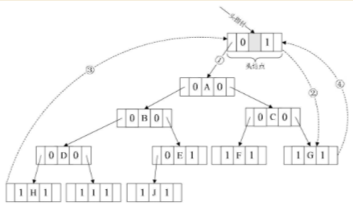
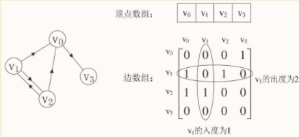

# 数据结构基础

## 1.数据结构绪论
### 1.1 基本概念和术语
- 数据：是描述客观事物的符号，是计算机中可以操作的对象，是能被计算机识别，并输入给计算机处理的符号集合。
- 数据元素：是组成数据的、有一定意义的基本单位，在计算机中通常作为整体处理。也被称为记录。
- 数据项：一个数据元素可以由若干个数据项组成。
- 数据对象：是性质相同的数据元素的集合，是数据的子集。
- 数据结构：是相互之间存在一种或多种特定关系的数据元素的集合。

### 1.2 逻辑结构与物理结构
#### 1.2.1 逻辑结构
逻辑结构：是指数据对象中数据元素之间的相互关系。
逻辑结构分为以下四种：
- 集合结构：集合结构中的数据元素除了同属于一个集合外，它们之间没有其他关系。

- 线性结构：线性结构中的数据元素之间是一对一的关系。

- 树形结构：树形结构中的数据元素之间存在一种一对多的层次关系。

- 图形结构：图形结构的数据元素是多对多的关系。

#### 1.2.2 物理结构
物理结构：是指数据的逻辑结构在计算机中的存储形式。
数据元素的存储结构形式有两种：顺序存储和链式存储。

- 顺序存储结构：是把数据元素存放在地址连续的存储单元里，其数据间的逻辑关系和物理关系是一致的。

- 链式存储结构：是把数据元素存放在任意的存储单元里，这组存储单元可以是连续的，也可以是不连续的。数据元素的存储关系并不能反映其逻辑关系，因此需要用一个指针存放数据元素的地址，这样通过地址就可以找到相关联数据元素的位置。

### 1.3 抽象数据类型
数据类型：是指一组性质相同的值的集合及定义在此集合上的一些操作的总称。

抽象数据类型（Abstract Data Type，ADT）：是指一个数学模型及定义在该模型上的一组操作。抽象数据类型的定义仅取决于它的一组逻辑特性，而与其在计算机内部如何表示和实现无关。

### 1.4 总结

## 2.算法
算法是解决特定问题求解步骤的描述，在计算机中表现为指令的有限序列，并且每条指令表示一个或多个操作。

### 2.1 算法的特性
算法具有五个基本特性：输入、输出、有穷性、确定性和可行性。

- 有穷性：指算法在执行有限的步骤之后，自动结束而不会出现无限循环，并且每一个步骤在可接受的时间内完成。
- 确定性：算法的每一步骤都具有确定的含义，不会出现二义性。算法在一定条件下，只有一条执行路径，相同的输入只能有唯一的输出结果。算法的每个步骤被精确定义而无歧义。
- 可行性：算法的每一步都必须是可行的，也就是说，每一步都能够通过执行有限次数完成。可行性意味着算法可以转换为程序上机运行，并得到正确的结果。

### 2.2 算法设计的要求
好的算法，应该具有正确性、可读性、健壮性、高效率和低存储量的特征。

- 正确性：算法的正确性是指算法至少应该具有输入、输出和加工处理无歧义性、能正确反映问题的需求、能够得到问题的正确答案。

算法的“正确”通常在用法上有很大的差别，大体分为以下四个层次。
1.算法程序没有语法错误。
2.算法程序对于合法的输入数据能够产生满足要求的输出结果。
3.算法程序对于非法的输入数据能够得出满足规格说明的结果。
4.算法程序对于精心选择的，甚至刁难的测试数据都有满足要求的输出结果。

- 可读性：算法设计的另一目的是为了便于阅读、理解和交流。
- 健壮性：当输入数据不合法时，算法也能做出相关处理，而不是产生异常或莫名其妙的结果。
- 时间效率高和存储量低。

### 2.3 算法效率的度量方法

- 事后统计方法（有缺陷，不采纳）：这种方法主要是通过设计好的测试程序和数据，利用计算机计时器对不同算法编制的程序的运行时间进行比较，从而确定算法效率的高低。
- 事前分析估算方法（常用）：在计算机程序编制前，依据统计方法对算法进行估算。

### 2.4 函数的渐近增长
函数的渐近增长：给定两个函数f(n)和g(n)，如果存在一个整数N，使得对于所有的n>N，f(n)总是比g(n)大，那么，我们说f(n)的增长渐近快于g(n)。

如果我们可以对比这几个算法的关键执行次数函数的渐近增长性，基本就可以分析出：某个算法，随着n的增大，它会越来越优于另一算法，或者越来越差于另一算法。这其实就是事前估算方法的理论依据，通过算法时间复杂度来估算算法时间效率。

### 2.5 算法时间复杂度
#### 2.5.1 算法时间复杂度定义
在进行算法分析时，语句总的执行次数T(n)是关于问题规模n的函数，进而分析T(n)随n的变化情况并确定T(n)的数量级。算法的时间复杂度，也就是算法的时间量度，记作：T(n)=O(f(n))。它表示随问题规模n的增大，算法执行时间的增长率和f(n)的增长率相同，称作算法的渐近时间复杂度，简称为时间复杂度。其中f(n)是问题规模n的某个函数。

这样用大写O( )来体现算法时间复杂度的记法，我们称之为大O记法。

一般情况下，随着n的增大，T(n)增长最慢的算法为最优算法。

#### 2.5.2 推导大O阶方法
推导大O阶：

1．用常数1取代运行时间中的所有加法常数。 
2．在修改后的运行次数函数中，只保留最高阶项。 
3．如果最高阶项存在且不是1，则去除与这个项相乘的常数。

#### 2.5.3 常见的时间复杂度
常见的时间复杂度如表：

### 2.6 最坏情况与平均情况
最坏情况运行时间是一种保证，那就是运行时间将不会再坏了。在应用中，这是一种最重要的需求，通常，除非特别指定，我们提到的运行时间都是最坏情况的运行时间。

平均运行时间是所有情况中最有意义的，因为它是期望的运行时间。也就是说，我们运行一段程序代码时，是希望看到平均运行时间的。

对算法的分析，一种方法是计算所有情况的平均值，这种时间复杂度的计算方法称为平均时间复杂度。另一种方法是计算最坏情况下的时间复杂度，这种方法称为最坏时间复杂度。一般在没有特殊说明的情况下，都是指最坏时间复杂度。

### 2.7 算法空间复杂度
算法的空间复杂度通过计算算法所需的存储空间实现，算法空间复杂度的计算公式记作：S(n)=O(f(n))，其中，n为问题的规模，f(n)为语句关于n所占存储空间的函数。

通常，我们都使用“时间复杂度”来指运行时间的需求，使用“空间复杂度”指空间需求。当不用限定词地使用“复杂度”时，通常都是指时间复杂度。

## 3 线性表
线性表（List）：零个或多个数据元素的`有限` `序列`。

### 3.1 线性表的顺序存储结构
线性表的顺序存储结构，指的是用一段地址连续的存储单元依次存储线性表的数据元素。

描述顺序存储结构需要三个属性：

存储空间的起始位置：数组data，它的存储位置就是存储空间的存储位置。
线性表的最大存储容量：数组长度MaxSize。
线性表的当前长度：length。

##### 数组长度与线性表长度区别
数组的长度是存放线性表的存储空间的长度，存储分配后这个量一般是不变的。
线性表的长度是线性表中数据元素的个数，随着线性表插入和删除操作的进行，这个量是变化的。

#### 3.1.1 顺序存储结构的插入与删除
##### 插入操作
插入算法的思路：
如果插入位置不合理，抛出异常；
如果线性表长度大于等于数组长度，则抛出异常或动态增加容量；
从最后一个元素开始向前遍历到第i个位置，分别将它们都向后移动一个位置；
将要插入元素填入位置i处； ?表长加1。

##### 删除操作
删除算法的思路：
如果删除位置不合理，抛出异常；
取出删除元素；
从删除元素位置开始遍历到最后一个元素位置，分别将它们都向前移动一个位置；
表长减1。

#### 3.1.2 线性表顺序存储结构的优缺点

### 3.2 线性表的链式存储结构
线性表的链式存储结构的特点是用一组任意的存储单元存储线性表的数据元素，这组存储单元可以是连续的，也可以是不连续的。

##### 头指针与头结点的异同

### 3.3 单链表
##### 单链表的读取
获得链表第i个数据的算法思路：

1.声明一个指针p指向链表第一个结点，初始化j从1开始； 
2.当j < i时，就遍历链表，让p的指针向后移动，不断指向下一结点，j累加1； 
3.若到链表末尾p为空，则说明第i个结点不存在； 
4.否则查找成功，返回结点p的数据。

##### 单链表的插入

假设存储元素e的结点为s，要实现结点p、p->next和s之间逻辑关系的变化，只需将结点s插入到结点p和p->next之间即可。

如果先p->next=s;再s->next=p->next;会怎么样？因为此时第一句会使得将p->next给覆盖成s的地址了。那么s->next=p->next，其实就等于s->next=s，这样真正的拥有a
i+1数据元素的结点就没了上级。这样的插入操作就是失败的，造成了临场掉链子的尴尬局面。所以这两句是无论如何不能反的。

单链表第i个数据插入结点的算法思路： 
1.声明一指针p指向链表头结点，初始化j从1开始；
2.当j < i时，就遍历链表，让p的指针向后移动，不断指向下一结点，j累加1； 
3.若到链表末尾p为空，则说明第i个结点不存在； 
4.否则查找成功，在系统中生成一个空结点s； 
5.将数据元素e赋值给s->data； 
6.单链表的插入标准语句s->next=p->next;p->next=s； 
7.返回成功。

##### 单链表的删除

单链表第i个数据删除结点的算法思路：
1.声明一指针p指向链表头结点，初始化j从1开始； 
2.当j< i时，就遍历链表，让p的指针向后移动，不断指向下一个结点，j累加1； 
3.若到链表末尾p为空，则说明第i个结点不存在； 
4.否则查找成功，将欲删除的结点p->next赋值给q； 
5.单链表的删除标准语句p->next=q->next； 
6.将q结点中的数据赋值给e，作为返回； 
7.释放q结点； 
8.返回成功。

##### 单链表的整表创建
单链表整表创建的算法思路：
1.声明一指针p和计数器变量i； 
2.初始化一空链表L； 
3.让L的头结点的指针指向NULL，即建立一个带头结点的单链表； 
4.循环：
生成一新结点赋值给p；
随机生成一数字赋值给p的数据域p->data；
将p插入到头结点与前一新结点之间。

##### 单链表的整表删除
单链表整表删除的算法思路如下：
1.声明一指针p和q； 
2.将第一个结点赋值给p； 
3.循环：
将下一结点赋值给q；
释放p；
将q赋值给p。

### 3.4 单链表结构与顺序存储结构优缺点

### 3.5 静态链表
让数组的元素都是由两个数据域组成，data和cur。也就是说，数组的每个下标都对应一个data和一个cur。数据域data，用来存放数据元素，也就是通常我们要处理的数据；而cur相当于单链表中的next指针，存放该元素的后继在数组中的下标，我们把cur叫做游标。

我们把这种用数组描述的链表叫做静态链表，这种描述方法还有起名叫做游标实现法。

##### 静态链表的优缺点

### 3.6 循环链表
将单链表中终端结点的指针端由空指针改为指向头结点，就使整个单链表形成一个环，这种头尾相接的单链表称为单循环链表，简称循环链表（circular linked list）。

- 循环链表带有头结点的空链表如图

- 对于非空的循环链表就如图

### 3.7 双向链表
双向链表（double linkedlist）是在单链表的每个结点中，再设置一个指向其前驱结点的指针域。所以在双向链表中的结点都有两个指针域，一个指向直接后继，另一个指向直接前驱。

- 双向链表的循环带头结点的空链表如图

- 非空的循环的带头结点的双向链表如图

- 在插入和删除时，需要更改两个指针变量,顺序不能写反。

- 删除结点p，只需要下面两步骤，如图

## 4 栈与队列
### 4.1 栈
栈（stack）是限定仅在表尾进行插入和删除操作的线性表。
我们把允许插入和删除的一端称为栈顶（top），另一端称为栈底（bottom），不含任何数据元素的栈称为空栈。栈又称为后进先出（LastIn First Out）的线性表，简称LIFO结构。

#### 4.1.1 栈的顺序存储结构及实现
栈的顺序存储其实也是线性表顺序存储的简化，我们简称为顺序栈。线性表是用数组来实现的，下标为0的一端作为栈底比较好，因为首元素都存在栈底，变化最小，所以让它作栈底。

当栈存在一个元素时，top等于0，因此通常把空栈的判定条件定为top等于-1。

##### 两栈共享空间
数组有两个端点，两个栈有两个栈底，让一个栈的栈底为数组的始端，即下标为0处，另一个栈为数组的末端，即下标为数组长度n-1处。这样，两个栈如果增加元素，就是两端点向中间延伸。

用这样的数据结构，通常都是当两个栈的空间需求有相反关系时，也就是一个栈增长时另一个栈在缩短的情况。

#### 4.1.2 栈的链式存储结构及实现
栈的链式存储结构，简称为链栈。
栈只是栈顶来做插入和删除操作，栈顶放在链表的头部还是尾部呢？由于单链表有头指针，而栈顶指针也是必须的，那干吗不让它俩合二为一呢，所以比较好的办法是把栈顶放在单链表的头部（如图4-6-1所示）。另外，都已经有了栈顶在头部了，单链表中比较常用的头结点也就失去了意义，通常对于链栈来说，是不需要头结点的。

对于链栈来说，基本不存在栈满的情况，除非内存已经没有可以使用的空间，对于空栈来说，链表原定义是头指针指向空，那么链栈的空其实就是top=NULL的时候。

对比一下顺序栈与链栈，它们在时间复杂度上是一样的，均为O(1)。对于空间性能，顺序栈需要事先确定一个固定的长度，可能会存在内存空间浪费的问题，但它的优势是存取时定位很方便，而链栈则要求每个元素都有指针域，这同时也增加了一些内存开销，但对于栈的长度无限制。所以它们的区别和线性表中讨论的一样，如果栈的使用过程中元素变化不可预料，有时很小，有时非常大，那么最好是用链栈，反之，如果它的变化在可控范围内，建议使用顺序栈会更好一些。

#### 4.1.3 栈的应用——递归
一个直接调用自己或通过一系列的调用语句间接地调用自己的函数，称做递归函数。

每个递归定义必须至少有一个条件，满足时递归不再进行，即不再引用自身而是返回值退出。
迭代和递归的区别是：迭代使用的是循环结构，递归使用的是选择结构。递归能使程序的结构更清晰、更简洁、更容易让人理解，从而减少读懂代码的时间。但是大量的递归调用会建立函数的副本，会耗费大量的时间和内存。迭代则不需要反复调用函数和占用额外的内存。

#### 4.1.4 栈的应用——四则运算表达式求值
对于“9+(3-1)×3+10÷2”，如果要用后缀表示法应该是什么样子：“9 3 1-3*+102/+”，这样的表达式称为后缀表达式，叫后缀的原因在于所有的符号都是在要运算数字的后面出现。

后缀表达式：9 3 1-3*+10 2/+

规则：从左到右遍历表达式的每个数字和符号，遇到是数字就进栈，遇到是符号，就将处于栈顶两个数字出栈，进行运算，运算结果进栈，一直到最终获得结果。

##### 中缀表达式转后缀表达式
我们把平时所用的标准四则运算表达式，即“9+(3-1)×3+10÷2”叫做中缀表达式。因为所有的运算符号都在两数字的中间，现在我们的问题就是中缀到后缀的转化。

中缀表达式“9+(3-1)×3+10÷2”转化为后缀表达式“9 3 1-3*+10 2/+”。

规则：从左到右遍历中缀表达式的每个数字和符号，若是数字就输出，即成为后缀表达式的一部分；若是符号，则判断其与栈顶符号的优先级，是右括号或优先级不高于栈顶符号（乘除优先加减）则栈顶元素依次出栈并输出，并将当前符号进栈，一直到最终输出后缀表达式为止。

要想让计算机具有处理我们通常的标准（中缀）表达式的能力，最重要的就是两步： 1.将中缀表达式转化为后缀表达式（栈用来进出运算的符号）。 2.将后缀表达式进行运算得出结果（栈用来进出运算的数字）。

### 4.2 队列
队列（queue）是只允许在一端进行插入操作，而在另一端进行删除操作的线性表。
队列是一种先进先出（First In First Out）的线性表，简称FIFO。允许插入的一端称为队尾，允许删除的一端称为队头。

#### 4.2.1 循环队列
线性表有顺序存储和链式存储，栈是线性表，所以有这两种存储方式。同样，队列作为一种特殊的线性表，也同样存在这两种存储方式。
队列的这种头尾相接的顺序存储结构称为循环队列。

##### 队列顺序存储的不足

为了避免当只有一个元素时，队头和队尾重合使处理变得麻烦，所以引入两个指针，front指针指向队头元素，rear指针指向队尾元素的下一个位置，这样当front等于rear时，此队列不是还剩一个元素，而是空队列。

假设这个队列的总个数不超过5个，但目前如果接着入队的话，因数组末尾元素已经占用，再向后加，就会产生数组越界的错误，可实际上，我们的队列在下标为0和1的地方还是空闲的。我们把这种现象叫做“假溢出”。

##### 循环队列的定义
队列的这种头尾相接的顺序存储结构称为循环队列。

若队列的最大尺寸为QueueSize，那么队列满的条件是(rear+1)%QueueSize==front（取模“%”的目的就是为了整合rear与front大小为一个问题）。

#### 4.2.2 队列的链式存储结构及实现

队列的链式存储结构，其实就是线性表的单链表，只不过它只能尾进头出而已，我们把它简称为链队列。为了操作上的方便，我们将队头指针指向链队列的头结点，而队尾指针指向终端结点。

空队列时，front和rear都指向头结点。

在可以确定队列长度最大值的情况下，建议用循环队列，如果你无法预估队列的长度时，则用链队列。

## 5 树
### 5.1 树的定义
树（Tree）是n（n≥0）个结点的有限集。n=0时称为空树。在任意一棵非空树中：（1）有且仅有一个特定的称为根（Root）的结点；（2）当n＞1时，其余结点可分为m（m＞0）个互不相交的有限集T 1 、T 2 、……、T m ，其中每一个集合本身又是一棵树，并且称为根的子树（SubTree）。
#### 5.1.1 结点分类
树的结点包含一个数据元素及若干指向其子树的分支。结点拥有的子树数称为结点的度（De-gree）。度为0的结点称为叶结点（Leaf）或终端结点；度不为0的结点称为非终端结点或分支结点。除根结点之外，分支结点也称为内部结点。树的度是树内各结点的度的最大值。

#### 5.1.2 结点间关系
结点的子树的根称为该结点的孩子（Child），相应地，该结点称为孩子的双亲（Parent）。嗯，为什么不是父或母，叫双亲呢？呵呵，对于结点来说其父母同体，唯一的一个，所以只能把它称为双亲了。同一个双亲的孩子之间互称兄弟（Sibling）。结点的祖先是从根到该结点所经分支上的所有结点。

#### 5.1.3 树的其他相关概念
结点的层次（Level）从根开始定义起，根为第一层，根的孩子为第二层。若某结点在第l层，则其子树就在第l+1层。其双亲在同一层的结点互为堂兄弟。显然图6-2-6中的D、E、F是堂兄弟，而G、H、I与J也是堂兄弟。树中结点的最大层次称为树的深度（Depth）或高度，当前树的深度为4。

如果将树中结点的各子树看成从左至右是有次序的，不能互换的，则称该树为有序树，否则称为无序树。

森林（Forest）是m（m≥0）棵互不相交的树的集合。对树中每个结点而言，其子树的集合即为森林。对于图6-2-1中的树而言，图6-2-2中的两棵子树其实就可以理解为森林。

对比线性表与树的结构，它们有很大的不同：

### 5.2 树的储存结构
双亲表示法、孩子表示法、孩子兄弟表示法。
#### 5.2.1 双亲表示法
data是数据域，存储结点的数据信息。而parent是指针域，存储该结点的双亲在数组中的下标。由于根结点是没有双亲的，所以根结点的位置域设置为-1。增加一个结点最左边孩子的域，叫长子域，如果没有孩子的结点，这个长子域就设置为-1。

但如果结点的孩子很多，超过了2个。我们又关注结点的双亲、又关注结点的孩子、还关注结点的兄弟，而且对时间遍历要求还比较高，那么我们还可以把此结构扩展为有双亲域、长子域、再有右兄弟域。

#### 5.2.2 孩子表示法
- 方案一：
指针域的个数就等于树的度

其中data是数据域。child1到childd是指针域，用来指向该结点的孩子结点。

缺点：如果树中各结点的度相差很大时，会造成空间浪费。

- 方案二：
每个结点指针域的个数等于该结点的度，专门取一个位置来存储结点指针域的个数

data为数据域，degree为度域，也就是存储该结点的孩子结点的个数，child1到childd为指针域，指向该结点的各个孩子的结点。

缺点：由于各个结点的链表是不相同的结构，加上要维护结点的度的数值，在运算上就会带来时间上的损耗。

- 结合单链表
孩子表示法。具体办法是，把每个结点的孩子结点排列起来，以单链表作存储结构，则n个结点有n个孩子链表，如果是叶子结点则此单链表为空。然后n个头指针又组成一个线性表，采用顺序存储结构，存放进一个一维数组中。

data是数据域，存储某结点的数据信息。firstchild是头指针域，存储该结点的孩子链表的头指针。
child是数据域，用来存储某个结点在表头数组中的下标。next是指针域，用来存储指向某结点的下一个孩子结点的指针。

- 结合双亲表示法

#### 5.2.3 孩子兄弟表示法
任意一棵树，它的结点的第一个孩子如果存在就是唯一的，它的右兄弟如果存在也是唯一的。因此，我们设置两个指针，分别指向该结点的第一个孩子和此结点的右兄弟。
data是数据域，firstchild为指针域，存储该结点的第一个孩子结点的存储地址，right-sib是指针域，存储该结点的右兄弟结点的存储地址。

增加一个parent指针域来解决快速查找双亲的问题，转化为二叉树

### 5.3 二叉树
#### 5.3.1 二叉树的特点
二叉树的特点有：
每个结点最多有两棵子树，所以二叉树中不存在度大于2的结点。

二叉树具有五种基本形态： 1.空二叉树。 2.只有一个根结点。 3.根结点只有左子树。 4.根结点只有右子树。 5.根结点既有左子树又有右子树。

#### 5.3.2 特殊二叉树
- 斜树
所有的结点都只有左子树的二叉树叫左斜树。所有结点都是只有右子树的二叉树叫右斜树。这两者统称为斜树。
- 满二叉树
在一棵二叉树中，如果所有分支结点都存在左子树和右子树，并且所有叶子都在同一层上，这样的二叉树称为满二叉树。
满二叉树的特点有：
  - （1）叶子只能出现在最下一层。
  - （2）非叶子结点的度一定是2。
  - （3）在同样深度的二叉树中，满二叉树的结点个数最多，叶子数最多。

- 完全二叉树
对一棵具有n个结点的二叉树按层序编号，如果编号为i（1≤i≤n）的结点与同样深度的满二叉树中编号为i的结点在二叉树中位置完全相同，则这棵二叉树称为完全二叉树，完全二叉树的所有结点与同样深度的满二叉树，它们按层序编号相同的结点，是一一对应的。
完全二叉树的特点：
    - （1）叶子结点只能出现在最下两层。
    - （2）最下层的叶子一定集中在左部连续位置。
    - （3）倒数二层，若有叶子结点，一定都在右部连续位置。
    - （4）如果结点度为1，则该结点只有左孩子，即不存在只有右子树的情况。
    - （5）同样结点数的二叉树，完全二叉树的深度最小。

### 5.4 二叉树的性质
性质1：在二叉树的第i层上至多有2 i-1 个结点（i≥1）。
性质2：深度为k的二叉树至多有2 k -1个结点（k≥1）。
性质3：对任何一棵二叉树T，如果其终端结点数为n 0 ，度为2的结点数为n 2 ，则n 0 =n 2 +1。
性质4：具有n个结点的完全二叉树的深度为|log 2 n+1|（|x|表示不大于x的最大整数）。
性质5：如果对一棵有n个结点的完全二叉树（其深度为）的结点按层序编号（从第1层到第层，每层从左到右），对任一结点i（1≤i≤n）有：
1．如果i=1，则结点i是二叉树的根，无双亲；如果i>1，则其双亲是结点。
2．如果2i>n，则结点i无左孩子（结点i为叶子结点）；否则其左孩子是结点2i。
3．如果2i+1>n，则结点i无右孩子；否则其右孩子是结点2i+1。

### 5.5 二叉树的储存结构
#### 5.5.1 二叉树的顺序存储结构
二叉树的顺序存储结构就是用一维数组存储二叉树中的结点，并且结点的存储位置，也就是数组的下标要能体现结点之间的逻辑关系，比如双亲与孩子的关系，左右兄弟的关系等。

对于一般的二叉树，尽管层序编号不能反映逻辑关系，但是可以将其按完全二叉树编号，只不过，把不存在的结点设置为“∧”而已。
考虑一种极端的情况，一棵深度为k的右斜树，它只有k个结点，却需要分配2k-1个存储单元空间，这显然是对存储空间的浪费，所以，顺序存储结构一般只用于完全二叉树。

#### 5.5.1 二叉链表
链式存储结构：二叉树每个结点最多有两个孩子，所以为它设计一个数据域和两个指针域是比较自然的想法，我们称这样的链表叫做二叉链表。

如果有需要，还可以再增加一个指向其双亲的指针域，那样就称之为三叉链表。

### 5.6 遍历二叉树
二叉树的遍历（traversing binary tree）是指从根结点出发，按照某种次序依次访问二叉树中所有结点，使得每个结点被访问一次且仅被访问一次。
这里有两个关键词：访问和次序。

#### 5.6.1 二叉树遍历方法
对于计算机来说，它只有循环、判断等方式来处理，也就是说，它只会处理线性序列，遍历方法是在把树中的结点变成某种意义的线性序列，这就给程序的实现带来了好处。
另外不同的遍历提供了对结点依次处理的不同方式，可以在遍历过程中对结点进行各种处理。

- 前序遍历
规则是若二叉树为空，则空操作返回，否则先访问根结点，然后前序遍历左子树，再前序遍历右子树。遍历的顺序为：ABDGH-CEIF。

- 中序遍历
规则是若树为空，则空操作返回，否则从根结点开始（注意并不是先访问根结点），中序遍历根结点的左子树，然后是访问根结点，最后中序遍历右子树。遍历的顺序为：GDHBAE-ICF。

- 后序遍历
规则是若树为空，则空操作返回，否则从左到右先叶子后结点的方式遍历访问左右子树，最后是访问根结点。遍历的顺序为：GHDBIEFCA。

- 层序遍历
规则是若树为空，则空操作返回，否则从树的第一层，也就是根结点开始访问，从上而下逐层遍历，在同一层中，按从左到右的顺序对结点逐个访问。遍历的顺序为：ABCDEFGHI。

已知前序遍历序列和中序遍历序列，可以唯一确定一棵二叉树。
已知后序遍历序列和中序遍历序列，可以唯一确定一棵二叉树。

### 5.7 二叉树的建立
为了能让每个结点确认是否有左右孩子，对它进行了扩展，也就是将二叉树中每个结点的空指针引出一个虚结点，其值为一特定值，比如“#”。称这种处理后的二叉树为原二叉树的扩展二叉树。扩展二叉树就可以做到一个遍历序列确定一棵二叉树了。比如前序遍历序列为AB#D##C##。

用“#”代替空指针，指针域利用不充分，容易造成空间浪费。
其实建立二叉树，也是利用了递归的原理。只不过在原来应该是打印结点的地方，改成了生成结点、给结点赋值的操作而已。

### 5.8 线索二叉树
指向前驱和后继的指针称为线索，加上线索的二叉链表称为线索链表，相应的二叉树就称为线索二叉树（Threaded Binary Tree）。对二叉树以某种次序遍历使其变为线索二叉树的过程称做是线索化。

（空心箭头实线为前驱，虚线黑箭头为后继）

增加判断child指向孩子还是前后：

ltag为0时指向该结点的左孩子，为1时指向该结点的前驱。
rtag为0时指向该结点的右孩子，为1时指向该结点的后继。

线索化的实质就是将二叉链表中的空指针改为指向前驱或后继的线索。由于前驱和后继的信息只有在遍历该二叉树时才能得到，所以线索化的过程就是在遍历的过程中修改空指针的过程。

和双向链表结构一样，在二叉树线索链表上添加一个头结点，如图所示，并令其lchild域的指针指向二叉树的根结点（图中的①），其rchild域的指针指向中序遍历时访问的最后一个结点（图中的②）。反之，令二叉树的中序序列中的第一个结点中，lchild域指针和最后一个结点的rchild域指针均指向头结点（图中的③和④）。这样定义的好处就是我们既可以从第一个结点起顺后继进行遍历，也可以从最后一个结点起顺前驱进行遍历。

线索二叉链表充分利用了空指针域的空间（这等于节省了空间），又保证了创建时的一次遍历就可以终生受用前驱后继的信息（这意味着节省了时间）。所以在实际问题中，如果所用的二叉树需经常遍历或查找结点时需要某种遍历序列中的前驱和后继，那么采用线索二叉链表的存储结构就是非常不错的选择。

### 5.9 树、森林与二叉树的转换
#### 5.9.1 树转换为二叉树
将树转换为二叉树的步骤如下 1.加线。在所有兄弟结点之间加一条连线。 2.去线。对树中每个结点，只保留它与第一个孩子结点的连线，删除它与其他孩子结点之间的连线。 3.层次调整。以树的根结点为轴心，将整棵树顺时针旋转一定的角度，使之结构层次分明。注意第一个孩子是二叉树结点的左孩子，兄弟转换过来的孩子是结点的右孩子。

#### 5.9.2 森林转换为二叉树
森林是由若干棵树组成的，所以完全可以理解为，森林中的每一棵树都是兄弟，可以按照兄弟的处理办法来操作。步骤如下： 1.把每个树转换为二叉树。 2.第一棵二叉树不动，从第二棵二叉树开始，依次把后一棵二叉树的根结点作为前一棵二叉树的根结点的右孩子，用线连接起来。当所有的二叉树连接起来后就得到了由森林转换来的二叉树。

#### 5.9.3 二叉树转换为树
二叉树转换为树是树转换为二叉树的逆过程，也就是反过来做而已。如图所示。步骤如下： 1.加线。若某结点的左孩子结点存在，则将这个左孩子的右孩子结点、右孩子的右孩子结点、右孩子的右孩子的右孩子结点……左孩子的n个右孩子结点都作为此结点的孩子。将该结点与这些右孩子结点用线连接起来。 2.去线。删除原二叉树中所有结点与其右孩子结点的连线。 3.层次调整。使之结构层次分明。

#### 5.9.4 二叉树转换为森林
判断一棵二叉树能够转换成一棵树还是森林，标准很简单，那就是只要看这棵二叉树的根结点有没有右孩子，有就是森林，没有就是一棵树。那么如果是转换成森林，步骤如下： 1.从根结点开始，若右孩子存在，则把与右孩子结点的连线删除，再查看分离后的二叉树，若右孩子存在，则连线删除……，直到所有右孩子连线都删除为止，得到分离的二叉树。 2.再将每棵分离后的二叉树转换为树即可。

#### 5.9.5 树与森林的遍历
树的遍历分为两种方式。 1.一种是先根遍历树，即先访问树的根结点，然后依次先根遍历根的每棵子树。 2.另一种是后根遍历，即先依次后根遍历每棵子树，然后再访问根结点。比如二叉树转换为树图中右下方的树，它的先根遍历序列为ABEFCDG，后根遍历序列为EFBCGDA。

森林的遍历也分为两种方式： 1.前序遍历：先访问森林中第一棵树的根结点，然后再依次先根遍历根的每棵子树，再依次用同样方式遍历除去第一棵树的剩余树构成的森林。比如上图下面三棵树的森林，前序遍历序列的结果就是ABCDEFGHJI。 2.后序遍历：是先访问森林中第一棵树，后根遍历的方式遍历每棵子树，然后再访问根结点，再依次同样方式遍历除去第一棵树的剩余树构成的森林。比如上图下面三棵树的森林，后序遍历序列的结果就是BCDAFEJHIG。

当以二叉链表作树的存储结构时，树的先根遍历和后根遍历完全可以借用二叉树的前序遍历和中序遍历的算法来实现。

### 5.10 赫夫曼树
#### 5.10.1 赫夫曼树定义与原理
从树中一个结点到另一个结点之间的分支构成两个结点之间的路径，路径上的分支数目称做路径长度。二叉树a中，根结点到结点D的路径长度就为4，二叉树b中根结点到结点D的路径长度为2。树的路径长度就是从树根到每一结点的路径长度之和。二叉树a的树路径长度就为1+1+2+2+3+3+4+4=20。二叉树b的树路径长度就为1+2+3+3+2+1+2+2=16。

如果考虑到带权的结点，结点的带权的路径长度为从该结点到树根之间的路径长度与结点上权的乘积。树的带权路径长度为树中所有叶子结点的带权路径长度之和。假设有n个权值{w 1 ,w 2 ,...,w n }，构造一棵有n个叶子结点的二叉树，每个叶子结点带权w k ，每个叶子的路径长度为l k ，我们通常记作，则其中带权路径长度WPL最小的二叉树称做赫夫曼树。

（注：树结点间的边相关的数叫做权Weight）

二叉树a的WPL=5×1+15×2+40×3+30×4+10×4=315
二叉树b的WPL=5×3+15×3+40×2+30×2+10×2=220

叉树b这样的树是如何构造出来的，这样的二叉树是不是就是最优的赫夫曼树呢？

1．先把有权值的叶子结点按照从小到大的顺序排列成一个有序序列，即：A5，E10，B15，D30，C40。
2．取头两个最小权值的结点作为一个新节点N 1 的两个子结点，注意相对较小的是左孩子，这里就是A为N 1 的左孩子，E为N 1 的右孩子，如图所示。新结点的权值为两个叶子权值的和5+10=15。

3．将N 1 替换A与E，插入有序序列中，保持从小到大排列。即：N 1 15，B15，D30，C40。
4．重复步骤2。将N 1 与B作为一个新节点N 2 的两个子结点。如图所示。N 2 的权值=15+15=30。

5．将N 2 替换N 1 与B，插入有序序列中，保持从小到大排列。即：N 2 30，D30，C40。
6．重复步骤2。将N 2 与D作为一个新节点N 3 的两个子结点。如图所示。N 3 的权值=30+30=60。

7．将N 3 替换N 2 与D，插入有序序列中，保持从小到大排列。即：C40，N 3 60。
8．重复步骤2。将C与N 3 作为一个新节点T的两个子结点，如图所示。由于T即是根结点，完成赫夫曼树的构造。

此时的二叉树的带权路径长度WPL=40×1+30×2+15×3+10×4+5×4=205。与二叉树b的WPL值220相比，还少了15。显然此时构造出来的二叉树才是最优的赫夫曼树。

通过刚才的步骤，我们可以得出构造赫夫曼树的赫夫曼算法描述。

1.根据给定的n个权值{w 1 ,w 2 ,...,w n }构成n棵二叉树的集合F={T 1 ,T 2 ,...,T n }，其中每棵二叉树T i 中只有一个带权为w i 根结点，其左右子树均为空。 
2.在F中选取两棵根结点的权值最小的树作为左右子树构造一棵新的二叉树，且置新的二叉树的根结点的权值为其左右子树上根结点的权值之和。 
3.在F中删除这两棵树，同时将新得到的二叉树加入F中。 
4.重复2和3步骤，直到F只含一棵树为止。这棵树便是赫夫曼树。

#### 5.10.2 赫夫曼编码
一般地，设需要编码的字符集为{d 1 ,d 2 ,...,d n }，各个字符在电文中出现的次数或频率集合为{w 1 ,w 2 ,...,w n }，以d 1 ,d 2 ,...,d n 作为叶子结点，以w 1 ,w 2 ,...,w n 作为相应叶子结点的权值来构造一棵赫夫曼树。规定赫夫曼树的左分支代表0，右分支代表1，则从根结点到叶子结点所经过的路径分支组成的0和1的序列便为该结点对应字符的编码，这就是赫夫曼编码。

### 5.11 总结回顾
开头提到了树的定义，讲到了递归在树定义中的应用。提到了如子树、结点、度、叶子、分支结点、双亲、孩子、层次、深度、森林等诸多概念，这些都是需要在理解的基础上去记忆的。

谈到了树的存储结构时，讲了双亲表示法、孩子表示法、孩子兄弟表示法等不同的存储结构。

并由孩子兄弟表示法引出了我们这章中最重要一种树，二叉树。

二叉树每个结点最多两棵子树，有左右之分。提到了斜树，满二叉树、完全二叉树等特殊二叉树的概念。

二叉树的存储结构由于其特殊性使得既可以用顺序存储结构又可以用链式存储结构表示。

遍历是二叉树最重要的一门学问，前序、中序、后序以及层序遍历都是需要熟练掌握的知识。要让自己要学会用计算机的运行思维去模拟递归的实现，可以加深我们对递归的理解。不过，并非二叉树遍历就一定要用到递归，只不过递归的实现比较优雅而已。这点需要明确。

二叉树的建立自然也是可以通过递归来实现。

二叉链表有很多浪费的空指针可以利用，查找某个结点的前驱和后继为什么非要每次遍历才可以得到，这就引出了如何构造一棵线索二叉树的问题。线索二叉树给二叉树的结点查找和遍历带来了高效率。

树、森林看似复杂，其实它们都可以转化为简单的二叉树来处理，我们提供了树、森林与二叉树的互相转换的办法，这样就使得面对树和森林的数据结构时，编码实现成为了可能。

最后，提到了关于二叉树的一个应用，赫夫曼树和赫夫曼编码，对于带权路径的二叉树做了详尽地讲述，初步理解数据压缩的原理，并明白其是如何做到无损编码和无错解码的。

## 6 图
图是一种较线性表和树更加复杂的数据结构。在图形结构中，结点之间的关系可以是任意的，图中任意两个数据元素之间都可能相关。
### 6.1 图的定义
图（Graph）是由顶点的有穷非空集合和顶点之间边的集合组成，通常表示为：G(V,E)，其中，G表示一个图，V是图G中顶点的集合，E是图G中边的集合。

对于图的定义，我们需要明确几个注意的地方。

线性表中我们把数据元素叫元素，树中将数据元素叫结点，在图中数据元素，我们则称之为顶点（Vertex）。
线性表中可以没有数据元素，称为空表。树中可以没有结点，叫做空树。在图结构中，不允许没有顶点。在定义中，若V是顶点的集合，则强调了顶点集合V有穷非空。
线性表中，相邻的数据元素之间具有线性关系，树结构中，相邻两层的结点具有层次关系，而图中，任意两个顶点之间都可能有关系，顶点之间的逻辑关系用边来表示，边集可以是空的。

#### 6.1.1 各种图定义
无向边：若顶点v i 到v j 之间的边没有方向，则称这条边为无向边（Edge），用无序偶对(v i ,v j )来表示。如果图中任意两个顶点之间的边都是无向边，则称该图为无向图（Undirected graphs）。图7-2-2就是一个无向图，由于是无方向的，连接顶点A与D的边，可以表示成无序对(A,D)，也可以写成(D,A)。

对于图7-2-2中的无向图G 1 来说，G 1 =(V 1 ,{E 1 })，其中顶点集合V 1 ={A,B,C,D}；边集合E 1 ={(A,B),(B,C),(C,D),(D,A),(A,C)}

有向边：若从顶点v i 到v j 的边有方向，则称这条边为有向边，也称为弧（Arc）。用有序偶<v i ,v j >来表示，v i 称为弧尾（Tail），v j 称为弧头（Head）。如果图中任意两个顶点之间的边都是有向边，则称该图为有向图（Directed graphs）。图7-2-3就是一个有向图。连接顶点A到D的有向边就是弧，A是弧尾，D是弧头，<A,D>表示弧，注意不能写成<D,A>。

对于图7-2-3中的有向图G 2 来说，G 2 =(V 2 ,{E 2 })，其中顶点集合V 2 ={A,B,C,D}；弧集合E 2 ={<A,D>,<B,A>,<C,A>,<B,C>}。

无向边用小括号“()”表示，而有向边则是用尖括号“<>”表示。
在图中，若不存在顶点到其自身的边，且同一条边不重复出现，则称这样的图为简单图。
在无向图中，如果任意两个顶点之间都存在边，则称该图为无向完全图。含有n个顶点的无向完全图有n(n-1)/2条边。在有向图中，如果任意两个顶点之间都存在方向互为相反的两条弧，则称该图为有向完全图。

对于具有n个顶点和e条边数的图，无向图0≤e≤n(n-1)/2，有向图0≤e≤n(n-1)。

有很少条边或弧的图称为稀疏图，反之称为稠密图。这里稀疏和稠密是模糊的概念。
与图的边或弧相关的数叫做权（Weight）。这些权可以表示从一个顶点到另一个顶点的距离或耗费。这种带权的图通常称为网（Network）。

假设有两个图G=(V,{E})和G'=(V',{E'})，如果V'V且E'E，则称G'为G的子图（Sub-graph）。例如图7-2-8带底纹的图均为左侧无向图与有向图的子图。

#### 6.1.2 图的顶点与边间关系
对于无向图G=(V,{E})，如果边(v,v')∈E，则称顶点v和v'互为邻接点（Adjacent），即v和v'相邻接。边(v,v')依附（incident）于顶点v和v'，或者说(v,v')与顶点v和v'相关联。顶点v的度（Degree）是和v相关联的边的数目，记为TD(v)。

对于有向图G=(V,{E})，如果弧<v,v'>∈E，则称顶点v邻接到顶点v'，顶点v'邻接自顶点v。弧<v,v'>和顶点v，v'相关联。以顶点v为头的弧的数目称为v的入度（InDegree），记为ID(v)；以v为尾的弧的数目称为v的出度（OutDegree），记为OD(v)；顶点v的度为TD(v)=ID(v)+OD(v)。

树中根结点到任意结点的路径是唯一的，但是图中顶点与顶点之间的路径却是不唯一的。
第一个顶点和最后一个顶点相同的路径称为回路或环（Cycle）。序列中顶点不重复出现的路径称为简单路径。除了第一个顶点和最后一个顶点之外，其余顶点不重复出现的回路，称为简单回路或简单环。
如果对于图中任意两个顶点v i 、v j ∈V，v i 和v j 都是连通的，则称G是连通图（Connected Graph）。

无向图中的极大连通子图称为连通分量。注意连通分量的概念，它强调：
要是子图；
子图要是连通的；
连通子图含有极大顶点数；
具有极大顶点数的连通子图包含依附于这些顶点的所有边。

在有向图G中，如果对于每一对v i 、v j ∈V、v i ≠v j ，从v i 到v j 和从v j 到v i 都存在路径，则称G是强连通图。有向图中的极大强连通子图称做有向图的强连通分量。

无向图中连通且n个顶点n-1条边叫生成树。有向图中一顶点入度为0其余顶点入度为1的叫有向树。一个有向图由若干棵有向树构成生成森林。

### 6.2 图的存储结构
正由于图的结构比较复杂，任意两个顶点之间都可能存在联系，因此无法以数据元素在内存中的物理位置来表示元素之间的关系，也就是说，图不可能用简单的顺序存储结构来表示。

#### 6.2.1 邻接矩阵
图的邻接矩阵（Adjacency Matrix）存储方式是用两个数组来表示图。一个一维数组存储图中顶点信息，一个二维数组（称为邻接矩阵）存储图中的边或弧的信息。
##### 无向图
设图G有n个顶点，则邻接矩阵是一个n×n的方阵，定义为：

设置两个数组，顶点数组为ver-tex[4]={v 0 ,v 1 ,v 2 ,v 3 }，边数组arc[4][4]为图右图这样的一个矩阵。
无向图的边数组是一个对称矩阵。
##### 有向图

顶点数组为vertex[4]={v0,v1,v2,v3}，弧数组arc[4][4]为图右图这样的一个矩阵。
有向图讲究入度与出度，顶点v 1 的入度为1，正好是第v 1 列各数之和。顶点v 1 的出度为2，即第v 1 行的各数之和。

##### 网图
设图G是网图，有n个顶点，则邻接矩阵是一个n×n的方阵，定义为：
这里w ij 表示（v i ,v j ）或<v i ,v j >上的权值。∞表示一个计算机允许的、大于所有边上权值的值，也就是一个不可能的极限值。

缺点：对于边数相对顶点较少的图，这种结构存在对存储空间的浪费。

#### 6.2.2 邻接表
数组与链表相结合的存储方法称为邻接表（Ad-jacency List）。
处理方法：
1.图中顶点用一个一维数组存储，当然，顶点也可以用单链表来存储，不过数组可以较容易地读取顶点信息，更加方便。另外，对于顶点数组中，每个数据元素还需要存储指向第一个邻接点的指针，以便于查找该顶点的边信息。 
2.图中每个顶点v i 的所有邻接点构成一个线性表，由于邻接点的个数不定，所以用单链表存储，无向图称为顶点v i 的边表，有向图则称为顶点v i 作为弧尾的出边表。
##### 无向图的邻接表结构

顶点表的各个结点由data和firstedge两个域表示，data是数据域，存储顶点的信息，firstedge是指针域，指向边表的第一个结点，即此顶点的第一个邻接点。边表结点由adjvex和next两个域组成。adjvex是邻接点域，存储某顶点的邻接点在顶点表中的下标，next则存储指向边表中下一个结点的指针。比如v 1 顶点与v 0 、v 2 互为邻接点，则在v 1 的边表中，adjvex分别为v 0 的0和v 2 的2。

##### 有向图的邻接表结构
若是有向图，邻接表结构是类似的，为了便于确定顶点的入度或以顶点为弧头的弧，可以建立一个有向图的逆邻接表，即对每个顶点v i 都建立一个链接为v i 为弧头的表。

##### 网图的邻接表结构
对于带权值的网图，在边表结点定义中再增加一个weight的数据域，存储权值信息即可。

缺点：对于有向图来说，邻接表是有缺陷的。关心了出度问题，想了解入度就必须要遍历整个图才能知道，反之，逆邻接表解决了入度却不了解出度的情况。

#### 6.2.3 十字链表
把邻接表与逆邻接表结合起来就是我们现在要讲的有向图的一种存储方法：十字链表
重新定义顶点表结点结构：
data 	 firstin 	 firstout
其中firstin表示入边表头指针，指向该顶点的入边表中第一个结点，firstout表示出边表头指针，指向该顶点的出边表中的第一个结点。
重新定义的边表结点结构:

其中tailvex是指弧起点在顶点表的下标，headvex是指弧终点在顶点表中的下标，headlink是指入边表指针域，指向终点相同的下一条边，taillink是指边表指针域，指向起点相同的下一条边。如果是网，还可以再增加一个weight域来存储权值。

虚线箭头就是此图的逆邻接表的表示。对于v 0 来说，它有两个顶点v 1 和v 2 的入边。因此v 0 的firstin指向顶点v 1 的边表结点中headvex为0的结点，如图7-4-10右图中的①。接着由入边结点的headlink指向下一个入边顶点v 2 ，如图中的②。对于顶点v 1 ，它有一个入边顶点v 2 ，所以它的firstin指向顶点v 2 的边表结点中headvex为1的结点，如图中的③。顶点v 2 和v 3 也是同样有一个入边顶点，如图中④和⑤。

十字链表的好处就是因为把邻接表和逆邻接表整合在了一起，这样既容易找到以v i 为尾的弧，也容易找到以v i 为头的弧，因而容易求得顶点的出度和入度。而且它除了结构复杂一点外，其实创建图算法的时间复杂度是和邻接表相同的，因此，在有向图的应用中，十字链表是非常好的数据结构模型。

#### 6.2.4 邻接多重表
仿照十字链表的方式，对边表结点的结构进行一些改造，
重新定义的边表结点结构。

其中ivex和jvex是与某条边依附的两个顶点在顶点表中的下标。ilink指向依附顶点ivex的下一条边，jlink指向依附顶点jvex的下一条边。这就是邻接多重表结构。

邻接多重表与邻接表的差别，仅仅是在于同一条边在邻接表中用两个结点表示，而在邻接多重表中只有一个结点。这样对边的操作就方便多了，若要删除左图的(v 0 ,v 2 )这条边，只需要将右图的⑥⑨的链接指向改为∧即可。

#### 6.2.5 边集数组
边集数组是由两个一维数组构成。一个是存储顶点的信息；另一个是存储边的信息，这个边数组每个数据元素由一条边的起点下标（begin）、终点下标（end）和权（weight）组成。
边集数组关注的是边的集合，在边集数组中要查找一个顶点的度需要扫描整个边数组，效率并不高。因此它更适合对边依次进行处理的操作，而不适合对顶点相关的操作。

### 6.3 图的遍历
图的遍历是和树的遍历类似，我们希望从图中某一顶点出发访遍图中其余顶点，且使每一个顶点仅被访问一次，这一过程就叫做图的遍历（Traversing Graph）。
需要在遍历过程中把访问过的顶点打上标记，以避免访问多次而不自知。具体办法是设置一个访问数组visited[n]，n是图中顶点的个数，初值为0，访问过后设置为1。

#### 6.3.1 深度优先遍历
深度优先遍历（Depth_First_Search），也有称为深度优先搜索，简称为DFS。

深度优先遍历其实就是一个递归的过程，转换成如图的右图后，就像是一棵树的前序遍历。它从图中某个顶点v出发，访问此顶点，然后从v的未被访问的邻接点出发深度优先遍历图，直至图中所有和v有路径相通的顶点都被访问到。这里讲到的是连通图，对于非连通图，只需要对它的连通分量分别进行深度优先遍历，即在先前一个顶点进行一次深度优先遍历后，若图中尚有顶点未被访问，则另选图中一个未曾被访问的顶点作起始点，重复上述过程，直至图中所有顶点都被访问到为止。

对比两个不同存储结构的深度优先遍历算法，对于n个顶点e条边的图来说，邻接矩阵由于是二维数组，要查找每个顶点的邻接点需要访问矩阵中的所有元素，因此都需要O(n2)的时间。而邻接表做存储结构时，找邻接点所需的时间取决于顶点和边的数量，所以是O(n+e)。显然对于点多边少的稀疏图来说，邻接表结构使得算法在时间效率上大大提高。
对于有向图而言，由于它只是对通道存在可行或不可行，算法上没有变化，是完全可以通用的。

#### 6.3.2 广度优先遍历
广度优先遍历（Breadth_First_Search），又称为广度优先搜索，简称BFS。
如果说图的深度优先遍历类似树的前序遍历，那么图的广度优先遍历就类似于树的层序遍历了。

对比图的深度优先遍历与广度优先遍历算法，它们在时间复杂度上是一样的，不同之处仅仅在于对顶点访问的顺序不同。可见两者在全图遍历上是没有优劣之分的，只是视不同的情况选择不同的算法。

深度优先更适合目标比较明确，以找到目标为主要目的的情况，而广度优先更适合在不断扩大遍历范围时找到相对最优解的情况。

### 6.4 最小生成树

构造连通网的最小代价生成树称为最小生成树（Minimum Cost SpanningTree）。

找连通网的最小生成树，经典的有两种算法，普里姆算法和克鲁斯卡尔算法。

#### 6.4.1 普里姆（Prim）算法
普里姆（Prim）算法是以某顶点为起点，逐步找各顶点上最小权值的边来构建最小生成树的。

普里姆（Prim）算法的实现定义：
假设N=(V,{E})是连通网，TE是N上最小生成树中边的集合。算法从U={u 0 }(u 0 ∈V)，TE={}开始。重复执行下述操作：在所有u∈U,v∈V-U的边(u,v)∈E中找一条代价最小的边(u 0 ,v 0 )并入集合TE，同时v 0 并入U，直至U=V为止。此时TE中必有n-1条边，则T=(V,{TE})为N的最小生成树。

由算法代码中的循环嵌套可得知此算法的时间复杂度为O(n 2 )。

#### 6.4.2 克鲁斯卡尔（Kruskal）算法
将图邻接矩阵通过程序转化为边集数组，并且对它们按权值从小到大排序。

左侧数字为行号。其中MAXEDGE为边数量的极大值，此处大于等于15即可，MAXVEX为顶点个数最大值，此处大于等于9即可。

克鲁斯卡尔（Kruskal）算法的实现定义：
假设N=(V,{E})是连通网，则令最小生成树的初始状态为只有n个顶点而无边的非连通图T={V,{}}，图中每个顶点自成一个连通分量。在E中选择代价最小的边，若该边依附的顶点落在T中不同的连通分量上，则将此边加入到T中，否则舍去此边而选择下一条代价最小的边。依次类推，直至T中所有顶点都在同一连通分量上为止。

此算法的Find函数由边数e决定，时间复杂度为O(loge)，而外面有一个for循环e次。所以克鲁斯卡尔算法的时间复杂度为O(eloge)。

对比两个算法，克鲁斯卡尔算法主要是针对边来展开，边数少时效率会非常高，所以对于稀疏图有很大的优势；而普里姆算法对于稠密图，即边数非常多的情况会更好一些。

### 6.5 最短路径
在网图和非网图中，最短路径的含义是不同的。由于非网图它没有边上的权值，所谓的最短路径，其实就是指两顶点之间经过的边数最少的路径；而对于网图来说，最短路径，是指两顶点之间经过的边上权值之和最少的路径，并且我们称路径上的第一个顶点是源点，最后一个顶点是终点。显然，我们研究网图更有实际意义，就地图来说，距离就是两顶点间的权值之和。而非网图完全可以理解为所有的边的权值都为1的网。

#### 6.5.1 迪杰斯特拉（Dijkstra）算法
这是一个按路径长度递增的次序产生最短路径的算法。
迪杰斯特拉（Di-jkstra）算法并不是一下子就求出了v 0 到v 8 的最短路径，而是一步步求出它们之间顶点的最短路径，过程中都是基于已经求出的最短路径的基础上，求得更远顶点的最短路径，最终得到结果。

#### 6.5.2 弗洛伊德（Floyd）算法
弗洛伊德算法的基本思想如下：

假设求从顶点 vi 到 vj 的最短路径。如果从 vi 到 vj 有边，则从 vi 到 vj 存在一条长度为 dis[i][j] （dis 为邻接矩阵）的路径，但是该路径不一定是最短路径，还需要再进行 n 次试探。首先考虑路径 <vi，v0，vj> 是否存在（即 <vi，v0> 、<v0，vj>），如果存在，则比较 <vi，vj> 和 <vi，v0，vj> 的路径长度，然后取较小者为 vi 到 vj 的最短路径，且 vi 到 vj 的中间顶点的序号不大于 0。假如在路径上再增加一个一个顶点 v1，也就是说，如果 <vi，…，v1> 和 <v1，…，vj> 分别是当前找到的中间顶点的序号不大于 0 （即中间顶点可能是 v0 或没有）的最短路径，那么<vi，…，v1，…，vj> 就有可能是从 vi 到 vj 的中间顶点的序号不大于 1 的最短路径。将它和已经得到的从 vi 到 vj 中间顶点序号不大于 0 的最短路径相比较，从中选出中间顶点的序号不大于 1 的最短路径之后，再增加一个顶点 v2，继续进行试探。以此类推，直到增加了所有的顶点作为中间节点。

弗洛伊德算法的核心思想总结下来就是：不断增加中转顶点，然后更新每对顶点之间的最短距离。

时间复杂度为O(n 3 )，如果面临需要求所有顶点至所有顶点的最短路径问题时，弗洛伊德（Floyd）算法是不错的选择。

另外，虽然对求最短路径的两个算法举例都是无向图，但它们对有向图依然有效，因为二者的差异仅仅是邻接矩阵是否对称而已。

### 6.6 拓扑排序
在一个表示工程的有向图中，用顶点表示活动，用弧表示活动之间的优先关系，这样的有向图为顶点表示活动的网，我们称为AOV网（ActivityOn Vertex Network）。AOV网中的弧表示活动之间存在的某种制约关系。

设G=(V,E)是一个具有n个顶点的有向图，V中的顶点序列v 1 ，v 2 ，……，v n ，满足若从顶点v i 到v j 有一条路径，则在顶点序列中顶点v i 必在顶点v j 之前。则我们称这样的顶点序列为一个拓扑序列。
所谓拓扑排序，其实就是对一个有向图构造拓扑序列的过程。构造时会有两个结果，如果此网的全部顶点都被输出，则说明它是不存在环（回路）的AOV网；如果输出顶点数少了，哪怕是少了一个，也说明这个网存在环（回路），不是AOV网。

- 拓扑排序算法
对AOV网进行拓扑排序的基本思路是：从AOV网中选择一个入度为0的顶点输出，然后删去此顶点，并删除以此顶点为尾的弧，继续重复此步骤，直到输出全部顶点或者AOV网中不存在入度为0的顶点为止。

### 6.7 关键路径
我们如果要对一个流程图获得最短时间，就必须要分析它们的拓扑关系，并且找到当中最关键的流程，这个流程的时间就是最短时间。

因此在前面讲了AOV网的基础上，我们来介绍一个新的概念。在一个表示工程的带权有向图中，用顶点表示事件，用有向边表示活动，用边上的权值表示活动的持续时间，这种有向图的边表示活动的网，我们称之为AOE网（Activity On Edge Net-work）。我们把AOE网中没有入边的顶点称为始点或源点，没有出边的顶点称为终点或汇点。由于一个工程，总有一个开始，一个结束，所以正常情况下，AOE网只有一个源点一个汇点。

路径上各个活动所持续的时间之和称为路径长度，从源点到汇点具有最大长度的路径叫关键路径，在关键路径上的活动叫关键活动。显然就图7-9-3的AOE网而言，开始→发动机完成→部件集中到位→组装完成就是关键路径，路径长度为5.5。

### 6.8 总结回顾
图的存储结构一共讲了五种，如图所示，其中比较重要的是邻接矩阵和邻接表，它们分别代表着边集是用数组还是链表的方式存储。十字链表是针对有向图邻接表结构的优化，邻接多重表是针对无向图邻接表结构的优化。边集数组更多考虑的是对边的关注。用什么存储结构需要具体问题具体分析，通常稠密图，或读存数据较多，结构修改较少的图，用邻接矩阵要更合适，反之则应该考虑邻接表。

图的遍历分为深度和广度两种。

图的三种应用：最小生成树、最短路径和有向无环图的应用。

最小生成树，两种算法：普里姆（Prim）算法和克鲁斯卡尔（Kruskal）算法。普里姆算法像是走一步看一步的思维方式，逐步生成最小生成树。而克鲁斯卡尔算法则更有全局意识，直接从图中最短权值的边入手，找寻最后的答案。

最短路径的现实应用非常多，迪杰斯特拉（Dijkstra）算法更强调单源顶点查找路径的方式，比较符合我们正常的思路，容易理解原理，但算法代码相对复杂。而弗洛伊德（Floyd）算法则完全抛开了单点的局限思维方式，巧妙地应用矩阵的变换，用最清爽的代码实现了多顶点间最短路径求解的方案，原理理解有难度，但算法编写很简洁。

有向无环图时常应用于工程规划中，对于整个工程或系统来说，我们一方面关心的是工程能否顺利进行的问题，通过拓扑排序的方式，我们可以有效地分析出一个有向图是否存在环，如果不存在，那它的拓扑序列是什么？另一方面关心的是整个工程完成所必须的最短时间问题，利用求关键路径的算法，可以得到最短完成工程的工期以及关键的活动有哪些。

## 7 查找
查找（Searching）就是根据给定的某个值，在查找表中确定一个其关键字等于给定值的数据元素（或记录）。

查找表（Search Table）是由同一类型的数据元素（或记录）构成的集合。。
关键字（Key）是数据元素中某个数据项的值，又称为键值，用它可以标识一个数据元素。也可以标识一个记录的某个数据项（字段），我们称为关键码。
若此关键字可以唯一地标识一个记录，则称此关键字为主关键字（Primary Key）。注意这也就意味着，对不同的记录，其主关键字均不相同。主关键字所在的数据项称为主关键码。
那么对于那些可以识别多个数据元素（或记录）的关键字，我们称为次关键字（SecondaryKey）。次关键字也可以理解为是不以唯一标识一个数据元素（或记录）的关键字，它对应的数据项就是次关键码。

查找表按照操作方式来分有两大种：静态查找表和动态查找表。
- 静态查找表（Static Search Table）：只作查找操作的查找表。它的主要操作有：（1）查询某个“特定的”数据元素是否在查找表中。（2）检索某个“特定的”数据元素和各种属性。
- 动态查找表（Dynamic Search Table）：在查找过程中同时插入查找表中不存在的数据元素，或者从查找表中删除已经存在的某个数据元素。显然动态查找表的操作就是两个：（1）查找时插入数据元素。（2）查找时删除数据元素。

为了提高查找的效率，我们需要专门为查找操作设置数据结构，这种面向查找操作的数据结构称为查找结构。

### 7.1 顺序表查找
顺序查找（Sequential Search）又叫线性查找，是最基本的查找技术，它的查找过程是：从表中第一个（或最后一个）记录开始，逐个进行记录的关键字和给定值比较，若某个记录的关键字和给定值相等，则查找成功，找到所查的记录；如果直到最后一个（或第一个）记录，其关键字和给定值比较都不等时，则表中没有所查的记录，查找不成功。

顺序查找技术是有很大缺点的，n很大时，查找效率极为低下，不过优点也是有的，这个算法非常简单，对静态查找表的记录没有任何要求，在一些小型数据的查找时，是可以适用的。

### 7.2 有序表查找
#### 7.2.1 折半查找

折半查找（Binary Search）技术，又称为二分查找。它的前提是线性表中的记录必须是关键码有序（通常从小到大有序），线性表必须采用顺序存储。折半查找的基本思想是：在有序表中，取中间记录作为比较对象，若给定值与中间记录的关键字相等，则查找成功；若给定值小于中间记录的关键字，则在中间记录的左半区继续查找；若给定值大于中间记录的关键字，则在中间记录的右半区继续查找。不断重复上述过程，直到查找成功，或所有查找区域无记录，查找失败为止。

例：
参数a={0,1,16,24,35,47,59,62,73,88,99}，n=10，key=62，此时low=1，high=10

由于折半查找的前提条件是需要有序表顺序存储，对于静态查找表，一次排序后不再变化，这样的算法已经比较好了。但对于需要频繁执行插入或删除操作的数据集来说，维护有序的排序会带来不小的工作量，那就不建议使用。

### 7.2.2 插值查找
插值查找（Interpolation Search）是根据要查找的关键字key与查找表中最大最小记录的关键字比较后的查找方法，其核心就在于插值的计算公式(key-a[low])/(a[high]-a[low])。应该说，从时间复杂度来看，它也是O(logn)，但对于表长较大，而关键字分布又比较均匀的查找表来说，插值查找算法的平均性能比折半查找要好得多。反之，数组中如果分布类似{0,1,2,2000,2001,......,999998,999999}这种极端不均匀的数据，用插值查找未必是很合适的选择。

比如要在取值范围0～10000之间100个元素从小到大均匀分布的数组中查找5，我们自然会考虑从数组下标较小的开始查找。

折半查找代码的第8句，略微等式变换后得到：

也就是mid等于最低下标low加上最高下标high与low的差的一半。算法科学家们考虑的就是将这个1/2进行改进，改进为下面的计算方案：

将1/2改成了(key-a[low])/(a[high]-a[low])有什么道理呢？假设a[11]={0,1,16,24,35,47,59,62,73,88,99}，low=1，high=10，则a[low]=1，a[high]=99，如果我们要找的是key=16时，按原来折半的做法，需要四次才可以得到结果，但如果用新办法，(key-a[low])/(a[high]-a[low])=(16-1)/(99-1)≈0.153，即mid≈1+0.153×(10-1)=2.377取整得到mid=2，只需要二次就查找到结果了，显然大大提高了查找的效率。

### 7.2.3 斐波那契查找
斐波那契查找（Fibonacci Search），它是利用了黄金分割原理来实现的一种有序查找。

斐波那契查找算法的核心在于：
1）当key=a[mid]时，查找就成功；
2）当key < a[mid]时，新范围是第low个到第mid-1个，此时范围个数为F[k-1]-1个； 
3）当key>a[mid]时，新范围是第m+1个到第high个，此时范围个数为F[k-2]-1个。

如果要查找的记录在右侧，则左侧的数据都不用再判断了，不断反复进行下去，对处于当中的大部分数据，其工作效率要高一些。所以尽管斐波那契查找的时间复杂也为O(logn)，但就平均性能来说，斐波那契查找要优于折半查找。但如果是最坏情况，比如这里key=1，那么始终都处于左侧长半区在查找，则查找效率要低于折半查找。

折半查找是进行加法与除法运算（mid=(low＋high)/2），插值查找进行复杂的四则运算（mid=low＋(high-low)*(key-a[low])/(a[high]-a[low])），而斐波那契查找只是最简单加减法运算（mid=low＋F[k-1]-1），在海量数据的查找过程中，这种细微的差别可能会影响最终的查找效率。

## 7.3 线性索引查找
数据结构的最终目的是提高数据的处理速度，索引是为了加快查找速度而设计的一种数据结构。索引就是把一个关键字与它对应的记录相关联的过程，一个索引由若干个索引项构成，每个索引项至少应包含关键字和其对应的记录在存储器中的位置等信息。索引技术是组织大型数据库以及磁盘文件的一种重要技术。

索引按照结构可以分为线性索引、树形索引和多级索引。
所谓线性索引就是将索引项集合组织为线性结构，也称为索引表。我们重点介绍三种线性索引：稠密索引、分块索引和倒排索引。

### 7.3.1 稠密索引
稠密索引是指在线性索引中，将数据集中的每个记录对应一个索引项，如图

稠密索引要应对的可能是成千上万的数据，因此对于稠密索引这个索引表来说，索引项一定是按照关键码有序的排列。
索引项有序也就意味着，我们要查找关键字时，可以用到折半、插值、斐波那契等有序查找算法，大大提高了效率。

数据集长度规模大，对于内存有限的计算机来说，可能查找性能反而会下降。

### 7.3.2 分块索引
稠密索引因为索引项与数据集的记录个数相同，所以空间代价很大。为了减少索引项的个数，我们可以对数据集进行分块，使其分块有序，然后再对每一块建立一个索引项，从而减少索引项的个数。

分块有序，是把数据集的记录分成了若干块，并且这些块需要满足两个条件：
- 块内无序，即每一块内的记录不要求有序。当然，你如果能够让块内有序对查找来说更理想，不过这就要付出大量时间和空间的代价，因此通常我们不要求块内有序。
- 块间有序，例如，要求第二块所有记录的关键字均要大于第一块中所有记录的关键字，第三块的所有记录的关键字均要大于第二块的所有记录关键字……因为只有块间有序，才有可能在查找时带来效率。

对于分块有序的数据集，将每块对应一个索引项，这种索引方法叫做分块索引。如图所示，我们定义的分块索引的索引项结构分三个数据项：
- 最大关键码：它存储每一块中的最大关键字，这样的好处就是可以使得在它之后的下一块中的最小关键字也能比这一块最大的关键字要大；
- 块长：存储了块中的记录个数，以便于循环时使用；
- 块首指针：用于指向块首数据元素的指针，便于开始对这一块中记录进行遍历。

在分块索引表中查找，就是分两步进行：
1.在分块索引表中查找要查关键字所在的块。由于分块索引表是块间有序的，因此很容易利用折半、插值等算法得到结果。例如，在图8-5-4的数据集中查找62，我们可以很快可以从左上角的索引表中由57<62<96得到62在第三个块中。 

2.根据块首指针找到相应的块，并在块中顺序查找关键码。因为块中可以是无序的，因此只能顺序查找。

### 7.3.3 倒排索引
例，现在有两篇极短的英文“文章”编号分别是1和2。
1.Books and friends should be few but good.（读书如交友，应求少而精。） 
2.A good book is a good friend.（好书如挚友。）
忽略掉如“books”、“friends”中的复数“s”以及如“A”这样的大小写差异。整理出这样一张单词表，并将单词做排序：
英文单词 文章编号
a 2
and 1
be 1
book 1,2
but 1
few 1
friend 1,2
good 1,2
is 2
should 1

如果在搜索框中填写“book”关键字。系统就先在这张单词表中有序查找“book”，找到后将它对应的文章编号1和2的文章地址（通常在搜索引擎中就是网页的标题和链接）返回。

在这里这张单词表就是索引表，索引项的通用结构是：
次关键码，例如上面的“英文单词”；
记录号表，例如上面的“文章编号”。
其中记录号表存储具有相同次关键字的所有记录的记录号（可以是指向记录的指针或者是该记录的主关键字）。这样的索引方法就是倒排索引（in-verted index）。倒排索引源于实际应用中需要根据属性（或字段、次关键码）的值来查找记录。这种索引表中的每一项都包括一个属性值和具有该属性值的各记录的地址。由于不是由记录来确定属性值，而是由属性值来确定记录的位置，因而称为倒排索引。

倒排索引的优点显然就是查找记录非常快，基本等于生成索引表后，查找时都不用去读取记录，就可以得到结果。但它的缺点是这个记录号不定长，若是对多篇文章所有单词建立倒排索引，那每个单词都将对应相当多的文章编号，维护比较困难，插入和删除操作都需要作相应的处理。

## 7.4 二叉排序树
需要在查找时插入或删除的查找表称为动态查找表。

若需要对集合{62,88,58,47,35,73,51,99,37,93}做查找，在打算创建此集合时就考虑用二叉树结构，而且是排好序的二叉树来创建。

二叉排序树（Binary Sort Tree），又称为二叉查找树。它或者是一棵空树，或者是具有下列性质的二叉树。
若它的左子树不空，则左子树上所有结点的值均小于它的根结构的值；
若它的右子树不空，则右子树上所有结点的值均大于它的根结点的值；
它的左、右子树也分别为二叉排序树。

构造一棵二叉排序树的目的，其实并不是为了排序，而是为了提高查找和插入删除关键字的速度。
二叉排序树是以链接的方式存储，保持了链接存储结构在执行插入或删除操作时不用移动元素的优点，只要找到合适的插入和删除位置后，仅需修改链接指针即可。

如果希望对一个集合按二叉排序树查找，最好是把它构建成一棵平衡的二叉排序树。

## 7.5 平衡二叉树（AVL树）
平衡二叉树（Self-Balancing Binary SearchTree或Height-Balanced Binary Search Tree），是一种二叉排序树，其中每一个节点的左子树和右子树的高度差至多等于1。

二叉树上结点的左子树深度减去右子树深度的值称为平衡因子BF（Balance Factor），那么平衡二叉树上所有结点的平衡因子只可能是-1、0和1。

距离插入结点最近的，且平衡因子的绝对值大于1的结点为根的子树，我们称为最小不平衡子树。当新插入结点37时，距离它最近的平衡因子绝对值超过1的结点是58（即它的左子树高度3减去右子树高度1），所以从58开始以下的子树为最小不平衡子树。

### 7.5.1 平衡二叉树实现原理
平衡二叉树构建的基本思想就是在构建二叉排序树的过程中，每当插入一个结点时，先检查是否因插入而破坏了树的平衡性，若是，则找出最小不平衡子树。在保持二叉排序树特性的前提下，调整最小不平衡子树中各结点之间的链接关系，进行相应的旋转，使之成为新的平衡子树。

假设有一个数组a[10]={3,2,1,4,5,6,7,10,9,8}需要构建二叉排序树。

所谓的平衡二叉树，其实就是在二叉排序树创建过程中保证它的平衡性，一旦发现有不平衡的情况，马上处理，这样就不会造成不可收拾的情况出现。当最小不平衡子树根结点的平衡因子BF是大于1时，就右旋，小于-1时就左旋，如上例中结点1、5、6、7的插入等。插入结点后，最小不平衡子树的BF与它的子树的BF符号相反时，就需要对结点先进行一次旋转以使得符号相同后，再反向旋转一次才能够完成平衡操作。

## 7.6 多路查找树（B树）
多路查找树（muitl-way search tree），其每一个结点的孩子数可以多于两个，且每一个结点处可以存储多个元素。由于它是查找树，所有元素之间存在某种特定的排序关系。
它有4种特殊形式：2-3树、2-3-4树、B树和B+树。

### 7.6.1 2-3树
2-3树是这样的一棵多路查找树：其中的每一个结点都具有两个孩子（我们称它为2结点）或三个孩子（我们称它为3结点）。

一个2结点包含一个元素和两个孩子（或没有孩子），且与二叉排序树类似，左子树包含的元素小于该元素，右子树包含的元素大于该元素。不过，与二叉排序树不同的是，这个2结点要么没有孩子，要有就有两个，不能只有一个孩子。

一个3结点包含一小一大两个元素和三个孩子（或没有孩子），一个3结点要么没有孩子，要么具有3个孩子。如果某个3结点有孩子的话，左子树包含小于较小元素的元素，右子树包含大于较大元素的元素，中间子树包含介于两元素之间的元素。
并且2-3树中所有的叶子都在同一层次上。

### 7.6.2 2-3-4树
2-3-4树是2-3树的概念扩展，包括了4结点的使用。一个4结点包含小中大三个元素和四个孩子（或没有孩子），一个4结点要么没有孩子，要么具有4个孩子。如果某个4结点有孩子的话，左子树包含小于最小元素的元素；第二子树包含大于最小元素，小于第二元素的元素；第三子树包含大于第二元素，小于最大元素的元素；右子树包含大于最大元素的元素。

构建一个数组为{7,1,2,5,6,9,8,4,3}的2-3-4树：

### 7.6.3 B树
B树（B-tree）是一种平衡的多路查找树，2-3树和2-3-4树都是B树的特例。结点最大的孩子数目称为B树的阶（order），因此，2-3树是3阶B树，2-3-4树是4阶B树。

一个m阶的B树具有如下属性：

如果根结点不是叶结点，则其至少有两棵子树。
每一个非根的分支结点都有k-1个元素和k个孩子，其中。每一个叶子结点n都有k-1个元素，其中。
所有叶子结点都位于同一层次。
所有分支结点包含下列信息数据

（n,A 0 ,K 1 ,A 1 ,K 2 ,A 2 ,...,K n ,A n ），其中：K i (i=1,2,...,n)为关键字，且K i < K i+1 (i=1,2,...,n-1)；A i (i=0,2,...,n)为指向子树根结点的指针，且指针A i-1 所指子树中所有结点的关键字均小于K i (i=1,2,...,n)，A n 所指子树中所有结点的关键字均大于K n ，n(≤n≤m-1)为关键字的个数（或n+1为子树的个数）。

例如，在讲2-3-4树时插入9个数后的图转成B树示意如图所示。左侧灰色方块表示当前结点的元素个数。

在B树上查找的过程是一个顺指针查找结点和在结点中查找关键字的交叉过程。
由于B树每结点可以具有比二叉树多得多的元素，所以与二叉树的操作不同，它们减少了必须访问结点和数据块的数量，从而提高了性能。可以说，B树的数据结构就是为内外存的数据交互准备的。

那么对于n个关键字的m阶B树，最坏情况是要查找几次呢？
第一层至少有1个结点，第二层至少有2个结点，由于除根结点外每个分支结点至少有|m/2|棵子树，则第三层至少有2×|m/2|个结点，……，这样第k+1层至少有2×(|m/2|) k-1 个结点，而实际上，k+1层的结点就是叶子结点。若m阶B树有n个关键字，那么当你找到了叶子结点，其实也就等于查找不成功的结点为n+1，因此n+1≥2×(|m/2|) k-1 ，即：

也就是说，在含有n个关键字的B树上查找时，从根结点到关键字结点的路径上涉及的结点数不超过log |m/2| ((n+1)/2)+1。

### 7.6.4 B+树

为了能够解决所有元素遍历等基本问题，在原有的B树结构基础上，加上了新的元素组织方式，这就是B+树。

在B树中，每一个元素在该树中只出现一次，有可能在叶子结点上，也有可能在分支结点上。而在B+树中，出现在分支结点中的元素会被当作它们在该分支结点位置的中序后继者（叶子结点）中再次列出。另外，每一个叶子结点都会保存一个指向后一叶子结点的指针。
图中灰色关键字即是根结点中的关键字在叶子结点再次列出，并且所有叶子结点都链接在一起。

一棵m阶的B+树和m阶的B树的差异在于：
有n棵子树的结点中包含有n个关键字；
所有的叶子结点包含全部关键字的信息，及指向含这些关键字记录的指针，叶子结点本身依关键字的大小自小而大顺序链接；
所有分支结点可以看成是索引，结点中仅含有其子树中的最大（或最小）关键字。

这样的数据结构最大的好处就在于，如果是要随机查找，我们就从根结点出发，与B树的查找方式相同，只不过即使在分支结点找到了待查找的关键字，它也只是用来索引的，不能提供实际记录的访问，还是需要到达包含此关键字的终端结点。

## 7.7 散列表查找（哈希表）概述
在顺序表查找时，查找某个关键字的记录，是从表头开始，挨个的比较记录a[i]与key的值是“=”还是“≠”，直到有相等才算是查找成功，返回i。在有序表查找时，利用a[i]与key的“<”或“>”来折半查找，直到相等时查找成功返回i。最终目的都是为了找到i，也就是相对的下标，再通过顺序存储的存储位置计算方法，LOC(a i )=LOC(a 1 )＋(i-1)×c，也就是通过第一个元素内存存储位置加上i-1个单元位置，得到最后的内存地址。
而散列查找是直接通过关键字key得到要查找的记录内存存储位置。

### 7.7.1 散列表查找定义
散列技术是在记录的存储位置和它的关键字之间建立一个确定的对应关系f，使得每个关键字key对应一个存储位置f（key）。查找时，根据这个确定的对应关系找到给定值key的映射f（key），若查找集合中存在这个记录，则必定在f（key）的位置上。

这里我们把这种对应关系f称为散列函数，又称为哈希（Hash）函数。按这个思想，采用散列技术将记录存储在一块连续的存储空间中，这块连续存储空间称为散列表或哈希表（Hash table）。那么关键字对应的记录存储位置我们称为散列地址。

### 7.7.2 散列表查找步骤
整个散列过程其实就是两步。
（1）在存储时，通过散列函数计算记录的散列地址，并按此散列地址存储该记录。就像张三丰我们就让他在体育馆，那如果是‘爱因斯坦’我们让他在图书馆，如果是‘居里夫人’，那就让她在化学实验室，如果是‘巴顿将军’，这个打仗的将军——我们可以让他到网吧。总之，不管什么记录，我们都需要用同一个散列函数计算出地址再存储。
（2）当查找记录时，我们通过同样的散列函数计算记录的散列地址，按此散列地址访问该记录。说起来很简单，在哪存的，上哪去找，由于存取用的是同一个散列函数，因此结果当然也是相同的。

散列技术既是一种存储方法，也是一种查找方法。然而它与线性表、树、图等结构不同的是，前面几种结构，数据元素之间都存在某种逻辑关系，可以用连线图示表示出来，而散列技术的记录之间不存在什么逻辑关系，它只与关键字有关联。因此，散列主要是面向查找的存储结构。
散列技术最适合的求解问题是查找与给定值相等的记录。

两个关键字key 1 ≠key 2 ，但是却有f(key 1 )=f(key 2 )，这种现象我们称为冲突（colli-sion），并把key 1 和key 2 称为这个散列函数的同义词（synonym）。

## 7.8 散列函数的构造方法
好的散列函数的有两个原则：
1.计算简单；
2.散列地址分布均匀。

### 7.8.1 直接定址法
取关键字的某个线性函数值为散列地址，即
f(key)=a×key+b（a、b为常数）
这样的散列函数优点就是简单、均匀，也不会产生冲突，但问题是这需要事先知道关键字的分布情况，适合查找表较小且连续的情况。

### 7.8.2 数字分析法
抽取方法是使用关键字的一部分来计算散列存储位置的方法，这在散列函数中是常常用到的手段。

数字分析法通常适合处理关键字位数比较大的情况，如果事先知道关键字的分布且关键字的若干位分布较均匀，就可以考虑用这个方法。

### 7.8.3 平方取中法
这个方法计算很简单，假设关键字是1234，那么它的平方就是1522756，再抽取中间的3位就是227，用做散列地址。再比如关键字是4321，那么它的平方就是18671041，抽取中间的3位就可以是671，也可以是710，用做散列地址。平方取中法比较适合于不知道关键字的分布，而位数又不是很大的情况。

### 7.8.4 折叠法
折叠法是将关键字从左到右分割成位数相等的几部分（注意最后一部分位数不够时可以短些），然后将这几部分叠加求和，并按散列表表长，取后几位作为散列地址。

比如关键字是9876543210，散列表表长为三位，我们将它分为四组，987|654|321|0，然后将它们叠加求和987+654+321+0=1962，再求后3位得到散列地址为962。
折叠法事先不需要知道关键字的分布，适合关键字位数较多的情况。

### 7.8.5 除留余数法
此方法为最常用的构造散列函数方法。对于散列表长为m的散列函数公式为：
f(key)=key mod p(p≤m)
mod是取模（求余数）的意思。事实上，这方法不仅可以对关键字直接取模，也可在折叠、平方取中后再取模。

本方法的关键就在于选择合适的p，p如果选得不好，就可能会容易产生同义词。
根据经验，若散列表表长为m，通常p为小于或等于表长（最好接近m）的最小质数或不包含小于20质因子的合数。

## 7.9 处理散列冲突的方法
### 7.9.1 开放定址法
所谓的开放定址法就是一旦发生了冲突，就去寻找下一个空的散列地址，只要散列表足够大，空的散列地址总能找到，并将记录存入。

它的公式是：
f i (key)=(f(key)+d i )MOD m(d i =1,2,3,......,m-1)

### 7.9.2 再散列函数法
对于散列表来说，事先准备多个散列函数。
f i (key)=RH i (key)(i=1,2,...,k)

这里RH i 就是不同的散列函数，可以把前面说的什么除留余数、折叠、平方取中全部用上。每当发生散列地址冲突时，就换一个散列函数计算，总会有一个可以把冲突解决掉。这种方法能够使得关键字不产生聚集，当然，相应地也增加了计算的时间。

### 7.9.3 链地址法
将所有关键字为同义词的记录存储在一个单链表中，我们称这种表为同义词子表，在散列表中只存储所有同义词子表的头指针。对于关键字集合{12,67,56,16,25,37,22,29,15,47,48,34}，用前面同样的12为除数，进行除留余数法，可得到如图结构，此时，已经不存在什么冲突换址的问题，无论有多少个冲突，都只是在当前位置给单链表增加结点的问题。

链地址法对于可能会造成很多冲突的散列函数来说，提供了绝不会出现找不到地址的保障。当然，这也就带来了查找时需要遍历单链表的性能损耗。

### 7.9.4 公共溢出区法
公共溢出区法：为所有冲突的关键字建立一个公共的溢出区来存放。

在查找时，对给定值通过散列函数计算出散列地址后，先与基本表的相应位置进行比对，如果相等，则查找成功；如果不相等，则到溢出表去进行顺序查找。如果相对于基本表而言，有冲突的数据很少的情况下，公共溢出区的结构对查找性能来说还是非常高的。

## 7.10 散列表查找性能分析
如果没有冲突，散列查找是我们本章介绍的所有查找中效率最高的，因为它的时间复杂度为O(1)。散列查找的平均查找长度取决于如下因素：
1．散列函数是否均匀；
2．处理冲突的方法；
3．散列表的装填因子。

## 7.11 总结
查找表、记录、关键字、主关键字、静态查找表、动态查找表等这些概念。

对于顺序表查找来说，尽管很土（简单），但它却是后面很多查找的基础，注意设置“哨兵”的技巧，可以使得本已经很难提升的简单算法里还是提高了性能。

有序查找，着重讲了折半查找的思想，它在性能上比原来的顺序查找有了质的飞跃，由O(n)变成了O(logn)。之后又讲解了另外两种优秀的有序查找：插值查找和斐波那契查找，三者各有优缺点。

线性索引查找，讲解了稠密索引、分块索引和倒排索引。索引技术被广泛的用于文件检索、数据库和搜索引擎等技术领域，是进一步学习这些技术的基础。

二叉排序树是动态查找最重要的数据结构，它可以在兼顾查找性能的基础上，让插入和删除也变得效率较高。不过为了达到最优的状态，二叉排序树最好是构造成平衡的二叉树才最佳。因此就需要再学习关于平衡二叉树（AVL树）的数据结构，了解AVL树是如何处理平衡性的问题。

B树这种数据结构是针对内存与外存之间的存取而专门设计的。由于内外存的查找性能更多取决于读取的次数，因此在设计中要考虑B树的平衡和层次。先通过最最简单的B树（2-3树）来理解如何构建、插入、删除元素的操作，再通过2-3-4树的深化，最终来理解B树的原理。

散列表是一种非常高效的查找数据结构，在原理上也与前面的查找不尽相同，它回避了关键字之间反复比较的烦琐，而是直接一步到位查找结果。这也就带来了记录之间没有任何关联的弊端。应该说，散列表对于那种查找性能要求高，记录之间关系无要求的数据有非常好的适用性。在学习中要注意的是散列函数的选择和处理冲突的方法。
