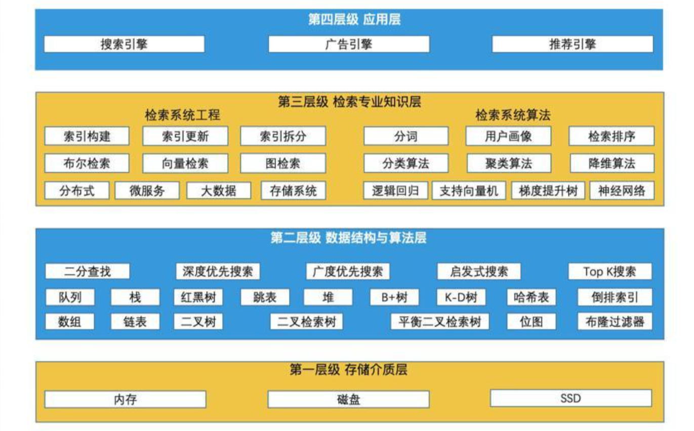
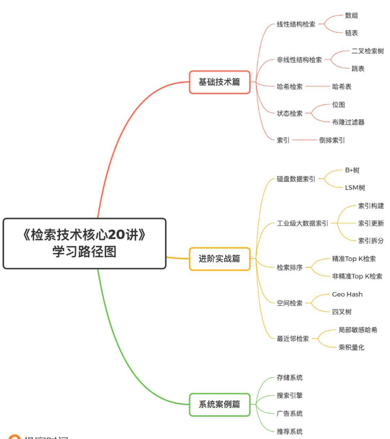
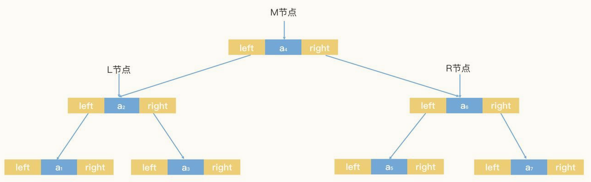
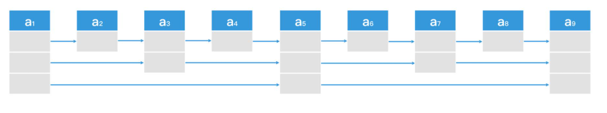
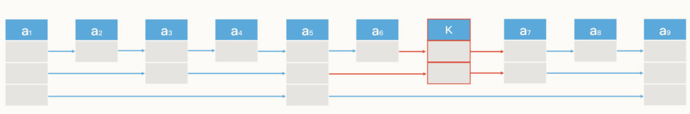

## 检索技术核心20讲
检索技术：它是更底层的通用技术，它研究的是如何将我们所需的数据高效地取出来。
检索的核心思路，是通过合理组织数据，尽可能地快速减少查询范围。

**知识全景图**

**检索知识体系**

### 01-线性结构检索：从数组和链表的原理初窥检索本质
数组和链表分别代表了连续空间和不连续空间的最基础的存储方式，它们是线性表（Linear List）的典型代表。其他所有的数据结构，比如栈、队列、二叉树、B+树等，都不外乎是这两者的结合和变化。

- 数组：数据存储空间连续，查找快增删慢，适用于读多写少场景；
- 链表：数据储存空间非连续，检索能力偏弱，动态调整能力强，适用于读少写多场景。

###　02-非线性结构检索：数据频繁变化的情况下，如何高效检索？
#### 二叉检索树
非线性结构数据，若想使用类似二分查找的方式进行高效检索，可使用二叉检索树结构。

其检索核心原理与有序数组的二分查找一致。

- 检索空间不平衡问题：当二叉树两端数据分布不平衡时，检索无法有效过滤“一半的数据”。例如在极端情况下，一个二叉树每一个节点都只有右节点，这时二叉树就退化为了一个单链表。
- 二叉检索树的检索空间平衡方案
  - AVL树（平衡二叉树）
  - 红黑树

#### 跳表

**利用多层链表存储多层索引区间，实现了类似“二分搜索”的数据查找算法。**

一个理想的跳表，就是从链表头开始，用多个不同的步长，每隔2^n个节点做一次直接链接（n取值为0，1，2……）。跳表中的每个节点都拥有多个不同步长的指针，我们可以在每个节点里，用一个数组next来记录这些指针。next数组的大小就是这个节点的层数，next[0]就是第0层的步长为1的指针，next[1]就是第1层的步长为2的指针，next[2]就是第2层的步长为4的指针，依此类推。

- 插入数据时，跳表的检索空间平衡方案
通过简单的随机生成指针层数的方式，保证指针的分布，使结构在大概率上保持平衡。

- 特点跳表用一种更简单的方式实现了检索空间的平衡。并且跳表保持了链表顺序遍历的能力，在需要遍历功能的场景中，跳表会比红黑树用起来更方便。如，在Redis系统中，经常会利用跳表来代替红黑树作为底层的数据结构。

理想状态下，平衡的二叉检索树和跳表的检索效率都为O(log n)。