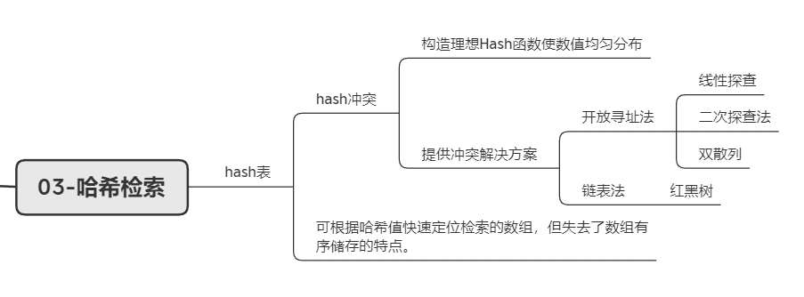
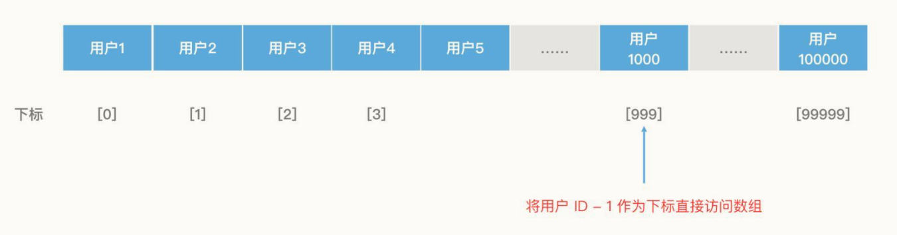
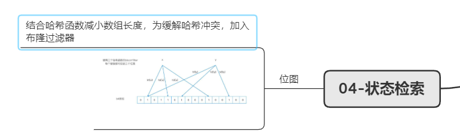
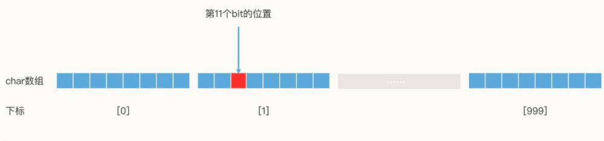
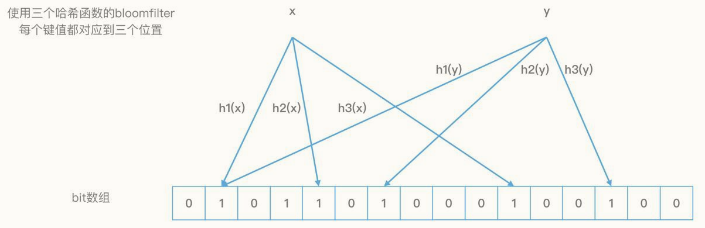

## 检索技术核心20讲
检索技术：它是更底层的通用技术，它研究的是如何将我们所需的数据高效地取出来。
检索的核心思路，是通过合理组织数据，尽可能地快速减少查询范围。

**知识全景图**

**检索知识体系**

### 01-线性结构检索：从数组和链表的原理初窥检索本质
数组和链表分别代表了连续空间和不连续空间的最基础的存储方式，它们是线性表（Linear List）的典型代表。其他所有的数据结构，比如栈、队列、二叉树、B+树等，都不外乎是这两者的结合和变化。

- 数组：数据存储空间连续，查找快增删慢，适用于读多写少场景；
- 链表：数据储存空间非连续，检索能力偏弱，动态调整能力强，适用于读少写多场景。

###　02-非线性结构检索：数据频繁变化的情况下，如何高效检索？
#### 二叉检索树
非线性结构数据，若想使用类似二分查找的方式进行高效检索，可使用二叉检索树结构。

其检索核心原理与有序数组的二分查找一致。

- 检索空间不平衡问题：当二叉树两端数据分布不平衡时，检索无法有效过滤“一半的数据”。例如在极端情况下，一个二叉树每一个节点都只有右节点，这时二叉树就退化为了一个单链表。
- 二叉检索树的检索空间平衡方案
  - AVL树（平衡二叉树）
  - 红黑树

#### 跳表

**利用多层链表存储多层索引区间，实现了类似“二分搜索”的数据查找算法。**

一个理想的跳表，就是从链表头开始，用多个不同的步长，每隔2^n个节点做一次直接链接（n取值为0，1，2……）。跳表中的每个节点都拥有多个不同步长的指针，我们可以在每个节点里，用一个数组next来记录这些指针。next数组的大小就是这个节点的层数，next[0]就是第0层的步长为1的指针，next[1]就是第1层的步长为2的指针，next[2]就是第2层的步长为4的指针，依此类推。

- 插入数据时，跳表的检索空间平衡方案
通过简单的随机生成指针层数的方式，保证指针的分布，使结构在大概率上保持平衡。

- 特点跳表用一种更简单的方式实现了检索空间的平衡。并且跳表保持了链表顺序遍历的能力，在需要遍历功能的场景中，跳表会比红黑树用起来更方便。如，在Redis系统中，经常会利用跳表来代替红黑树作为底层的数据结构。

理想状态下，平衡的二叉检索树和跳表的检索效率都为O(log n)。

### 03-哈希检索：如何根据用户ID快速查询用户信息？

#### 使用Hash函数将Key转换为数组下标

- 哈希表的本质是一个数组，它通过Hash函数将查询的Key转为数组下标，利用数组的随机访问特性，使得我们能在O(1)的时间代价内完成检索。

**哈希冲突：两个对象的hash值相同**
- 方案一：构造更理想的hash函数，使数值分布均匀；
- 方案二：为hash冲突提供解决方案：
  - *开放寻址法*：
    - 线性探查：若插入的位置存在元素，插入时按顺序插入下一空闲处，查找时查找至空闲处（影响哈希表整体性能）；
    - 二次探查：将线性探查的步长从i改为i^2；
    - 使用多个Hash函数来求下标位置
  - *链表法*：在数组中不存储一个具体元素，而是存储一个链表头，将元素存入链表尾部。

对于开放寻址法，插入元素越多、哈希值越满，性能下降越快，数据动态变化场景下并不适用；
链表法将数组和链表进行结合，既利用了数组的随机访问特性，又利用了链表的动态修改特性，同时提供了快速查询和动态修改的能力。

- 哈希表的缺点：失去了数组“有序存储的特点”，无法对遍历和范围查询加速。

### 04-状态检索：如何快速判断一个用户是否存在？

#### 位图
思路：利用数组的随机访问特性来提高查询效率，利用位图来减少存储空间。
1char--1字节=8bit

**以bit为单位构建数组的方案，就叫作Bitmap，翻译为位图。**

检索过程：假如用户id为11，一个元素占8bit，11/8得1余3，查找第二个元素的第三位。

- 问题1：数组长度必须大于ID上限且ID必须为正整数。

优化1：使用哈希函数将ID转化为小于数组长度的下标。
压缩了数组长度，且ID不再限制于正整数。

- 问题2：哈希冲突，假如ID1和ID2相同，ID1存在ID2不存在，检索ID2时，结果为1。
优化2：使用**布隆过滤器**。
布隆过滤器的特点是对一个对象使用多个哈希函数。k个哈希函数，得到k个哈希值，有k个下标，将其值都置为1。大大降低两个对象的k位都相同的概率，从而解决哈希冲突。

- 布隆过滤器的错误率问题：一个的对象的k个哈希下标可能都被其他对象置为1，就算这个对象不存在，当查询时仍会判定为存在。

此问题在该场景下影响不大：无法确认ID是否已经被注册了，让用户再换一个ID注册，这也不会损害新用户的体验。

如果哈希函数个数为1，且数组长度足够，布隆过滤器就可以退化成一个位图。所以，我们可以认为“位图是只有一个特殊的哈希函数，且没有被压缩长度的布隆过滤器”。
