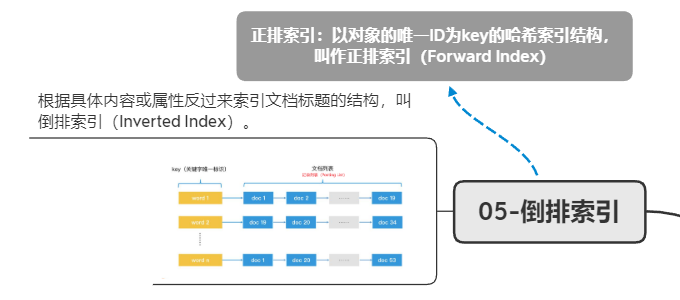
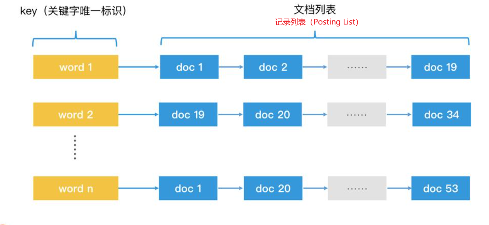
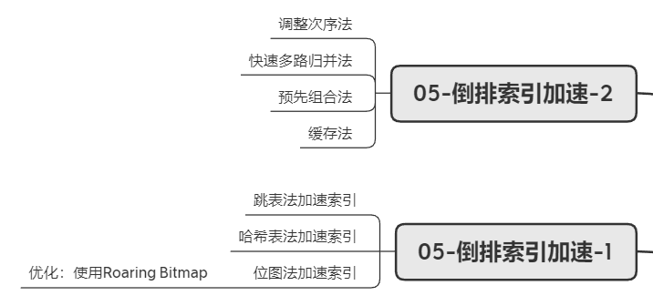

## 检索技术核心20讲
检索技术：它是更底层的通用技术，它研究的是如何将我们所需的数据高效地取出来。
检索的核心思路，是通过合理组织数据，尽可能地快速减少查询范围。

**知识全景图**

**检索知识体系**

### 01-线性结构检索：从数组和链表的原理初窥检索本质
数组和链表分别代表了连续空间和不连续空间的最基础的存储方式，它们是线性表（Linear List）的典型代表。其他所有的数据结构，比如栈、队列、二叉树、B+树等，都不外乎是这两者的结合和变化。

- 数组：数据存储空间连续，查找快增删慢，适用于读多写少场景；
- 链表：数据储存空间非连续，检索能力偏弱，动态调整能力强，适用于读少写多场景。

###　02-非线性结构检索：数据频繁变化的情况下，如何高效检索？
#### 二叉检索树
非线性结构数据，若想使用类似二分查找的方式进行高效检索，可使用二叉检索树结构。

其检索核心原理与有序数组的二分查找一致。

- 检索空间不平衡问题：当二叉树两端数据分布不平衡时，检索无法有效过滤“一半的数据”。例如在极端情况下，一个二叉树每一个节点都只有右节点，这时二叉树就退化为了一个单链表。
- 二叉检索树的检索空间平衡方案
  - AVL树（平衡二叉树）
  - 红黑树

#### 跳表

**利用多层链表存储多层索引区间，实现了类似“二分搜索”的数据查找算法。**

一个理想的跳表，就是从链表头开始，用多个不同的步长，每隔2^n个节点做一次直接链接（n取值为0，1，2……）。跳表中的每个节点都拥有多个不同步长的指针，我们可以在每个节点里，用一个数组next来记录这些指针。next数组的大小就是这个节点的层数，next[0]就是第0层的步长为1的指针，next[1]就是第1层的步长为2的指针，next[2]就是第2层的步长为4的指针，依此类推。

- 插入数据时，跳表的检索空间平衡方案
通过简单的随机生成指针层数的方式，保证指针的分布，使结构在大概率上保持平衡。

- 特点跳表用一种更简单的方式实现了检索空间的平衡。并且跳表保持了链表顺序遍历的能力，在需要遍历功能的场景中，跳表会比红黑树用起来更方便。如，在Redis系统中，经常会利用跳表来代替红黑树作为底层的数据结构。

理想状态下，平衡的二叉检索树和跳表的检索效率都为O(log n)。

### 03-哈希检索：如何根据用户ID快速查询用户信息？

#### 使用Hash函数将Key转换为数组下标

- 哈希表的本质是一个数组，它通过Hash函数将查询的Key转为数组下标，利用数组的随机访问特性，使得我们能在O(1)的时间代价内完成检索。

**哈希冲突：两个对象的hash值相同**
- 方案一：构造更理想的hash函数，使数值分布均匀；
- 方案二：为hash冲突提供解决方案：
  - *开放寻址法*：
    - 线性探查：若插入的位置存在元素，插入时按顺序插入下一空闲处，查找时查找至空闲处（影响哈希表整体性能）；
    - 二次探查：将线性探查的步长从i改为i^2；
    - 使用多个Hash函数来求下标位置
  - *链表法*：在数组中不存储一个具体元素，而是存储一个链表头，将元素存入链表尾部。

对于开放寻址法，插入元素越多、哈希值越满，性能下降越快，数据动态变化场景下并不适用；
链表法将数组和链表进行结合，既利用了数组的随机访问特性，又利用了链表的动态修改特性，同时提供了快速查询和动态修改的能力。

- 哈希表的缺点：失去了数组“有序存储的特点”，无法对遍历和范围查询加速。

### 04-状态检索：如何快速判断一个用户是否存在？

#### 位图
思路：利用数组的随机访问特性来提高查询效率，利用位图来减少存储空间。
1char--1字节=8bit

**以bit为单位构建数组的方案，就叫作Bitmap，翻译为位图。**

检索过程：假如用户id为11，一个元素占8bit，11/8得1余3，查找第二个元素的第三位。

- 问题1：数组长度必须大于ID上限且ID必须为正整数。

优化1：使用哈希函数将ID转化为小于数组长度的下标。
压缩了数组长度，且ID不再限制于正整数。

- 问题2：哈希冲突，假如ID1和ID2相同，ID1存在ID2不存在，检索ID2时，结果为1。
优化2：使用**布隆过滤器**。
布隆过滤器的特点是对一个对象使用多个哈希函数。k个哈希函数，得到k个哈希值，有k个下标，将其值都置为1。大大降低两个对象的k位都相同的概率，从而解决哈希冲突。

- 布隆过滤器的错误率问题：一个的对象的k个哈希下标可能都被其他对象置为1，就算这个对象不存在，当查询时仍会判定为存在。

此问题在该场景下影响不大：无法确认ID是否已经被注册了，让用户再换一个ID注册，这也不会损害新用户的体验。

如果哈希函数个数为1，且数组长度足够，布隆过滤器就可以退化成一个位图。所以，我们可以认为“位图是只有一个特殊的哈希函数，且没有被压缩长度的布隆过滤器”。

### 05-倒排索引：如何从海量数据中查询同时带有“极”和“客”的唐诗？

**创建步骤**：
1. 给每个文档编号，作为其唯一的标识，并且排好序，然后开始遍历文档;
2. 解析当前文档中的每个关键字，生成<关键字，文档ID，关键字位置>这样的数据对;
3. 将关键字作为key插入哈希表。如果哈希表中已经有这个key了，就在对应的posting list后面追加节点，记录该文档ID；如果哈希表中还没有这个key，就直接插入该key，并创建posting list和对应节点;
4. 重复2、3步。

**多个关键字查询步骤**：
1. 将每个关键字对应的posting list查询出来；
2. 链表归并，根据需求计算集合合并中的交集、并集和差集。

**链表归并的过程**：
1. 使用指针p1和p2分别指向有序链表A和B的第一个元素。
2. 对比p1和p2指向的节点是否相同，这时会出现3种情况：
两者的id相同，说明该节点为公共元素，直接将该节点加入归并结果。然后，p1和p2要同时后移，指向下一个元素；
p1元素的id小于p2元素的id，p1后移，指向A链表中下一个元素；
p1元素的id大于p2元素的id，p2后移，指向B链表中下一个元素。
3. 重复第2步，直到p1或p2移动到链表尾为止。

**应用场景**：数据库的全文索引功能、搜索引擎的索引、广告引擎和推荐引擎，都使用了倒排索引技术来实现检索功能。

### 05-倒排索引加速

#### 数据结构优化
##### 跳表加速法
当需要对两个Posting List进行归并时，可让这两个list相互二分查找进行查找加速：
1. 当指向list1的节点p1大于指向list2的节点p2，用p1对list2进行二分查找，找到相同元素时提取出来；
2. 比较下一个元素大小，重复步骤1。

- 适用场景：list元素分布稀疏。

##### 哈希表法
当一个list中的元素少，一个list中的元素多时：
1. 将元素多的list1转化为哈希表；
2. 遍历list2，将每个元素向list1转化的哈希表查询。

- 时间复杂度：假如list2有m个元素，每次查询的时间复杂度为O（1），检索时间可为m。
- 注意点：
  - 需要在查询前将list1转化为哈希表；
  - list1的Posting List需要保留；
- 适用场景：Posting List大小差距较大；

##### 位图加速法
将Posting List转化为位图，进行运算。

缺陷：Posting List中的元素不能太多，且只能查询简单ID。

- 优化：使用Roaring Bitmap
将倒排索引的key转化为32为bit，将高16位作为一个2^16大小的数组桶下标中，低16位作为一个容器，存储对应的posting list。
