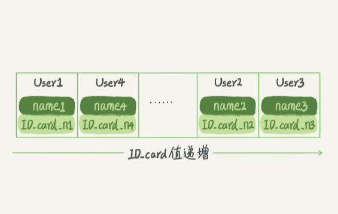
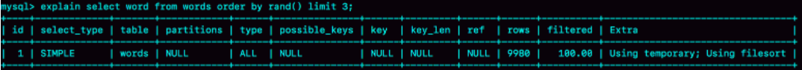
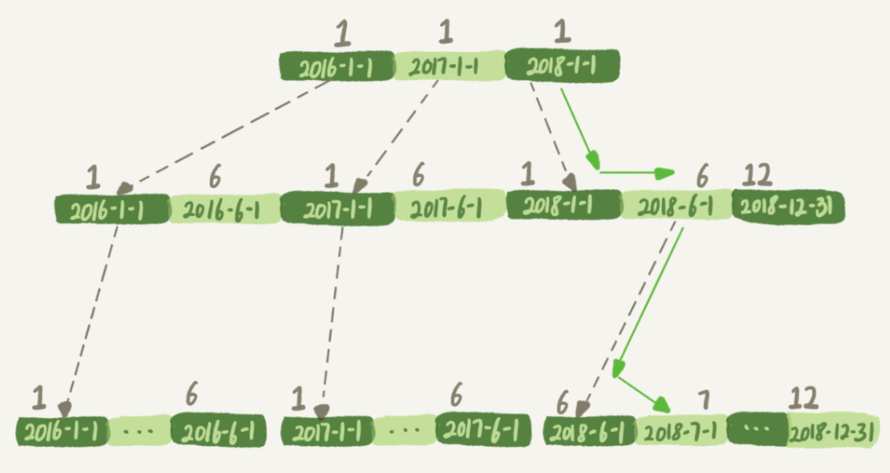
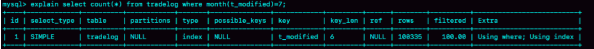
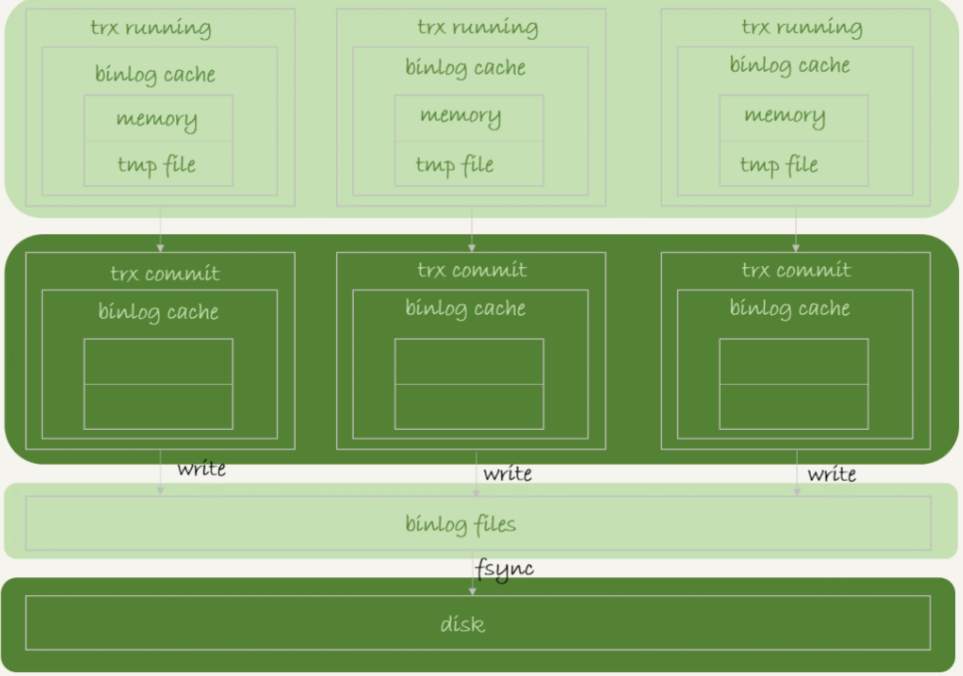
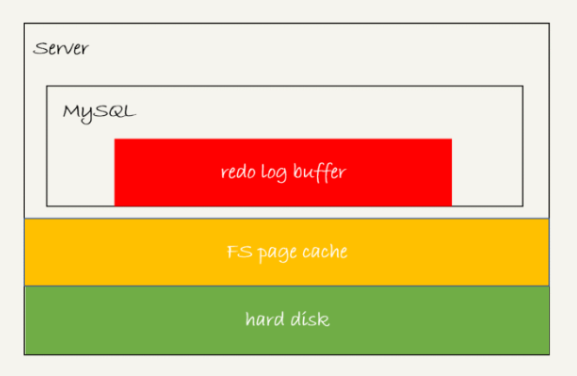
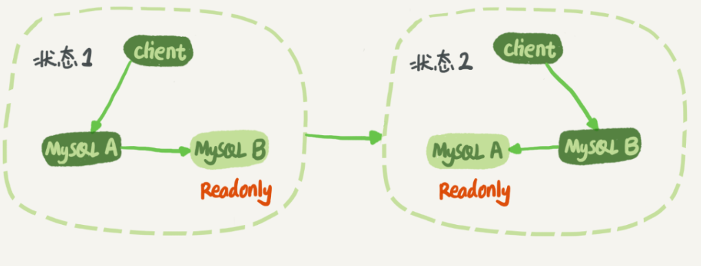

## 01讲：基础架构
一条SQL查询语句是如何执行的？
MySQL的基本架构示意图：


- MySQL可以分为Server层和存储引擎层两部分：
    - Server层包括连接器、查询缓存、分析器、优化器、执行器等，涵盖MySQL的大多数核心服务功能，以及所有的内置函数（如日期、时间、数学和加密函数等），所有跨存储引擎的功能都在这一层实现，比如存储过程、触发器、视图等。
  - 而存储引擎层负责数据的存储和提取。其架构模式是插件式的，支持InnoDB、MyISAM、Memory等多个存储引擎。现在最常用的存储引擎是InnoDB，它从MySQL 5.5.5版本开始成为了默认存储引擎。

**连接器**
第一步，先连接到这个数据库上，这时候接待你的就是连接器。连接器负责跟客户端建立连接、获取权限、维持和管理连接。

**查询缓存**
连接建立完成后，你就可以执行select语句了。执行逻辑就会来到第二步：查询缓存。
之前执行过的语句及其结果可能会以key-value对的形式，被直接缓存在内存中。MySQL会先到查询缓存查看，若能在查询缓存中能找到key，那么会将其value直接返回客户端。

- 查询缓存的利弊
  - 弊：若对表更新，该表上的查询缓存会被清空，对于更新压力大的数据库查询缓存的命中率会很低。
  - 利：查询缓存适用于静态表。

ps：MySQL 8.0版本将查询缓存的整块功能删掉了。

**分析器**
若没有命中查询缓存，分析器会先对SQL语句进行解析，根据语法规则，判断你输入的这个SQL语句是否满足MySQL语法。

**优化器**
经过分析器，MySQL知道了要做什么，接下来进行优化处理。
优化器是在表里面有多个索引的时候，决定使用哪个索引；或者在一个语句有多表关联（join）的时候，决定各个表的连接顺序。

**执行器**
MySQL通过分析器知道了要做什么，通过优化器知道了该怎么做，于是就进入了执行器阶段，开始执行语句。
开始执行的时候会判断你对表有没有执行权限，有权限就打开表执行，然后将满足条件的行组成的记录集作为结果集返回给客户端。


- 问题：如果表T中没有字段k，而你执行了这个语句 select * from T where k=1, 那肯定是会报“不存在这个列”的错误： “Unknown column ‘k’ in ‘where clause’”。这个错误是在我们上面提到的哪个阶段报出来的呢？
答案：分析器。Oracle会在分析阶段判断语句是否正确，表是否存在，列是否存在等。MySQL确实在设计上受Oracle影响颇深，这一点与Oracle相同。

## 02讲：日志系统
### 物理日志：redo log
如果每一次的更新操作都需要写进磁盘，然后磁盘也要找到对应的那条记录，然后再更新，整个过程IO成本、查找成本都很高。为解决这一问题，MySQL使用了WAL(Write-Ahead Logging)技术,它的关键点就是先写日志，再写磁盘。
当有一条记录需要更新时，InnoDB引擎就会先把记录写到redo log，并更新内存，InnoDB引擎会在适当的时候，将这个操作记录更新到磁盘里面，而这个更新往往是在系统比较空闲的时候做。

**InnoDB的redo log**
InnoDB的redo log是固定大小的，比如可以配置为一组4个文件，每个文件的大小是1GB，总共就可以记录4GB的操作。从头开始写，写到末尾就又回到开头循环写，如图：


write pos是当前记录位置，一边写一边后移。checkpoint是当前要擦除的位置，也是往后推移并且循环的，擦除记录前要把记录更新到数据文件。

write pos和checkpoint之间可以用来记录新的操作。如果write pos追上checkpoint，这时候不能再执行新的更新，得停下来先擦掉一些记录，把checkpoint推进一下。

有了redo log，InnoDB就可以保证即使数据库发生异常重启，之前提交的记录都不会丢失，这个能力称为*crash-safe*。

### 逻辑日志：binlog
MySQL整体来看有两块：一块是Server层，它主要做的是MySQL功能层面的事情；还有一块是引擎层，负责存储相关的具体事宜。redo log是InnoDB引擎特有的日志，而Server层也有自己的日志，称为binlog（归档日志）。
- binlog日志与redo log日志的不同：
  - 1.redo log是InnoDB引擎特有的；binlog是MySQL的Server层实现的，所有引擎都可以使用。
  - 2.redo log是物理日志，记录的是“在某个数据页上做了什么修改”；binlog是逻辑日志，记录的是这个语句的原始逻辑，比如“给ID=2这一行的c字段加1 ”。
  - 3.redo log是循环写的，空间固定会用完；binlog是可以追加写入的。“追加写”是指binlog文件写到一定大小后会切换到下一个，并不会覆盖以前的日志。

- 执行器和InnoDB引擎在执行update语句时的内部流程：
  - 1.执行器先找引擎取ID=2这一行。ID是主键，引擎直接用树搜索找到这一行。如果ID=2这一行所在的数据页本来就在内存中，就直接返回给执行器；否则，需要先从磁盘读入内存，然后再返回。
  - 2.执行器拿到引擎给的行数据，把这个值加上1，比如原来是N，现在就是N+1，得到新的一行数据，再调用引擎接口写入这行新数据。
  - 3.引擎将这行新数据更新到内存中，同时将这个更新操作记录到redo log里面，此时redo log处于prepare状态。然后告知执行器执行完成了，随时可以提交事务。
  - 4.执行器生成这个操作的binlog，并把binlog写入磁盘。
  - 5.执行器调用引擎的提交事务接口，引擎把刚刚写入的redo log改成提交（commit）状态，更新完成。


图中浅色框表示是在InnoDB内部执行的，深色框表示是在执行器中执行的。
**两阶段提交**
最后三步，*为了让两份日志之间的逻辑一致*，将redo log的写入拆成了两个步骤：prepare和commit，这就是"两阶段提交"。

由于redo log和binlog是两个独立的逻辑，如果不用两阶段提交，要么就是先写完redo log再写binlog，或者采用反过来的顺序，那么数据库的状态就有可能和用它的日志恢复出来的库的状态不一致。

- 先写redo log后写binlog。假设在redo log写完，binlog还没有写完的时候，MySQL进程异常重启。由于我们前面说过的，redo log写完之后，系统即使崩溃，仍然能够把数据恢复回来，所以恢复后这一行c的值是1。
但是由于binlog没写完就crash了，这时候binlog里面就没有记录这个语句。因此，之后备份日志的时候，存起来的binlog里面就没有这条语句。
然后你会发现，如果需要用这个binlog来恢复临时库的话，由于这个语句的binlog丢失，这个临时库就会少了这一次更新，恢复出来的这一行c的值就是0，与原库的值不同。

- 先写binlog后写redo log。如果在binlog写完之后crash，由于redo log还没写，崩溃恢复以后这个事务无效，所以这一行c的值是0。但是binlog里面已经记录了“把c从0改成1”这个日志。所以，在之后用binlog来恢复的时候就多了一个事务出来，恢复出来的这一行c的值就是1，与原库的值不同。

redo log和binlog都可以用于表示事务的提交状态，而两阶段提交就是让这两个状态保持逻辑上的一致。

### 小结
MySQL里面最重要的两个日志，即物理日志redo log和逻辑日志binlog。

redo log用于保证crash-safe能力。innodb_flush_log_at_trx_commit这个参数设置成1的时候，表示每次事务的redo log都直接持久化到磁盘。这个参数我建议你设置成1，这样可以保证MySQL异常重启之后数据不丢失。

sync_binlog这个参数设置成1的时候，表示每次事务的binlog都持久化到磁盘。这个参数我也建议你设置成1，这样可以保证MySQL异常重启之后binlog不丢失。

两阶段提交是跨系统维持数据逻辑一致性时常用的一个方案。

## 03讲：事务隔离
事务的四大特性：ACID（Atomicity、Consistency、Isolation、Durability，即原子性、一致性、隔离性、持久性）
### 隔离性与隔离级别
SQL标准的事务隔离级别包括：读未提交（read uncommitted）、读提交（read committed）、可重复读（repeatable read）和串行化（serializable ）。
- 读未提交是指，一个事务还没提交时，它做的变更就能被别的事务看到。
- 读提交是指，一个事务提交之后，它做的变更才会被其他事务看到。
- 可重复读是指，一个事务执行过程中看到的数据，总是跟这个事务在启动时看到的数据是一致的。当然在可重复读隔离级别下，未提交变更对其他事务也是不可见的。
- 串行化，顾名思义是对于同一行记录，“写”会加“写锁”，“读”会加“读锁”。当出现读写锁冲突的时候，后访问的事务必须等前一个事务执行完成，才能继续执行。

```sql
mysql> create table T(c int) engine=InnoDB;
insert into T(c) values(1);
 ```


在不同的隔离级别下，事务A的返回结果，也就是图里面V1、V2、V3的返回值分别是什么。
- 若隔离级别是“读未提交”， 则V1的值就是2。这时候事务B虽然还没有提交，但是结果已经被A看到了。因此，V2、V3也都是2。
- 若隔离级别是“读提交”，则V1是1，V2的值是2。事务B的更新在提交后才能被A看到。所以， V3的值也是2。
- 若隔离级别是“可重复读”，则V1、V2是1，V3是2。之所以V2还是1，遵循的就是这个要求：事务在执行期间看到的数据前后必须是一致的。
- 若隔离级别是“串行化”，则在事务B执行“将1改成2”的时候，会被锁住。直到事务A提交后，事务B才可以继续执行。所以从A的角度看， V1、V2值是1，V3的值是2。

在实现上，数据库里面会创建一个视图，访问的时候以视图的逻辑结果为准。在“可重复读”隔离级别下，这个视图是在事务启动时创建的，整个事务存在期间都用这个视图。在“读提交”隔离级别下，这个视图是在每个SQL语句开始执行的时候创建的。这里需要注意的是，“读未提交”隔离级别下直接返回记录上的最新值，没有视图概念；而“串行化”隔离级别下直接用加锁的方式来避免并行访问。

ps:Oracle数据库的默认隔离级别是“读提交”，因此对于一些从Oracle迁移到MySQL的应用，为保证数据库隔离级别的一致，一定要记得将MySQL的隔离级别设置为“读提交”。

- 尽量不要使用长事务：
  - 长事务意味着系统里面会存在很老的事务视图。由于这些事务随时可能访问数据库里面的任何数据，所以这个事务提交之前，数据库里面它可能用到的回滚记录都必须保留，这就会导致大量占用存储空间。

  - 在MySQL 5.5及以前的版本，回滚日志是跟数据字典一起放在ibdata文件里的，即使长事务最终提交，回滚段被清理，文件也不会变小。
  - 除了对回滚段的影响，长事务还占用锁资源，也可能拖垮整个库。

### 事务的启动方式
MySQL的事务启动方式有以下几种：
- 显式启动事务语句， begin 或 start transaction。配套的提交语句是commit，回滚语句是rollback。
- set autocommit=0，这个命令会将这个线程的自动提交关掉。意味着如果你只执行一个select语句，这个事务就启动了，而且并不会自动提交。这个事务持续存在直到你主动执行commit 或 rollback 语句，或者断开连接。
- 通过显式语句的方式来启动事务：
使用`commit work and chain`语法：在autocommit为1的情况下，用begin显式启动的事务，如果执行commit则提交事务。如果执行 commit work and chain，则是提交事务并自动启动下一个事务，这样也省去了再次执行begin语句的开销。同时带来的好处是从程序开发的角度明确地知道每个语句是否处于事务中。

## 04讲：深入浅出索引(上)
索引的出现其实就是为了提高数据查询的效率，就像书的目录一样。
索引三种常见、也比较简单的数据结构分别是**哈希表**、**有序数组**和**搜索树**。

### 哈希表
哈希表是一种以键-值（key-value）存储数据的结构，我们只要输入待查找的值即key，就可以找到其对应的值即Value。哈希的思路很简单，把值放在数组里，用一个哈希函数把key换算成一个确定的位置，然后把value放在数组的这个位置。


图中四个ID_card_n的值并不是递增的，这样做的好处是增加新的User时速度会很快，只需要往后追加。但缺点是，因为不是有序的，所以哈希索引做区间查询的速度是很慢的。

**哈希表这种结构适用于只有等值查询的场景**，比如Memcached及其他一些NoSQL引擎。

### 有序数组
**有序数组在等值查询和范围查询场景中的性能就都非常优秀。**


如果仅仅看查询效率，有序数组就是最好的数据结构了。但是，在需要更新数据的时候成本太高。
**序数组索引只适用于静态存储引擎。**

### 搜索树
**InnoDB 的索引模型：B+树**
在InnoDB中，表都是根据主键顺序以索引的形式存放的，这种存储方式的表称为索引组织表。又因为前面我们提到的，InnoDB使用了B+树索引模型，所以数据都是存储在B+树中的。
每一个索引在InnoDB里面对应一棵B+树。

例如建表：
```sql
mysql> create table T(
id int primary key, 
k int not null, 
name varchar(16),
index (k))engine=InnoDB;
 ```
表中R1~R5的(ID,k)值分别为(100,1)、(200,2)、(300,3)、(500,5)和(600,6)，两棵树的示例示意图如下。

根据叶子节点的内容，索引类型分为主键索引和非主键索引。

主键索引的叶子节点存的是整行数据。在InnoDB里，主键索引也被称为聚簇索引（clustered index）。
非主键索引的叶子节点内容是主键的值。在InnoDB里，非主键索引也被称为二级索引（secondary index）。

基于主键索引和普通索引的查询有什么区别？
- 如果语句是select * from T where ID=500，即主键查询方式，则只需要搜索ID这棵B+树；
- 如果语句是select * from T where k=5，即普通索引查询方式，则需要先搜索k索引树，得到ID的值为500，再到ID索引树搜索一次。这个过程称为回表。

也就是说，基于非主键索引的查询需要多扫描一棵索引树。因此，我们在应用中应该尽量使用主键查询。

### 索引维护
一个数据页满了，按照B+Tree算法，新增加一个数据页，叫做页分裂，会导致性能下降。空间利用率降低大概50%。当相邻的两个数据页利用率很低的时候会做数据页合并，合并的过程是分裂过程的逆过程。
主键长度越小，普通索引的叶子节点就越小，普通索引占用的空间也就越小。从性能和存储空间方面考量，自增主键往往是更合理的选择。

## 05讲：深入浅出索引(下)
### 覆盖索引
如果查询条件使用的是普通索引（或是联合索引的最左原则字段），查询结果是联合索引的字段或是主键，不用回表操作，直接返回结果，减少IO磁盘读写读取正行数据。
由于覆盖索引可以减少树的搜索次数，显著提升查询性能，所以使用覆盖索引是一个常用的性能优化手段。

### 最左前缀原则
联合索引的最左 N 个字段，也可以是字符串索引的最左 M 个字符。
B+树这种索引结构，可以利用索引的“最左前缀”，来定位记录。

### 联合索引
根据创建联合索引的顺序，以最左原则进行where检索，比如（age，name）以age=1 或 age= 1 and name=‘张三’可以使用索引，单以name=‘张三’ 不会使用索引，考虑到存储空间的问题，还请根据业务需求，将查找频繁的数据进行靠左创建索引。
第一原则是，如果通过调整顺序，可以少维护一个索引，那么这个顺序往往就是需要优先考虑采用的。

### 索引下推
like 'hello%’and age >10 检索，MySQL5.6版本之前，会对匹配的数据进行回表查询。5.6版本后，会先过滤掉age<10的数据，再进行回表查询，减少回表率，提升检索速度

## 06讲：全局锁和表锁
根据加锁的范围，MySQL里面的锁大致可以分成全局锁、表级锁和行锁三类。

### 全局锁
对整个数据库实例加锁。
MySQL提供加全局读锁的方法：Flush tables with read lock(FTWRL)
这个命令可以使整个库处于只读状态。使用该命令之后，数据更新语句、数据定义语句和更新类事务的提交语句等操作都会被阻塞。
使用场景：全库逻辑备份。

风险：
1.如果在主库备份，在备份期间不能更新，业务停摆
2.如果在从库备份，备份期间不能执行主库同步的binlog，导致主从延迟
官方自带的逻辑备份工具mysqldump，当mysqldump使用参数--single-transaction的时候，会启动一个事务，确保拿到一致性视图。而由于MVCC的支持，这个过程中数据是可以正常更新的。

一致性读是好，但是前提是引擎要支持这个隔离级别。
如果要全库只读，为什么不使用set global readonly=true的方式？
1.在有些系统中，readonly的值会被用来做其他逻辑，比如判断主备库。所以修改global变量的方式影响太大。
2.在异常处理机制上有差异。如果执行FTWRL命令之后由于客户端发生异常断开，那么MySQL会自动释放这个全局锁，整个库回到可以正常更新的状态。而将整个库设置为readonly之后，如果客户端发生异常，则数据库就会一直保持readonly状态，这样会导致整个库长时间处于不可写状态，风险较高。

### 表级锁
MMySQL里面表级锁有两种，一种是表锁，一种是元数据所(meta data lock,MDL)
表锁的语法是:lock tables ... read/write
可以用unlock tables主动释放锁，也可以在客户端断开的时候自动释放。lock tables语法除了会限制别的线程的读写外，也限定了本线程接下来的操作对象。
对于InnoDB这种支持行锁的引擎，一般不使用lock tables命令来控制并发，毕竟锁住整个表的影响面还是太大。
MDL：不需要显式使用，在访问一个表的时候会被自动加上。
MDL的作用：保证读写的正确性。
在对一个表做增删改查操作的时候，加MDL读锁；当要对表做结构变更操作的时候，加MDL写锁。
读锁之间不互斥。读写锁之间，写锁之间是互斥的，用来保证变更表结构操作的安全性。
MDL 会直到事务提交才会释放，在做表结构变更的时候，一定要小心不要导致锁住线上查询和更新。个表的时候会被自动加上。MDL的作用是，保证读写的正确性。

在MySQL 5.5版本中引入了MDL，当对一个表做增删改查操作的时候，加MDL读锁；当要对表做结构变更操作的时候，加MDL写锁。
- 读锁之间不互斥，因此可以有多个线程同时对一张表增删改查。
- 读写锁之间、写锁之间是互斥的，用来保证变更表结构操作的安全性。因此，如果有两个线程要同时给一个表加字段，其中一个要等另一个执行完才能开始执行。

## 07讲：行锁功过：怎么减少行锁对性能的影响
**两阶段锁**：在 InnoDB 事务中，行锁是在需要的时候才加上的，但并不是不需要了就立刻释放， 而是要等到事务结束时才释放。
**建议**：如果你的事务中需要锁多个行，要把最可能造成锁冲突、最可能影响并发度的锁尽量往后放。
**死锁**：当并发系统中不同线程出现循环资源依赖，涉及的线程都在等待别的线程释放资源时，就会导致这几个线程都进入无限等待的状态。

解决方案：
1、通过参数 innodb_lock_wait_timeout 根据实际业务场景来设置超时时间，InnoDB引擎默认值是50s。
2、发起死锁检测，发现死锁后，主动回滚死锁链条中的某一个事务，让其他事务得以继续执行。将参数 innodb_deadlock_detect 设置为 on，表示开启这个逻辑（默认是开启状态）。

如何解决热点行更新导致的性能问题？
1、如果你能确保这个业务一定不会出现死锁，可以临时把死锁检测关闭掉。一般不建议采用
2、控制并发度，对应相同行的更新，在进入引擎之前排队。这样在InnoDB内部就不会有大量的死锁检测工作了。
3、将热更新的行数据拆分成逻辑上的多行来减少锁冲突，但是业务复杂度可能会大大提高。

innodb行级锁是通过锁索引记录实现的，如果更新的列没建索引是会锁住整个表的。

## 08讲：事务到底是隔离的还是不隔离的
- innodb支持RC和RR隔离级别实现是用的一致性视图(consistent read view)

- 事务在启动时会拍一个快照,这个快照是基于整个库的.
基于整个库的意思就是说一个事务内,整个库的修改对于该事务都是不可见的(对于快照读的情况)
如果在事务内select t表,另外的事务执行了DDL t表,根据发生时间,要嘛锁住要嘛报错(参考第六章)

- 事务是如何实现的MVCC呢?
(1)每个事务都有一个事务ID,叫做transaction id(严格递增)
(2)事务在启动时,找到已提交的最大事务ID记为up_limit_id。
(3)事务在更新一条语句时,比如id=1改为了id=2.会把id=1和该行之前的row trx_id写到undo log里,
并且在数据页上把id的值改为2,并且把修改这条语句的transaction id记在该行行头
(4)再定一个规矩,一个事务要查看一条数据时,必须先用该事务的up_limit_id与该行的transaction id做比对,
如果up_limit_id>=transaction id,那么可以看.如果up_limit_id< transaction id,则只能去undo log里去取。去undo log查找数据的时候,也需要做比对,必须up_limit_id>transaction id,才返回数据。

- 更新数据都是先读后写的，而这个读，只能读当前的值，称为“当前读”（current read）。

- 事务的可重复读的能力是怎么实现的？
可重复读的核心就是一致性读（consistent read）；而事务更新数据的时候，只能用当前读。如果当前的记录的行锁被其他事务占用的话，就需要进入锁等待。
而读提交的逻辑和可重复读的逻辑类似，它们最主要的区别是：
  - 在可重复读隔离级别下，只需要在事务开始的时候创建一致性视图，之后事务里的其他查询都共用这个一致性视图；
  - 在读提交隔离级别下，每一个语句执行前都会重新算出一个新的视图。

## 09讲：普通索引和唯一索引，应该怎么选择
- **查询过程：**
a、普通索引，查到满足条件的第一个记录后，继续查找下一个记录，知道第一个不满足条件的记录。
b、唯一索引，由于索引唯一性，查到第一个满足条件的记录后，停止检索
但是，两者的性能差距微乎其微。因为InnoDB根据数据页来读写的。

- **更新过程：**
概念：change buffer
当需要更新一个数据页，如果数据页在内存中就直接更新，如果不在内存中，在不影响数据一致性的前提下，InnoDB会将这些更新操作缓存在change buffer中。下次查询需要访问这个数据页的时候，将数据页读入内存，然后执行change buffer中的与这个页有关的操作。

  change buffer是可以持久化的数据。在内存中有拷贝，也会被写入到磁盘上。

  merge:将change buffer中的操作应用到原数据页，得到最新结果的过程称为merge。除了访问这个数据页会触发merge外，系统有后台线程会定期merge。在数据库正常关闭（shutdown）的过程中，也会执行merge操作。

- **什么条件下可以使用change buffer**
对于唯一索引来说，所有的更新操作都要先判断这个操作是否违反唯一性约束。因此，唯一索引的更新就不能使用change buffer，实际上也只有普通索引可以使用。

  change buffer用的是buffer pool里的内存，因此不能无限增大。change buffer的大小，可以通过参数innodb_change_buffer_max_size来动态设置。这个参数设置为50的时候，表示change buffer的大小最多只能占用buffer pool的50%。

  将数据从磁盘读入内存涉及随机IO的访问，是数据库里面成本最高的操作之一。change buffer 因为减少了随机磁盘访问，所以对更新性能的提升很明显。

- **change buffer使用场景**
在一个数据页做merge之前，change buffer记录的变更越多，收益就越大。
对于写多读少的业务来说，页面在写完以后马上被访问到的概率比较小，此时change buffer的使用效果最好。这种业务模型常见的就是账单类、日志类的系统。
反过来，假设一个业务的更新模式是写入之后马上会做查询，那么即使满足了条件，将更新先记录在change buffer,但之后由于马上要访问这个数据页，会立即触发merge过程。
这样随机访问IO的次数不会减少，反而增加了change buffer的维护代价。所以，对于这种业务模式来说，change buffer反而起到了副作用。

- **索引的选择和实践：**
尽可能使用普通索引。
redo log主要节省的是随机写磁盘的IO消耗(转成顺序写)，而change buffer主要节省的则是随机读磁盘的IO消耗。

- 思考题：change buffer一开始是写内存的，那么如果这个时候机器掉电重启，会不会导致change buffer丢失呢？change buffer丢失可不是小事儿，再从磁盘读入数据可就没有了merge过程，就等于是数据丢失了。会不会出现这种情况呢？
change buffer不会丢失，因为change buffer是可以持久化的数据，在磁盘上占据了系统表空间ibdata，对应的内部系统表名为SYS_IBUF_TABLE。因此在异常关机的时候，不会丢失。

## 10：讲MySQL为什么有时候会选错索引
**优化器的逻辑**
优化器选择索引的目的，是找到一个最优的执行方案，并用最小的代价去执行语句。在数据库里面，扫描行数是影响执行代价的因素之一。扫描的行数越少，意味着访问磁盘数据的次数越少，消耗的CPU资源越少。此外，优化器还会结合是否使用临时表、是否排序等因素进行综合判断。

对于由于索引统计信息不准确导致的问题，你可以用analyze table来解决。

**索引选择异常和处理**
原本可以执行得很快的SQL语句，执行速度却比预期的慢很多，应该怎么办？
1.采用force index强行选择一个索引。
2.考虑修改语句，引导MySQL使用我们期望的索引。
3.在有些场景下，可以新建一个更合适的索引，来提供给优化器做选择，或删掉误用的索引。

## 11讲：怎么给字符串字段加索引
在email字段上创建索引的语句：
```sql
mysql> alter table SUser add index index1(email);
或
mysql> alter table SUser add index index2(email(6));
 ```
第一个语句创建的index1索引里面，包含了每个记录的整个字符串；而第二个语句创建的index2索引里面，对于每个记录都是只取前6个字节。


图1 email 索引结构

图2 email(6) 索引结构

**如果使用的是index1**，执行顺序是这样的：
1.从index1索引树找到满足索引值是’zhangssxyz@xxx.com’的这条记录，取得ID2的值；
2.到主键上查到主键值是ID2的行，判断email的值是正确的，将这行记录加入结果集；
3.取index1索引树上刚刚查到的位置的下一条记录，发现已经不满足email='zhangssxyz@xxx.com’的条件了，循环结束。

这个过程中，只需要回主键索引取一次数据，所以系统认为只扫描了一行。

**如果使用的是index2**，执行顺序是这样的：
1.从index2索引树找到满足索引值是’zhangs’的记录，找到的第一个是ID1；
2.到主键上查到主键值是ID1的行，判断出email的值不是’zhangssxyz@xxx.com’，这行记录丢弃；
3.取index2上刚刚查到的位置的下一条记录，发现仍然是’zhangs’，取出ID2，再到ID索引上取整行然后判断，这次值对了，将这行记录加入结果集；
4.重复上一步，直到在idxe2上取到的值不是’zhangs’时，循环结束。
在这个过程中，要回主键索引取4次数据，也就是扫描了4行。

使用前缀索引后，可能会导致查询语句读数据的次数变多。

但是，对于这个查询语句来说，如果你定义的index2不是email(6)而是email(7），也就是说取email字段的前7个字节来构建索引的话，即满足前缀’zhangss’的记录只有一个，也能够直接查到ID2，只扫描一行就结束了。
也就是说**使用前缀索引，定义好长度，就可以做到既节省空间，又不用额外增加太多的查询成本。**

**前缀索引对覆盖索引的影响**
使用前缀索引就用不上覆盖索引对查询性能的优化了，这也是选择是否使用前缀索引时需要考虑的一个因素。

- 字符串字段创建索引的的方式有：
1.直接创建完整索引，这样可能比较占用空间；
2.创建前缀索引，节省空间，但会增加查询扫描次数，并且不能使用覆盖索引；
3.倒序存储，再创建前缀索引，用于绕过字符串本身前缀的区分度不够的问题；
4.创建hash字段索引，查询性能稳定，有额外的存储和计算消耗，跟第三种方式一样，都不支持范围扫描。


## 12讲：为什么我的MySQL会“抖”一下
平时的工作中，一条SQL语句，正常执行的时候特别快，但是有时会变得特别慢，并且这样的场景很难复现，它不只随机，而且持续时间还很短。
看上去，这就像是数据库“抖”了一下。

**当内存数据页跟磁盘数据页内容不一致的时候，我们称这个内存页为“脏页”。内存数据写入到磁盘后，内存和磁盘上的数据页的内容就一致了，称为“干净页”。**

平时执行很快的更新操作，其实就是在写内存和日志，而MySQL偶尔“抖”一下的那个瞬间，可能就是在刷脏页（flush）。


- 什么情况会引发数据库的flush过程呢？
  - 1.对应的就是InnoDB的redo log写满了。这时候系统会停止所有更新操作，把checkpoint往前推进，redo log留出空间可以继续写。
  - 2.系统内存不足。当需要新的内存页，而内存不够用的时候，就要淘汰一些数据页，空出内存给别的数据页使用。如果淘汰的是“脏页”，就要先将脏页写到磁盘。
  - 3.MySQL认为系统“空闲”的时候。MySQL把内存的脏页都flush到磁盘上。
  - 4.MySQL正常关闭的情况。这时候，MySQL会把内存的脏页都flush到磁盘上，这样下次MySQL启动的时候，就可以直接从磁盘上读数据，启动速度会很快。

- 上面四种场景对性能的影响。
  - 第一种是“redo log写满了，要flush脏页”，这种情况是InnoDB要尽量避免的。出现这种情况的时，整个系统就不能再接受更新了，所有的更新都必须堵住。如果你从监控上看，这时候更新数会跌为0。
  - 第二种是“内存不够用了，要先将脏页写到磁盘”，这种情况其实是常态。InnoDB用缓冲池（buffer pool）管理内存，缓冲池中的内存页有三种状态：
    - 还没有使用的；
    - 使用了并且是干净页；
    - 使用了并且是脏页。
  - 第三种情况是属于MySQL空闲时的操作，这时系统没什么压力。
  - 第四种场景是数据库本来就要关闭了，属于正常情况。

- 刷脏页虽然是常态，但是出现以下这两种情况，都是会明显影响性能的：
  - 一个查询要淘汰的脏页个数太多，会导致查询的响应时间明显变长；
  - 日志写满，更新全部堵住，写性能跌为0，这种情况对敏感业务来说，是不能接受的。

**InnoDB刷脏页的控制策略**
正确地告诉InnoDB所在主机的IO能力，这样InnoDB才能知道需要全力刷脏页的时候，可以刷多快。这就要用到innodb_io_capacity这个参数了，它会告诉InnoDB你的磁盘能力。这个值建议设置成磁盘的IOPS，磁盘的IOPS可以通过fio这个工具来测试。
```sql
 fio -filename=$filename -direct=1 -iodepth 1 -thread -rw=randrw -ioengine=psync -bs=16k -size=500M -numjobs=10 -runtime=10 -group_reporting -name=mytest 
 ```

InnoDB的刷盘速度要参考这两个因素：一个是**脏页比例**，一个是**redo log写盘速度**。
InnoDB会根据这两个因素先单独算出两个数字。
参数innodb_max_dirty_pages_pct是脏页比例上限，默认值是75%。

合理地设置innodb_io_capacity的值，并且平时要多关注脏页比例，不要让它经常接近75%。
其中，脏页比例是通过Innodb_buffer_pool_pages_dirty/Innodb_buffer_pool_pages_total得到的，具体的命令参考下面的代码：
```sql
mysql> select VARIABLE_VALUE into @a from global_status where VARIABLE_NAME = 'Innodb_buffer_pool_pages_dirty';
select VARIABLE_VALUE into @b from global_status where VARIABLE_NAME = 'Innodb_buffer_pool_pages_total';
select @a/@b;
 ```

MySQL中的一个机制，可能让你的查询会更慢：在准备刷一个脏页的时候，如果这个数据页旁边的数据页刚好是脏页，就会把这个“邻居”也带着一起刷掉；而且这个把“邻居”拖下水的逻辑还可以继续蔓延，也就是对于每个邻居数据页，如果跟它相邻的数据页也还是脏页的话，也会被放到一起刷。

在InnoDB中，innodb_flush_neighbors 参数就是用来控制这个行为的，值为1的时候会有上述的“连坐”机制，值为0时表示不找邻居，自己刷自己的。

这个优化在机械硬盘时代是很有意义的，可以减少很多随机IO。机械硬盘的随机IOPS一般只有几百，相同的逻辑操作减少随机IO就意味着系统性能的大幅度提升。
而如果使用的是SSD这类IOPS比较高的设备的话，建议把innodb_flush_neighbors的值设置成0。因为这时候IOPS往往不是瓶颈，而“只刷自己”，就能更快地执行完必要的刷脏页操作，减少SQL语句响应时间。
在MySQL 8.0中，innodb_flush_neighbors参数的默认值已经是0了。

## 13讲：为什么删除表数据达不到表空间回收的效果
**参数innodb_file_per_table**
表数据既可以存在共享表空间里，也可以是单独的文件。这个行为是由参数innodb_file_per_table控制的：
1.这个参数设置为OFF表示的是，表的数据放在系统共享表空间，也就是跟数据字典放在一起；
2.这个参数设置为ON表示的是，每个InnoDB表数据存储在一个以 .ibd为后缀的文件中。
从MySQL 5.6.6版本开始，它的默认值就是ON了。建议不论使用MySQL的哪个版本，都将这个值设置为ON。

在删除整个表的时候，可以使用drop table命令回收表空间。但是，遇到的更多的删除数据的场景是删除某些行，这时就遇到了表中的数据被删除了，但是表空间却没有被回收。

**数据删除流程**

删除单条记录：可复用这个位置，磁盘文件的大小并不会缩小。
删掉了一个数据页上的所有记录：InnoDB的数据是按页存储的，这时整个数据页可以被复用。

数据页的复用跟记录的复用是不同的。记录的复用，只限于符合范围条件的数据。而当整个页从B+树里面摘掉以后，可以复用到任何位置。

如果相邻的两个数据页利用率都很小，系统就会把这两个页上的数据合到其中一个页上，另外一个数据页就被标记为可复用。

进一步地，如果用delete命令把整个表的数据删除，所有的数据页都会被标记为可复用。但是磁盘上，文件不会变小。这些可以复用，而没有被使用的空间，看起来就像是“空洞”。
实际上，不止是删除数据会造成空洞，插入数据也会。

把这些空洞去掉，就能达到收缩表空间的目的。而重建表，就可以达到这样的目的。

**重建表**
可以使用alter table A engine=InnoDB命令来重建表。MySQL会自动完成转存数据、交换表名、删除旧表的操作。但整个DDL过程中，表A中不能有更新。也就是说，这个DDL不是Online的。

而在MySQL 5.6版本开始引入的Online DDL，对这个操作流程做了优化。

引入了Online DDL之后，重建表的流程：
1.建立一个临时文件，扫描表A主键的所有数据页；
2.用数据页中表A的记录生成B+树，存储到临时文件中；
3.生成临时文件的过程中，将所有对A的操作记录在一个日志文件（row log）中，对应的是图中state2的状态；
4.临时文件生成后，将日志文件中的操作应用到临时文件，得到一个逻辑数据上与表A相同的数据文件，对应的就是图中state3的状态；
5.用临时文件替换表A的数据文件。


上述的这些重建方法都会扫描原表数据和构建临时文件。对于很大的表来说，这个操作是很消耗IO和CPU资源的。因此，如果是线上服务，你要很小心地控制操作时间。如果想要比较安全的操作的话，我推荐你使用GitHub开源的gh-ost来做。

**Online 和 inplace**
1.DDL过程如果是Online的，就一定是inplace的；
2.反过来未必，也就是说inplace的DDL，有可能不是Online的。截止到MySQL 8.0，添加全文索引（FULLTEXT index）和空间索引(SPATIAL index)就属于这种情况。

使用optimize table、analyze table和alter table这三种方式重建表的区别。
- 从MySQL 5.6版本开始，alter table t engine = InnoDB（也就是recreate）默认的就是上面图4的流程了；
- analyze table t 其实不是重建表，只是对表的索引信息做重新统计，没有修改数据，这个过程中加了MDL读锁；
- optimize table t 等于recreate+analyze。

## 14讲：count(*)缓慢的原因
**count(*)的实现方式**
在不同的MySQL引擎中，count(*)有不同的实现方式。
- MyISAM引擎把一个表的总行数存在了磁盘上，因此执行count(*)的时候会直接返回这个数，效率很高；
- 而InnoDB引擎就麻烦了，它执行count(*)的时候，需要把数据一行一行地从引擎里面读出来，然后累积计数。

InnoDB是索引组织表，主键索引树的叶子节点是数据，而普通索引树的叶子节点是主键值。所以，普通索引树比主键索引树小很多。对于count(*)这样的操作，遍历哪个索引树得到的结果逻辑上都是一样的。因此，MySQL优化器会找到最小的那棵树来遍历。**在保证逻辑正确的前提下，尽量减少扫描的数据量，是数据库系统设计的通用法则之一。**

show table status 命令输出结果里的TABLE_ROWS用于显示这个表当前有多少行，索引统计的值是通过采样来估算的。TABLE_ROWS就是从这个采样估算得来的，官方文档说误差可能达到40%到50%。所以，**show table status命令显示的行数也不能直接使用**。

- MyISAM表虽然count(*)很快，但是不支持事务；
- show table status命令虽然返回很快，但是不准确；
- InnoDB表直接count(*)会遍历全表，虽然结果准确，但会导致性能问题。

**不同的count用法**
count(*)、count(主键id)和count(1) 都表示返回满足条件的结果集的总行数；而count(字段），则表示返回满足条件的数据行里面，参数“字段”不为NULL的总个数。

分析性能差别的时候，你可以记住这么几个原则：
- server层要什么就给什么；
- InnoDB只给必要的值；
- 现在的优化器只优化了count(*)的语义为“取行数”，其他“显而易见”的优化并没有做。

对于**count(主键id)**来说，InnoDB引擎会遍历整张表，把每一行的id值都取出来，返回给server层。server层拿到id后，判断是不可能为空的，就按行累加。

对于**count(1)**来说，InnoDB引擎遍历整张表，但不取值。server层对于返回的每一行，放一个数字“1”进去，判断是不可能为空的，按行累加。

单看这两个用法的差别的话，你能对比出来，count(1)执行得要比count(主键id)快。因为从引擎返回id会涉及到解析数据行，以及拷贝字段值的操作。

对于**count(字段)**来说：
- 如果这个“字段”是定义为not null的话，一行行地从记录里面读出这个字段，判断不能为null，按行累加；
- 如果这个“字段”定义允许为null，那么执行的时候，判断到有可能是null，还要把值取出来再判断一下，不是null才累加。

count( *)是例外，并不会把全部字段取出来，而是专门做了优化，不取值。count( *)肯定不是null，按行累加。

按照效率排序的话，count(字段)< count(主键id)< count(1)≈count(* )，建议尽量使用count(*)。

把计数放在Redis里面，不能够保证计数和MySQL表里的数据精确一致的原因，是**这两个不同的存储构成的系统，不支持分布式事务，无法拿到精确一致的视图**。而把计数值也放在MySQL中，就解决了一致性视图的问题。

## 15讲：答疑文章（一）：日志和索引相关问题
**追问1：MySQL怎么知道binlog是完整的?**
回答：一个事务的binlog是有完整格式的：

- statement格式的binlog，最后会有COMMIT；
- row格式的binlog，最后会有一个XID event。
另外，在MySQL 5.6.2版本以后，还引入了binlog-checksum参数，用来验证binlog内容的正确性。对于binlog日志由于磁盘原因，可能会在日志中间出错的情况，MySQL可以通过校验checksum的结果来发现。所以，MySQL还是有办法验证事务binlog的完整性的。

**追问2：redo log 和 binlog是怎么关联起来的?**
回答：它们有一个共同的数据字段，叫XID。崩溃恢复的时候，会按顺序扫描redo log：
- 如果碰到既有prepare、又有commit的redo log，就直接提交；
- 如果碰到只有parepare、而没有commit的redo log，就拿着XID去binlog找对应的事务。

**追问3：处于prepare阶段的redo log加上完整binlog，重启就能恢复，MySQL为什么要这么设计?**
回答：其实，这个问题还是跟我们在反证法中说到的数据与备份的一致性有关。在时刻B，也就是binlog写完以后MySQL发生崩溃，这时候binlog已经写入了，之后就会被从库（或者用这个binlog恢复出来的库）使用。

所以，在主库上也要提交这个事务。采用这个策略，主库和备库的数据就保证了一致性。

**追问4：如果这样的话，为什么还要两阶段提交呢？干脆先redo log写完，再写binlog。崩溃恢复的时候，必须得两个日志都完整才可以。是不是一样的逻辑？**
回答：其实，两阶段提交是经典的分布式系统问题，并不是MySQL独有的。

如果必须要举一个场景，来说明这么做的必要性的话，那就是事务的持久性问题。

对于InnoDB引擎来说，如果redo log提交完成了，事务就不能回滚（如果这还允许回滚，就可能覆盖掉别的事务的更新）。而如果redo log直接提交，然后binlog写入的时候失败，InnoDB又回滚不了，数据和binlog日志又不一致了。

两阶段提交就是为了给所有人一个机会，当每个人都说“我ok”的时候，再一起提交。

**追问5：不引入两个日志，也就没有两阶段提交的必要了。只用binlog来支持崩溃恢复，又能支持归档，不就可以了？**
回答：这位同学的意思是，只保留binlog，然后可以把提交流程改成这样：… -> “数据更新到内存” -> “写 binlog” -> “提交事务”，是不是也可以提供崩溃恢复的能力？

答案是不可以。

如果说历史原因的话，那就是InnoDB并不是MySQL的原生存储引擎。MySQL的原生引擎是MyISAM，设计之初就有没有支持崩溃恢复。

InnoDB在作为MySQL的插件加入MySQL引擎家族之前，就已经是一个提供了崩溃恢复和事务支持的引擎了。

InnoDB接入了MySQL后，发现既然binlog没有崩溃恢复的能力，那就用InnoDB原有的redo log好了。

**追问6：那能不能反过来，只用redo log，不要binlog？**
回答：如果只从崩溃恢复的角度来讲是可以的。你可以把binlog关掉，这样就没有两阶段提交了，但系统依然是crash-safe的。

但是，如果你了解一下业界各个公司的使用场景的话，就会发现在正式的生产库上，binlog都是开着的。因为binlog有着redo log无法替代的功能。

一个是归档。redo log是循环写，写到末尾是要回到开头继续写的。这样历史日志没法保留，redo log也就起不到归档的作用。

一个就是MySQL系统依赖于binlog。binlog作为MySQL一开始就有的功能，被用在了很多地方。其中，MySQL系统高可用的基础，就是binlog复制。

还有很多公司有异构系统（比如一些数据分析系统），这些系统就靠消费MySQL的binlog来更新自己的数据。关掉binlog的话，这些下游系统就没法输入了。

总之，由于现在包括MySQL高可用在内的很多系统机制都依赖于binlog，所以“鸠占鹊巢”redo log还做不到。

**追问7：redo log一般设置多大？**
回答：redo log太小的话，会导致很快就被写满，然后不得不强行刷redo log，这样WAL机制的能力就发挥不出来了。

所以，如果是现在常见的几个TB的磁盘的话，就不要太小气了，直接将redo log设置为4个文件、每个文件1GB吧。

**追问8：正常运行中的实例，数据写入后的最终落盘，是从redo log更新过来的还是从buffer pool更新过来的呢？**
回答：这个问题其实问得非常好。这里涉及到了，“redo log里面到底是什么”的问题。

实际上，redo log并没有记录数据页的完整数据，所以它并没有能力自己去更新磁盘数据页，也就不存在“数据最终落盘，是由redo log更新过去”的情况。

1.如果是正常运行的实例的话，数据页被修改以后，跟磁盘的数据页不一致，称为脏页。最终数据落盘，就是把内存中的数据页写盘。这个过程，甚至与redo log毫无关系。
2.在崩溃恢复场景中，InnoDB如果判断到一个数据页可能在崩溃恢复的时候丢失了更新，就会将它读到内存，然后让redo log更新内存内容。更新完成后，内存页变成脏页，就回到了第一种情况的状态。

## 16讲：“orderby”是怎么工作的
假设这个表的部分定义是这样的：
```sql
CREATE TABLE `t` (
  `id` int(11) NOT NULL,
  `city` varchar(16) NOT NULL,
  `name` varchar(16) NOT NULL,
  `age` int(11) NOT NULL,
  `addr` varchar(128) DEFAULT NULL,
  PRIMARY KEY (`id`),
  KEY `city` (`city`)
) ENGINE=InnoDB;
 ```
执行：
```sql
select city,name,age from t where city='杭州' order by name limit 1000  ;
 ```
- MySQL会为每个线程分配一个内存（sort_buffer）用于排序该内存大小为sort_buffer_size
  - 如果排序的数据量小于sort_buffer_size，排序将会在内存中完成
  - 如果排序数据量很大，内存中无法存下这么多数据，则会使用磁盘临时文件来辅助排序，也称外部排序
  - 在使用外部排序时，MySQL会分成好几份单独的临时文件用来存放排序后的数据，然后在将这些文件合并成一个大文件

- mysql会通过遍历索引将满足条件的数据读取到sort_buffer，并且按照排序字段进行快速排序
  - 如果查询的字段不包含在辅助索引中，需要按照辅助索引记录的主键返回聚集索引取出所需字段
  - 该方式会造成随机IO，在MySQL5.6提供了MRR的机制，会将辅助索引匹配记录的主键取出来在内存中进行排序，然后在回表
  - 按照情况建立联合索引来避免排序所带来的性能损耗，允许的情况下也可以建立覆盖索引来避免回表

**全字段排序**

1. 通过索引将所需的字段全部读取到sort_buffer中
2. 按照排序字段进行排序
3. 将结果集返回给客户端
缺点：
造成sort_buffer中存放不下很多数据，因为除了排序字段还存放其他字段，对sort_buffer的利用效率不高
当所需排序数据量很大时，会有很多的临时文件，排序性能也会很差
优点：
 MySQL认为内存足够大时会优先选择全字段排序，因为这种方式比rowid 排序避免了一次回表操作


**rowid排序**

1. 通过控制排序的行数据的长度来让sort_buffer中尽可能多的存放数据，max_length_for_sort_data
2. 只将需要排序的字段和主键读取到sort_buffer中，并按照排序字段进行排序
3. 按照排序后的顺序，取id进行回表取出想要获取的数据
4. 将结果集返回给客户端
优点：
更好的利用内存的sort_buffer进行排序操作，尽量减少对磁盘的访问
缺点：
回表的操作是随机IO，会造成大量的随机读，不一定就比全字段排序减少对磁盘的访问

按照排序的结果返回客户所取行数。

## 17讲：如何正确地显示随机消息
案例：从一个单词表(10000条)中随机选出三个单词。
建表语句：
```sql
mysql> CREATE TABLE `words` (
  `id` int(11) NOT NULL AUTO_INCREMENT,
  `word` varchar(64) DEFAULT NULL,
  PRIMARY KEY (`id`)
) ENGINE=InnoDB;
 ```

**内存临时表**
用order by rand()来实现这个逻辑:
```sql
mysql> select word from words order by rand() limit 3;
 ```

Extra字段显示Using temporary，表示的是需要使用临时表；Using filesort，表示的是需要执行排序操作。

对于内存表，回表过程只是简单地根据数据行的位置，直接访问内存得到数据，根本不会导致多访问磁盘。优化器没有了这一层顾虑，那么它会优先考虑的，就是用于排序的行越少越好了，所以，MySQL这时就会选择rowid排序。

rowid实际上表示的是每个引擎用来唯一标识数据行的信息:
1. 对于有主键的InnoDB表来说，这个rowid就是主键ID；
2. 对于没有主键的InnoDB表来说，这个rowid就是由系统生成的；
3. MEMORY引擎不是索引组织表。在这个例子里面，你可以认为它就是一个数组。因此，这个rowid其实就是数组的下标。

**order by rand()使用了内存临时表，内存临时表排序的时候使用了rowid排序方法。**

**磁盘临时表**
不是所有的临时表都是内存表。tmp_table_size这个配置限制了内存临时表的大小，默认值是16M。如果临时表大小超过了tmp_table_size，那么内存临时表就会转成磁盘临时表。

磁盘临时表使用的引擎默认是InnoDB，是由参数internal_tmp_disk_storage_engine控制的。

## 18讲：为什么SQL语句逻辑相同，性能却差异巨大
**案例一：条件字段函数操作**
t_modified字段上有索引，执行如下SQL语句：
```sql
mysql> select count(*) from tradelog where month(t_modified)=7;
 ```
结果：mysql并没有按预计走绿色箭头使用树搜索功能，而是按灰色箭头路径选择索引t_modified。


原因：**对索引字段做函数操作，可能会破坏索引值的有序性，因此优化器就决定放弃走树搜索功能。**

使用explain命令，查看这条SQL语句的执行结果。

key="t_modified"表示的是，使用了t_modified这个索引；在测试表数据中插入了10万行数据，rows=100335，说明这条语句扫描了整个索引的所有值；Extra字段的Using index，表示的是使用了覆盖索引。
也就是说，由于在t_modified字段加了month()函数操作，导致了全索引扫描。

为了能够用上索引的快速定位能力，我们就要把SQL语句改成基于字段本身的范围查询。
```sql
mysql> select count(*) from tradelog where
  -> (t_modified >= '2016-7-1' and t_modified<'2016-8-1') or
  -> (t_modified >= '2017-7-1' and t_modified<'2017-8-1') or 
  -> (t_modified >= '2018-7-1' and t_modified<'2018-8-1');
 ```

**案例二：隐式类型转换**
```sql
mysql > select * from tradelog where tradeid=110717;
 ```
tradeid字段上本来就有索引，但explain的结果显示这条语句需要走全表扫描。原因是tradeid的字段类型是varchar(32)，而输入的参数却是整型，所以需要做类型转换。

MySQL里的转换规则：在MySQL中，字符串和数字做比较的话，是将字符串转换成数字。
对于优化器来说，这个语句相当于：
```sql
mysql> select * from tradelog where  CAST(tradid AS signed int) = 110717;
 ```
这条语句触发了上面说到的规则：对索引字段做函数操作，优化器会放弃走树搜索功能。

**案例三：隐式字符编码转换**
```sql
mysql> CREATE TABLE `trade_detail` (
  `id` int(11) NOT NULL,
  `tradeid` varchar(32) DEFAULT NULL,
  `trade_step` int(11) DEFAULT NULL, /*操作步骤*/
  `step_info` varchar(32) DEFAULT NULL, /*步骤信息*/
  PRIMARY KEY (`id`),
  KEY `tradeid` (`tradeid`)
) ENGINE=InnoDB DEFAULT CHARSET=utf8;
 ```
查询id=2的交易的所有操作步骤信息:
```sql
mysql> select d.* from tradelog l, trade_detail d where d.tradeid=l.tradeid and l.id=2; /*语句Q1*/
 ```
结果：表示没有用上交易详情表trade_detail上的tradeid索引，进行了全表扫描。

原因：两个表的字符集不同，一个是utf8，一个是utf8mb4，所以做表连接查询的时候用不上关联字段的索引。

实际上这个语句等同于下面这个写法：
```sql
select * from trade_detail  where CONVERT(traideid USING utf8mb4)=$L2.tradeid.value; 
 ```
再次触发了上面说到的原则：对索引字段做函数操作，优化器会放弃走树搜索功能。

应对方法:
1. 把trade_detail表上的tradeid字段的字符集也改成utf8mb4:
```sql
alter table trade_detail modify tradeid varchar(32) CHARACTER SET utf8mb4 default null;
 ```
1. 修改字段的字符集的话。如果数据量比较大或业务上暂时不能做这个DDL的话，就只能采用修改SQL语句的方法:
```sql
mysql> select d.* from tradelog l , trade_detail d where d.tradeid=CONVERT(l.tradeid USING utf8) and l.id=2; 
 ```

**小结：**
- 字段发生了转换,导致本该使用索引而没有用到索引
  - 条件字段函数操作
  - 隐式类型转换
  - 隐式字符编码转换
(如果驱动表的字符集比被驱动表得字符集小，关联列就能用到索引,如果更大,需要发生隐式编码转换,则不能用到索引,latin< gbk< utf8< utf8mb4)

- 嵌套循环,驱动表与被驱动表选择错误
  - 连接列上没有索引,导致大表驱动小表,或者小表驱动大表(但是大表走的是全表扫描) --连接列上建立索引
  - 连接列上虽然有索引,但是驱动表任然选择错误。--通过straight_join强制选择关联表顺序
  - 子查询导致先执行外表在执行子查询,也是驱动表与被驱动表选择错误。
  --可以考虑把子查询改写为内连接,或者改写内联视图(子查询放在from后组成一个临时表,在于其他表进行关联)
  - 只需要内连接的语句,但是写成了左连接或者右连接。比如select * from t left join b on t.id=b.id where b.name='abc'驱动表被固定,大概率会扫描更多的行,导致效率降低.
--根据业务情况或sql情况,把左连接或者右连接改写为内连接

- 索引选择不同,造成性能差异较大
  - select * from t where aid= and create_name>'' order by id limit 1;
  选择走id索引或者选择走(aid,create_time)索引,性能差异较大.结果集都有可能不一致
  --这个可以通过where条件过滤的值多少来大概判断,该走哪个索引

- 其它一些因素
  - 比如之前学习到的是否有MDL X锁
  - innodb_buffer_pool设置得太小,innodb_io_capacity设置得太小,刷脏速度跟不上
  - 是否是对表做了DML语句之后,马上做select,导致change buffer收益不高
  - 是否有数据空洞
  - select选取的数据是否在buffer_pool中
  - 硬件原因,资源抢占


## 22讲：MySQL有哪些“饮鸩止渴”提高性能的方法
**短连接**
正常的短连接模式就是连接到数据库后，执行很少的SQL语句就断开，下次需要的时候再重连。如果使用的是短连接，在业务高峰期的时候，就可能出现连接数突然暴涨的情况。

应对方法（有损）：
第一种方法：先处理掉那些占着连接但是不工作的线程。
第二种方法：减少连接过程的消耗。

**慢查询性能问题**
在MySQL中，会引发性能问题的慢查询，大体有以下三种可能：
1. 索引没有设计好；
2. SQL语句没写好；
3. MySQL选错了索引。

**QPS突增问题**
有时候由于业务突然出现高峰，或者应用程序bug，导致某个语句的QPS突然暴涨，也可能导致MySQL压力过大，影响服务。

## 23讲：MySQL是怎么保证数据不丢的
**binlog的写入机制**
binlog的写入逻辑：事务执行过程中，先把日志写到binlog cache，事务提交的时候，再把binlog cache写到binlog文件中。

一个事务的binlog是不能被拆开的，因此不论这个事务多大，也要确保一次性写入。这就涉及到了binlog cache的保存问题。

系统给binlog cache分配了一片内存，每个线程一个，参数 binlog_cache_size用于控制单个线程内binlog cache所占内存的大小。如果超过了这个参数规定的大小，就要暂存到磁盘。

事务提交的时候，执行器把binlog cache里的完整事务写入到binlog中，并清空binlog cache。

每个线程有自己binlog cache，但是共用同一份binlog文件。

- 图中的write，指的就是指把日志写入到文件系统的page cache，并没有把数据持久化到磁盘，所以速度比较快。
- 图中的fsync，才是将数据持久化到磁盘的操作。一般情况下，我们认为fsync才占磁盘的IOPS。

write 和fsync的时机，是由参数sync_binlog控制的：
1. sync_binlog=0的时候，表示每次提交事务都只write，不fsync；
2. sync_binlog=1的时候，表示每次提交事务都会执行fsync；
3. sync_binlog=N(N>1)的时候，表示每次提交事务都write，但累积N个事务后才fsync。

因此，在出现IO瓶颈的场景里，将sync_binlog设置成一个比较大的值，可以提升性能。在实际的业务场景中，考虑到丢失日志量的可控性，一般不建议将这个参数设成0，比较常见的是将其设置为100~1000中的某个数值。

但是，将sync_binlog设置为N，对应的风险是：如果主机发生异常重启，会丢失最近N个事务的binlog日志。

**redo log的写入机制**
redo log可能存在的三种状态：


这三种状态分别是：
1. 存在redo log buffer中，物理上是在MySQL进程内存中，就是图中的红色部分；
2. 写到磁盘(write)，但是没有持久化（fsync)，物理上是在文件系统的page cache里面，也就是图中的黄色部分；
3. 持久化到磁盘，对应的是hard disk，也就是图中的绿色部分。

为了控制redo log的写入策略，InnoDB提供了innodb_flush_log_at_trx_commit参数，它有三种可能取值：
1. 设置为0的时候，表示每次事务提交时都只是把redo log留在redo log buffer中;
2. 设置为1的时候，表示每次事务提交时都将redo log直接持久化到磁盘；
3. 设置为2的时候，表示每次事务提交时都只是把redo log写到page cache。

InnoDB有一个后台线程，每隔1秒，就会把redo log buffer中的日志，调用write写到文件系统的page cache，然后调用fsync持久化到磁盘。

注意，事务执行中间过程的redo log也是直接写在redo log buffer中的，这些redo log也会被后台线程一起持久化到磁盘。也就是说，一个没有提交的事务的redo log，也是可能已经持久化到磁盘的。

实际上，除了后台线程每秒一次的轮询操作外，还有两种场景会让一个没有提交的事务的redo log写入到磁盘中。
1. 一种是，**redo log buffer占用的空间即将达到 innodb_log_buffer_size一半的时候，后台线程会主动写盘。**注意，由于这个事务并没有提交，所以这个写盘动作只是write，而没有调用fsync，也就是只留在了文件系统的page cache。
2. 另一种是，**并行的事务提交的时候，顺带将这个事务的redo log buffer持久化到磁盘。**假设一个事务A执行到一半，已经写了一些redo log到buffer中，这时候有另外一个线程的事务B提交，如果innodb_flush_log_at_trx_commit设置的是1，那么按照这个参数的逻辑，事务B要把redo log buffer里的日志全部持久化到磁盘。这时候，就会带上事务A在redo log buffer里的日志一起持久化到磁盘。

这里需要说明的是，我们介绍两阶段提交的时候说过，时序上redo log先prepare， 再写binlog，最后再把redo log commit。

如果把innodb_flush_log_at_trx_commit设置成1，那么redo log在prepare阶段就要持久化一次，因为有一个崩溃恢复逻辑是要依赖于prepare 的redo log，再加上binlog来恢复的。

如果MySQL现在出现了性能瓶颈，而且瓶颈在IO上，可以通过以下三种方法来提升性能：
1. 设置 binlog_group_commit_sync_delay 和 binlog_group_commit_sync_no_delay_count参数，减少binlog的写盘次数。这个方法是基于“额外的故意等待”来实现的，因此可能会增加语句的响应时间，但没有丢失数据的风险。
2. 将sync_binlog 设置为大于1的值（比较常见是100~1000）。这样做的风险是，主机掉电时会丢binlog日志。
3. 将innodb_flush_log_at_trx_commit设置为2。这样做的风险是，主机掉电的时候会丢数据。

## 24讲：MySQL是怎么保证主备一致的
**MySQL主备的基本原理**

在状态1中，客户端的读写都直接访问节点A，而节点B是A的备库，只是将A的更新都同步过来，到本地执行。这样可以保持节点B和A的数据是相同的。
当需要切换的时候，就切成状态2。这时候客户端读写访问的都是节点B，而节点A是B的备库。

**binlog的三种格式对比**
binlog有两种格式，一种是statement，一种是row。第三种格式叫作mixed，是前两种格式的混合。

