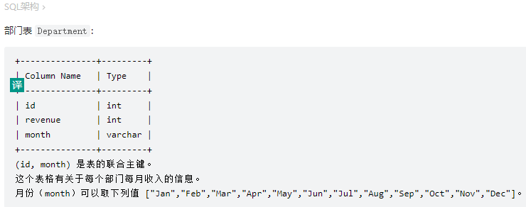
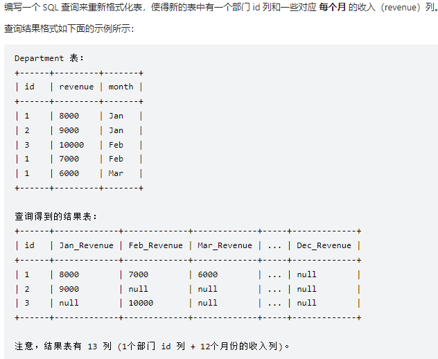
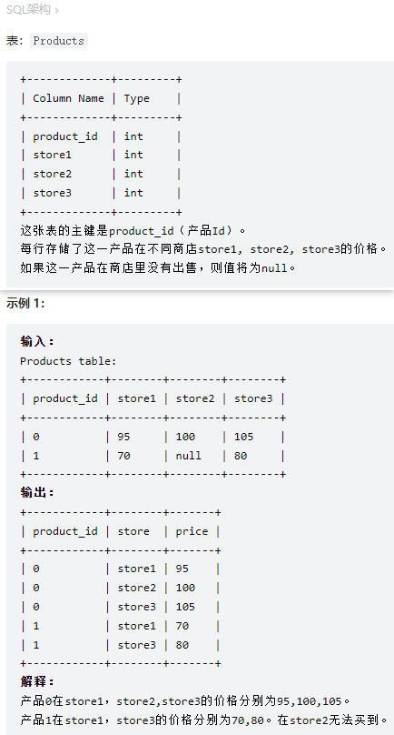
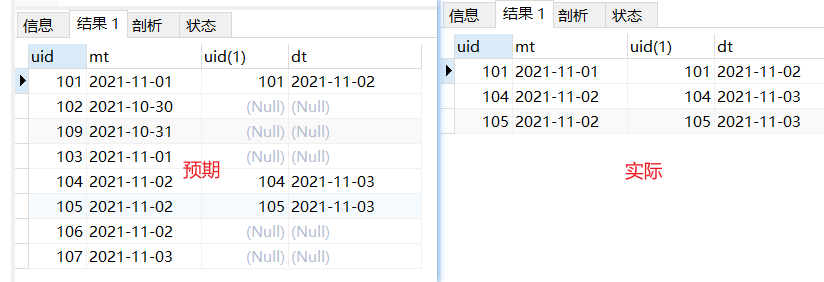
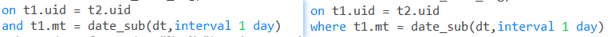

#### 力扣1179. 重新格式化部门表
[重新格式化部门表](https://leetcode.cn/problems/reformat-department-table)



要求：编写一个 SQL 查询来重新格式化表，使得新的表中有一个部门 id 列和一些对应 每个月 的收入（revenue）列。

- 解题
```sql
select id,
sum(if(month="Jan",revenue,null)) as "Jan_Revenue",
sum(if(month="Feb",revenue,null)) as "Feb_Revenue",
sum(if(month="Mar",revenue,null)) as "Mar_Revenue",
sum(if(month="Apr",revenue,null)) as "Apr_Revenue",
sum(if(month="May",revenue,null)) as "May_Revenue",
sum(if(month="Jun",revenue,null)) as "Jun_Revenue",
sum(if(month="Jul",revenue,null)) as "Jul_Revenue",
sum(if(month="Aug",revenue,null)) as "Aug_Revenue",
sum(if(month="Sep",revenue,null)) as "Sep_Revenue",
sum(if(month="Oct",revenue,null)) as "Oct_Revenue",
sum(if(month="Nov",revenue,null)) as "Nov_Revenue",
sum(if(month="Dec",revenue,null)) as "Dec_Revenue"
from
Department
group by id;
```

- 要点：通过case-when或者if行转列。

#### 力扣1795. 每个产品在不同商店的价格
[每个产品在不同商店的价格](https://leetcode.cn/problems/rearrange-products-table)


要求：请你重构 Products 表，查询每个产品在不同商店的价格，使得输出的格式变为(product_id, store, price) 。如果这一产品在商店里没有出售，则不输出这一行。

- 解题
```sql
select product_id,'store1' as store ,store1 as price from Products where store1 is not null
union all
select product_id,'store2' as store ,store2 as price from Products where store2 is not null
union all
select product_id,'store3' as store ,store3 as price from Products where store3 is not null
```

- 要点：通过联结进行列转行。

#### 牛客-SQL24 各城市最大同时等车人数
[各城市最大同时等车人数](https://www.nowcoder.com/practice/f301eccab83c42ab8dab80f28a1eef98?tpId=268&tqId=2300011&ru=%2Fpractice%2F65de67f666414c0e8f9a34c08d4a8ba6&qru=%2Fta%2Fsql-factory-interview%2Fquestion-ranking&sourceUrl=)

- 求同一时刻最大数，过滤出符合条件的数据，开窗按时间排序累加，取最大值。


#### 牛客-SQL4 国庆期间每类视频点赞量和转发量
[国庆期间每类视频点赞量和转发量](https://www.nowcoder.com/practice/f90ce4ee521f400db741486209914a11?tpId=268&tags=&title=&difficulty=0&judgeStatus=0&rp=0&sourceUrl=)

-  求近N天的数据，可按日期排序指定范围开窗或使用timediff函数过滤。
-  开窗指定计算范围：UNBOUNDED、PRECEDING、FOLLOWING、CURRENT ROW
```sql
CURRENT ROW：当前行

n PRECEDING：往前 n 行数据

n FOLLOWING：往后 n 行数据

UNBOUNDED：起点

UNBOUNDED PRECEDING 表示从前面的起点，

UNBOUNDED FOLLOWING 表示到后面的终点

-- 示例
sum(like_a) over(partition by tag order by dt ROWS between 6 preceding and current row )
```

#### 牛客-SQL164 2021年11月每天新用户的次日留存率
[2021年11月每天新用户的次日留存率](https://www.nowcoder.com/practice/1fc0e75f07434ef5ba4f1fb2aa83a450?tpId=268&&tqId=39490)


- 解题过程中出现左连接左表数据没有全部显示的问题
原因：连接条件设置有误，使用了on...where，两表连接后where将数据过滤掉了，应使用on...and连接两表。


#### SQL167 连续签到领金币
[连续签到领金币](https://www.nowcoder.com/practice/aef5adcef574468c82659e8911bb297f?tpId=268&&tqId=39493)

```sql
-- 需求：用户签到获得的金币数
-- 维度：时间》》2021年7月以来每月获得的、按天计算；用户》》每个用户；
-- 注意：每天一枚、每7天重新开始一轮、连续第3、7天分别可额外领2、6金币、日期只针对in_time；
     -- 由于连续签到可能跨月，故金币先按日统计
-- 思路：
        -- 过滤，取出uid，in_time,将日期与in_time的排名相减得出相同的值为连续签到记录same_dt
        -- 对same_dt开窗排名，得连续签到排名
        -- 判断签到排名，给出相应金币，按月分组求和得出结果

with t as (
select uid,
    date(in_time) as dt,
    date_sub(date(in_time),INTERVAL ROW_NUMBER() over(partition by uid order by date(in_time)) day) as same_dt
from
    tb_user_log
where artical_id = 0 and sign_in = 1 and date(in_time) between '2021-07-07' and '2021-10-31'
)

select 
    uid,
    month,
    sum(other_m) as coin
from(
select 
    uid,
    DATE_FORMAT(dt,'%Y%m') as month,
    day_nb,
    CASE
    WHEN day_nb%7 = 3 then 3
    when day_nb%7 = 0 then 7
    else 1
    end as other_m
from(
select 
    uid,
    dt,
    ROW_NUMBER() over(partition by uid,same_dt order by dt) as day_nb
from t) as t2
  ) as t3
  group by uid,month;
```

- 要点：
  - 对于求多段的连续记录，可先求一排名，排名与一连续字段再求差值，该值相同表示连续，对其排名可得连续的具体值；
  - 判断每天金币数时，以1为默认值，满足条件时另加。

#### SQL149 根据指定记录是否存在输出不同情况
[根据指定记录是否存在输出不同情况](https://www.nowcoder.com/practice/f72d3fc27dc14f3aae76ee9823ccca6b?tpId=240&tags=&title=&difficulty=0&judgeStatus=0&rp=0&sourceUrl=%2Fexam%2Foj%3Ftab%3DSQL%25E7%25AF%2587%26topicId%3D240)

```sql
-- 需求：未完成试卷数大于2时，0级用户的试卷未完成数和未完成率，若无，输出所有
-- 维度：试卷完成情况；用户
-- 注意：有未完成试卷数大于2的0级用户，输出0级用户，否则输出所有；未作答过试卷，未完成率默认填0
-- 思路分析:
    -- 连接两表，对uid分组计算作答数，未完成数（为null则置0）
    -- 使用union，根据exists分两种情况输出

WITH tb AS (
	SELECT
		user_info.uid,
		ifnull( incomplete_cnt, 0 ) AS incomplete_cnt,
		ifnull( round( incomplete_cnt / cnt, 3 ), 0.000 ) AS incomplete_rate,
		cnt,
	LEVEL 
	FROM
		user_info
		LEFT JOIN (
		SELECT
			uid,
			ifnull( count( start_time ), 0 ) AS cnt,
			sum(
			IF
			( submit_time, 0, 1 )) AS incomplete_cnt 
		FROM
			exam_record 
		GROUP BY
			exam_record.uid 
		) AS t ON user_info.uid = t.uid 
	) SELECT
	uid,
	incomplete_cnt,
	incomplete_rate 
FROM
	tb 
WHERE
	EXISTS ( SELECT uid FROM tb WHERE LEVEL = 0 AND incomplete_cnt > 2 ) 
	AND `level` = 0 UNION ALL
SELECT
	uid,
	incomplete_cnt,
	incomplete_rate 
FROM
	tb 
WHERE
	NOT EXISTS ( SELECT uid FROM tb WHERE LEVEL = 0 AND incomplete_cnt > 2 ) 
	AND cnt > 0 
ORDER BY
	incomplete_rate;
```

- 要点：
  - 对于值为null的记录，根据情况赋值为0；
  - 分两种情况输出时，用where exist (查询是否存在记录)判断是否输出；
  - 两个输出条件互斥，可以使用union all。

#### SQL139 近三个月未完成试卷数为0的用户完成情况
[group by 基础上进行开窗问题](https://www.nowcoder.com/practice/4a3acb02b34a4ecf9045cefbc05453fa?tpId=240&tqId=2183407&ru=/exam/oj&qru=/ta/sql-advanced/question-ranking&sourceUrl=%2Fexam%2Foj%3Ftab%3DSQL%25E7%25AF%2587%26topicId%3D240)
窗口函数与group by一起使用并不冲突，窗口函数也是基于整个group by后的查询结果(而不是基于每组组内的查询结果)。