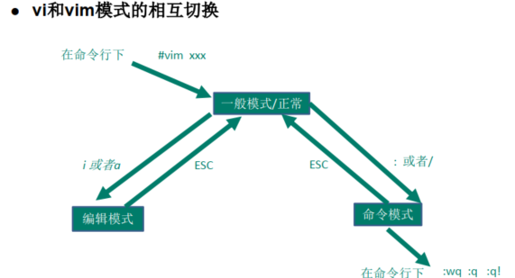

## 1 Linux目录结构
- /bin [重点] 
(/usr/bin 、 /usr/local/bin)：是Binary的缩写, 这个目录存放着最经常使用的命令。
- /sbin (/usr/sbin 、 /usr/local/sbin)
s就是Super User的意思，这里存放的是系统管理员使用的系统管理程序。
- /home [重点]
存放普通用户的主目录，在Linux中每个用户都有一个自己的目录，一般
该目录名是以用户的账号命名的。
- /root [重点]
该目录为系统管理员，也称作超级权限者的用户主目录。
- /lib
系统开机所需要最基本的动态连接共享库，其作用类似于Windows里的DLL文件。几
乎所有的应用程序都需要用到这些共享库。
- /lost+found
这个目录一般情况下是空的，当系统非法关机后，这里就存放了一些文件。
- /etc [重点]
所有的系统管理所需要的配置文件和子目录 my.conf
- /usr [重点]
这是一个非常重要的目录，用户的很多应用程序和文件都放在这个目录下，类似与
windows下的program files目录。
- /boot [重点]
存放的是启动Linux时使用的一些核心文件，包括一些连接文件以及镜像文件
- /boot [重点]
存放的是启动Linux时使用的一些核心文件，包括一些连接文件以及镜像文件
- /boot [重点]
存放的是启动Linux时使用的一些核心文件，包括一些连接文件以及镜像文件
-  /sys
这是linux2.6内核的一个很大的变化。该目录下安装了2.6内核中新出现的一个文件系统
- /tmp
这个目录是用来存放一些临时文件的。
- /dev
类似于windows的设备管理器，把所有的硬件用文件的形式存储。
- /media [重点]
linux系统会自动识别一些设备，例如U盘、光驱等等，当识别后， linux
会把识别的设备挂载到这个目录下。
-  /mnt [重点]
系统提供该目录是为了让用户临时挂载别的文件系统的，我们可以将外部的存储挂
载在/mnt/上，然后进入该目录就可以查看里的内容了。 d:/myshare
-  /opt
这是给主机额外安装软件所摆放的目录。如安装ORACLE数据库就可放到该目录下。
默认为空。
- /usr/local [重点]
这是另一个给主机额外安装软件所安装的目录。一般是通过编译源码方式安装的程序。
- /var [重点]
这个目录中存放着在不断扩充着的东西，习惯将经常被修改的目录放在这个目录下。
包括各种日志文件。
- /var [重点]
这个目录中存放着在不断扩充着的东西，习惯将经常被修改的目录放在这个目录下。
包括各种日志文件。

## 2 vim文本编辑器
- 正常模式:
以 vim 打开一个档案就直接进入一般模式了(这是默认的模式)。在这个模式中， 你可以使用
『上下左右』 按键来移动光标，你可以使用『删除字符』 或『删除整行』 来处理档案内容，
也可以使用『复制、贴上』 来处理你的文件数据。
- 插入模式:
按下i, I, o, O, a, A, r, R等任何一个字母之后才会进入编辑模式, 一般来说按i即可.
- 命令行模式
在这个模式当中， 可以提供你相关指令，完成读取、存盘、替换、离开 vim 、显示行号等的
动作则是在此模式中达成的！

## 3 开机、重启和用户登录注销
### 3.1 关机、重启命令
shutdown –h now 立该进行关机
shudown -h 1 "hello, 1 分钟后会关机了"
shutdown –r now 现在重新启动计算机
halt 关机，作用和上面一样.
reboot 现在重新启动计算机
sync 把内存的数据同步到磁盘.
注意细节:
不管是重启系统还是关闭系统，首先要运行sync命令，把内存中的数据写到磁盘中。

### 3.2 用户登录和注销
1) 登录时尽量少用root帐号登录，因为它是系统管理员，最大的权限，避免操作失误。可以利用普通用户登录，登录后再用” su - 用户名’命令来切换成系统管理员身份.
2) 在提示符下输入 logout 即可注销用户
(logout 注销指令在图形运行级别无效，在 运行级别 3下有效.)

## 4 用户管理
- 添加用户
useradd [选项] 用户名
添加时给用户指定家目录：
useradd -d /home/homename username

- 给用户指定密码或修改密码
passwd username

- 删除用户
userdel username(保留家目录)
user - r username(删除家目录)

- 查询用户信息
id username

- 切换用户
su - username
exit返回原理用户

- 用户组
增加组
groupadd groupname
删除组
groupdel groupname

- 增加用户时加上组
useradd -g groupname username

- 修改用户组
usermod -g groupname username
