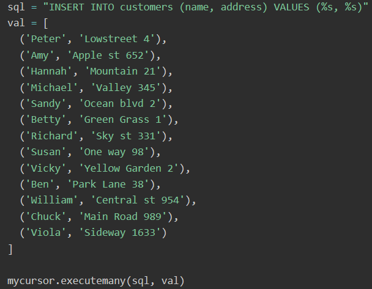
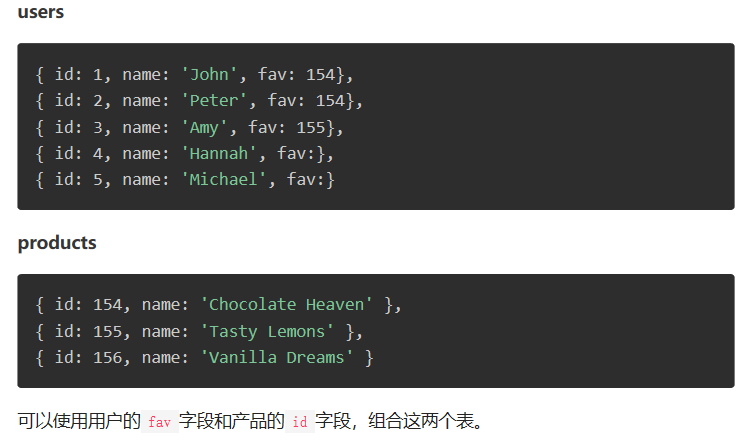

# Python MYSQL基础

## Python MySQL 创建数据库

#### 创建数据库

mycursor.execute("CREATE DATABASE mydatabase")

#### 返回数据库列表

mycursor.execute("SHOW DATABASES")

## Python MySQL 创建表

#### 创建表customers

mycursor.execute("CREATE TABLE customers (name VARCHAR(255), address VARCHAR(255))")

#### 检查表是否存在

mycursor.execute("SHOW TABLES")

#### 创建表的主键（自增ID（从1开始，每条记录增加1））

mycursor.execute("CREATE TABLE customers (id INT AUTO_INCREMENT PRIMARY KEY, name VARCHAR(255), address VARCHAR(255))")

如果表已经存在，可使用ALTER TABLE关键字创建主键:

mycursor.execute("ALTER TABLE customers ADD COLUMN id INT AUTO_INCREMENT PRIMARY KEY")

## Python MySQL 插入表

#### 插入表

要把记录插入到MySQL中的表中，使用“INSERT INTO”语句。

sql = "INSERT INTO customers (name, address) VALUES (%s, %s)"
val = ("John", "Highway 21")
mycursor.execute(sql, val)
mydb.commit()

要将多行插入到表中，使用`executemany()`方法。

#### 获取插入行的ID（如果插入多行，则返回最后插入行的id）

print("1 条记录插入, ID:", mycursor.lastrowid)

## Python MySQL Select

#### 从表中选取（SELECT)数据

mycursor.execute("SELECT * FROM customers")
myresult = mycursor.fetchall()

`fetchall()`方法，它从最后所执行语句的结果中，获取所有行。

#### 选取（SELECT)部分字段

使用“SELECT 字段1, 字段2 …”语句:

mycursor.execute("SELECT name, address FROM customers")
myresult = mycursor.fetchall()

#### 使用detchone（）方法

如果只想获取一行记录，可以使用`fetchone()`方法。
`fetchone()`方法将返回结果的第一行:

mycursor.execute("SELECT * FROM customers")
myresult = mycursor.fetchone()

## Python MySQL Where

#### 筛选数据

从表中选取记录时，可以使用“WHERE”语句筛选:

选取地址为“Park Lane 38”的记录:

sql = "SELECT * FROM customers WHERE address ='Park Lane 38'"
mycursor.execute(sql)
myresult = mycursor.fetchall()

#### 通配符%

`WHERE`语句中可以使用通配符`%`

选取地址中包含单词“way”的记录:

sql = "SELECT * FROM customers WHERE address LIKE '%way%'"

#### 防止SQL注入

当用户提供查询值时，为了防止[SQL注入](https://www.qikegu.com/docs/2945)，应该转义这些值。
SQL注入是一种常见的web黑客技术，用于破坏或误用数据库。

使用占位符`%s`方法转义查询值:

sql = "SELECT * FROM customers WHERE address = %s"
adr = ("Yellow Garden 2", )
mycursor.execute(sql, adr)

## Python MySQL Order By

#### 对结果排序

可以使用ORDER BY语句，按升序或降序对结果排序。

默认情况下，ORDER BY关键字按升序排列结果。

按name的字母顺序排列结果:

sql = "SELECT * FROM customers ORDER BY name"

要按降序排列，可使用DESC关键字。

sql = "SELECT * FROM customers ORDER BY name DESC"

## Python MySQL Delete

#### 删除记录

使用“DELETE FROM”语句，从现有表中删除记录:
删除地址为“Mountain 21”的记录:

sql = "DELETE FROM customers WHERE address = 'Mountain 21'"
mycursor.execute(sql)
mydb.commit()

数据库修改后，需要使用`mydb.commit()`语句提交，不提交，修改不会生效。

**注意DELETE语句中的WHERE子句:** WHERE子句指定应该删除哪些记录。如果省略WHERE子句，将删除所有记录!

## Python MySQL 删除表

#### 删除表

可以使用“DROP table”语句，删除现有的表:
删除表“customers”:

sql = "DROP TABLE customers"

#### 仅当表存在时才删除

如果要删除的表不存在，会报错，可以使用If EXISTS关键字判断表是否存在，避免报错。

sql = "DROP TABLE IF EXISTS customers"

## Python MySQL Update

#### 更新表

使用“UPDATE”语句，更新表格内的现有记录:
将地址栏由“Valley 345”改写为“Canyoun 123”:

sql = "UPDATE customers SET address = 'Canyon 123' WHERE address = 'Valley 345'"

mycursor.execute(sql)
mydb.commit()

## Python MySQL Limit

#### 限制结果数量

使用“LIMIT”语句，限制查询返回的记录数量:
在“customers”表中，选择前5条记录:

mycursor.execute("SELECT * FROM customers LIMIT 5")
myresult = mycursor.fetchall()

#### 从指定位置开始

如果想返回，从第3条记录开始的5条记录，可以使用“OFFSET”关键字:

mycursor.execute("SELECT * FROM customers LIMIT 5 OFFSET 2")

## Python MySQL Join

#### 连接两个或多个表

可以使用JOIN语句，根据多张表之间的相关字段，把这些表组合成一个表。

假设有一个“users”表和一个“products”表:

sql = "SELECT \

[users.name](http://users.name) AS user, \

[products.name](http://products.name) AS favorite \

FROM users \

INNER JOIN products ON users.fav = [products.id](http://products.id)"

JOIN与INNER JOIN等价，它们会给你相同的结果。

#### 左连接

在上面的例子中，Hannah和Michael被排除在结果之外，这是因为INNER JOIN只显示匹配的记录。

如果想显示所有用户，即使他们没有喜欢的产品，可以使用LEFT JOIN语句:

查询所有用户和他们喜欢的产品:

sql = "SELECT \

[users.name](http://users.name) AS user, \

[products.name](http://products.name) AS favorite \

FROM users \

LEFT JOIN products ON users.fav = [products.id](http://products.id)"

#### 右连接

如果你想要返回所有产品，以及喜欢它们的用户，可以使用RIGHT JOIN语句:
查询所有产品以及喜欢它们的用户:

sql = "SELECT \

[users.name](http://users.name) AS user, \

[products.name](http://products.name) AS favorite \

FROM users \

RIGHT JOIN products ON users.fav = [products.id](http://products.id)"

Hannah 与 Michael，没有喜欢的产品，被排除在结果之外。 

Python MySQL 删除表

[https://blog.csdn.net/m0_51008912/article/details/110392020?ops_request_misc=%257B%2522request%255Fid%2522%253A%2522162996750916780255259391%2522%252C%2522scm%2522%253A%252220140713.130102334..%2522%257D&request_id=162996750916780255259391&biz_id=0&utm_medium=distribute.pc_search_result.none-task-blog-2~all~top_click~default-2-110392020.pc_search_similar&utm_term=mysql%E8%AF%AD%E6%B3%95&spm=1018.2226.3001.4187](https://blog.csdn.net/m0_51008912/article/details/110392020?ops_request_misc=%257B%2522request%255Fid%2522%253A%2522162996750916780255259391%2522%252C%2522scm%2522%253A%252220140713.130102334..%2522%257D&request_id=162996750916780255259391&biz_id=0&utm_medium=distribute.pc_search_result.none-task-blog-2~all~top_click~default-2-110392020.pc_search_similar&utm_term=mysql%E8%AF%AD%E6%B3%95&spm=1018.2226.3001.4187)

