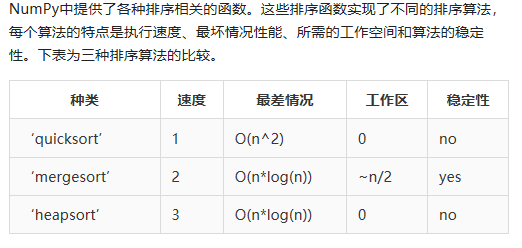

# Python Numpy基础

[https://www.qikegu.com/docs/3393](https://www.qikegu.com/docs/3393)

## Numpy ndarry

#### 创建Ndarray对象

numpy.array(object, dtype = None, copy = True, order = None, subok = False, ndmin = 0)  

#### 获取数组的维数

`ndarray.ndim`属性可以用来获取数组的维数。

#### 获取数组的大小

`ndarray.itemsize`属性用于获取数组元素的大小，该函数返回数组元素的字节数。

#### 获取…数组元素的数据类型

要检查数组元素的数据类型，可以使用`ndarray.dtype`属性。

#### 获取数组的形状和大小

要获得数组的形状和大小，可以使用`ndarray.size`与`ndarray.shape`属性。
数组形状是指数组的行数和列数。

#### 重构数组对象

`ndarray.reshape()`函数可用于重构数组。该函数接受新形状的行、列两个参数。

#### 数组切片

NumPy中，数组切片可以从数组中提取指定范围的数组元素。NumPy中的数组切片方法与python中的列表切片方法类似。

arr_name[start: end: step]

#### linspace

`linspace()`函数的作用是: 返回给定区间内均匀分布的值。

#### 获取数组元素中的最大值、最小值以及元素的和

`ndarray.max()`、`ndarray.min()`和`ndarray.sum()`函数，分别用于获取数组元素中的最大值、最小值以及元素和。

#### NumPy数组轴

NumPy多维数组由轴表示，其中axis-0表示列，axis-1表示行。我们可以通过轴对列或行进行计算。例如，求某行元素的和。

import numpy as np  
a = np.array([[1,2,30],[10,15,4]])  
print("每列的最大元素:",a.max(axis = 0))      #每列的最大元素: [10 15 30]
print("每行的最小元素:",a.min(axis = 1))       #每行的最小元素: [1 4]
print("每行的和:",a.sum(axis = 1))                #每行的和: [33 29]

#### 求平方根和标准差

NumPy中，`sqrt()`和`std()`函数分别求数组元素的平方根和标准差。

标准差表示数组的每个元素与numpy数组的平均值之间的差异。

#### 数组间的算术运算

numpy中，多维数组间可以直接进行算术运算。

import numpy as np  
a = np.array([[1,2,30],[10,15,4]])  
b = np.array([[1,2,3],[12, 19, 29]])  
print("a+b\n",a+b)  
print("axb\n",a*b)  
print("a/b\n",a/b)  

#### 数组拼接

numpy中，可以垂直或水平拼接2个数组。

import numpy as np  
a = np.array([[1,2,30],[10,15,4]])  
b = np.array([[1,2,3],[12, 19, 29]])  
print("垂直拼接\n",np.vstack((a,b)));  
print("水平拼接\n",np.hstack((a,b)))  

## Numpy 数据类型

#### NumPy 数据类型对象（dtype）

数据类型对象/dtype，是描述数组中元素数据类型的对象。具体内容包括：

- 数据类型(整数、浮点数或Python对象)
- 数据长度
- 字节顺序(小端或大端)
- 在结构化类型中，字段名称、字段数据类型等。
- 如果数据类型是子数组，则会包含其形状和数据类型

字节顺序由数据类型的前缀(‘<‘或’>’)决定。'<‘表示小端，’>’表示大端。

我们可以使用以下语法，创建一个dtype对象。

numpy.dtype(object, align, copy)

参数：
*   **object**: 要转换为dtype类型的对象。
*   **align**: 布尔值。如果为真，则添加额外的填充，使其等效于C结构体
*   **copy**: 创建一个新的dtype对象副本。如果为false，则结果是对内置数据类型对象的引用

#int8, int16, int32, int64 等价于字符串 'i1', 'i2','i4', etc. 
import numpy as np 
dt = np.dtype('i4')
print(dt)    #int32

#### 创建结构化数据类型

我们可以创建类似字典的数据类型，包括字段名与字段值。

#先创建结构化数据类型

import numpy as np 

dt = np.dtype([('age',np.int8)]) # 格式是：[('字段名', 字段类型)]

print(dt)    #[('age', 'i1')] 

#现在将它应用到ndarray对象

a = np.array([(10,),(20,),(30,)], dtype = dt)

print(a)      #[(10,) (20,) (30,)]

#字段名可用于访问列的内容

print(a['age'])     #[10 20 30]

## NumPy 数组创建

#### numpy.empty

`empty`函数创建未初始化数组，可以指定数组形状和数据类型。

numpy.empty(shape, dtype = float, order = 'C')  

参数：
*   **shape**: 指定数组的形状。
*   **dtype**: 数组项的数据类型。默认值是浮点数。
*   **order**: 默认顺序是c语言形式的内存顺序(按行排列)。也可以设置为Fortran语言形式的内存顺序(按列排列)：`order = 'F'`。

#### numpy.zeros

`zeros`函数创建数组，并且把数组元素的值初始化为0，可以指定数组形状和数据类型。语法同上

#### numpy.ones

`ones`函数创建数组，并且把数组元素的值初始化为1，可以指定数组形状和数据类型。语法同上

## NumPy 基于已有数据创建数组

#### numpy.asarray

要使用列表或元组创建ndarray数组，可使用`asarray`函数。这个函数通常用于将python序列转换为numpy数组对象的场景中。
numpy.asarray(sequence,  dtype = None, order = None)
参数：
*   **sequence**: 要被转换成ndarray数组的python序列。
*   **dtype**: 指定数组元素的数据类型。
*   **order**: 可以设置为’C’或’F’，表示c语言形式的内存顺序(按行排列)，或者Fortran语言形式的内存顺序(按列排列)。默认值是C。

#### numpy.frombuffer

要使用指定的缓冲区创建数组，可以用`frombuffer`函数。

numpy.frombuffer(buffer, dtype = float, count = -1, offset = 0)  

参数：
*   **buffer**: 缓冲区对象（具有缓冲区接口）。
*   **dtype**: 指定数组元素的数据类型。
*   **count**: 指定数组长度。默认值是-1。
*   **offset**: 表示要读取的缓冲区起始位置。默认值为0。

#### numpy.fromiter

要使用可迭代对象创建ndarray数组，可以使用`fromiter`函数。`fromiter`函数返回一个一维的ndarray数组。
numpy.fromiter(iterable, dtype, count = - 1)
参数：
*   **iterable**: 表示一个可迭代的对象。
*   **dtype**: 指定数组元素的数据类型。
*   **count**: 表示要从数组中的缓冲区读取的项数。

import numpy as np  
list = [0,2,4,6]  
it = iter(list)
x = np.fromiter(it, dtype = float, count = 2)  
print(x)    #[0. 2.]
print(type(x))    #<class 'numpy.ndarray'>

## NumPy 基于数值区间创建数组

#### numpy.arange

要使用指定区间均匀分布的数值创建数组，可以使用`arange`函数。
numpy.arange(start, stop, step, dtype)
参数：
*   **start**: 区间开始值。默认值是0。
*   **stop**: 区间结束值(此值不包含在内)。
*   **step**: 区间步长。
*   **dtype**: 数组元素的数据类型。

#### numpy.linspace

`linspace`函数作用类似`arange()`函数，使用指定区间均匀分布的数值创建数组。但是，这个函数不指定步长，而是指定区间之间的取值数量。

numpy.linspace(start, stop, num, endpoint, retstep, dtype)
参数：
*   **start**: 区间开始值。默认值是0。
*   **stop**: 区间结束值。
*   **num**: 区间内均匀分布的数值数量。默认值是50。
*   **endpoint**: 如果为true，表示结束值包含在内；false，结束值不包含。默认为true。
*   **retstep**: 如果为true，返回步长信息。
*   **dtype**: 数组元素的数据类型。

#### numpy.logspace

`logspace`函数使用对数区间上均匀分布的数值，创建ndarray数组。
numpy.logspace(start, stop, num, endpoint, base, dtype)
参数：
*   **start**: 区间开始值。取值`base^start`，例如: start = 2, base = 10，取值 10^2 = 100
*   **stop**: 区间结束值。取值`base^start`，例如: stop = 5, base = 10，取值 10^5 = 100000
*   **num**: 区间内的取值数量。默认50
*   **endpoint**: 如果为true，表示结束值包含在内；false，结束值不包含。默认为true。
*   **base**: 对数的基数，默认为10。
*   **dtype**: 数组元素的数据类型。

import numpy as np  
arr = np.logspace(10, 20, num = 5, endpoint = True)  
print("给定范围内的数组为 ",arr)

#给定范围内的数组为  [1.00000000e+10 3.16227766e+12 1.00000000e+15 3.16227766e+17

1.00000000e+20]

## NumPy 数组切片

使用切片访问数组，首先通过内置`slice`函数创建一个切片对象，该对象存储了创建时传入的`start`、`stop`和`step`参数，把这个切片对象传给数组，我们就可以提取数组的一部分(切片)返回。

#### 一维数组

import numpy as np 
a = np.arange(10) 
s = slice(2,7,2) 
print(a[s])   #[2  4  6]

可以直接向ndarray数组传入`start:stop:step`格式的切片参数，效果相同

*   `[i]` 如果只放一个参数，则返回与索引对应的单个项。
*   `[:i]` 如果在前面插入`:`，则从该索引之前的所有项都将被提取。
*   `[start:stop]` 如果使用了两个参数，中间用`:`分隔，则使用默认步骤1，提取两个索引(不包括stop)之间的项。

#### 多维数组

a = np.array([[1,2,3],[3,4,5],[4,5,6]])

print(a[1:])

#[[3 4 5]

[4 5 6]]

切片还可以包括省略号(…)，表示在该维度上选择全部。

[行，列]  数字的位置对应其操作

## NumPy 广播

#### 广播的规则

广播机制遵循下列规则：

1. 如果两个数的维度数不同，那么小维度数组的形状将会在最左边补1。
2. 如果两个数组的形状在任何一个维度都不匹配，那么数组的形状会沿着维度为1的维度扩展，以匹配另外一个数组的形状。
3. 如果两个数组的形状在任何一个维度上都不匹配并且没有任何一个维度等于1，那么会引发异常。

## NumPy 数组迭代

NumPy提供了迭代器对象`NumPy.nditer`，是一个高效的多维迭代器对象，可以使用它对数组进行迭代，使用Python的标准迭代器接口访问数组元素。

#### 迭代顺序

要强制按F排序或C排序的顺序迭代数组，可在创建迭代对象时显式指定。

#### 数组修改

迭代数组时，默认数组值不能修改，因为迭代对象的`op-flag`默认被设置为只读。如要可修改，可在创建迭代对象时，把`op_flags`设置为`readwrite`或`write`。

for x in np.nditer(a, op_flags = ['readwrite']):  

x[...] = 3 * x;  

#### 广播迭代

如果两个数组是可广播的，可以使用组合的nditer对象对它们进行并发迭代。假设一个数组a的维数为3X4，而另一个数组b的维数为1X4，可使用以下类型的迭代器(将数组b广播到a的大小)。

print ('同时迭代2个可广播的数组:')

for x,y in np.nditer([a,b]): 

print ("%d:%d" % (x,y))

## NumPy 位运算

NumPy包中，可用位操作函数进行位运算。

- **bitwise_and** 位与运算
- **bitwise_or** 位或运算
- **invert** 位非运算
- **left_shift** 左移位
- **right_shift** 右移位

import numpy as np
print ('\n13与17的二进制表示:')
a,b = 13,17 
print (bin(a))
print (bin(b))

print ('\n13与17相与:') 
c = np.bitwise_and(13, 17)
print (bin(c))

输出

13与17的二进制表示:

0b1101

0b10001

13与17相与:

0b1

## NumPy 字符串函数

#### numpy.char.add()

print (np.char.add(['hello'],[' [qikegu.com](http://qikegu.com)']) )

#['hello [qikegu.com](http://qikegu.com)']

print (np.char.add(['hello', 'hi'],[' [qikegu.com](http://qikegu.com)', ' kevin']))

#['hello [qikegu.com](http://qikegu.com)' 'hi kevin']

#### numpy.char.multiply()

返回字符串的多个副本，即，如果字符串“hello”乘以3，则返回一个字符串“hello hello hello”

print (np.char.multiply('qikegu ',3))

#### numpy.char.center()

返回指定宽度的字符串，输入的字符串居中，两边填充指定字符。

import numpy as np 

#语法：np.char.center(arr, width,fillchar) 

print (np.char.center('qikegu', 20, fillchar = '*'))

#********qikegu********

#### numpy.char.capitalize()

返回首字母大写的字符串副本

print (np.char.capitalize('hello qikegu'))

#Hello qikegu

#### numpy.char.title()

返回单词首字母大写的字符串副本。

#### numpy.char.lower()

返回字符串的副本，其中所有字母都转换为小写。

#### numpy.char.upper()

返回字符串的副本，其中所有字母都转换为大写。

#### numpy.char.split()

返回字符串中的单词列表。

#### numpy.char.splitlines()

返回字符串中的行列表，在行边界处断开。

print (np.char.splitlines('hello\rhow are you?'))

#['hello', 'how are you?']

#### numpy.char.strip()

返回字符串的副本，删除前导和后置空格。

import numpy as np 
print (np.char.strip('qikegu faq','q') )
print (np.char.strip(['after','admin','java'],'a'))

输出;

ikegu fa
['fter' 'dmin' 'jav']

#### numpy.char.join()

返回一个字符串，该字符串是给定序列中所有字符串的连接。

import numpy as np 

print (np.char.join(':','dmy') )

print (np.char.join([':','-'],['dmy','ymd']))

输出

d:m:y

['d:m:y' 'y-m-d']

#### numpy.char.decode()

使用指定的编解码器解码指定的字符串元素。

import numpy as np 

a = np.char.encode('qikegu', 'gb2312') print (a)

print (np.char.decode(a,'gb2312'))

输出

b'qikegu'

qikegu

#### numpy.char.encode()

对字符串元素进行编码。

import numpy as np 

a = np.char.encode('qikegu', 'gb2312') print (a)

输出

b'qikegu'

## NumPy 数学函数

#### 三角函数

Numpy中包含三角函数，用于不同角度的正弦、余弦和正切等就散。

import numpy as np  
arr = np.array([0, 30, 60, 90, 120, 150, 180])  
print("\n角的正弦值",end = " ")  
print(np.sin(arr * np.pi/180))  

输出：

角的正弦值

[0.00000000e+00 5.00000000e-01 8.66025404e-01 1.00000000e+00

8.66025404e-01 5.00000000e-01 1.22464680e-16]

另一方面，`arcsin()`、`arccos()`和`arctan()`函数返回指定角度的三角反函数。`degrees()`函数可用于验证这些三角函数的结果。

#### 舍入函数

`around()`函数返回四舍五入到指定精度的值。

numpy.around(num, decimals)  

参数:
*   **num** 输入数值。
*   **decimals** 四舍五入的精度。默认值为0，如果是负数，对小数点之前进行四舍五入。

`floor()`函数用于对数值往小取整。

`ceil()`函数用于对数值往小取整。

## NumPy 统计函数

#### 从数组中找出最小和最大元素

函数`numpy.amin()`和`numpy.amax()`分别用于查找指定轴上，数组元素的最小值和最大值。

#### numpy.ptp()

返回数组某个轴方向的峰间值，即最大值最小值之差。

#### numpy.percentile(）

百分位数是统计中使用的度量，表示小于这个值的观察值占总数的百分比。

例如，第80个百分位数是这样一个值，它使得至少有80%的数据项小于或等于这个值，且至少有(100-80)%的数据项大于或等于这个值。

numpy.percentile(input, q, axis)

参数：
*   **input**: 输入数组
*   **q**: 要计算的百分位数，在 0 ~ 100 之间
*   **axis**: 计算百分位数的轴方向，二维取值0，1

#### numpy.median()

中值是一组数值中，排在中间位置的值，可以指定轴方向。

### numpy.mean()

计算数组的平均值，可以指定轴方向。

### numpy.average()

计算数组的加权平均值，权重用另一个数组表示，并作为参数传入，可以指定轴方向。

考虑一个数组[1,2,3,4]和相应的权值[4,3,2,1]，通过将对应元素的乘积相加，再除以权值的和来计算加权平均值。

加权平均值 = (1_4+2_3+3_2+4_1)/(4+3+2+1)

### 标准差与方差

#### numpy.std()

要计算标准差，可以使用`std()`函数。
标准差的公式:
std = sqrt(mean(abs(x - x.mean())**2))

#### numpy.std()

要计算方差，可以使用`var()`函数。
方差公式
var = mean(abs(x - x.mean())**2)

import numpy as np      
print (np.std([1,2,3,4]))    #1.118033988749895
print (np.var([1,2,3,4]))    #1.25

## NumPy 排序、查找、计数

#### numpy.sort()

`sort()`对数组进行排序，返回排好序的数组副本。可以指定轴方向。
**函数语法**:
numpy.sort(a, axis, kind, order)
**参数**
*   **a** 待排序数组
*   **axis** 指定排序的轴。如果没有，按最后一个轴排序。
*   **kind** 默认是‘quicksort’
*   **order** 指定排序字段

#### numpy.argsort()

该函数先对数组进行排序，然后提取排序后的数组索引，以数组形式返回，原数组不会被修改，通过索引可以得到排序结果。

#### numpy.lexsort()

用于对多个序列进行排序，类似于SQL中的ORDERBY多个字段：`ORDER BY 字段1， 字段2， 字段3`。可以想象成对电子表格进行排序，每一列代表一个序列，越后面的列优先级越高。

原数组不会被修改，该函数提取排序后的数组索引，以数组形式返回，通过索引可以得到排序结果。

#### numpy.argmax() 与 numpy.argmin()

这两个函数分别返回指定轴上，最大和最小元素的索引。

#### numpy.nonzero()

该函数返回数组中非零元素的索引。

#### numpy.where()

该函数查找数组中符合条件的元素，返回其索引。

b = np.array([12, 90, 380, 12, 211])  
print(np.where(b>12))     #(array([0, 1, 1])

#### numpy.extract()

该函数返回数组中符合条件的元素。

b = np.array([12, 90, 380, 12, 211])  
print(np.extract(b>12, b))     #[ 90 380 211]

## NumPy 副本和视图

数组副本是内容与原数组相同，存储在另一个内存位置的数组。

数组视图是由原数组生成的另一个数组，但是与原数组共享数组元素内存，是对同一个内存位置所存储数组元素的不同呈现。

数组引用是原数组的别名，与原数组是同一个数组。

#### 数组赋值

NumPy中，把一个数组赋值给另一个数组，不会拷贝数组，赋值只是对原始数组的引用。对被赋值数组做的更改也会反映在原始数组中。
`id()`函数返回数组的通用标识符，类似于C语言中的指针。

#### ndarray.view()

`view()`方法返回新的数组对象，但数组元素数据与原始数组共享，因此是浅拷贝。与前面的情况不同，新数组的维数更改不会影响原数组的维数，元素更改会。

b = a.view()

#### ndarray.copy()

`copy()`返回原始数组的深层副本，该副本不与原始数组共享任何内存，是深拷贝。对数组副本所做的修改不会影响原始数组。

## NumPy 矩阵库函数

NumPy包含一个矩阵库NumPy.matlib，这个模块的函数用于处理矩阵而不是ndarray对象。

NumPy中，ndarray数组可以是n维的，与此不同，矩阵总是二维的，但这两种对象可以相互转换。

#### matlib.empty()

`empty()`函数返回一个新的矩阵，但不会初始化矩阵元素。
numpy.matlib.empty(shape, dtype, order)
*   **shape** 定义新矩阵形状的int或int的元组
*   **dtype** 可选，指定矩阵数据类型
*   **order** C 或 F

#### numpy.matlib.zeros()

`zeros()`函数返回一个新的矩阵，矩阵元素被初始化为0。

import numpy.matlib 
import numpy as np 

a = np.matlib.zeros((2,2))
print (a)

输出

[[ 0.  0.] 

 [ 0.  0.]]

#### numpy.matlib.ones()

`zeros()`函数返回一个新的矩阵，矩阵元素被初始化为1。

#### numpy.matlib.eye()

`eye()`函数返回一个矩阵，对角线上的元素都是1，其它地方都是0。该函数接受以下参数。
numpy.matlib.eye(n, M, k, dtype)
*   **n** 返回矩阵中的行数
*   **M** 列数，默认为n
*   **k** 对角线的开始索引
*   **dtype** 矩阵的数据类型

#### numpy.matlib.identity()

`identity()`函数返回指定大小的单位矩阵。单位矩阵是一个所有对角元素都为1的方阵。

## NumPy 线性代数

