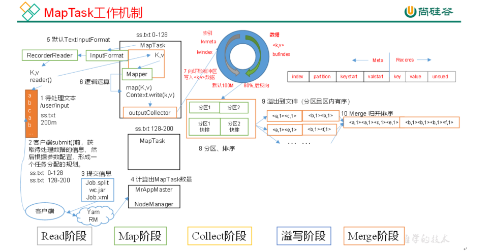

## 1 hadoop概述
9870:监测端口
### 1.1 hadoop的优势
**1.高可靠性**。因为它假设计算元素和存储会失败，因此它维护多个工作数据副本，确保能够针对失败的节点重新分布处理。

**2.高扩展性**。当存储hdp集群的存储能力和运算资源不足时,可以横向的扩展机器节点来达到扩容和增强运算能力 

**3.高效性**。因为它以并行的方式工作，通过并行处理加快处理速度

**4.高容错性**。Hadoop能够自动保存数据的多个副本，当有存储数据的节点宕机以后, 会自动的复制副本维持集群中副本的个数 ,并且能够自动将失败的任务重新分配。

### 1.2 hadoop的核心模块
1. **HDFS (Hadoop Distributed File System) 分布式文件系统**:负责海量数据的存储和管理
1. **MapReduce分布式运算系统**:负责海量数据的运算
2. **YARN分布式资源调度和任务监控平台**

## 2 HDFS分布式文件系统
HDFS分布式文件系统,全称为:Hadoop Distributed File System,首先这是一个文件系统,主要用于对文件的存储,通过和linux相似的目录树系统定位文件和目录的位置,其次,他是分布式的,解决海量数据的存储问题,HDFS系统统一管理,提供统一的操作目录,操作命令和API。

### 2.1 hdfs的优缺点
- 优点：
  - 高容错性
  - 高扩展性

- 缺点：
  - 不适合低延时数据访问
  - 无法高效的对大量小文件进行存储
  - 不支持并发写入、文件随机修改

### 2.2 hdfs的角色分析
HDFS默认采用的是主从架构,架构中有三个角色:一个叫NameNode,一个叫DataNode,还有一个叫secondaryNameNode。


> NameNode:主要负责存储文件的元数据,比如集群id,文件存储所在的目录名称,文件的副本数,以及每个文件被切割成块以后的块列表和块列表所在的DataNode。
> DataNode:主要负责存储数据,包含一整个文件或者某个文件切成的块数据,以及块数据的一些校验信息等。
> SecondaryNameNode:主要负责和NameNode的checkpoint机制(类似于备份机制)等。

- 储存块大小的计算：根据寻址时间与磁盘写的速率计算。

### 2.3 hdfs的搭建和配置
1. 准备搭建好的集群机器，解压hadoop压缩包；
2. 在hadoop-3.1.1/etc/hadoop/hadoop-env.xml中配置Java依赖路径；
3. 在hdfs-site.xml中配置namenode节点等参数；
4. 进入hadoop-3.1.1/bin目录下，`./hadoop namenode -format`初始化NameNode,此时可以单点启动;
5. 以下开始配置一键启动和停止：在hadoop-3.1.1/etc/hadoop/workers中加入集群各机器名；
6. 进入hadoop-3.1.1/sbin分别在start-dfs.sh、stop-dfs.sh第二行加入：
    ```bash
    HDFS_DATANODE_USER=root 
    HADOOP_SECURE_DN_USER=hdfs
    HDFS_NAMENODE_USER=root 
    HDFS_SECONDARYNAMENODE_USER=root
    ```
7. 此时可以在hadoop-3.1.1/sbin目录下，通过./start-dfs.sh、./stop-dfs.sh一键启动、停止集群；
8. 在/etc/profile文件中环境变量：`export HADOOP_HOME=/opt/apps/hadoop-3.1.1/`、`export PATH=$PATH:$JAVA_HOME/bin:$HADOOP_HOME/bin:$HADOOP_HOME/sbin`，
9. `source profile`，此时不管在任何位置都能够启动集群。

## 3 hdfs的shell客户端与Java客户端


## 4 hdfs的内部原理机制
### 4.1 HDFS写数据流程（重点）
写：

读：

### 4.2 NameNode与DataNode的交互

### 4.3 NameNode和SecondaryNameNode

## 5 MapReduce概述

## 6 MapReduce框架原理
### 6.1 InputFormat数据输入

### 6.2 MapReduce工作流程

### 6.3 Shuffle机制
#### Partition分区
#### WritableComparable排序
#### Combiner合并

### 6.4 OutputFormat数据输出

## 7 Hadoop数据压缩

## 8 Yarn资源调度器
### 8.1 基础架构

### 8.2 工作机制

### 8.3 作业提交全过程

### 8.4 Yarn调度器和调度算法

---



（1）Read阶段：MapTask通过InputFormat获得的RecordReader，从输入InputSplit中解析出一个个key/value。
	（2）Map阶段：该节点主要是将解析出的key/value交给用户编写map()函数处理，并产生一系列新的key/value。
	（3）Collect收集阶段：在用户编写map()函数中，当数据处理完成后，一般会调用OutputCollector.collect()输出结果。在该函数内部，它会将生成的key/value分区（调用Partitioner），并写入一个环形内存缓冲区中。
	（4）Spill阶段：即“溢写”，当环形缓冲区满后，MapReduce会将数据写到本地磁盘上，生成一个临时文件。需要注意的是，将数据写入本地磁盘之前，先要对数据进行一次本地排序，并在必要时对数据进行合并、压缩等操作。
	溢写阶段详情：
	步骤1：利用快速排序算法对缓存区内的数据进行排序，排序方式是，先按照分区编号Partition进行排序，然后按照key进行排序。这样，经过排序后，数据以分区为单位聚集在一起，且同一分区内所有数据按照key有序。
	步骤2：按照分区编号由小到大依次将每个分区中的数据写入任务工作目录下的临时文件output/spillN.out（N表示当前溢写次数）中。如果用户设置了Combiner，则写入文件之前，对每个分区中的数据进行一次聚集操作。
	步骤3：将分区数据的元信息写到内存索引数据结构SpillRecord中，其中每个分区的元信息包括在临时文件中的偏移量、压缩前数据大小和压缩后数据大小。如果当前内存索引大小超过1MB，则将内存索引写到文件output/spillN.out.index中。
	（5）Merge阶段：当所有数据处理完成后，MapTask对所有临时文件进行一次合并，以确保最终只会生成一个数据文件。
	当所有数据处理完后，MapTask会将所有临时文件合并成一个大文件，并保存到文件output/file.out中，同时生成相应的索引文件output/file.out.index。
	在进行文件合并过程中，MapTask以分区为单位进行合并。对于某个分区，它将采用多轮递归合并的方式。每轮合并mapreduce.task.io.sort.factor（默认10）个文件，并将产生的文件重新加入待合并列表中，对文件排序后，重复以上过程，直到最终得到一个大文件。
