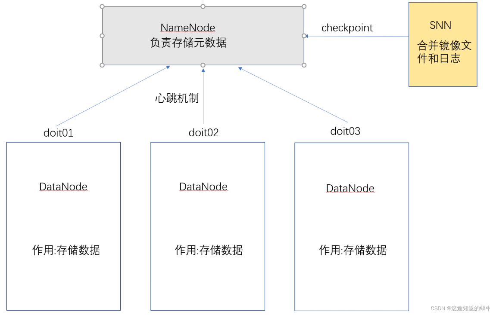

## 1 hadoop概述
9870:监测端口
### 1.1 hadoop的优势
**1.高可靠性**。因为它假设计算元素和存储会失败，因此它维护多个工作数据副本，确保能够针对失败的节点重新分布处理。

**2.高扩展性**。当存储hdp集群的存储能力和运算资源不足时,可以横向的扩展机器节点来达到扩容和增强运算能力 

**3.高效性**。因为它以并行的方式工作，通过并行处理加快处理速度

**4.高容错性**。Hadoop能够自动保存数据的多个副本，当有存储数据的节点宕机以后, 会自动的复制副本维持集群中副本的个数 ,并且能够自动将失败的任务重新分配。

### 1.2 hadoop的核心模块
1. **HDFS (Hadoop Distributed File System) 分布式文件系统**:负责海量数据的存储和管理
1. **MapReduce分布式运算系统**:负责海量数据的运算
2. **YARN分布式资源调度和任务监控平台**

## 2 HDFS分布式文件系统
HDFS分布式文件系统,全称为:Hadoop Distributed File System,首先这是一个文件系统,主要用于对文件的存储,通过和linux相似的目录树系统定位文件和目录的位置,其次,他是分布式的,解决海量数据的存储问题,HDFS系统统一管理,提供统一的操作目录,操作命令和API。

### 2.1 hdfs的优缺点
- 优点：
  - 高容错性
  - 高扩展性

- 缺点：
  - 不适合低延时数据访问
  - 无法高效的对大量小文件进行存储
  - 不支持并发写入、文件随机修改

### 2.2 hdfs的角色分析
HDFS默认采用的是主从架构,架构中有三个角色:一个叫NameNode,一个叫DataNode,还有一个叫secondaryNameNode。


> NameNode:主要负责存储文件的元数据,比如集群id,文件存储所在的目录名称,文件的副本数,以及每个文件被切割成块以后的块列表和块列表所在的DataNode。
> DataNode:主要负责存储数据,包含一整个文件或者某个文件切成的块数据,以及块数据的一些校验信息等。
> SecondaryNameNode:主要负责和NameNode的checkpoint机制(类似于备份机制)等。

- 储存块大小的计算：根据寻址时间与磁盘写的速率计算。

### 2.3 hdfs的搭建和配置
1. 准备搭建好的集群机器，解压hadoop压缩包；
2. 在hadoop-3.1.1/etc/hadoop/hadoop-env.xml中配置Java依赖路径；
3. 在hdfs-site.xml中配置namenode节点等参数；
4. 进入hadoop-3.1.1/bin目录下，`./hadoop namenode -format`初始化NameNode,此时可以单点启动;
5. 以下开始配置一键启动和停止：在hadoop-3.1.1/etc/hadoop/workers中加入集群各机器名；
6. 进入hadoop-3.1.1/sbin分别在start-dfs.sh、stop-dfs.sh第二行加入：
    ```bash
    HDFS_DATANODE_USER=root 
    HADOOP_SECURE_DN_USER=hdfs
    HDFS_NAMENODE_USER=root 
    HDFS_SECONDARYNAMENODE_USER=root
    ```
7. 此时可以在hadoop-3.1.1/sbin目录下，通过./start-dfs.sh、./stop-dfs.sh一键启动、停止集群；
8. 在/etc/profile文件中环境变量：`export HADOOP_HOME=/opt/apps/hadoop-3.1.1/`、`export PATH=$PATH:$JAVA_HOME/bin:$HADOOP_HOME/bin:$HADOOP_HOME/sbin`，
9. `source profile`，此时不管在任何位置都能够启动集群。

## 3 hdfs的shell客户端与Java客户端


## 4 hdfs的内部原理机制
### 4.1 NameNode与DataNode的交互

### 4.2 hdfs的数据存储流程

### 4.3 NameNode的checkpoint

## 5 MapReduce
### 5.1 MapReduce流程
- 当map传输出的value为bean对象时，reduce阶段对values迭代器进行迭代时，需要对value进行深拷贝。原因是reduce的Iterable迭代器的bean对象是一个单例对象，其地址不变，若不进行深拷贝，所有的迭代对象的值都将变为同一对象的值（最后一次迭代到的对象）。
- 
## 6 Yarn