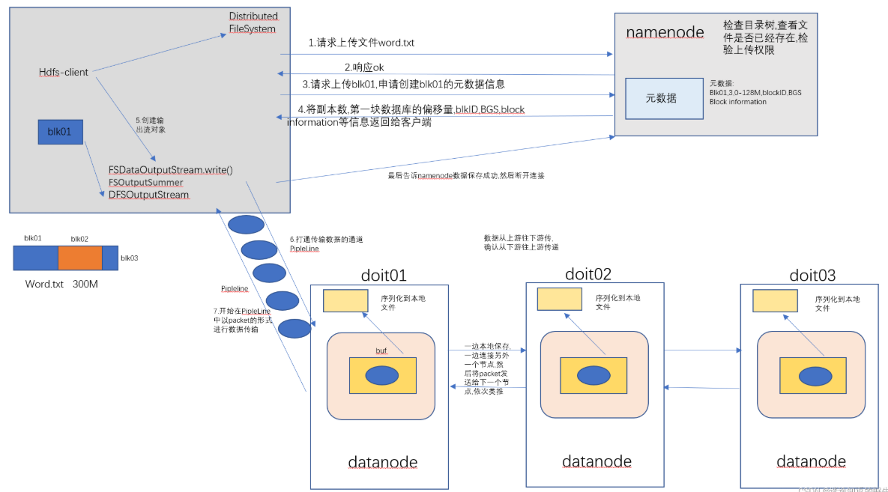
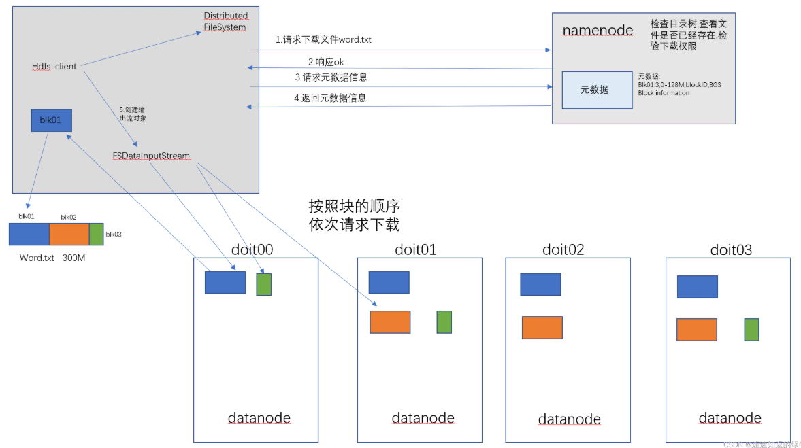
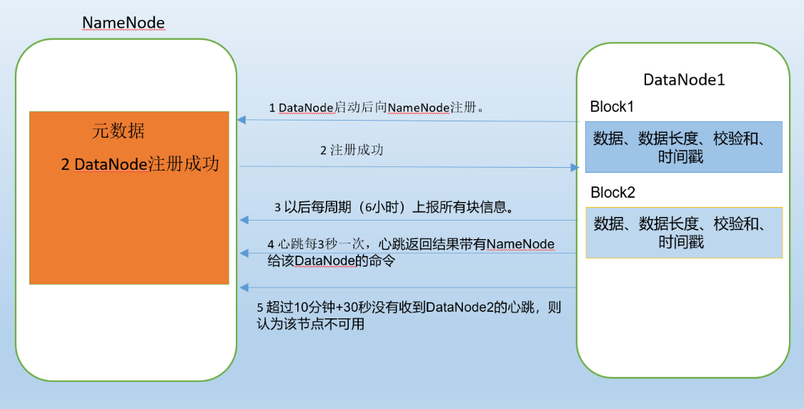
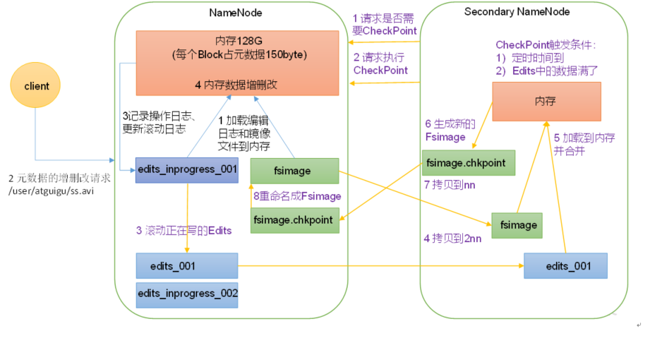
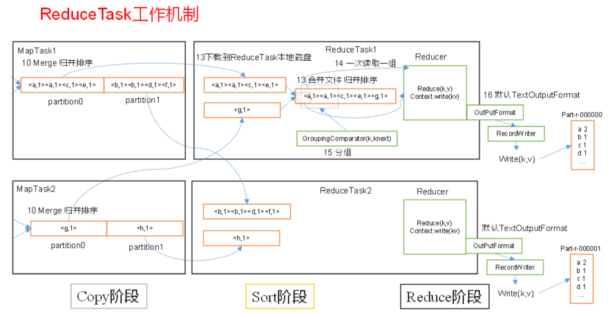
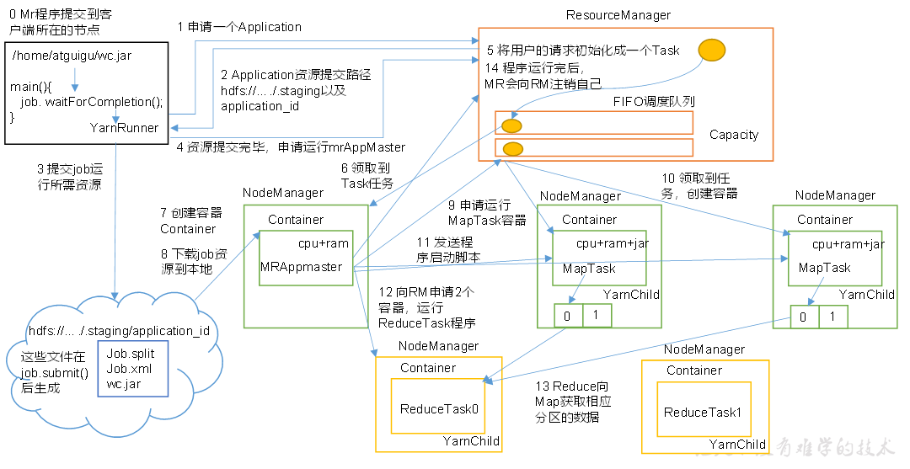

## 1 hadoop概述
### 1.1 hadoop是什么
1. 分布式系统基础架构；
2. 面向海量的数据存储及分析计算；
3. 通常指hadoop生态圈。
### 1.2 hadoop的应用场景
- 海量的数据存储
- 海量数据的分析计算
### 1.3 hadoop的优势
**1.高可靠性**。因为它假设计算元素和存储会失败，因此它维护多个工作数据副本，确保能够针对失败的节点重新分布处理。

**2.高扩展性**。当存储hdp集群的存储能力和运算资源不足时,可以横向的扩展机器节点来达到扩容和增强运算能力 

**3.高效性**。因为它以并行的方式工作，通过并行处理加快处理速度

**4.高容错性**。Hadoop能够自动保存数据的多个副本，当有存储数据的节点宕机以后, 会自动的复制副本维持集群中副本的个数 ,并且能够自动将失败的任务重新分配。

### 1.4 hadoop的核心模块
1. **HDFS (Hadoop Distributed File System) 分布式文件系统**:负责海量数据的存储和管理
1. **MapReduce分布式运算系统**:负责海量数据的运算
2. **YARN分布式资源调度和任务监控平台**

## 2 HDFS分布式文件系统
HDFS分布式文件系统,全称为:Hadoop Distributed File System,首先这是一个文件系统,主要用于对文件的存储,通过和linux相似的目录树系统定位文件和目录的位置,其次,他是分布式的,解决海量数据的存储问题,HDFS系统统一管理,提供统一的操作目录,操作命令和API。

### 2.1 hdfs的优缺点
- 优点：
  - 高容错性
  - 高扩展性

- 缺点：
  - 不适合低延时数据访问
  - 无法高效的对大量小文件进行存储
  - 不支持并发写入、文件随机修改

### 2.2 hdfs的角色分析
HDFS默认采用的是主从架构,架构中有三个角色:一个叫NameNode,一个叫DataNode,还有一个叫secondaryNameNode。


> NameNode:主要负责存储文件的元数据,比如集群id,文件存储所在的目录名称,文件的副本数,以及每个文件被切割成块以后的块列表和块列表所在的DataNode。
> DataNode:主要负责存储数据,包含一整个文件或者某个文件切成的块数据,以及块数据的一些校验信息等。
> SecondaryNameNode:主要负责和NameNode的checkpoint机制(类似于备份机制)等。

- 储存块大小的计算：根据寻址时间与磁盘写的速率计算。

### 2.3 hdfs的搭建和配置
1. 准备搭建好的集群机器，解压hadoop压缩包；
2. 在hadoop-3.1.1/etc/hadoop/hadoop-env.xml中配置Java依赖路径；
3. 在hdfs-site.xml中配置namenode节点等参数；
4. 进入hadoop-3.1.1/bin目录下，`./hadoop namenode -format`初始化NameNode,此时可以单点启动;
5. 以下开始配置一键启动和停止：在hadoop-3.1.1/etc/hadoop/workers中加入集群各机器名；
6. 进入hadoop-3.1.1/sbin分别在start-dfs.sh、stop-dfs.sh第二行加入：
    ```bash
    HDFS_DATANODE_USER=root 
    HADOOP_SECURE_DN_USER=hdfs
    HDFS_NAMENODE_USER=root 
    HDFS_SECONDARYNAMENODE_USER=root
    ```
7. 此时可以在hadoop-3.1.1/sbin目录下，通过./start-dfs.sh、./stop-dfs.sh一键启动、停止集群；
8. 在/etc/profile文件中环境变量：`export HADOOP_HOME=/opt/apps/hadoop-3.1.1/`、`export PATH=$PATH:$JAVA_HOME/bin:$HADOOP_HOME/bin:$HADOOP_HOME/sbin`，
9. `source profile`，此时不管在任何位置都能够启动集群。

## 3 hdfs的shell客户端与Java客户端


## 4 hdfs的内部原理机制
### 4.1 HDFS写数据流程（重点）
写：

读：

### 4.2 NameNode与DataNode的交互

### 4.3 NameNode和SecondaryNameNode

## 5 MapReduce概述

## 6 MapReduce框架原理
### 6.1 InputFormat数据输入

### 6.2 MapReduce工作流程

### 6.3 Shuffle机制
#### Partition分区
#### WritableComparable排序
#### Combiner合并

### 6.4 OutputFormat数据输出

## 7 Hadoop数据压缩

## 8 Yarn资源调度器
### 8.1 基础架构

### 8.2 工作机制

### 8.3 作业提交全过程

### 8.4 Yarn调度器和调度算法

---
## 知识点总结
#### HDFS的写数据流程

1. Client 发起文件上传请求， 通过 RPC 与 NameNode 建立通讯, NameNode检查目标文件是否已存在， 父目录是否存在， 返回是否可以上传；
2. Client 请求第一个block该传输到哪些 DataNode 服务器上；
3. NameNode返回可用的DataNode 的地址如： A, B, C；
(Hadoop 在设计时考虑到数据的安全与高效， 数据文件默认在 HDFS 上存放三份，
存储策略为本地一份， 同机架内其它某一节点上一份， 不同机架的某一节点上一份。)
4. Client 请求3台DataNode中的一台A上传数据（ 本质上是一个 RPC调用， 建立 pipeline ）,A 收到请求会继续调用 B，然后B调用C，将整个pipeline建立完成，然后后逐级返回 client；
5. Client 开始往 A 上传第一个 block（ 先从磁盘读取数据放到一个本地内存缓存），以packet为单位（ 默认 64K，A 收到一个packe 就会传给B，B传给C。每发送一个packet都会将其放入一个应答队列等待应答；
   `(FSDataInputStream流将blk01中的内容读到一个buf中,buf大小为4KB,每读满一个buf,就会flush一次,将数据写到chunk中,一个chunk大小为512b的数据内容加上4b的校验(checksum)内容,也就是516b,chunk是数据传输过程中的最小校验单位,然后再将chunk写入到packet中,packet是client和datanode进行数据传输的最小单位,一个packet大概是64KB)`
6. packet被最后一台DataNode节点保存成功后，会向pipeline的反方向发送应答，最终由节点 A 将pipelineack 发送给 Client，将应答队列中的packet移除；
7. 当一个block传输完成之后，Client会再次请求NameNode上传第二个block，重复以上步骤。

---
#### HDFS的读数据流程

1. Client 向 NameNode 发起 RPC 请求， 来确定请求文件 block 所在的位置；
2. NameNode 会视情况返回文件的部分或者全部 block 列表， 对于每个 block，NameNode 都会返回含有该 block 副本的 DataNode 地址；
3. Client 根据集群拓扑结构选取离自己最近的DataNode 来读取 block，如果客户端本身就是DataNode， 那么将从本地直接获取数据(短路读取特性)；
4. 底层上本质是建立FSDataInputStream， 重复的调用父类 DataInputStream 的 read 方法， 直到这个块上的数据读取完毕；
5. 当读完列表的 block 后， 若文件读取还没有结束， 客户端会继续向NameNode 获取下一批的 block 列表；
6. 读取完一个 block 都会进行 checksum 验证， 如果读取 DataNode 时出现错误， 客户端会通知 NameNode， 然后再从下一个拥有该 block 副本的DataNode 继续读；
7. 最终读取来所有的 block 会合并成一个完整的最终文件。
从 HDFS 文件读写过程中， 可以看出， HDFS 文件写入时是串行写入的， 数据包先发
送给节点 A， 然后节点 A 发送给 B， B 在给 C； 而 HDFS 文件读取是并行的， 客户端
Client 直接并行读取 block 所在的节点。

---
#### NameNode与DataNode的交互


一个数据块在 datanode 上以文件形式存储在磁盘上， 包括两个文件，一个是数据本身， 一个是元数据（数据块的长度、块数据的校验和、时间戳）
1. DataNode 启动后向 namenode 注册， 通过后，每6小时向namenode上报所有的块信息。 
2. 心跳是每 3 秒一次，心跳返回结果带有 namenode 给该 datanode 的命令如复制块数据到另一台机器，或删除某个数据块。
3. 如果超过 10 分钟+ 30秒没有收到某个 datanode 的心跳，则认为该节点不可用；
4. 将这个节点移出集群，然后在任务队列中发布任务，新增一份宕机节点储存的block块副本。

---
#### NameNode和SecondaryNameNode

1）第一阶段：NameNode启动
（1）第一次启动NameNode格式化后，创建Fsimage和Edits文件。如果不是第一次启动，直接加载编辑日志和镜像文件到内存。
（2）客户端对元数据进行增删改的请求。
（3）NameNode记录操作日志，更新滚动日志。
（4）NameNode在内存中对元数据进行增删改。
2）第二阶段：Secondary NameNode工作
（1）Secondary NameNode询问NameNode是否需要CheckPoint。直接带回NameNode是否检查结果。
（2）Secondary NameNode请求执行CheckPoint。
（3）NameNode滚动正在写的Edits日志。
（4）将滚动前的编辑日志和镜像文件拷贝到Secondary NameNode。
（5）Secondary NameNode加载编辑日志和镜像文件到内存，并合并。
（6）生成新的镜像文件fsimage.chkpoint。
（7）拷贝fsimage.chkpoint到NameNode。
（8）NameNode将fsimage.chkpoint重新命名成fsimage。

---
#### MapReduce的工作流程

1. 客户端会通过 getSplits 方法对输入目录中的文件进行逻辑切片规划，生成切片规划文件(jpb.split、wc.jar、job.xml)发送给yarn，yarn对其进行计算启动相应数量MapTask；
2. maptask会调用InPutFormat()方法去HDFS上面读取文件,调用RecordRead()方法,将数据以行首字母的偏移量为key,以行
数据为value传给mapper()方法；
3. mapper方法对数据进行处理后，数据被collect方法收集，对其进行分区标记（调用Partitioner），然后写入环形缓冲区；
4. 环形缓冲区是一块内存区域，作用是批量收集 Mapper 结果, 减少磁盘 IO 的影响。大小默认100M，当数据写到80%以后会发生溢写，在数据溢写到本地磁盘之前会对数据进行一次快速排序以及分区(如果设置了combiner操作也会溢写时进行，前提是combiner不会影响最终结果)；
5. 所有数据处理完成后，MapTask会对所有临时文件以分区为单位进行一次归并；


1. Map阶段结束后，会启动根据分区数启动一定数量的ReduceTask，从Map端拉取数据到内存中（内存不足则存在磁盘）；
2. 将拉取到的数据进行一次归并排序，归并后的文件会再次进行一次分组的操作,然后将数据以组为单位发送到
reduce()方法；
1. reduce方法做一些逻辑判断后,最终调用OutputFormat()方法,调用其中的RecordWrite()方法将数据以KV的形式写出
到HDFS上。

---
#### Yarn的工作机制

1. MR程序提交到客户端所在的节点。客户端启动YarnRunner向ResourceManager申请一个Application；
2. RM将该应用程序的资源路径返回给YarnRunner，该程序将运行所需资源提交到HDFS上；
3. 程序资源提交完毕后，申请运行mrAppMaster；
4. RM将用户的请求初始化成一个Task，发布到调度队列；
5. 其中一个NodeManager领取到Task任务，在其内部创建容器Container，生成MRAppmaste并向ResourceManager 注册；
6. MRAppmaste从HDFS上获取资源，计算任务所需的资源，向RM申请运行MapTask资源；
7. RM将运行MapTask的任务发布到调度队列，NodeManager领取任务并创建容器；
8. MR向接收到任务的NodeManager发送程序启动脚本，NodeManager分别启动MapTask；
9. MrAppMaster等待所有MapTask运行完毕后，向RM申请容器，运行ReduceTask；
10. 所有程序运行完毕后，MR向RM申请注销自己。

