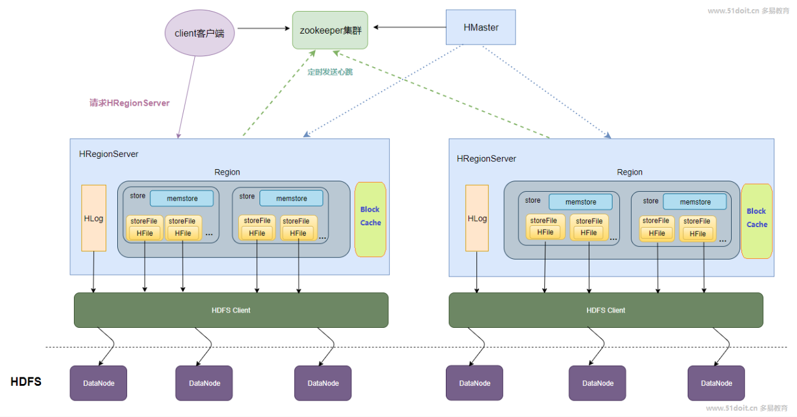
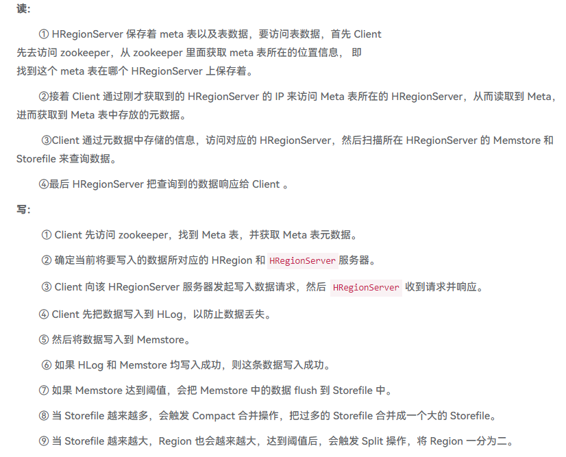
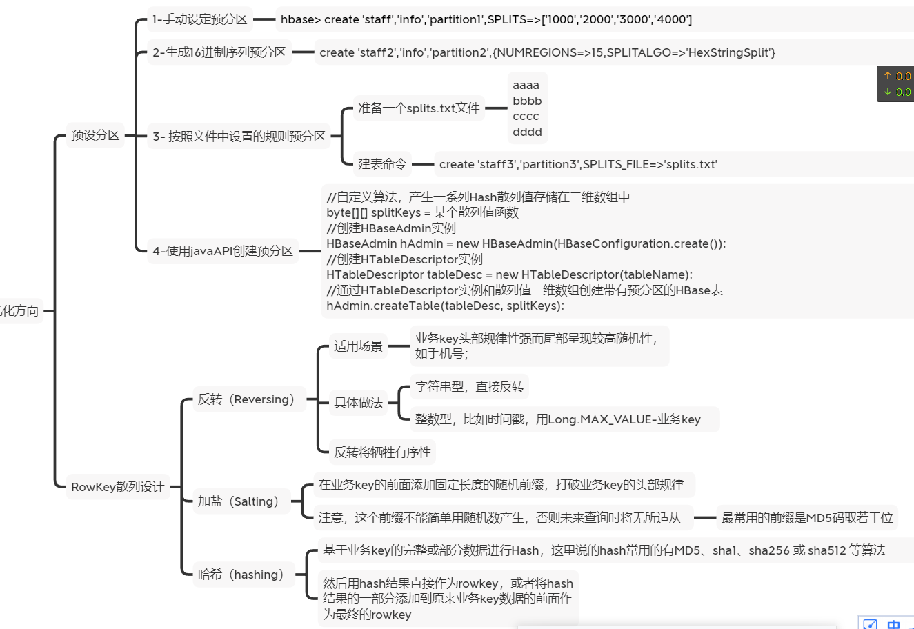
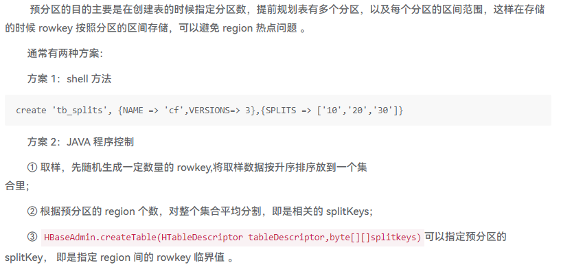
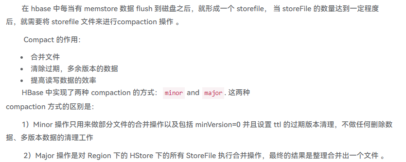
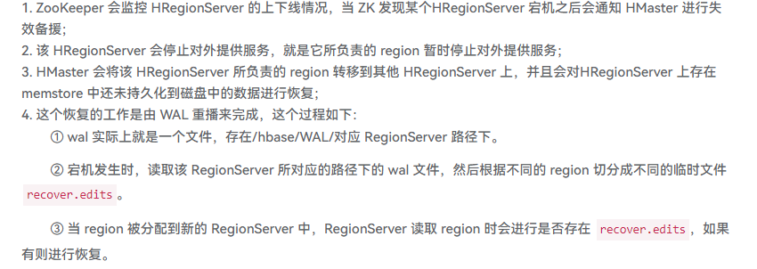

## 1 Hbase概述
### 1.1 Hbase是什么
hbase是一个**分布式数据库**, 用来存储海量的标签数据,不支持SQL。
### 1.2 Hbase应用场景
1. 半结构化和非结构化数据，可动态扩展
2. 存储用户画像和标签数据
3. 记录多版本数据
4. 储存超大容量的数据
### 1.3 Hbase优缺点
#### 特点：
1. 海量存储  
2. 列式存储
3. 极易扩展
4. 稀疏（列的灵活性）
5. 无模式
6. 数据多版本 

#### 不适合使用：
1. 需要数据分析,比如报表(rowkey) 对sql支持不好
2. 单表数据不超过千万(200万)
## 2 Hbase架构

## 主要知识点
1. Hbase 的架构和原理
>Master
HBase Master用于协调多个Region Server，侦测各个RegionServer之间的状态，并平衡RegionServer之间的负载。HBaseMaster还有一个职责就是负责分配Region给RegionServer。HBase允许多个Master节点共存，但是这需要Zookeeper的帮助。不过当多个Master节点共存时，只有一个Master是提供服务的，其他的Master节点处于待命的状态。当正在工作的Master节点宕机时，其他的Master则会接管HBase的集群。
Region Server
对于一个RegionServer而言，其包括了多个Region。RegionServer的作用只是管理表格，以及实现读写操作。Client直接连接RegionServer，并通信获取HBase中的数据。对于Region而言，则是真实存放HBase数据的地方，也就说Region是HBase可用性和分布式的基本单位。如果当一个表格很大，并由多个CF组成时，那么表的数据将存放在多个Region之间，并且在每个Region中会关联多个存储的单元（Store）。
Zookeeper
对于 HBase 而言，Zookeeper的作用是至关重要的。首先Zookeeper是作为HBase Master的HA解决方案。也就是说，是Zookeeper保证了至少有一个HBase Master 处于运行状态。并且Zookeeper负责Region和Region Server的注册。其实Zookeeper发展到目前为止，已经成为了分布式大数据框架中容错性的标准框架。不光是HBase，几乎所有的分布式大数据相关的开源框架，都依赖于Zookeeper实现HA。

2. Hbase 的读写流程
>
1. Hbase 有没有并发问题？Hbase 如何实现自己的 MVVC 的？
> HBase目前只支持行级事务，强一致性，满足的ACID特性。其采用了WAL（Write Ahead Log）策略，以及通过锁和MVCC机制来实现并发控制.
> 
> 写写并发控制
> 多个写入/更新同时进行会导致数据不一致的问题，HBase通过获取行锁来实现写写并发，如果获取不到，就需要不断重试等待> 或者自旋等待，直至其他线程释放该锁。拿到锁之后开始写入数据，写入完成之后释放行锁即可。这种行锁机制是实现写写并发> 控制最常用的手段，MySQL也使用了行锁来实现写写并发。
> HBase支持批量写入/更新，实现批量写入的并发控制也是使用行锁。但这里需要注意的是必须使用两阶段锁协议，步骤如下：
> (1) 获取所有待写入/更新行记录的行锁。
> (2) 开始执行写入/更新操作。
> (3) 写入完成之后再统一释放所有行记录的行锁。
> 
> 不能更新一行锁定（释放）一行，多个事务之间容易形成死锁。两阶段锁协议就是为了避免死锁，MySQL事务写写并发控制同样> 使用两阶段锁协议。
> 
> 读写并发控制
> 读写之间也需要一种并发控制来保证读取的数据总能够保持一致性，读写并发不能通过加锁的方式，性能太差，采用的是MVCC> 机制（Mutil Version Concurrent Control）。HBase中MVCC机制实现主要分为两步：
> 
> (1) 为每一个写入/更新事务分配一个Region级别自增的序列号。
> (2) 为每一个读请求分配一个已完成的最大写事务序列号。

1. Hbase 中几个重要的概念：HMaster、RegionServer、WAL 机制、MemStore
> HMaster负责region的分配，数据库的创建和删除操作，其职责包括：
> 调控Region server的工作
> 在集群启动的时候分配region，根据恢复服务或者负载均衡的需要重新分配region。
> 监控集群中的Region server的工作状态。（通过监听zookeeper对于ephemeral node状态的通知）。
> 管理数据库
> 提供创建，删除或者更新表格的接口。
> Region server由如下几个部分组成：
> 
> WAL：既Write Ahead Log。WAL是HDFS分布式文件系统中的一个文件，即HLog。WAL用来存储尚未写入永久性存储区中的新数据。WAL也用来在服务器发生故障时进行数据恢复。
> Block Cache：Block cache是读缓存。Block cache将经常被读的数据存储在内存中来提高读取数据的效率。当Blockcache的空间被占满后，其中被读取频率最低的数据将会被杀出。
> MemStore：MemStore是写缓存。其中存储了从WAL中写入但尚未写入硬盘的数据。MemStore中的数据在写入硬盘之前会先进行排序操作。每一个region中的每一个column family对应一个MemStore。
> Hfiles：Hfiles存在于硬盘上，根据排序号的键存储数据行。

1. Hbase 在进行表设计过程中如何进行列族和 RowKey 的设计
>Rowkey 长度原则
>        Rowkey 是一个二进制码流，Rowkey 的长度被很多开发者建议说设计在 10~100 个字节，不过建议是越短越好，不要超过 16 个字节。
>       原因如下：
>数据的持久化文件 HFile 中是按照 KeyValue 存储的，如果 Rowkey 过长,比如 100 个字节，1000 万列数据光 Rowkey 就要占用 100*1000 万=10 亿个字节， 将近 1G 数据，这会极大影响 HFile 的存储效率；
>      MemStore 将缓存部分数据到内存，如果 Rowkey 字段过长内存的有效利用率会降低，系统将无法缓存更多的数据，这会降低检索效率。 因此 Rowkey 的字节长度越短越好。
>
>目前操作系统是都是 64 位系统，内存 8 字节对齐。控制在 16 个字节，8 字节的整数倍利用操作系统的最佳特性 。
>
>Rowkey 散列原则
>        如果 Rowkey 是按时间戳的方式递增，不要将时间放在二进制码的前面，建议将 Rowkey 的高位作为散列字段，由>程序循环生成，低位放时间字段， 这样将提高数据均衡分布在每个 Regionserver 实现负载均衡的几率。如果没有>散列字段，首字段直接是时间信息将产生所有新数据都在一个 RegionServer 上堆积的 热点现象，这样在做数据检>索的时候负载将会集中在个别 RegionServer，降低查询效率 。
>
>Rowkey 唯一原则
>    Column Family 的个数具体看表的数据，一般来说划分标准是根据数据访问频度，如一张表里有些列访问相对频繁，而另一些列访问很少， 这时可以把这张表划分成两个列族，分开存储，提高访问效率。
>        必须在设计上保证其唯一性。
1. Hbase 的数据热点问题发现和解决办法
> 在实际操作中，当大量请求访问HBase集群的一个或少数几个节点，造成少数RegionServer的读写请求过多，负载过大，而其他RegionServer负载却很小，这样就造成热点现象。
> 
2. 提高 Hbase 的读写性能的通用做法
> 开启 bloomfilter 过滤器，开启 bloomfilter 比没开启要快 3、4 倍
Hbase 对于内存有特别的需求，在硬件允许的情况下配足够多的内存给它
通过修改 hbase-env.sh 中的 export HBASE_HEAPSIZE=3000 (默认为 1000m)
增大 RPC 数量
通过修改 hbase-site.xml 中的 hbase.regionserver.handler.count 属性，可以适当的放大 RPC 数量，默值为 10 有点小 。
1. HBase 中 RowFilter 和 BloomFilter 的原理
> 筛选出匹配的所有的行，基于行键（Rowkey）过滤数据，可以执行精确匹配，子字符串匹配或正则表达式匹配，过滤掉不匹配的数据。
一般来说，对 Rowkey 进行范围过滤，可以执行 Scan 的 startKey 和 endKey，RowFilter 可以更精确的过滤。
> BloomFilter对于HBase的随机读性能至关重要，对于get操作以及部分scan操作可以剔除掉不会用到的HFile文件，减少实际IO次数，提高随机读性能。
1.  Hbase API 中常见的比较器
> BinaryComparator          // 匹配完整字节数组  
BinaryPrefixComparator    // 匹配字节数组前缀 
BitComparator // 按位执行与、或、异或比较 
NullComparator // 判断当前值是不是 NULL 
RegexStringComparator     // 正则表达式匹配字符串 
SubstringComparator       // 子串匹配，相当于 contains()
2.  Hbase 的预分区
> 
3.  Hbase 的 Compaction
> 
4.  Hbase 集群中 HRegionServer 宕机如何解决
> 
---