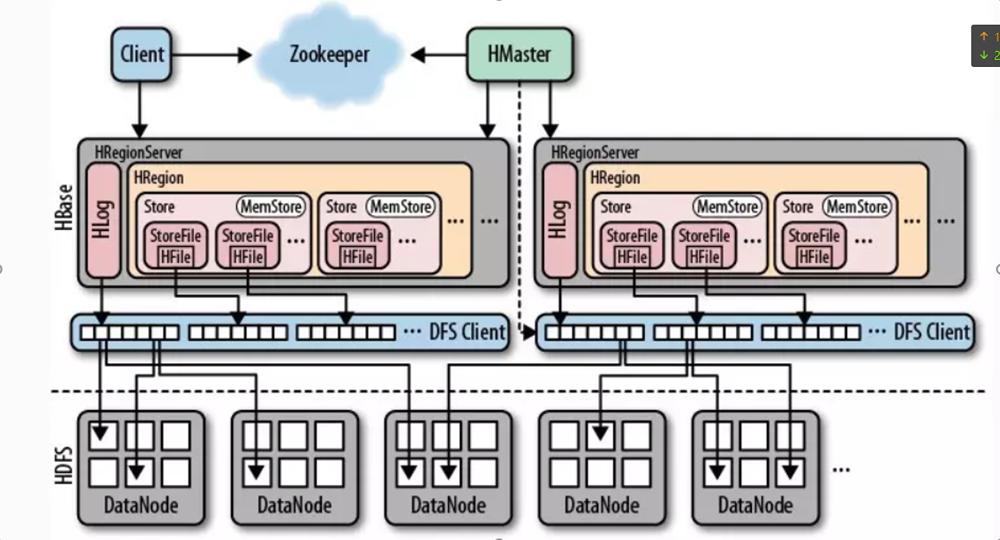

## 1 Hbase概述
### 1.1 Hbase是什么
hbase是一个**分布式数据库**, 用来存储海量的标签数据,不支持SQL。
### 1.2 Hbase应用场景
1. 半结构化和非结构化数据，可动态扩展
2. 存储用户画像和标签数据
3. 记录多版本数据
4. 储存超大容量的数据
### 1.3 Hbase优缺点
#### 特点：
1. 海量存储  
2. 列式存储
3. 极易扩展
4. 稀疏（列的灵活性）
5. 无模式
6. 数据多版本 

#### 不适合使用：
1. 需要数据分析,比如报表(rowkey) 对sql支持不好
2. 单表数据不超过千万(200万)
## 2 Hbase架构

