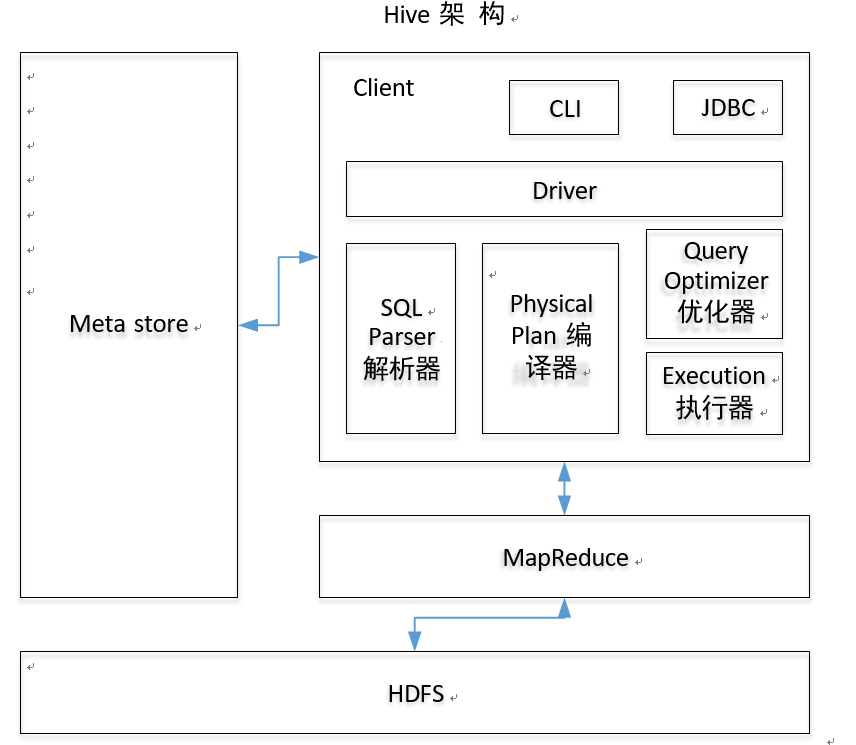
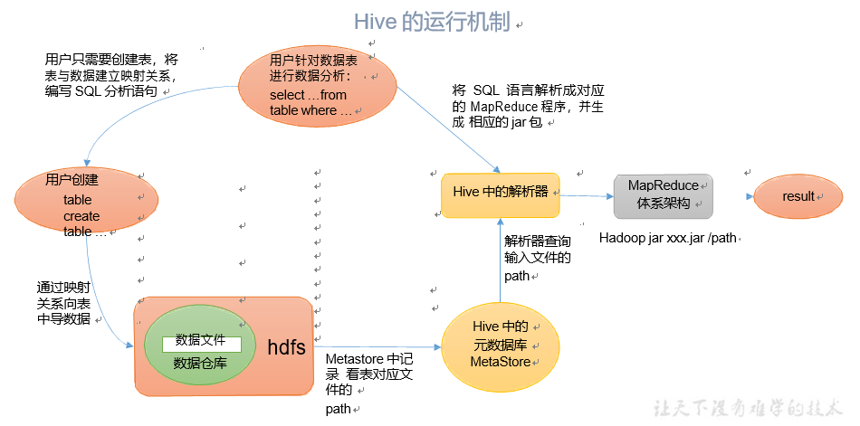
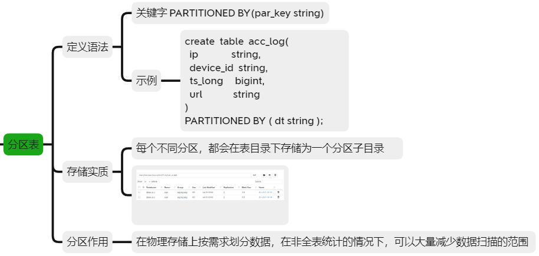
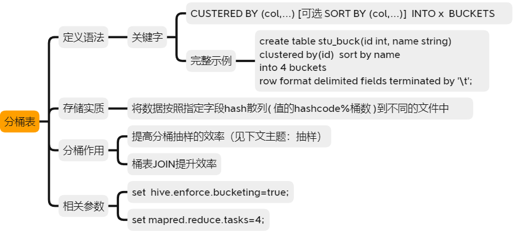

## 1 Hive的基本概念
### 1.1 什么是Hive
- **hive 简介**
Hive：由 Facebook 开源用于解决海量**结构化**日志的数据统计工具。
Hive 是基于 Hadoop 的一个**数据仓库工具**，可以**将结构化的数据文件映射为一张表**，并提供类 SQL 查询功能。

- **Hive 本质**：SQL转化工具，将 HQL 转化成 MapReduce 程序（SQL解析，任务提交生成）。

hive是构建在Hadoop之上的数据仓库：数据存储在hdfs上、数据计算用mapreduce。

### 1.2 Hive的应用场景
1. 数据统计、分析处理；
2. 架设数据仓库。

### 1.3 Hive的优缺点
- 优点：
    1. 操作接口采用类 SQL 语法，上手容易；
    2. 避免了写MapReduce，减少开发人员的学习成本；
    3. 处理大数据有优势；
- 缺点：
  1. Hive 的 HQL 表达能力有限（无法表达迭代式算法、不擅长数据挖掘）；
  2. 执行效率比较低（不够智能化、调优较困难）。

### 1.3 Hive架构


- 用户接口；
- 元数据：包括：表名、表所属的数据库（默认是 default）、表的拥有者、列/分区字段、 表的类型（是否是外部表）、表的数据所在目录等；**默认存储在自带的 derby 数据库中，推荐使用 MySQL 存储 Metastore。**
- Hadoop：使用 HDFS 进行存储，使用 MapReduce 进行计算。
- 驱动器：Driver
  - 解析器（SQL Parser）：将 SQL 字符串转换成抽象语法树 AST，这一步一般都用第 三方工具库完成，比如 antlr；对 AST 进行语法分析，比如表是否存在、字段是否存在、SQL 语义是否有误。
  - 编译器（Physical Plan）：将 AST 编译生成逻辑执行计划。
  - 优化器（Query Optimizer）：对逻辑执行计划进行优化。
  - 执行器（Execution）：把逻辑执行计划转换成可以运行的物理计划。对于 Hive 来 说，就是 MR/Spark。

### 1.4 Hive与数据库的比较
由于 Hive 采用了类似 SQL 的查询语言 HQL(Hive Query Language)，因此很容易将 Hive 理解为数据库。其实从结构上来看，Hive 和数据库除了拥有类似的查询语言，再无类似之处。 
- **查询语言**：HQL是类SQL的查询语言；
- **数据更新**： Hive 是针对数据仓库应用设计的，读多写少，数据在加载时确定好。而数据库中的数据通常是经常进行修改。
- **执行延迟**：由于使用MapReduce框架以及没有索引，Hive查询延迟较高，当数据规模大到一定程度时，Hive的并行计算将比数据库更有优势。
- **数据规模**： Hive 建立在集群上，可以支持很大规模 的数据；数据库可以支持的数据规模较小。

## 2 Hive的运行原理


## 3 Hive的数据类型
### 3.1 基本数据类型
| Hive 数据类型 | Java 数据类型 | 长度                                                   | 例子                                     |
| ------------- | ------------- | ------------------------------------------------------ | ---------------------------------------- |
| TINYINT       | byte          | 1byte 有符号整数                                       | 20                                       |
| SMALINT       | short         | 2byte 有符号整数                                       | 20                                       |
| INT           | int           | 4byte 有符号整数                                       | 20                                       |
| BIGINT        | long          | 8byte 有符号整数                                       | 20                                       |
| BOOLEAN       | boolean       | 布尔类型，true 或者  false                             | TRUE FALSE                               |
| FLOAT         | float         | 单精度浮点数                                           | 3.14159                                  |
| DOUBLE        | double        | 双精度浮点数                                           | 3.14159                                  |
| STRING        | string        | 字符系列。可以指定字符集。可以使用单引号或者双  引号。 | ‘ now is the time  ’ “for  all good men” |
| TIMESTAMP     |               | 时间类型                                               |                                          |
| BINARY        |               | 字节数组                                               |                                          |
对于 Hive 的 String 类型相当于数据库的varchar 类型，该类型是一个可变的字符串，不过它不能声明其中最多能存储多少个字符，理论上它可以存储 2GB 的字符数。

### 3.2 集合数据类型
| 数据类型 | 描述                                                         | 语法示例                                             |
| -------- | ------------------------------------------------------------ | ---------------------------------------------------- |
| STRUCT   | 和c 语言中的 struct 类似，都可以通过“点”符号访问元素内容。例如，如果某个列的数据类型是 STRUCT{first STRING, last STRING},那么第 1 个元素可以通过字段.first 来  引用。 | struct()  例  如  struct<street:string, city:string> |
| MAP      | MAP 是一组键-值对元组集合，使用数组表示法可以访问数据。例如，如果某个列的数据类型是  MAP，其中键  ->值对是’first’->’John’和’last’->’Doe’，那么可以  通过字段名[‘last’]获取最后一个元素 | map()  例如 map<string, int>                         |
| ARRAY    | 数组是一组具有相同类型和名称的变量的集合。这些变量称为数组的元素，每个数组元素都有一个编号，编号从零开始。例如，数组值为[‘John’, ‘Doe’]，那么第 2 个  元素可以通过数组名[1]进行引用。 | Array()  例如 array<string>                          |
Hive 有三种复杂数据类型 ARRAY、MAP 和 STRUCT。ARRAY 和 MAP 与 Java 中的 Array和 Map 类似，而 STRUCT 与 C 语言中的 Struct 类似，它封装了一个命名字段集合，复杂数据类型允许任意层次的嵌套。

## 4 Hive的数据定义（DDL）
### 4.1 数据库操作
#### 基本语法
```sql
 -- 建库语法
 CREATE DATABASE [IF NOT EXISTS] database_name  [COMMENT database_comment]  [LOCATION hdfs_path]  [WITH DBPROPERTIES (property_name=property_value, ...)]; 
 -- 创建数据库标准的写法
 create database  if not exists db_hive; 
 -- 创建数据库，指定存放的位置
 create database db_hive2 location '/db_hive2.db'; 
 
 -- 查询数据库
 show databases; 
 -- 过滤查询
 show databases like 'db_hive*'; 
 -- 查看数据库详情
 desc  database (extended) db_hive;

 -- 修改数据库
 alter database db_hive set dbproperties('createtime'='20170830'); 

 -- 删除数据库
 drop database if exists db_hive2;
 -- 强制删除
 drop  database db_hive cascade
```

### 4.2 表操作
#### 基本语法
```sql
 -- 建表语法
  CREATE [EXTERNAL] TABLE [IF NOT EXISTS] table_name  
 [(col_name data_type [COMMENT col_comment], ...)] 
 [COMMENT table_comment]  
 [PARTITIONED BY (col_name data_type [COMMENT col_comment], ...)] 
 [CLUSTERED BY (col_name,  col_name, ...) 
 [SORTED BY (col_name [ASC|DESC], ...)] INTO num_buckets BUCKETS] 
 [ROW FORMAT row_format]  
 [STORED AS file_format]  
 [LOCATION hdfs_path]  
 [TBLPROPERTIES (property_name=property_value, ...)] 
 [AS select_statement] 
 ```

- CREATE TABLE 创建一个指定名字的表。如果相同名字的表已经存在，则抛出异常；用户可以用 IF NOT EXISTS 选项来忽略这个异常。
- EXTERNAL 关键字可以让用户创建一个外部表，在建表的同时可以指定一个指向实际数据的路径（LOCATION），在删除表的时候，内部表的元数据和数据会被一起删除，而外部表只删除元数据，不删除数据。
- COMMENT：为表和列添加注释。
- PARTITIONED BY 创建分区表
- CLUSTERED BY 创建分桶表
- SORTED BY 不常用，对桶中的一个或多个列另外排序
- ROW FORMAT 用户在建表的时候可以自定义 SerDe 或者使用自带的 SerDe。如果没有指定 ROW FORMAT 或者ROW FORMAT DELIMITED，将会使用自带的 SerDe。
- STORED AS 指定存储文件类型
常用的存储文件类型：SEQUENCEFILE（二进制序列文件）、TEXTFILE（文本）、RCFILE（列式存储格式文件）
如果文件数据是纯文本，可以使用STORED AS TEXTFILE。如果数据需要压缩，使用 STORED AS SEQUENCEFILE。
- LOCATION ：指定表在 HDFS 上的存储位置。 
- AS：后跟查询语句，根据查询结果创建表。
- LIKE 允许用户复制现有的表结构，但是不复制数据。


 ```sql
 -- 创建普通表
 create table table_name(
    colum1 string,
    colum2 string)
 row format delimited fields terminated by '\t'
 
 -- 根据查询结果创建表
 create table if  not exists table_name as select colum1, colum2 from other_table;

 -- 根据已经存在的表结构创建表
 create table if  not exists table_name like other_table; 

 -- 查询表的类型
 desc formatted table_name；
 ```

#### 外部表
- Hive认为不完全拥有外部表的数据。删除该表并不会删除掉这份数据，不过描述表的元数据信息会被删除掉。
- 管理表和外部表的使用场景：每天将收集到的网站日志定期流入 HDFS 文本文件。在外部表（原始日志表）的基础上做大量的统计分析，用到的中间表、结果表使用内部表存储，数据通过 SELECT+INSERT 进入内部表。
 ```sql
 -- 创建外部表
 create external table if  not exists emp (
    colum1 string,
    colum2 string )  row format delimited fields terminated by  '\t'; 

 -- 管理表与外部表的互相转换
 -- 修改内部表 student 为外部表
 alter table student set tblproperties('EXTERNAL'='TRUE'); 
 -- 修改外部表 student 为内部表
 alter table student set tblproperties('EXTERNAL'='FALSE'); 
 ```
外部表删除后，hdfs 中的数据还在，但是 metadata 中 dept 的元数据已被删除。

#### 修改表
 ```sql
 -- 重命名表
 ALTER TABLE table_name RENAME TO  new_table_name;

 -- 增加/修改/替换列信息
 -- 更新列
 ALTER TABLE table_name CHANGE [COLUMN] col_old_name col_new_name column_type [COMMENT  col_comment] [FIRST|AFTER column_name] 
 -- 增加和替换列
 ALTER TABLE table_name ADD|REPLACE COLUMNS (col_name data_type [COMMENT col_comment], ...)  
 ```
注：ADD 是代表新增一字段，字段位置在所有列后面(partition 列前)，
REPLACE 则是表示替换表中所有字段。

## 5 Hive的数据操作（DML）
### 5.1 数据导入
#### 向表中装载数据（Load）
 ```sql
 load data [local] inpath '数据的 path' [overwrite] into table student [partition (partcol1=val1,…)];
 ```
（1） load data:表示加载数据
（2） local:表示从本地加载数据到 hive 表；否则从 HDFS 加载数据到 hive 表
（3） inpath:表示加载数据的路径
（4） overwrite:表示覆盖表中已有数据，否则表示追加
（5） into table:表示加载到哪张表
（6） student:表示具体的表
（7） partition:表示上传到指定分区

#### 通过查询语句向表中插入数据（Insert）
 ```sql
 -- 基本插入数据
 insert into table table_name values('xx','xx'),('xx','xx');  

 -- 根据单张表查询结果插入
 insert overwrite table table_name select ......
 ```
insert into：以追加数据的方式插入到表或分区，原有数据不会删除;
insert overwrite：会覆盖表中已存在的数据;
注意：insert 不支持插入部分字段。

#### Import 数据到指定 Hive 表中
 ```sql
 -- 先用 export 导出后，再将数据导入
 import table table_name from 'Path'; 
 ```

#### 创建表时as与like的区别
- create table t1 as:只抽取字段、数据，不导入表结构；
- create table t2 like:不会复制表中属性值，只会复制表结构。

### 5.2 数据导出
#### Insert导出
 ```sql
 -- 将查询的结果导出到本地
 insert overwrite local directory 'Path' select * from table_name;  
 -- 将查询的结果格式化导出到本地
 insert overwrite local directory 'Path' ROW FORMAT DELIMITED FIELDS TERMINATED BY '\t' select * from table_name;
 -- 将查询的结果导出到 HDFS 上没有(local)
 insert overwrite directory 'Path' ROW FORMAT DELIMITED FIELDS TERMINATED BY '\t' select * from table_name;  
 ```

#### Hadoop 命令导出到本地
 ```shell
 hdfs dfs -get /user/hive/warehouse/table_name/table_name.txt  /opt/apps/data/table_name.txt; 
 ```

#### Hive Shell命令导出
基本语法：（hive -f/-e 执行语句或者脚本 > file）
 ```shell
 bin/hive -e 'select * from default.table_name;' > /opt/apps/hive/data/table_name.txt;  
 ```

#### Export 导出到 HDFS 上
 ```sql
 export table default.table_name to '/user/hive/warehouse/export/table_name';
 ```
export 和 import 主要用于两个 Hadoop 平台集群之间 Hive 表迁移。

### 5.3 清除表中数据（Truncate）
 ```sql
 truncate table table_name;  
 ```

## 6 查询
 ```sql
 SELECT [ALL | DISTINCT] select_expr, select_expr, ... 
 FROM table_reference 
 [WHERE where_condition] 
 [GROUP BY col_list] 
 [ORDER BY col_list] 
 [CLUSTER BY col_list | [DISTRIBUTE BY col_list] [SORT BY col_list]] 
 [LIMIT number]  
 ```
逐行映射、分组聚合、过滤模型


## 7 函数
### 7.1 条件函数
#### 空字段赋值
NVL：给值为 NULL 的数据赋值，它的格式是 NVL( value，default_value)。它的功能是如果 value 为 NULL，则 NVL 函数返回 default_value 的值，否则返回 value 的值，如果两个参数都为NULL ，则返回NULL。

#### CASE WHEN THEN ELSE END
 ```sql
 select 
	colum1,
	sum(case colum2 when 'A' then 1 else 0 end) a_count, 
	sum(case colum2 when 'B' then 1 else 0 end) b_count
from table_name 
group by colum1;
 ```

### 7.2 聚合函数
- AVG() 返回某列的平均值
- COUNT() 返回某列的行数
- MAX() 返回某列的最大值
- MIN() 返回某列的最小值
- SUM() 返回某列值之和
除聚集计算语句外，SELECT语句中的每一列都必须在GROUP BY
子句中给出（select中各列，在分组中需唯一）。
### 7.3 窗口函数
说明：
- OVER()：指定分析函数工作的数据窗口大小，这个数据窗口大小可能会随着行的变而变化。
- CURRENT ROW：当前行
- n PRECEDING：往前 n 行数据 
- n FOLLOWING：往后 n 行数据 
- UNBOUNDED：起点，
  - UNBOUNDED PRECEDING 表示从前面的起点，
  - UNBOUNDED FOLLOWING 表示到后面的终点 
- LAG(col,n,default_val)：往前第 n 行数据 
- LEAD(col,n, default_val)：往后第 n 行数据
- NTILE(n)：把有序窗口的行分发到指定数据的组中，各个组有编号，编号从 1 开始，对于每一行，NTILE 返回此行所属的组的编号。

 ```sql
 sum(cost) over(),--所有行相加
 sum(cost) over(partition by name),--按 name 分组，组内数据相加
 sum(cost) over(partition by name order by orderdate),--按 name分组，组 内数据累加
 sum(cost) over(partition by name order by orderdate rows between UNBOUNDED  PRECEDING and current row ),--和sample3一样,由起点到当前行的聚合     
 sum(cost) over(partition by name order by orderdate rows between 1 PRECEDING and current row), --当前行和前面一行做聚合
 sum(cost) over(partition by name order by orderdate rows between 1 PRECEDING AND 1 FOLLOWING),--当前行和前边一行及后面一行     
 sum(cost) over(partition by name order by orderdate rows between current row and UNBOUNDED FOLLOWING) --当前行及后面所有行
 ```

 ```sql
 sum(x) over();
 lead(x,x,x) over();
 lag(x,x,x) over();
 count(x,x,x) over();
 first_value(x) over();
 last_value(x) over;
 row_number() over ()
 rank() over ();
 dense_rank();
 ```

可对窗口函数进行运算操作，如：(columnA - (开窗)) as c。

### 7.4 日期函数
- select datediff('2022-01-10','2022-01-08'); --求两个日期之间的天数差
- select date_sub('2022-01-10',5); --求给定日期在N天前/后的日期
- select from_unixtime(1641020745,'YYYY-MM-dd HH:mm:ss'); --按UTC时区把长整数时间戳转 年月日时分秒字符串
### 7.5 json与url解析函数
-  get_json_object
### 7.6 列转行与行转列
- 列转行
  - collect_set
  - collect_list
- 行转列
  - json_tuple
  - explode

## 8 分区表和分桶表
### 8.1 分区表

### 8.2 分桶表

#### 抽样查询

### 8.3 分区表和分桶表的区别
- 从表现形式上：
分区表是一个目录，分桶表是文件

- 从创建语句上：
分区表使用partitioned by 子句指定，以指定字段为伪列，需要指定字段类型
分桶表由clustered by 子句指定，指定字段为真实字段，需要指定桶的个数

- 从数量上：
分区表的分区个数可以增长，分桶表一旦指定，不能再增长

- 从作用上：
分区避免全表扫描，根据分区列查询指定目录提高查询速度
分桶保存分桶查询结果的分桶结构（数据已经按照分桶字段进行了hash散列）。
分桶表数据进行抽样和JOIN时可以提高MR程序效率
## 9 压缩和存储
### 9.1 支持的压缩编码

| 压缩格式 | 算法    | 文件扩展名 | 是否可切分 |
| -------- | ------- | ---------- | ---------- |
| DEFLATE  | DEFLATE | .deflate   | 否         |
| Gzip     | DEFLATE | .gz        | 否         |
| bzip2    | bzip2   | .bz2       | 是         |
| LZO      | LZO     | .lzo       | 是         |
| Snappy   | Snappy  | .snappy    | 否         |

压缩性能的比较：

| 压缩算法 | 原始文件大小 | 压缩文件大小 | 压缩速度 | 解压速度 |
| -------- | ------------ | ------------ | -------- | -------- |
| gzip     | 8.3GB        | 1.8GB        | 17.5MB/s | 58MB/s   |
| bzip2    | 8.3GB        | 1.1GB        | 2.4MB/s  | 9.5MB/s  |
| LZO      | 8.3GB        | 2.9GB        | 49.3MB/s | 74.6MB/s |

### 9.2 开启 Map 输出阶段压缩（MR 引擎）
开启 map 输出阶段压缩可以减少 job 中 map 和 Reduce task 间数据传输量。

### 9.3 开启 Reduce 输出阶段压缩

### 9.4 文件存储格式
#### TextFile 格式

默认格式，数据不做压缩，磁盘开销大，数据解析开销大。可结合 Gzip、Bzip2 使用，但使用 Gzip 这种方式，hive 不会对数据进行切分，从而无法对数据进行并行操作。

#### Orc 格式

#### Parquet 格式

---

## 10 知识点
### 1.HQL转化成MapReduce的原理：
> HQL语句首先被解析器转换成AST语法树，这时会语义检查（表、字段、语法），再由编译器生成可执行逻辑，然后由优化器优化执行流程，最后执行器将执行逻辑转换成物理执行计划，开始执行MapReduce。


### 2.Hive 和普通关系型数据库有什么区别？
> 1) Hive不是数据库，本质上是一个SQL转换工具，只是语法和SQL类似。
> 1) Hive的底层是MapReduce，数据存储在HDFS上；普通关系型数据库底层是执行引擎，数据储存在本地系统。
> 1) 索引：Hive没有索引，底层是MR，扫描所有数据。
> 1) 数据更新：Hive不支持数据的改写和添加，在加载时就确定好了;数据库可以增删改查。
> 1) Hive不支持事务。

### 3.Hive 支持哪些数据格式
> textFile：Hive的默认格式，数据不压缩，磁盘开销大、数据解析开销大。
> ORC：数据按行分块、每块按照列存储 ，压缩快，快速列存取，效率比rcfile高,是rcfile的改良版本，相比RC能够更好的压缩，能够更快的查询，但还是不支持模式演进。
> Parquet：Parquet能够很好的压缩，有很好的查询性能，支持有限的模式演进。但是写速度通常比较慢。这种文件格式主要是用在Cloudera Impala上面的。

### 4.Hive 在底层是如何存储 NULL 的
> Hive中的空值分两种：NULL和\N，默认null在底层是以\N存储，这个参数由`serialization.null.format' = '\N`设定。

### 5.HiveSQL 支持的几种排序各代表什么意思（Sort By/Order By/Cluster By/Distrbute By）
> 1) Order By 表示全局排序，只有一个 Reducer；
> 2) Sort By表示分区内排序，每个 Reducer 内部进行排序；
> 3) Distribute By类似mr中的partition，可控制控制某个特定行到某个reducer；
> 4) Cluster By 除了具有 distribute by 的功能外还兼具 sort by 的功能。但只能升序排序，当Sort By与Distribute By相同时可以使用。

### 6.Hive 的动态分区
> 分区是Hive存储数据的一种方式，分目录储存数据，使用分区可以快速定位数据位置，提高查询效率。
> hive分区有静态分区和动态分区，静态分区是手动指定，动态分区是开启后，在执行sql的时根据字段的值插入相应分区中。
> hive.exec.dynamic.partition=true 开启动态分区
> hive.exec.dynamic.partition.mode=strict或nonstrict设置模式，strict表示必须指定至少一个分区为静态分区，nonstrict 模式表示允许所有的分区字段都可以使用动态分区。
> ps:静态分区时在建表时指定分区字段，该字段为伪列，并不实际存在，相当于指定一个文件夹，插入与查询数据时以其为依据进行查找。动态分区的字段是实际存在的，位置需要放在最后。
> [动态分区详解](https://blog.csdn.net/m0_48283915/article/details/108942191)
> [分区注意细节](https://blog.csdn.net/shammy_feng/article/details/99946701?spm=1001.2101.3001.6650.1&utm_medium=distribute.pc_relevant.none-task-blog-2%7Edefault%7ECTRLIST%7Edefault-1-99946701-blog-108771653.pc_relevant_multi_platform_whitelistv2&depth_1-utm_source=distribute.pc_relevant.none-task-blog-2%7Edefault%7ECTRLIST%7Edefault-1-99946701-blog-108771653.pc_relevant_multi_platform_whitelistv2)

### 7.HQL 和 SQL 有哪些常见的区别
> Hive是为了数据仓库设计的,采用了类SQL的查询语言HQL。除了HQL之外，无任何相似的地方。
> 语句方面：
> 1) hive sql不支持非等值连接，sql支持非等值连接；
> 2) 在hive中默认的NULL值是存储为\N，在SQL中字段没有值或者为空即表示为NULL；
> 3) 部分函数使用不同，比如HQL的date_sub/add中不用写interval、day以及字符串分割mysql为substring_index("str","分隔符",返回数量)，hql为split("str", '分隔符')[下标]；
> 4) hive支持将转换后的数据直接写入不同的表，还能写入分区、hdfs和本地目录; SQL是直接落地到文件；
> 5) 建表语句不一样，hive有列分割，按字段分割，sql没有。

### 8.Hive 中的内部表和外部表的区别
> 内部表（managed table）由未被external修饰，外部表被external修饰（external table）。
> 内部表数据由自身管理，删除表会删除元数据和存储数据；外部表数据由HDFS管理，删除表仅删除元数据，不擅长存储文件。

### 9.Hive 表进行关联查询如何解决长尾和数据倾斜问题
> 长尾意味着运行时间长发生数据倾斜了。[Map、Reduce、Join情况](https://zhuanlan.zhihu.com/p/320515172)
> 1) 当大小表关联且小表是从表时，使用 map join;
map join 可将小表放入内存中，避免长尾的分发。所谓从表，即LEFT OUTER JOIN中的右表，或者RIGHT OUTER JOIN中的左表。
> 2) Join 的 2个表都是大表，且由于空值导致长尾，可将空值处理成随机值;
> 3) Join 的 2个表都是大表，且由于热点值导致长尾，可以先将热点Key取出，对于主表数据用热点Key切分成热点数据和非热点数据两部分分别处理，最后合并。

### 10.HiveSQL 的优化（系统参数调整、SQL 语句优化）
> SQL 语句优化:[详见](https://zhuanlan.zhihu.com/p/180353740)
> 核心思想：
> 减少数据量（例如分区、列剪裁）；
> 避免数据倾斜（例如加参数、Key打散）;
> 避免全表扫描（例如on添加加上分区等）；
> 减少job数（例如相同的on条件的join放在一起作为一个任务）。
> 具体示例：
> 1) 使用分区剪裁、列剪裁
在分区剪裁中，当使用外关联时，如果将副表的过滤条件写在Where后面，那么就会先全表关联，之后再过滤。
> 2) 尽量不要用COUNT DISTINCT，因为COUNT DISTINCT操作需要用一个Reduce Task来完成，这一个Reduce需要处理的数据量太大，就会导致整个Job很难完成，一般COUNT DISTINCT使用先GROUP BY再COUNT的方式替换，虽然会多用一个Job来完成，但在数据量大的情况下，这个绝对是值得的。
> 3) 使用with as，因为拖慢hive查询效率除了join产生的shuffle以外，还有一个就是子查询，在SQL语句里面尽量减少子查询。with as是将其查询的数据事先提取出来（类似临时表），可以避免重复计算。
> 4) 大小表的join，将条目少的表/子查询放在Join操作符的左边,让位于Join操作符左边的表的内容加载进内存，可适当减少数据量，提高效率（新版Hive已优化）。
> 5) 数据倾斜只会发生在shuffle过程中，注意会触发shuffer的算子。
> 
> 系统参数调整:[详见](https://www.cnblogs.com/ITtangtang/p/7683028.html)
> 1) 开启开启本地模式，设置启动条件，大多数情况下Hive通过本地模式在单台机器上就可以处理任务
> set hive.exec.mode.local.auto=true; //开启本地 mr
//设置 local mr 的最大输入数据量，当输入数据量小于这个值时采用 local mr 的方式，默认为 134217728，即128M 
set hive.exec.mode.local.auto.inputbytes.max=50000000;     
//设置 local mr 的最大输入文件个数，当输入文件个数小于这个值时采用 local mr 的方式，默认为 4     
set hive.exec.mode.local.auto.input.files.max=10;
> 2) 开启并行执行，如果某些阶段不是互相依赖，是可以并行执行的
set hive.exec.parallel=true,可以开启并发执行。
set hive.exec.parallel.thread.number=16; //同一个sql允许最大并行度，默认为8。
会比较耗系统资源。
> 3) JVM重用,用于避免小文件的场景或者task特别多的场景，JVM重用可以使得JVM实例在同一个job中重新使用N次
set mapred.job.reuse.jvm.num.tasks=10;
> 4) 动态分区。

### 11.分区表与分桶表的区别
> （1）从表现形式上：
> 分区表是一个目录，分桶表是文件。
> 分桶将整个数据内容按照某列属性值的hash值进行区分，是相对分区进行更细粒度的划分。
> （2）从创建语句上：
> 分区表使用partitioned by 子句指定，以指定字段为伪列，需要指定字段类型
> 分桶表由clustered by 子句指定，指定字段为真实字段，需要指定桶的个数
> （3）从数量上：
> 分区表的分区个数可以增长，分桶表一旦指定，不能再增长
> （4）从作用上：
> 分区避免全表扫描，根据分区列查询指定目录提高查询速度
> 分桶表数据进行抽样和JOIN时可以提高MR程序效率

### 12.hive数据倾斜
> 从本质上来说，发生数据倾斜的原因有两种：一是任务中需要处理大量相同的 key 的数据。二是任务读取不可分割的大文件。
> 场景与解决方案：
> 1. 空值引发的数据倾斜
>     - 描述：null值的hash值一样，会被分配到一个reduce。
> 解决方案：
>       - 直接不让 null 值参与 join 操作，即不让 null 值有 shuffle 阶段；
>       - 给 null 值随机赋值。
> 2. 不同数据类型引发的数据倾斜
>     - 描述：两表join，a表key为int类型，b表key既有int类型也有string类型。按key进行join操作时，默认的hash操作会将所有string类型分配为同一个hash_id,这样所有的string类型数据就进入了一个reduce中。
> 解决方案：
>       - 直接把int类都转为string类型，使hash时按string类型分配。
> 3. 不可拆分大文件引发的数据倾斜
>     - 描述：GZIP等不可压缩的文件类型，只会被一个任务所读取。如果该压缩文件很大，则处理该文件的Map相比其他Map将耗费更多时间，该 Map 任务会成为作业运行的瓶颈。
> 解决方案：
>     - 将使用 GZIP 压缩等不支持文件分割的文件转为 bzip 和 zip 等支持文件分割的压缩方式。
> 4. 数据膨胀引发的数据倾斜
>     - 描述：例如两表连接之后，数据量远超两表只和，或是极端情况下发生笛卡尔积。
> 解决方案：
>       - 构建中间层，构建数据Cube，先行聚合，在聚合的基础上再聚合,这样既可以复用中间钻取的数据表，减少了数据量，又加速了关联查询。
> 5. 表连接时引发的数据倾斜
>     - 描述:两表进行普通的 repartition join 时，如果表连接的键存在倾斜，那么在 Shuffle 阶段必然会引起数据倾斜。
> 解决方案：
>       - 通常做法是将倾斜的数据存到分布式缓存中，分发到各个 Map 任务所在节点。在 Map 阶段完成 join 操作，即 MapJoin，这避免了 Shuffle，从而避免了数据倾斜。
>       - 将表放到 Map 端内存时，如果节点的内存很大，但还是出现内存溢出的情况，我们可以通过这个参数 mapreduce.map.memory.mb 调节 Map 端内存的大小。
> 6. 确实无法减少数据量引发的数据倾斜
>     - 描述：在一些操作中，我们没有办法减少数据量，如在使用 collect_list 函数时。
> 解决方案：
>       - 调整 reduce 所执行的内存大小。使用mapreduce.reduce.memory.mb。
> 
> shuffle 阶段堪称性能的杀手，一方面 shuffle 阶段是最容易引起数据倾斜的；另一方面 shuffle 的过程中会产生大量的磁盘 I/O、网络 I/O 以及压缩、解压缩、序列化和反序列化等。这些操作都是严重影响性能的。
所以围绕 shuffle 和数据倾斜有很多的调优点：
Mapper 端的 Buffer 设置为多大？ Buffer 设置得大，可提升性能，减少磁盘 I/O ，但 是对内存有要求，对 GC 有压力； Buffer 设置得小，可能不占用那么多内存， 但是可 能频繁的磁盘 I/O 、频繁的网络 I/O 。
[详见]()
### 13.Hive 性能调优的方式
> Hive 对 SQL 语句性能问题排查的方式：
> 使用 explain 查看执行计划；
> 查看 YARN 提供的日志。
> 1. SQL 语句优化：union all、distinct；
> 2. 数据格式优化:使用ORC或parquet数据存储格式，可提高效率；
> 3. 小文件过多优化；
> 4. 并行执行优化：对于并非互相依赖的阶段，可以开启并发执行，设置参数 hive.exec.parallel 值为 true；
> 5. JVM 优化：开启 JVM 重用；
> 6. 推测执行优化：在分布式集群环境下，因为负载不均衡或者资源分布不均等原因，有些任务可能会拖慢作业的整体执行进度Hadoop采用了推测执行机制，推测出“拖后腿”的任务，为其启动一个备份任务，同时处理，取先运行完的计算结果。

### 14.Hive 有索引吗
> Hive支持索引（3.0版本之前）,但Hive索引与其他关系型数据库的索引不同，且功能有限，效率也不高。
> 由于每次更新数据后都有重建索引以构建索引表，所有只适用与不更新的静态字段。

### 15.Hive 的函数：UDF、UDAF、UDTF 的区别？
> UDF：单行进入，单行输出
> UDAF：多行进入，单行输出
> UDTF：单行输入，多行输出