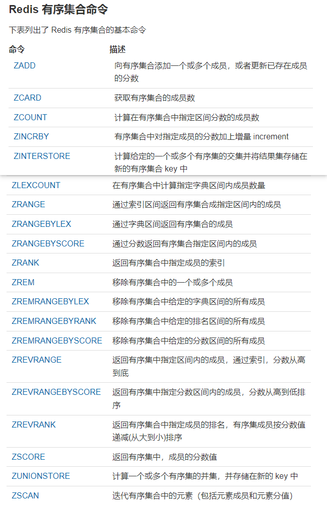

## 1 Redis简介
### 1.1 Redis是什么
Redis是数据储存在内存中的非关系型数据库，由于数据在内存中，其读写速度非常快，被广泛应用于缓存方向。

Redis 提供了多种数据类型来支持不同的业务场景。Redis 还支持事务 、持久化、Lua 脚本、多种集群方案。

### 1.2 Redis用来做什么
Redis 除了做缓存，还能做什么？
- 分布式锁 ： 通过 Redis 来做分布式锁是一种比较常见的方式。通常情况下，我们都是基于 Redisson 来实现分布式锁。。
- 限流 ：一般是通过 Redis + Lua 脚本的方式来实现限流。。
- 消息队列 ：Redis 自带的 list 数据结构可以作为一个简单的队列使用。Redis 5.0 中增加的 Stream 类型的数据结构更加适合用来做消息队列。它比较类似于 Kafka，有主题和消费组的概念，支持消息持久化以及 ACK 机制。
- 复杂业务场景 ：通过 Redis 以及 Redis 扩展（比如 Redisson）提供的数据结构，我们可以很方便地完成很多复杂的业务场景比如通过 bitmap 统计活跃用户、通过 sorted set 维护排行榜。

## 2 Redis常用的数据结构
### 2.1 键（Keys）

### 2.2 字符串 ( Strings )

### 2.3 哈希 ( Hashes )

### 2.4 列表 ( Lists )

### 2.5 集合 ( Sets )

### 2.6 有序集合 ( Sorted Sets )

### 2.7 HyperLogLog

### 2.8 地理信息GEO
Redis GEO 主要用于存储地理位置信息，并对存储的信息进行操作，该功能在 Redis 3.2 版本新增。

Redis GEO 操作方法有：
- geoadd：添加地理位置的坐标。
- geopos：获取地理位置的坐标。
- geodist：计算两个位置之间的距离。
- georadius：根据用户给定的经纬度坐标来获取指定范围内的地理位置集合。
- georadiusbymember：根据储存在位置集合里面的某个地点获取指定范围内的地理位置集合。
- geohash：返回一个或多个位置对象的 geohash 值。

### 2.9 BitMap数据结构
位图（也称为位数组或位向量）是由比特位（bit)组成的数组。

## 3 其他功能
### 3.1 发布订阅

### 3.2 事务

### 3.3 备份和恢复
- SAVE 命令用于创建当前 Redis 数据库的备份。此命令将通过执行同步 SAVE 在 Redis 目录中创建 dump.rdb 文件。
- 将 Redis 备份文件（dump.rdb）移动到 Redis 目录中并启动服务器，输入`CONFIG get dir`以恢复 Redis 数据。
- BGSAVE 是创建 Redis 备份的备用命令。此命令将启动备份过程并在后台运行。

## 4 Redis持久化
redis 提供了两种持久化的方式，分别是RDB（Redis DataBase）和AOF（Append Only File）。
### 4.1 RDB
RDB 方式，是将 redis 某一时刻的数据持久化到磁盘中，是一种快照式的持久化方法。

- 有两个命令可以生成RDB文件：
  - SAVE会阻塞Redis服务器进程，服务器不能接收任何请求，直到RDB文件创建完毕为止。
  - BGSAVE创建（fork）出一个子进程，由子进程来负责创建RDB文件，服务器进程可以继续接收请求。

- RDB的优点：载入时恢复数据快、文件体积小。
- RDB的缺点：会一定程度上丢失数据(因为系统一旦在定时持久化之前出现宕机现象，此前没有来得及写入磁盘的数据都将丢失。)

### 4.2 AOF
AOF是通过保存Redis服务器所执行的写命令来记录数据库的数据的。

- AOF的优点：丢失数据少(默认配置只丢失一秒的数据)。
- AOF的缺点：恢复数据相对较慢，文件体积大

### 4.3 AOF重写
aof中的大量记录都是冗余无效的，可以执行rewrite操作来精简体积提高效率
==>  rewrite aof

可以通过配置让redis自动定期对aof文件进行重写

AOF 重写可以产生一个新的 AOF 文件，这个新的 AOF 文件和原有的 AOF 文件所保存的数据库状态一样，但体积更小。

也可以用命令来触发aof重写：`BGREWRITEAOF`

在执行 BGREWRITEAOF 命令时，Redis 服务器会维护一个 AOF 重写缓冲区，该缓冲区会在子进程创建新 AOF 文件期间，记录服务器执行的所有写命令。当子进程完成创建新 AOF 文件的工作之后，服务器会将重写缓冲区中的所有内容追加到新 AOF 文件的末尾，使得新的 AOF 文件保存的数据库状态与现有的数据库状态一致。最后，服务器用新的 AOF 文件替换旧的 AOF 文件，以此来完成 AOF 文件重写操作。

### 4.4 持久化方式的选择
如果Redis服务器同时开启了RDB和AOF持久化，服务器会优先使用AOF文件来还原数据(因为AOF更新频率比RDB更新频率要高，还原的数据更完善)。

## 5 Redis 内存管理
### 5.1 给缓存数据设置过期时间
Redis 中除了字符串类型有自己独有设置过期时间的命令 setex 外，其他方法都需要依靠 expire 命令来设置过期时间 。另外， persist 命令可以移除一个键的过期时间。

过期时间除了有助于缓解内存的消耗。

### 5.2 如何判断数据是否过期
Redis 通过一个叫做过期字典（可以看作是 hash 表）来保存数据过期的时间。过期字典的键指向 Redis 数据库中的某个 key(键)，过期字典的值是一个 long long 类型的整数，这个整数保存了 key 所指向的数据库键的过期时间（毫秒精度的 UNIX 时间戳）。

### 5.3 过期的数据的删除策略
缓存数据TTL的删除策略可分为三种
- 定时删除(对内存友好，对CPU不友好)
到时间点上就把所有过期的键删除了。
- 惰性删除(对CPU极度友好，对内存极度不友好)
每次取键的时候，判断一下该键是否过期了，如果过期了就删除。
- 定期删除(折中)
每隔一段时间去检查及删除过期键，限制删除的执行时长和频率。
Redis的过期数据的删除策略：采用的是惰性删除+定期删除两种策略

仅仅通过给 key 设置过期时间还是有问题的。因为还是可能存在定期删除和惰性删除漏掉了很多过期 key 的情况。这样就导致大量过期 key 堆积在内存里，然后就 Out of memory 了。

这时就需要Redis 内存淘汰机制来解决这个问题。

### 5.4 Redis 内存淘汰机制
Redis 提供 6 种数据淘汰策略：
1. volatile-lru（least recently used）：从已设置过期时间的数据集（server.db[i].expires）中挑选最近最少使用的数据淘汰
2. volatile-ttl：从已设置过期时间的数据集（server.db[i].expires）中挑选将要过期的数据淘汰
3. volatile-random：从已设置过期时间的数据集（server.db[i].expires）中任意选择数据淘汰
4. allkeys-lru（least recently used）：当内存不足以容纳新写入数据时，在键空间中，移除最近最少使用的 key（这个是最常用的）
5. allkeys-random：从数据集（server.db[i].dict）中任意选择数据淘汰
6. no-eviction：禁止驱逐数据，也就是说当内存不足以容纳新写入数据时，新写入操作会报错。

4.0 版本后增加以下两种：
1. volatile-lfu（least frequently used）：从已设置过期时间的数据集（server.db[i].expires）中挑选最不经常使用的数据淘汰
1. allkeys-lfu（least frequently used）：当内存不足以容纳新写入数据时，在键空间中，移除最不经常使用的 key

## 6 Redis 生产问题
### 6.1 缓存穿透
缓存穿透说简单点就是大量请求的 key 根本不存在于缓存中，导致请求直接到了数据库上，根本没有经过缓存这一层。举个例子：某个黑客故意制造我们缓存中不存在的 key 发起大量请求，导致大量请求落到数据库。

解决的办法如下。
对不存在的数据，在缓存中保存一个空对象进行标记，防止相同 ID 再次访问 DB。不过有时这个方法并不能很好解决问题，可能导致缓存中存储大量无用数据。

使用 BloomFilter 过滤器，BloomFilter 的特点是存在性检测，如果 BloomFilter 中不存在，那么数据一定不存在；如果 BloomFilter 中存在，实际数据也有可能会不存在。非常适合解决这类的问题。

### 6.2 缓存击穿
就是某个热点数据失效时，大量针对这个数据的请求会穿透到数据源。

解决这个问题有如下办法。
可以使用互斥锁更新，保证同一个进程中的多个线程针对同一个数据不会并发请求到 DB，减小 DB 压力。

使用随机退避方式，失效时随机 sleep一个很短的时间，再次查询，如果失败再执行更新。

针对多个热点 key 同时失效的问题，可以在缓存时使用固定时间加上一个小的随机数，避免大量热点 key 同一时刻失效。

### 6.3 缓存雪崩
缓存在同一时间大面积的失效，后面的请求都直接落到了数据库上，造成数据库短时间内承受大量请求。
还有一种缓存雪崩的场景是：有一些被大量访问数据（热点缓存）在某一时刻大面积失效，导致对应的请求直接落到了数据库上。 
解决方法：
- 使用快速失败的熔断策略，减少 DB 瞬间压力；
- 使用主从模式和集群模式来尽量保证缓存服务的高可用。
实际场景中，这两种方法会结合使用。