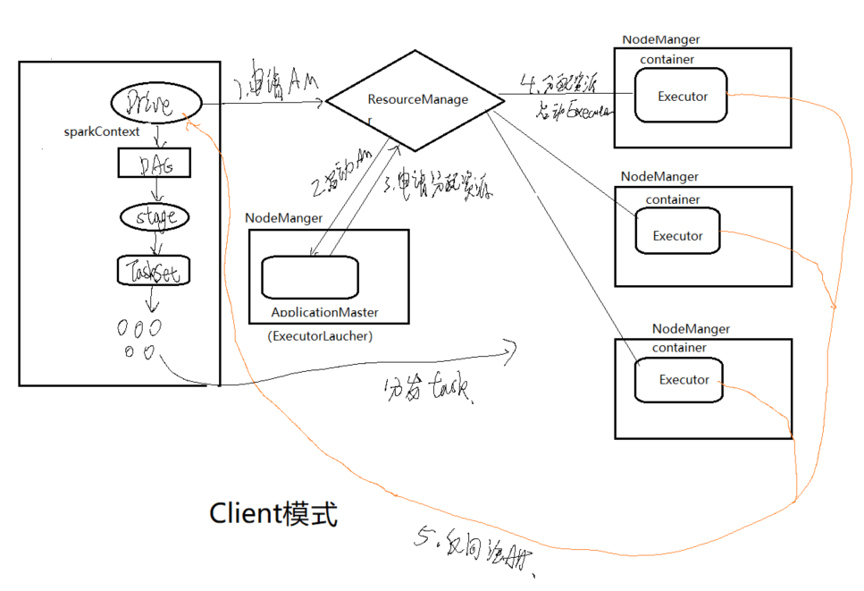
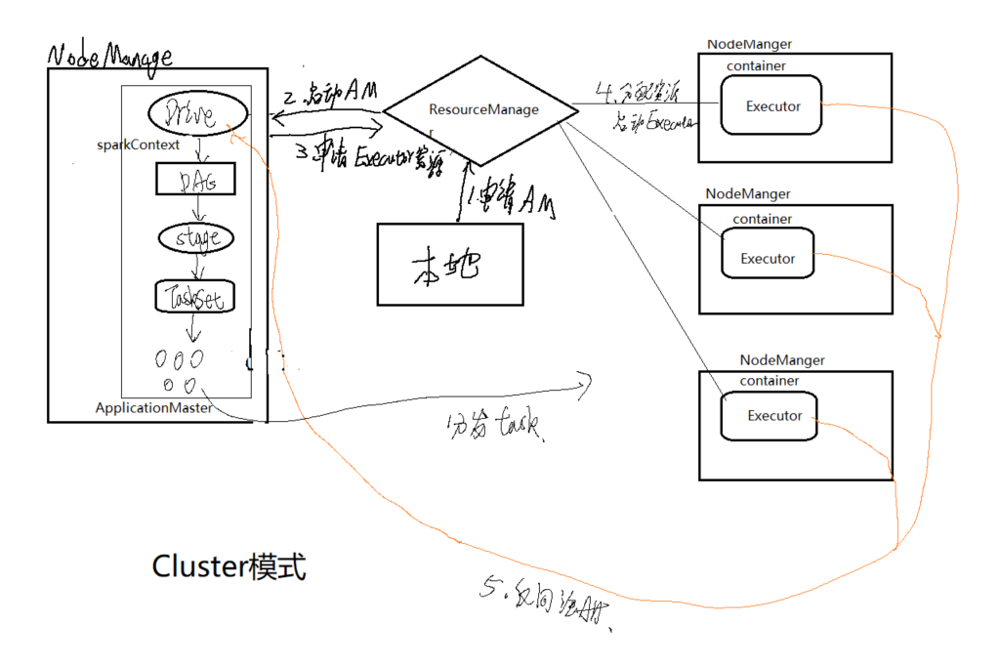
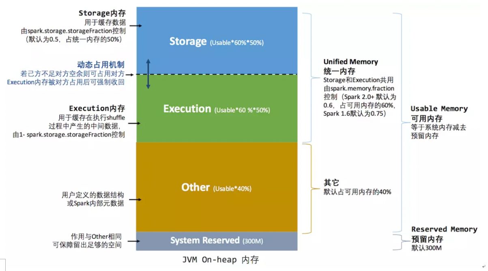

# Spark
## 1 Spark概述
### 1.1 Spark是什么
一种快速、通用、可扩展的大数据运算引擎。
### 1.2 Spark特点
- 可处理海量数据，且支持多种数据源；
- 支持多种编程语言，Java、python、scala、R；
- 上层API丰富且强大；
- 根据不同的计算场景提供了不同的处理组件；
- 底层架构高效且先进；
- 充分利用内存计算，运算速度快；
### 1.3 Spark的技术生态

- Spark Core：实现了 Spark 的基本功能，包含RDD、任务调度、内存管理、错误恢复、与存储系统交互等模块;
- Spark SQL：处理结构化数据,使用 SQL 操作数据；
- Spark Streaming：实时处理数据（微批次）；
- Spark GraphX:图计算组件，处理图结构数据；
- Spark MLlib：机器学习类库；
### 1.4 Spark与MaReduce的对比
1.MR只能做离线计算，如果实现复杂计算逻辑，需要将多个MR进行处理，会频繁读写HDFS，网络IO和磁盘IO会成为性能瓶颈，从而导致效率低下。
2.Spark既可以做离线计算，又可以做实时计算，提供了抽象的数据集（RDD、Dataset、DataFrame、DStream）
有高度封装的API，算子丰富，并且使用了更先进的DAG有向无环图调度思想，可以对执行计划优化后在执行，并且数据可以cache到内存中进行复用。
注意：MR和Spark在Shuffle时数据都落本地磁盘
**堪称一站式计算框架**
- MR编程模型单一  Spark编程模型丰富
- MR编程多次和磁盘网络交互  Spark优化磁盘和网络交互次数
- MR计算引擎稳定  Spark有时没有MR稳定
## 2 Spark编程入门
1. 导入maven依赖；
2. 配置spark编程环境；
    1. 获取SparkConf；
    2. 设置任务名与运行环境；
    3. 获取SparkContext上下文对象；
3. 读取文件生成RDD；
4. 编写计算流程；
5. 触发迭代计算，进行输入或储存；
6. 关闭资源。

```scala
object Demo01 {
  //设置控制台打印日志的日志级别
  Logger.getLogger("org").setLevel(Level.ERROR)
  def main(args: Array[String]): Unit = {
    // 1使用spark编程  首先  spark编程的入口 [环境]
    /**
     * SparkConf 用于用户的参数设置
     *  运行模式 job名
     */
    val conf = new SparkConf()
    /**
     * 程序运行必须设置运行模式
     *   conf.setMaster("local")  等同于  conf.set("spark.master", "")
     *  local       在本地使用一个核处理数据
     *  local[4]   在本地使用四个核处理数据
     */
    conf
      .setMaster("local")
      .setAppName("demo01")   // 设置程序名
    // conf.set("spark.master", "")
    val sc: SparkContext = new SparkContext(conf)

    // 2加载数据源
    /**
     * RDD 理解成 Iterator
     */
    val data: RDD[String] = sc.textFile("F://data//stu.txt")
    // 3计算逻辑 处理数据
    val res: RDD[String] = data.map(line => line + "hello")

    // 4输出结果 /存储到磁盘 /HDFS /mysql /打印
    res.foreach(println)
    // 回收环境
    sc.stop()
  }
}
```

## 3 Spark-core之RDD
### 3.1 RDD是什么
RDD是一个弹性分布式数据集，是spark计算逻辑的一个抽象，它并不储存需要处理的数据，而是记录数据计算流程的逻辑与依赖，其中中包含[分区表、依赖列表、与上一个rdd计算逻辑的封装]。
rdd由初始文件或上一个RDD经转化算子生成，下一RDD对上一RDD具有依赖关系，所以RDD在整体上具有血缘关系，当一个RDD丢失时可根据其父RDD恢复。
RDD之间并不进行数据处理，只有当RDD被行动算子触发时，才会进行迭代计算，对RDD向上进行溯源找到源文件，然后将整个计算逻辑构建成DAG图交由Task对数据进行并行处理。

弹性：1.分区数可变；2.高容错、可靠。

### 3.2 RDD编程
#### RDD的创建
1. 由本地内存中的集合直接创建；
2. 读取数据源、文件创建。

#### RDD的分区问题
##### RDD分区个数问题
对于RDD创建时，数据会分区进行处理，同一rdd内不同分区的数据具有相同的计算逻辑，最后被分配到不同的执行端进行处理。

- 从本地集合创建rdd时：
  1. 默认为所有可用核数；
  2. 设置spark编程环境选择运行模式时设置`conf.setMaster("local[*]")`，*为最大内核数；
  3. 执行`conf.set("spark.default.parallelism","n")`;
  4. 创建RDD时设置`sc.make(arr,n)`

优先级由上往下依次增高。

- 通过读取数据源、文件创建rdd时：
  1. 默认分区数为2；
  2. 创建RDD时设置。

##### 分区处理过程中的suffer问题
RDD转化过程中，RDD分区中的数据如果发生数据重排，将发生shuffle。
- 什么情况下将会产生shuffle:
  - 上游一个分区中的数据发送给下游中的多个分区；

##### 分区与Task
每个RDD中每个分区的计算逻辑是一样的，当RDD触发动作算子后，会将整个计算逻辑封装发送给Task对象，产生的Task数取决于分区数。

##### 自定义分区
```scala
    println("-------------------自定义分区--------------------------")
    val kvRdd2: RDD[(String, (String, String, String, String))] = stuRdd.map(e => {
      val arr = e.split(",")
      (arr(2), (arr(0), arr(1), arr(2), arr(3)))
    })
    // 新建分区器，设置传入参数（可以是数组或其他类型）
    val par2 = new MyPartioner2(3)
    // 传入分区器
    val grRdd3= kvRdd2.groupByKey(par2)

    grRdd3.mapPartitionsWithIndex((p,iter)=>{
      iter.map(tp=>{
        tp._2.map(stu=>(tp._1,stu,"分区号是" + p))
      })
    }).foreach(println)
```
**自定义分区器**
```scala
// 根据主键key进行分区
class MyPartioner2(numberPartitions:Int) extends Partitioner{
  override def numPartitions: Int = numberPartitions

  override def getPartition(key: Any): Int = {
    val v = key.asInstanceOf[String]
    if(v.equals("语文")){
      0
    }else if(v.equals("数学")){
      1
    }else{
      2
    }
  }
}
```

### 3.3 Spark-core常用算子
- mapPartitions(func)——对每个rdd的分区应用func函数
- mapPartitionsWithIndex(func)——类似mapPartitions，不同之处在于func可以接收到每个元素所属分区号
- sample(withReplacement, fraction, seed——返回一个随机采样的样本rdd
- union(otherDataset)——求并集
- intersection(otherDataset)——求交集
- distinct([numPartitions]))——去重
- groupByKey([numPartitions])——按key分组，将 (K, V)  RDD 转成： (K, Iterable<V>)RDD
Note: 如果分组后是为了做聚合(如：sum、average) ，则使用reduceByKey 或aggregateByKey将更加高效；
- reduceByKey(func, [numPartitions])_按key进行分组聚合；聚合结果必须与输入数据相同 v,v=>v
- aggregateByKey(zeroValue)(seqOp, combOp, [numPartitions])——按key进行分组聚合；聚合结果可以与输入数据类型不同. u,v=>u
- sortByKey([ascending], [numPartitions])——根据key排序

- RDD的第一次分区发生在RDD生成时，可以在随后使用`partitionBy`shuffer重新分区，此外在运行一些算子的时候也可以自定义重新分区。

### 3.4 闭包引用
#### 闭包是什么
函数可以访问函数外部定义的变量，但是函数内部对该变量进行的修改，在函数外是不可见的，即对函数外源变量不会产生影响。
spark中的闭包，指那些没有定义在算子作用域内部，却被算子处理和操作了的变量。

- 本地Driver与远程执行者Executor
集群模式下，Driver端将整个计算逻辑封装成task发送给远程端执行，计算发生在远程端，而Driver端与远程端并不是处在同一个JVM环境中，远程端中的变量相当于一个副本，与Driver端并不会产生关系。

#### 闭包引用的原理
在RDD触发行动算子以后，Driver端会进行闭包监测，确保被引用到的对象能被序列化，随后将这些对象序列化打包发送给Worker端，反序列化后供执行者使用。

注意：
  - 闭包引用的对象必须实现序列化接口;
  - 普通对象每个task一份，object对象整个executor只有一份（可能线程不安全）；
  - 计算逻辑内的新建对象不属于闭包。

### 3.5 广播变量
闭包并不适合传递太大的对象，一来耗费空间，二来影响效率。

应对这种情况可以使用广播变量（BitTorrent协议）：
1）当任务跨多个stage并且需要同样的数据时；
2）当需要以反序列化的形式来缓存数据时。

注意:
  - RDD不能被广播；
  - 广播只能在Driver端定义与修改；
  - 广播变量的值被修改以后需要重新广播

### 3.6 RDD缓存与累加器
#### RDD缓存
当多个job计算链条都需要使用同一个RDD的数据时，可以将该RDD的数据缓存起来，以供重复使用。

API：
  1) 缓存：cache() [内部是调用的persist(StorageLevel.MEMORY_ONLY)]
  2) 清除缓存：unpersist()

> RDD缓存所占的内存并不会和计算内存产生冲突，两者之间分离且有一个动态调整的机制。


### 3.7 累加器与自定义累加器
由于在task中操作闭包变量并无法对Driver端产生影响，所以如果要对计算的内容今天统计的话，需要使用累加器。

示例：使用累加器对单词出现的次数进行统计。
**自定义累加器**
```scala
//输入类型与输出类型
class Demo05_自定义累加器 extends AccumulatorV2[String, mutable.Map[String,Int]]{
  // 定义输出map
  var mp = mutable.Map[String, Int]()

  // 判断是否为初始值
  override def isZero: Boolean = mp.isEmpty

  // 复制方法
  override def copy(): AccumulatorV2[String, mutable.Map[String, Int]] = new Demo05_自定义累加器()

  // 清除方法
  override def reset(): Unit = mp.clear()

  // 每个分区的单词统计
  override def add(k: String): Unit = {
    val v = mp.getOrElse(k, 0)
    var cnt = v+1
    mp.put(k,cnt)
  }

  // 每个分区的map集合结果汇总
  override def merge(other: AccumulatorV2[String, mutable.Map[String, Int]]): Unit = {
    // 对其他分区的map依次进行遍历，结果汇总到mp中
    val taskMap = other.value
    taskMap.foreach(tp=>{
      val key = tp._1
      val value = tp._2
      var cnt = mp.getOrElse(key, 0)
      cnt += value
      mp.put(key,cnt)
    })
  }

  override def value: mutable.Map[String, Int] = mp
}

```

**累加器的使用**
```scala
object Demo05_Test {
  def main(args: Array[String]): Unit = {
    val sc = SparkUtil.getSparkContext("自定义累加器")

    // 导入数据，创建rdd
    val rdd = sc.textFile("data//word2.txt")

    // 创建累加器
    val a = new Demo05_自定义累加器
    // 注册累加器
    sc.register(a)

    rdd
      .flatMap(e=>{
      e.split("\\s+")
    })
      .foreach(word=>{
        // 在行动算子内对累加器进行操作
        a.add(word)
      })

    // 返回累加器结果
    val mp_cnt = a.value
    mp_cnt.foreach(println)
  }

}
```
### 3.8 RDD的深度理解
#### RDD的五大属性
**概要**
RDD对象中并不真实存储数据，而只是封装着“对数据读写操作的逻辑定义”：
- 本RDD的“数据”将从哪里去读
- 读进来的数据需要做什么样的运算；
- 算完的结果需要写到哪里去

RDD的本质，更像scala中的迭代器。

##### 1.compute计算函数
描述了本RDD是如何计算的，封装了父RDD数据的迭代器以及计算函数。

##### 2.依赖RDD列表
存储着当前RDD所依赖的一个或多个前序RDD

##### 3.分区列表
数据分区划分的列表
- 处理HDFS上的文件时，会按文件及偏移量范围划分partition，通常一个hdfs的block块对应一个partition
- 处理MySQL等数据库中的数据时，会按照用户指定的某个字段的取值范围和指定的分区数进行partition划分

> 面试题：处理MySQL数据库的数据时如何分区？
JdbcRDD有个参数可以指定分区，根据查询的数据量指定分区个数。

##### 4.[可选] key-value类型RDD的分区器
对RDD重新划分分区时使用

##### 5.[可选] 每个分区的首选计算执行位置
位置优先：移动任务优先于移动数据。（Executor>Worker>机架）

#### RDD的懒加载原理
Rdd转换算子的lazy原理，与scala的迭代器算子的lazy原理很类似

Scala迭代器算子：map/flatMap等，方法的内部实现只是创建了一个新的迭代器返回（并没有去调用迭代器的hasNext和next进行迭代计算）

Rdd的转换算子：map/flatMap等，方法的内部实现只是创建了一个新的RDD返回（并没有去调用RDD内部的迭代器的hasNext和next进行迭代计算）


## 4 Spark的job调度
RDD设计思想 ==>  scala迭代器“描绘”数据运算逻辑 + 分布式任务调度功能封装
### 4.1 分布式执行引入的问题
#### 任务分片
问题：当一个任务放置到多个节点上并行执行时会引发数据被重复计算的问题。

解决：所以引入任务分片机制，将数据分区交由对应task处理。

#### shuffer
上游数据需要分发给下游。
问题：当需要对多个分区内的不同数据进行汇总处理时，无法得出全局结果。

解决：将运算逻辑链划分成多个stage）每个stage形成独立task任务，上下游衔接借助数据的shuffle。

shuffle是spark用来在不同executors甚至机器之间重新分配数据的一种机制。
有些运算需要将各节点上的同一类数据汇集到某一节点进行计算，把这些分布在不同节点的数据按照一定的规则汇集到一起的过程称为 Shuffle。

#### 行动算子的重新设计
问题：在普通的scala迭代器中，一旦调用行动算子，则整个迭代器链条将立即执行。

解决：分布式运算模式下，将“行动算子”的功能改造成：对整个逻辑链条的分布式任务生成及提交、调度（即job调度）。

> sc.runJob 会把用户通过RDD定义的运算链，转化成一系列stage，及task计算任务并提交到集群执行；
> 1.	初始化job
> 2.	根据代码，判断哪里shuffer，划分阶段
> 3.	在各个阶段中，根据最后一个RDD的分区数据创建不同的task
> 4.	将task交给调度器，根据集群资源、数据位置合理分配task
> 5.	Task执行，针对目标数据的并行计算

### 4.2 RDD的血缘与依赖
- 相邻两个RDD的关系为依赖关系，新RDD依赖于旧RDD。
- 一连串的依赖关系称为血缘关系。

#### Dependency依赖关系
Dependency描述了父子血缘，也描述了父子RDD的分区间关系，并且Dependency也是判定是否需要划分stage（shuffle）的依据。

#### 窄依赖
指的是父 RDD 中的一个分区最多只会被子RDD 中的一个分区使用。
- 一对一依赖（OneToOneDependency）
- 范围依赖（RangeDependency）

#### 宽依赖
指的是父 RDD 的一个分区被子RDD的多个分区所依赖。

### 4.3 Job调度中的核心概念
- Application(应用)： 创建一个sparkContext，就生成了一个application；
- job:行动算子触发job，一个job就是一个DAG的运算流程（触发了一次sc.runJob() 就是一次job）；
- DAG:有向无环图，是一系列RDD转换关系的描述；
- Stage（阶段）：以shuffle为分界线，将DAG转换逻辑从整体切分为多个阶段；
- Task Set：每个阶段task的集合，数量为该stage最后一个RDD的分区数；
- task：本质上是一个类，封装了调用rdd迭代器的代码以及将计算结果输出的代码；

> Task在spark内部共有2种： shuffleMapTask 和  resultTask
最后一个stage所产生的task，是resultTask
其他stage所产生的task，都属于shuffleMapTask

### 4.4 分区的切片计算逻辑
当从文件导入数据创建RDD时，Spark文件进行分区的操作流程：
1. 调用hadoop的FileInputFormat的getSplits方法；
2. 计算切片大小，将切片规划信息封装进数组；
3. 根据切片信息数组创建分区。


### 4.5 Partition（分区）与Partitioner（分区器）
#### 分区
为了并行计算，将数据分为多块处理。

- RDD必有Partitions；
- 窄依赖的分区数一路传承不变；
- 宽依赖的分区数由传入的分区参数或父RDD最大分区数决定；

决定分区数的因素(见3.2)

#### 分区器
描述的是RDD的数据在各个分区之间的分布规则。

- RDD不一定有Partitioner；
- 源头RDD通过内在机制进行分区，无需分区器；
- 窄依赖子RDD分区依赖父RDD，分区器为None；
- 产生shuffle时需要分区规则，默认分区器为HashPartitioner；

宽依赖RDD的分区数与分区器判定：
1. 由算子传入分区数，分区器默认为HashPartitioner；
2. 由算子传入分区器；
3. 不传入分区数与分区器：
   1. 上游有分区器时：选上游最大分区器与其分区数；
   2. 上游没有分区器时:分区器为HashPartitioner,分区数为上游最大分区数。

### 4.6 缓存与checkpoint
RDD缓存与checkpoint都是对RDD的重复利用。

```scala
rdd.cache()
rdd.persist(StorageLevel.MEMORY_ONLY)

// 在进行RDD的检查点操作以前先设置检查点的路径 , 实际生产环境下将目录设置成HDFS目录 , 会自动创建
sc.setCheckpointDir("ck/data")
//设置RDD的检查点 ,当触发行动算子的时候会将RDD的数据缓存在指定的目录下 , 删除原来的RDD依赖关系
rdd.checkpoint()
```
#### 缓存
- 适用场景：数据量不大且后续经常要使用的结果；
- 缓存方式：使用cache()方法缓存到内存，使用persist()可设置缓存级别(cache调用persist)；
- 生命周期：随job结束而失效；
- 与RDD的关系：不改变依赖血缘关系(lineage)。
#### checkpoint
- 适用场景：数据量大或计算复杂且耗时长；
- 缓存方式：存于HDFS；
- 生命周期：持久化储存；
- 与RDD的关系：会切断血缘关系，生成新的checkpointRDD。

> cache 机制是每计算出一个要 cache 的 partition 就直接将其 cache 到内存了。
> 为了保证数据安全，在执行checkpoint的时候会生成两个Job,一个专门负责持久化的Job ,所以数据会加载两次。
为了能够提高效率，一般情况下，checkpoint前先cache，能提高checkpoint效率。

### 4.7 spark序列化
1) 闭包检查
在执行任务计算前，检测闭包内的对象是否可以进行序列化，称之为闭包检测。`val cleanF = sc.clean(f)`
2) 序列化方法和属性
从计算的角度, 算子以外的代码都是在 Driver 端执行, 算子里面的代码都是在 Executor端执行;
3) Kryo 序列化框架
Java 的序列化比较重，序列化后对象的提交也比较大。Spark使用另外一种 Kryo 序列化机制。
```scala
.set("spark.serializer",
"org.apache.spark.serializer.KryoSerializer")
// 注册需要使用 kryo 序列化的自定义类
.registerKryoClasses(Array(classOf[Searcher],...))

在spark-shell和spark-submit的时候
--conf spark.serializer=org.apache.spark.serializer.KryoSerializer
```

## 5 Spark程序分布式运行模式
>spark程序分布式运行的模式有很多种：
1. Standalone模式（Client/cluster）： 在spark Standalone集群上运行 
2. Yarn 模式（Client/cluster）：在yarn上运行
3. Mesos/k8s : 在mesos集群或者k8s集群上运行

### 5.1 spark 运行时主要角色
- SparkSubmit（进程）
应用提交的客户端程序

-	Driver（线程）  
含有SparkContext实例的那个线程
(功能：利用sparkcontext 做stage切分，生成taskset，调度task ,收集结果 , 广播数据 )

-	ApplicationMaster（进程）（yarn-cluster模式下有） 
类同于MapReduce中的MRAppMaster（local模式中是LocalJobRunner）
是yarn的规范中要求的用户程序的主管进程！
ApplicationMaster负责申请容器启动executor，及调用Driver线程的功能；

-	ExecutorLauncher（yarn-client模式下有）
作为一个简化的applictionMaster运行在容器中，只负责向RM申请容器申请启动executor；

-	Executor（进程）  
Executor是Task的具体执行者；
它负责调用task中的runTask方法来执行task的运算逻辑；
（executor是进程，task是被线程所调用的对象）

-	Task（对象）    
Task中就是封装了对FinalRDD的迭代器进行循环调用的逻辑；
Task分为ShuffleMapTask和ResultTask

#### Standalone集群搭建
1. 下载安装包解压；
2. 修改spark-env.sh,添加配置：
  > export JAVA_HOME=/opt/apps/jdk1.8.0_191/
  export HADOOP_CONF_DIR=/opt/apps/hadoop-3.1.1/etc/hadoop/
  export YARN_CONF_DIR=/opt/apps/hadoop-3.1.1/etc/hadoop/
3. 修改slaves文件，添加worker节点；
4. 修改一键启停脚本start/stop-all.sh为start/stop-spark.sh，避免与hadoop发生冲突；
5. 将安装包分发到其他节点；
6. 修改系统环境变量，添加SPARK_HOME与PATH路径；
7. 启动standalone集群。


### 5.2 Standalone集群
#### Standalone-Client模式

> 1. 任务提交后本地生成Driver，Driver创建一个SparkContext，由sc与Master通信，sc向Master注册并申请运行 Executor的资源；
> 2. Master找到可用的Worker，为其Executor分配资源，并启动Executor进程；
> 3. Executor向Driver反向注册；
> 4. Driver开始执行main函数，触发Action算子后，生成DAG；
> 5. DAG中根据shuffle阶段划分stage；
> 6. 每个stage根据其最后一个RDD的分区数产生相应数量的Task，每个stage一个TaskSet；
> 7. TaskSet交由任务调度器（TaskScheduler）处理，Executor向sc申请任务，任务调度器将Task分发给Executor运行，同时sc将应用程序代码发放给Executor；
> 8. Executor运行任务，反馈结果，运行完毕后写入数据并释放资源。

#### Standalone-Cluster模式

1. 任务提交后，Master 会找到一个 Worker 启动 Driver进程；
2. 后续步骤同上。

### 5.3 yarn集群
#### yarn-Client模式

> 1. 客户端提交一个Application，在客户端启动一个Driver进程；
> 2. Driver向ResourceManager发生请求启动Application；
> 3. RM收到请求，分配container，选择一台NodeManager启动AM；
> 4. 此时的 ApplicationMaster 的功能相当于一个ExecutorLaucher， 只负责向 ResourceManager申请 Executor 内存;
> 5. RM收到AM的资源分配请求后，分配container，在各个NodeManager启动相应的Executor进程；
> 6. Executor启动后，向Driver反向注册；
> 7. Executor注册完后，Driver开始执行main函数，执行到Action算子时触发job；
> 8. 生成DAG，根据宽窄依赖划分stage，生成对应的taskSet，将Task分发到各个Executor执行。


#### yarn-Cluster模式

> 1. 客户端提交一个Application，向ResourceManager发生请求启动Application；
> 2. RM收到请求，分配container，选择一台NodeManager启动AM；
> 3. 此时的 ApplicationMaster 就是 Driver,Driver 启动后向 ResourceManager 申请 Executor 内存;
> 4. 后续同上。

#### spark on yarn的两种模式区别
Client模式一般用于测试，这种情况下Driver端是运行在本地的，好处是可以本地调试方便。
Cluster一般用于生产环境，但是调试不方便，只能到Yarn上找log或者远程调试。
在Yarn中，每个Application实例都有一个ApplicationMaster进程，它是Application启动的第一个容器。它负责和ResourceManager打交道并请求资源，获取资源之后告诉NodeManager为其启动Container。

Cluster模式下，Driver运行在AM(Application Master)中，它负责向Yarn申请资源，并监督作业的运行状况。当用户提交了作业之后，就可以关掉Client，作业会继续在Yarn上运行，因而Cluster模式不适合运行交互类型的作业；

Client模式下，Application Master仅仅向Yarn请求Executor，Client会和请求的Container通信来调度他们工作，也就是说Client不能离开；
### 5.4 Standalone集群与yarn集群的区别
- 相同点
standalone是spark自身携带的资源管理框架，yarn是hadoop中的资源管理框架。都是对核心和内存进行管理和分配。
- 不同点
底层实现方式不一样。standalone是比较简单的资源管理，给application分配核心时，分配多少就占用多少，但核心和内存分配自由度大。而yarn是以container为单位分配的，粒度较粗，当然可以自行设置container中资源的大小。yarn中有fifo调度器，容量调度器，公平调度器这三种资源分配策略，可以动态实现资源的扩缩，更灵活，更重。
另外，spark可以集成的资源管理框架还有mesos，k8s。

## 6 job调度全流程（task调度）
> spark程序提交以后 , 根据提交模式在不同的位置创建Driver端 ,初始化sparkContext , 初始化Job , 创建DAG ,
> 划分阶段 , 封装TaskSet , 创建Task ,调度Task ! Driver将Task通过TaskScheduler分配到不同的Executor
> 上 , 在不同的Executor上反序列化创建Task实例, 以线程的形式运行当前Task , 如果是shuffleMapTask会有中间
> 结果,写出到本地磁盘 , 等待下游Task读取数据。


1) 构造并初始化SparkContext
2) 触发行动算子
3) 创建RDD构建DAG
4) 切分Stage，生成TaskSet
5) 提交stage
6) TaskScheduler发送Task
7) 在Executor中执行Task

### 6.1 stage的创建与提交
#### 源码


#### Stage的划分过程

> DAGScheduler从最后一个RDD开始，从后往前调用递归，判断该RDD与父RDD之间的依赖关系，如果是窄依赖，会继续向上递归，如果遇到宽依赖，则会由此断开，将这部分RDD划分为一个Stage，然后继续递归判断，直到第一个RDD，递归结束，stage划分完毕。随后DAGScheduler从前往后基于每个Stage生成TaskSet（set中的task数取决于每个stage中final rdd的分区数），并提交给TaskScheduler。
> Stage划分是从后往前划分，但是stage执行时从前往后的。
> 
> 
> 在根据shuffle切分stage后，DAGScheduler首先根据Final RDD，调用createResultStage方法来生成ResultStage，在提交resultStage之前，会检查是否有父Stage，如果有会先创建父shuffleMapStage，每个stage提交之前都会检查是否有父stage，有的话先创建父stage，没有的话就提交，形成了一个递归。
> 整体上看，stage的创建与提交是由下往上创建，由下往上提交。

### 6.2 task的调度

DAGScheduler划分stage之后将taskSet发送TaskScheduler中，TaskScheduler将task序列化，根据调度策略发给executor，Executor收到Task对象并反序列化后，会将Task包装成一个TaskRunner类以便放入线程池执行。

## 7 Shuffle
Shuffle分为Hash Shuffle和Sort Shuffle。Spark 1.2起默认使用Sort Shuffle，并且Sort Shuffle在map端有三种实现，分别是UnsafeShuffleWriter、BypassMergeSortShuffleWriter、SortShuffleWriter，根据运行时信息自动选择对应的实现。
[Spark HashShuffle与SortShuffle](https://blog.csdn.net/qq_33044969/article/details/122984280?ops_request_misc=%257B%2522request%255Fid%2522%253A%2522165789124416780357236413%2522%252C%2522scm%2522%253A%252220140713.130102334.pc%255Fall.%2522%257D&request_id=165789124416780357236413&biz_id=0&utm_medium=distribute.pc_search_result.none-task-blog-2~all~first_rank_ecpm_v1~rank_v31_ecpm-6-122984280-null-null.142^v32^new_blog_fixed_pos,185^v2^control&utm_term=sortshuffle&spm=1018.2226.3001.4187)


### 7.1 Hash Shuffle
HashShuffle 存在两个版本，未经优化的和已经优化的版本。合并机制主要是通过复用buffer来优化Shuffle过程中产生的小文件的数量。HashShuffle是不具有排序的Shuffle。
#### 普通机制的HashShuffle

Excecutor中的每个Task需要把数据进行Hash计算，分到3块缓存当中。然后Reducer再从每个Task中将编号与自己相等的缓存块的数据拉取过来，形成一个大的数据集。这里，每一个Task都会输出三个本地文件，一共4个Mapper Task，所以一共输出了12个本地小文件。

问题：shuffle前回产生海量小文件；读写磁盘时的对象过多可能导致OOM。

#### 合并机制的 HashShuffle

合并机制就是复用buffer，开启合并机制的配置是spark.shuffle.consolidateFiles，该参数的默认值为false，将其设置为true即可开启优化机制，通常来说，如果我们使用HashShuffleManager，那么就建议开启这个选项。
这里还是4个Tasks，数据类别还是3种类型，因为Hash算法会根据Key分类，在同一个进程中，无论有多少Task，都会把同样的Key写入到同一个Buffer中，然后把Buffer中的数据写入本地文件中。每一个Task所在的进程中，分别写入共同进程中的3份本地文件，这里有4个Mapper Tasks，所以一共输出2个cores × 3个分类文件 = 6个本地小文件。

问题：如果Reducer端的并行任务或者数据分片过多的话，Core核心数 × Reduce Task数依旧过大，也会产生很多小文件。

### 7.2 SortShuffle
Sort Shuffle在map端有三种实现，分别是UnsafeShuffleWriter、BypassMergeSortShuffleWriter、SortShuffleWriter。


- 运行时三种ShuffleWriter实现的选择
Spark根据运行时信息选择三种ShuffleWriter实现中的一种。


- 没有map端聚合操作，且RDD的Partition数小于200，使用BypassMergeSortShuffleWriter。
- 没有map端聚合操作，RDD的Partition数小于16777216，且Serializer支持relocation，使用UnsafeShuffleWriter。
- 上述条件都不满足，使用SortShuffleWriter。

#### Shuffle Writer机制

> Shuffle 分为 Shuffle Write 和 Shuffle Read 两个阶段，分别负责stage间数据的输出与输入。
> Shuffle Write 主要是生成 shuffle 中间文件的一个过程。在 shuffle 中间文件生成的过程中，Shuffle Writer 主要
> 承担的功能有：数据分区、聚合和排序 3 个功能。
> 当 Shuffle Write 输出了 shuffle 中间文件后，就到了 Shuffle Read 阶段。Shuffle Read 主要需要实现 3 个功
> 能：跨节点拉取数据，聚合和排序。
> 在Spark中有三种shuffle写，分别是BypassMergeSortShuffleWriter、UnsafeShuffleWriter、SortShuffleWriter。
> 不同shuffleWrite是根据shuffleHandle来决定的，在构建shuffleDependence时都会构建shuffleHandle，在registerShuffle方法中，会根据不同的条件判断使用不同的shuffleHandle。
> 

## 8 Spark内存管理机制
作为一个JVM进程，Executor的内存管理建立在JVM的内存管理之上，Spark对JVM的堆内（On-heap）空间进行了更为详细的分配，以充分利用内存。同时，Spark引入了堆外（Off-heap）内存，使之可以直接在工作节点的系统内存中开辟空间，进一步优化了内存的使用。 

### 堆内内存
默认情况下，Spark 仅仅使用了堆内内存。Executor 端的堆内内存区域大致可以分为以下四大块： 



### 堆外内存
相比堆内内存，堆外内存只区分 Execution 内存和 Storage 内存
 

堆外内存可以避免频繁的 GC，但是必须自己编写内存申请和释放的逻辑。

## 9 知识点整理
为什么要划分stage（调度阶段）？
> 由于一个job任务中可能有大量的宽窄依赖，由于窄依赖不会产生shuffle，宽依赖会产生shuffle。后期划分完stage
> 之后，在同一个stage中只有窄依赖，并没有宽依赖，这些窄依赖对应的task就可以相互独立的取运行。划分完stage之
> 后，它内部是有很多可以并行运行task。

---
如何划分stage？（宽依赖划分）
> 1）生成DAG有向无环图之后，从最后一个rdd往前推，先创建一个stage，它是最后一个stage。
> 2）如果遇到窄依赖，就把该rdd加入到stage中，如果遇到宽依赖，就从宽依赖切开，一个stage也就划分结束了。
> 3）后面重新创建一个新的stage，还是按照第二部操作继续往前推，一直推到最开始的rdd，整个划分stage也就结束了。

---
stage的内部逻辑
> 1）每一个stage中按照RDD的分区划分了很多个可以并行运行的task
> 2）把每一个stage中这些可以并行运行的task都封装到一个taskSet集合中
> 3）前面stage中task的输出结果数据 ，是后面stage中task输入数据

---
Application 、job、Stage、task之间的关系
> Application是spark的一个应用程序，它包含了客户端写好的代码以及任务运行的时候需要的资源信息。
> 后期一个application中有很多个action操作，一个action操作就是一个job，一个job会存在大量的宽依赖，后期会
> 按照宽依赖进行stage的划分，一个job又产生很多个stage，每一个stage内部有很多可以并行的task。

---
DAG与RDD的关系
> DAG是有向无环图，指的是数据转换执行的过程，是RDD的一个依赖关系和执行流程。RDD触发行动算子后就形成了DAG。

---
为什么计算引擎用spark而不用mr？
> 1.spark开发更便捷，多个stage可以串行执行，不需要像mr那样写多个程序；
> 2.RDD可以缓存，可以实现数据的复用，并提高容错。

---

