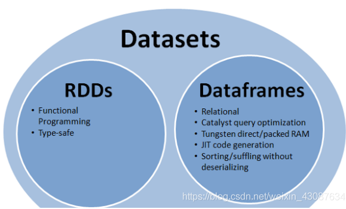
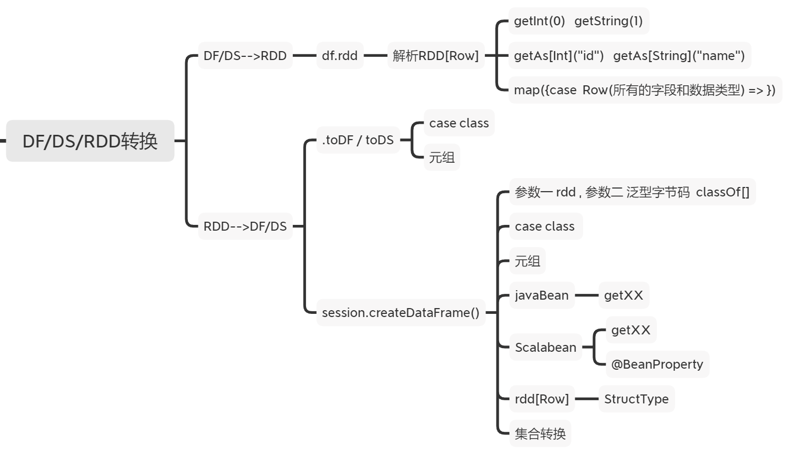
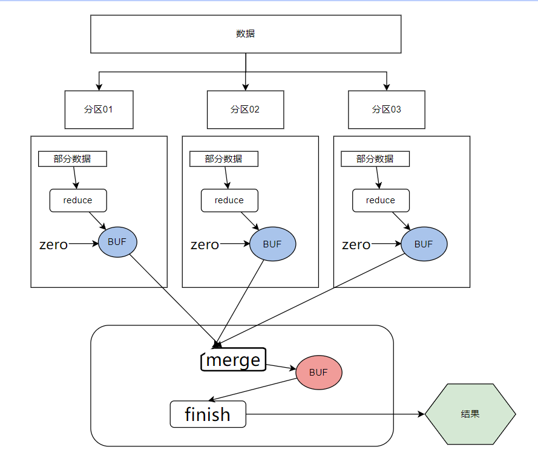
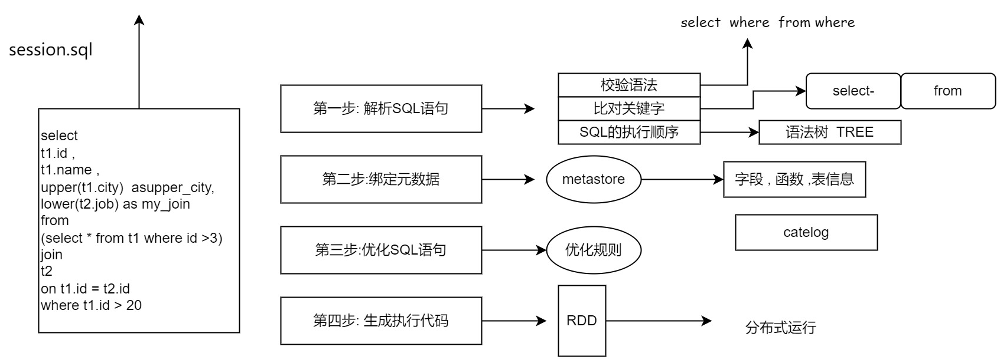

# Spark-SQL
## 1 概述
### Spark-SQL是什么
SparkSQL是Spark用于处理结构化数据的一个组件，它的编程抽象是DataFrame，可以理解为一个基于RDD数据模型并带有结构化元信息（schema）的数据模型。

### Spark-SQL的特性
- 易整合：可以在编程中混搭SQL和算子API；
- 统一的数据访问方式：为各类数据源提供统一的访问方式，可以跨数据源进行join。支持的数据源有Hive、CSV、Parquet、ORC、josn、JDBC等。
- 兼容Hive：支持HiveQL语法，并允许访问已经存在的Hive数仓数据；
- 标准的数据连接： 可以当作一个转换层，向下对接各种不同的结构化数据源，向上提供不同的数据访问方式。

## 2 DataFrame编程
> 我们使用sparksql加载结构化数据 返回Dataframe(DataSet) , 
> - 使用DF创建视图后就可以编写SQL分析处理数据
> - 在DF上还有类似于SQL的API select  where  groupBy  sum ....TableAPI 
> 
> SparkSQL编程其实就是对Dataframe进行编程

### 2.1 创建DataFrame-加载数据源
在Spark SQL中SparkSession是创建DataFrames和执行SQL的入口
创建DataFrames有三种方式：
1) 从一个已存在的RDD进行转换
2) 从JSON/Parquet/CSV/ORC等结构化文件源创建
1) 从Hive/JDBC各种外部结构化数据源（服务）创建

核心要义：创建DataFrame，需要创建 “RDD + 元信息schema定义” + 执行计划

#### 加载结构化数据
```scala
import org.apache.spark.sql.SparkSession

object Demo01_MakeDF_Csv {
  def main(args: Array[String]): Unit = {

    val session = SparkSession
      .builder()
      .master("local[*]")
      .appName("获取 spark-sql环境")
      .config("", "")
      // 添加对hive的支持
      // .enableHiveSupport()
      .getOrCreate()

    val df = session.read
    .option("header" , true)    // 加载有文件头的内容
    .option("inferSchema",true)     // 自动推导数据类型
    .csv("data/csv/Teacher2.csv")
     // 打印结构
    df.printSchema()
```

#### 自定义数据的schema
```scala
def main(args: Array[String]): Unit = {
  val session = SparkUtil.getSession
  // 根据结构化数据的结构  自定义  Schema
  val structType = new StructType()
    .add("tid" , DataTypes.LongType)
    .add("tname" , DataTypes.StringType)
    .add("tage" , DataTypes.IntegerType)
    .add("tgender",DataTypes.StringType)
    .add("tcity" , DataTypes.StringType)
  // 加载数据的时候指定schema信息
  val df = session.read.schema(structType).csv("data/csv/Teacher.csv")

  /**
   * root
   * |-- tid: long (nullable = true)
   * |-- tname: string (nullable = true)
   * |-- tage: integer (nullable = true)
   * |-- tgender: string (nullable = true)
   * |-- tcity: string (nullable = true)
   */

  // 打印默认的结构和数据
  df.printSchema()
```

#### DataTypes支持的数据类型
```scala
public static final DataType StringType;
public static final DataType BinaryType;
public static final DataType BooleanType;
public static final DataType DateType;
public static final DataType TimestampType;
public static final DataType CalendarIntervalType;
public static final DataType DoubleType;
public static final DataType FloatType;
public static final DataType ByteType;
public static final DataType IntegerType;
public static final DataType LongType;
public static final DataType ShortType;
public static final DataType NullType;
createArrayType
createDecimalType
createMapType
```

### 2.2 加载外部数据源
#### 加载MySQL 创建DF
1. 添加MySQL的依赖 
2. 有操作的MySQL中的表 
3. 编程

```scala
import java.util.Properties
import cn.doitedu.util.SparkUtil

object Demo02_MakeDF_MySQL {
  def main(args: Array[String]): Unit = {

    val session = SparkUtil.getSession
    /**
     * 参数一  JDBC 协议的url定位到数据库
     * 参数二   表名
     * 参数三   连接数据库的必要参数
     */
    val  uri = "jdbc:mysql://localhost:3306/demo"
    val  tableName = "tb_student"
    val props =  new Properties()
    props.setProperty("user" ,"root")
    props.setProperty("password" , "root")

    val df = session.read.jdbc(uri, tableName, props)
    df.printSchema()
    df.show()
    // 创建视图
    df.createTempView("tb")
    // 编写SQL  统计需求
    session.sql(
      """
        |select
        |*
        |from
        |tb
        |""".stripMargin).show()
  }
}
```

#### 加载hive中的表 创建DF
1. 导入MySQL的依赖
2. 导入spark和hive的整合依赖
   - core-site.xml  核心是 HDFS文件系统的地址
   - hive-site.xml  hive有关的信息  [元数据服务的地址]
   - hdfs-site.xml  从HDFS上加载数据  
3. 元数据服务启动 hohup hive --service metastore 1>/dev/null 2>&1 &

```scala
object Demo03_MakeDF_hive {
  Logger.getLogger("org").setLevel(Level.ERROR)
  def main(args: Array[String]): Unit = {

    val session = SparkSession
      .builder()
      .master("local[*]")
      .appName(this.getClass.getSimpleName)
      // 添加对hive的支持
      /**
       * 添加MySQL和spark-hive的依赖
       * 添加hive-site.xml   访问元数据服务
       *
       */
      .enableHiveSupport()
      .getOrCreate()
    /*val df = session.sql("show databases")
    val df = session.sql("show tables")*/
    val df = session.sql("select * from  default.tb_order")
    df.show()
  }
}
```

#### 由RDD转换成DF
```scala
package cn.doitedu.sql

import cn.doitedu.utils.SparkUtil
import org.apache.spark.rdd.RDD

case  class  Teacher(tid:Int , tName:String, tage:Int, tgender:String , tHeight:Long)
object Demo04_CreateDF_RDD_CaseClass {
  def main(args: Array[String]): Unit = {
    val session = SparkUtil.getSession
    // 获取RDD
    val sc = session.sparkContext

    val rdd: RDD[String] = sc.textFile("data/teacher/")
  // 加载数据  封装成RDD
    val caseClassRDD: RDD[Teacher] = rdd.map(line => {
      val arr = line.split(",")
      //2,星哥,46,M,180
      Teacher(arr(0).toInt, arr(1), arr(2).toInt, arr(3), arr(4).toLong)
    })
    /**
     * case class 有数据结构 属性名  属性数据类型
     */
    val df = session.createDataFrame(caseClassRDD)

    df.printSchema()
    df.show()

    session.close()

  }
}
```

## 3 DataFrame编程
### 3.1	加载数据源为DF
在Spark SQL中SparkSession是创建DataFrames和执行SQL的入口
创建DataFrames有三种方式：
(1)	从一个已存在的RDD进行转换
(2)	从JSON/Parquet/CSV/ORC等结构化文件源创建
(3)	从Hive/JDBC各种外部结构化数据源（服务）创建

### 3.2	DF数据运算操作
#### 纯SQL操作
核心要义：将DataFrame 注册为一个临时视图view，然后就可以针对view直接执行各种sql
临时视图有两种：session级别视图，global级别视图；
session级别视图是Session范围内有效的，Session退出后，表就失效了；
全局视图则在application级别有效；
注意使用全局表时需要全路径访问：global_temp.people

#### DSL风格API(TableApi)语法
DSL风格API，就是用编程api的方式，来实现sql语法
DSL：特定领域语言
dataset的tableApi有一个特点：运算后返回值必回到dataframe
因为select后，得到的结果，无法预判返回值的具体类型，只能用通用的Row封装

#### DataFrame/dataset的RDD风格算子
Dataset提供与RDD类似的编程算子，即map/flatMap/reduceByKey等等，不过本方式使用略少：
- 如果方便用sql表达的逻辑，首选sql
- 如果不方便用sql表达，则可以把Dataset转成RDD后使用 RDD的算子

### 3.3 RDD、DataFrmae和DataSet之间的关系和区别

#### RDD、DataFrmae和DataSet是什么
- RDD是一个懒执行的弹性分布式数据集，是spark计算逻辑的一个抽象，它并不储存需要处理的数据，而是记录数据计算流程的逻辑与依赖。
- DataFrmae是sql的编程抽象 , 本质就是对RDD的封装  在RDD上添加了数据结构信息  RDD + Schema。
- Dataset可以认为是DataFrame的一个特例，主要区别是Dataset每一个record存储的是一个强类型值而不是一个Row，DataFrame=Dataset[Row]。

#### 共性
- RDD、DataFrame、Dataset全都是spark平台下的分布式弹性数据集；
- 三者都有partition的概念；
- 三者有许多共同的函数，如filter，排序等；
- DataFrame和Dataset均可使用模式匹配获取各个字段的值和类型；

#### 三者的区别
- Dataset和DataFrame拥有完全相同的成员函数，区别是每一行的数据类型不同；
- RDD不支持sparksql操作，DataFrame与Dataset均支持sparksql的操作；
- 与RDD和Dataset不同，DataFrame每一行的类型固定为Row，只有通过解析才能获取各个字段的值；

## 4 RDD、DataFrmae和DataSet之间的相互转化

RDD、DataFrame、Dataset三者有许多共性，有各自适用的场景常常需要在三者之间转换
DF  DS 使用SQL处理   DSL风格处理 
DF  优先使用这个   统一的封装的数据结构  Row
DS  功能强         封装各种类型 
RDD 充分的使用coreRDD编程的灵活性

## 5 自定义函数
### 5.1 自定义UDF函数
```scala
    // 自定义函数
    val f = (username:String)=>{
      "Hello~"+username.toUpperCase
    }

    // 注册函数
    session.udf.register("add_hello",f)

    // 测试
    session.sql(
      """
        |select
        |       uid,
        |       add_hello(name) as h_name
        |from
        |       tb_user;
        |""".stripMargin).show()
```

### 5.2 自定义UDAF函数

```scala

    // 获取数据
    // 导入
    import org.apache.spark.sql.functions._
    df.show()
    // 创建视图
    df.createTempView("tb_user")

    /**
     * +---+----+---+------+
     * |uid|name|age|gender|
     * +---+----+---+------+
     * |  1| zss| 23|     M|
     * |  2| lss| 33|     M|
     * |  3|  ww| 21|     F|
     * +---+----+---+------+
     */

    // 注册UDAF函数
    session.udf.register("myavg",udaf(new MyAvgFunction))

    // 使用自定义聚合函数
    session.sql(
      """
        |select
        |       myavg(age) as avg_age
        |from
        |       tb_user;
        |""".stripMargin).show()

    /**
     * +------------------+
     * |           avg_age|
     * +------------------+
     * |25.666666666666668|
     * +------------------+
     */
  }
}

/**
 * 自定义聚合函数类
 * 泛型1   输入数据
 * 泛型2    中间的缓存数据
 * 泛型3   输出结果数据
 */
class MyAvgFunction extends Aggregator[Int,Buff,Double]{
  // 初始值
  override def zero: Buff = Buff(0,0)

  // 分区内计算逻辑
  override def reduce(b: Buff, a: Int): Buff = {
    val sum = b.sum+a
    val cnt = b.cnt + 1
    Buff(sum,cnt)
  }

  // 各分区的数据合并
  override def merge(b1: Buff, b2: Buff): Buff = {
    Buff(b1.sum+b2.sum,b1.cnt+b2.cnt)
  }

  // 最终计算结果
  override def finish(reduction: Buff): Double = {
    reduction.sum/reduction.cnt
  }

  /**
   * 这里是rdd  数据来自sql---rdd  返回sql
   * @return
   */
  override def bufferEncoder: Encoder[Buff] = Encoders.product

  override def outputEncoder: Encoder[Double] = Encoders.scalaDouble
}

case class Buff(sum:Double,cnt:Double)

```

## 6 Spark-SQL的核心运行原理

第一步 解析sql语句
第二步 绑定元数据
第三步 优化sql语句
第四步 生成执行代码

1. 使用parser解析器去解析sql语句 生成逻辑执行计划
2. analyzer绑定catalog元数据信息 生成绑定了元数据信息的逻辑执行计划
3. optimizer优化sql执行逻辑
4. planer执行物理执行计划
5. execution转成RDD

逻辑执行计划和物理执行计划的区别最大的在于是否绑定了元数据信息

B-S 网络要求高 类似于网页浏览 客户端更新了本地不用更新
C-S 内存要求高 例如游戏  客户端要更新,所有人都需要更新


sql 进来用parser先生成一个AST语法树 spark逻辑执行计划 
analyzer的exectuteAndCheck 

总结
1. sql进来会传入sqlparser 生成未绑定的逻辑执行计划的
2. 接着传入到Analyzer去绑定元数据信息catalog,得到绑定了元数据信息的逻辑执行计划,根据计划生成了一个DataSet返回
3. 再传入到optimizer中去优化
4. 最后放到planner里生成物理执行计划
5. 里面的execute触发了getByteArrayRDD,生成 doCodeGen 和 inputRDDS
6. doCodeGen对代码进行编译,反射,实例化,生成了一个包含stage的计算逻辑的迭代器,而inputRDDS用mappartitionswithindex将迭代器传入里面得到一个RDD