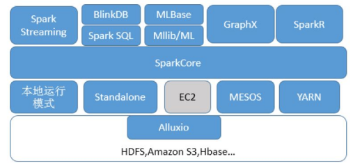

# Spark
## 1 Spark概述
### 1.1 Spark是什么
一种快速、通用、可扩展的大数据运算引擎。
### 1.2 Spark特点
- 可处理海量数据，且支持多种数据源；
- 支持多种编程语言，Java、python、scala、R；
- 上层API丰富且强大；
- 根据不同的计算场景提供了不同的处理组件；
- 底层架构高效且先进；
- 充分利用内存计算，运算速度快；
### 1.3 Spark的技术生态

- Spark Core：实现了 Spark 的基本功能，包含RDD、任务调度、内存管理、错误恢复、与存储系统交互等模块;
- Spark SQL：处理结构化数据,使用 SQL 操作数据；
- Spark Streaming：实时处理数据（微批次）；
- Spark GraphX:图计算组件，处理图结构数据；
- Spark MLlib：机器学习类库；
### 1.4 Spark与MaReduce的对比
1.MR只能做离线计算，如果实现复杂计算逻辑，需要将多个MR进行处理，会频繁读写HDFS，网络IO和磁盘IO会成为性能瓶颈，从而导致效率低下。
2.Spark既可以做离线计算，又可以做实时计算，提供了抽象的数据集（RDD、Dataset、DataFrame、DStream）
有高度封装的API，算子丰富，并且使用了更先进的DAG有向无环图调度思想，可以对执行计划优化后在执行，并且数据可以cache到内存中进行复用。
注意：MR和Spark在Shuffle时数据都落本地磁盘
**堪称一站式计算框架**
- MR编程模型单一  Spark编程模型丰富
- MR编程多次和磁盘网络交互  Spark优化磁盘和网络交互次数
- MR计算引擎稳定  Spark有时没有MR稳定
## 2 Spark编程入门
1. 导入maven依赖；
2. 配置spark编程环境；
    1. 获取SparkConf；
    2. 设置任务名与运行环境；
    3. 获取SparkContext上下文对象；
3. 读取文件生成RDD；
4. 编写计算流程；
5. 触发迭代计算，进行输入或储存；
6. 关闭资源。

```scala
object Demo01 {
  //设置控制台打印日志的日志级别
  Logger.getLogger("org").setLevel(Level.ERROR)
  def main(args: Array[String]): Unit = {
    // 1使用spark编程  首先  spark编程的入口 [环境]
    /**
     * SparkConf 用于用户的参数设置
     *  运行模式 job名
     */
    val conf = new SparkConf()
    /**
     * 程序运行必须设置运行模式
     *   conf.setMaster("local")  等同于  conf.set("spark.master", "")
     *  local       在本地使用一个核处理数据
     *  local[4]   在本地使用四个核处理数据
     */
    conf
      .setMaster("local")
      .setAppName("demo01")   // 设置程序名
    // conf.set("spark.master", "")
    val sc: SparkContext = new SparkContext(conf)

    // 2加载数据源
    /**
     * RDD 理解成 Iterator
     */
    val data: RDD[String] = sc.textFile("F://data//stu.txt")
    // 3计算逻辑 处理数据
    val res: RDD[String] = data.map(line => line + "hello")

    // 4输出结果 /存储到磁盘 /HDFS /mysql /打印
    res.foreach(println)
    // 回收环境
    sc.stop()
  }
}
```

## 3 Spark-core之RDD
### 3.1 RDD是什么
---
RDD是一个弹性分布式数据集，是spark计算逻辑的一个抽象，它并不储存需要处理的数据，而是记录数据计算流程的逻辑与依赖，其中中包含[分区表、依赖列表、与上一个rdd计算逻辑的封装]。
rdd由初始文件或上一个RDD经转化算子生成，下一RDD对上一RDD具有依赖关系，所以RDD在整体上具有血缘关系，当一个RDD丢失时可根据其父RDD恢复。
RDD之间并不进行数据处理，只有当RDD被行动算子触发时，才会进行迭代计算，对RDD向上进行溯源找到源文件，然后将整个计算逻辑构建成DAG图交由Task对数据进行并行处理。

### 3.2 RDD编程
#### RDD的创建
1. 由本地内存中的集合直接创建；
2. 读取数据源、文件创建。

#### RDD的分区问题
##### RDD分区个数问题
对于RDD创建时，数据会分区进行处理，同一rdd内不同分区的数据具有相同的计算逻辑，最后被分配到不同的执行端进行处理。

- 从本地集合创建rdd时：
  1. 默认分区为1；
  2. 设置spark编程环境选择运行模式时设置`conf.setMaster("local[*]")`，*为最大内核数；
  3. 执行`conf.set("spark.default.parallelism","n")`;
  4. 创建RDD时设置`sc.make(arr,n)`

优先级由上往下依次增高。

- 通过读取数据源、文件创建rdd时：
  1. 默认分区数为2；
  2. 创建RDD时设置。

##### 分区处理过程中的suffer问题
RDD转化过程中，RDD分区中的数据如果发生数据重排，将发生shuffle。
- 什么情况下将会产生shuffle:
  - 上游一个分区中的数据发送给下游中的多个分区；

##### 分区与Task
每个RDD中每个分区的计算逻辑是一样的，当RDD触发动作算子后，会将整个计算逻辑封装发送给Task对象，产生的Task数取决于分区数。

##### 本地Driver与远程执行者Executor
对于计算时变量的闭包无效的原因：
在集群模式下，Driver将生成的task发生给远程端Executor执行，执行者运行在不同的JVM环境下，其中闭包的变量相当于一个副本，其产生的变化不会对本地产生影响。
如果想让一个变量在全局产生作用，使用全局累加器。