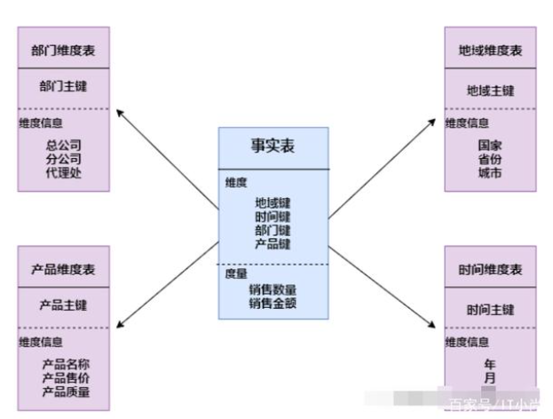

# 第二篇 数据模型篇
## 第八章 大数据领域建模综述
### 8.1 为什么需要数据建模
- 数据模型就是数据组织和存储方法，它强调从业务、数据存取和使用角度合理存储数据。
- 数据建模的目的就是进行有序、有结构的分类和存储数据。

### 8.3 从 OLTP 和 OLAP 系统的区别看模型方法论的选择
OLTP 系统通常面向的主要数据操作是随机读写，主要采用满足3NF 的 实体关系模型存储数据，从而在事务处理中解决数据的冗余和一致性问题。
而 OLAP 系统面向的主要数据操作是批量读写，事务处理中的一致性不是 OLAP 所关注的，其主要关注数据的整合，以及在一次性的复杂大数据查询和处理中的性能，因此它需要采用一些不同的数据建模方法。

###　8.4 典型的数据仓库建模方法论
**数据库设计步骤**
数据库的设计分为以下3个步骤：

- 设计概念模型(conceptual model)。在关系型数据库中，我们使用ER图来进行概念模型的设计。ER图的作用是：表示出各个实体之间的关系，方便在下一步的逻辑模型设计时书写相应的代码。
- 设计逻辑模型(logical model)。在这一步中，我们需要将人可以读懂的ER模型转化为机器可以读懂的逻辑模型，即我们需要书写数据库模式(SQL schema)来实现我们的模型。
- 物理模型设计(physical model)。物理模型关乎于数据库在储存器中如何存放，这一步的实现交由数据库管理系统(DBMS)进行。

**数据库设计三大范式**
第一范式(确保每列保持原子性)；
第二范式(确保表中的每列都和主键相关)；
第三范式(确保每列都和主键列直接相关,而不是间接相关)；
> 第一范式（1NF）：要求数据库表的每一列都是不可分割的原子数据项。
第一范式是最基本的范式。如果数据库表中的所有字段值都是不可分解的原子值，就说明该数据库表满足了第一范式。
第二范式（2NF）：第二范式需要确保数据库表中的每一列都和主键相关，而不能只与主键的某一部分相关（主要针对联合主键而言）。
在1NF的基础上，非码属性必须完全依赖于候选码（在1NF基础上消除非主属性对主码的部分函数依赖）
第三范式（3NF）：第三范式需要确保数据表中的每一列数据都和主键直接相关，而不能间接相关。
在2NF基础上，任何非主属性不依赖于其它非主属性（在2NF基础上消除传递依赖）
#### 8.4.1 ER 模型（范式模型）
ER(实体联系)模型中有三个主要的概念：实体集、属性、联系集。
- 实体集对于数据库中的一个表，一个视图对应表中的一行；
- 一个属性对应数据库表中的一列，也就是一个字段；
- 联系集是表与表之间的联系
  - 一对一关联：两表间实体一对一对应；
  - 一对多：主表一个实体对应从表多条实体；
  - 多对多：多对多关联需要一个中间表，两张表和中间表分别形成一对多关系。

ER模型建模分三个阶段：
- 高层模型：是一个高度抽象的模型，描述主要的主题与主题间的关系；
- 中层模型：在高层模型基础上对主题的细化；
- 物理模型（底层模型）：在中层模型的基础上，考虑物理存储与性能的设计，以及进行表的合并、分区设计。

应用场景：
- ER模型是数据库设计的理论基础，当前几乎所有的OLTP系统设计都采用了这种建模方式；
- Bill Inom提出的数仓理论推荐采用ER关系模型建模；
- 数仓分层架构的ODS、DWD也大多采用ER关系模型设计。
#### 8.4.2 维度模型
维度建模按数据组织类型划分可分为星型模型、雪花模型、星座模型。

维度建模四个步骤：选择业务处理过程 > 定义粒度 > 选择维度 > 确定事实。
**星型模型**
星型模型主要是维表和事实表，以事实表为中心，所有维度直接关联在事实表上，呈星型分布。

**雪花模型**
雪花模型，在星型模型的基础上，维度表上又关联了其他维度表。这种模型维护成本高，性能方面也较差，一般不建议使用。尤其是基于hadoop体系构建数仓，减少join就是减少shuffle，性能差距会很大。

**星座模型**
星座模型，是对星型模型的扩展延伸，多张事实表共享维度表。在业务发展后期，绝大部分维度建模都采用的是星座模式。

#### 8.4.3 Data Vault 模型
DataVault由Hub（关键核心业务实体）、Link（关系）、Satellite（实体属性） 三部分组成 ，是一种模型方法论，它是在ER关系模型上的衍生，同时设计的出发点也是为了实现数据的整合，并非为数据决策分析直接使用。
#### 8.4.4 Anchor 模型
Anchor模型是高度可扩展的模型，所有的扩展只是添加而不是修改，因此它将模型规范到6NF，基本变成了K-V结构模型。企业很少使用。

### 8.5 数据模型的评价标准
- 业务过程清晰：ODS就是原始信息，不修改；DWD面向基础业务过程；DIM描述维度信息；DWS针对最小场景做指标计算；ADS也要分层，面向跨域的建设，和面向应用的建设；
- 指标可理解：按照一定业务事务过程进行业务划分，明细层粒度明确、历史数据可获取，汇总层维度和指标同名同义，能客观反映业务不同角度下的量化程度；
- 核心模型相对稳定：如果业务过程运行的比较久，过程相对固定，就要尽快下沉到公共层，形成可复用的核心模型；
- 高内聚低耦合：各主题内数据模型要业务高内聚，避免在一个模型耦合其他业务的指标，造成该模型主题不清晰和性价比低。

## 9 阿里巴巴数据整合及管理体系
### 9.2 规范定义
#### 名词术语

### 9.3 模型设计
#### 指导理论
以维度建模为基础

#### 模型层次
阿里巴巴的表数据模型分为三层 ：操作数据层（ ODS ）、公共维度模型层（ CDM ）和应用数据层（ ADS ）， 其中公共维度模型层包括明细数据层（ DWD ）和汇总数据层（ DWS ）。

- 操作数据层（ ODS ）：把操作系统数据几乎无处理地存放在数据仓库系统中。
- 公共维度模型层（ CDM ）：存放明细事实数据、维表数据及公共指标汇总数据 ， 其中明细事实数据、维表数据一般根据 ODS 层数据加工生成 ：公共指标汇总数据一般根据维表数据和明细事实数据加工生成。CDM 层又细分为 DWD 层和 DWS 层。
- 应用数据层（ ADS ）：存放数据产品个性化的统计指标数据，根据CDM 层与 ODS 层加工生成 。

#### 基本原则
1. 高内聚和低辑合
一个逻辑或者物理模型由哪些记录和字段组成，应该遵循最基本的软件设计方法论的高内聚和低藕合原则。主要从数据业务特性和访问特性两个角度来考虑 ：将业务相近或者相关、粒度相同的数据设计为一个逻辑或者物理模型；将高概率同时访问的数据放一起 ，将低概率同时访问的数据分开存储。
2. 核心模型与扩展模型分离
建立核心模型与扩展模型体系，核心模型包括的宇段支持常用的核心业务，扩展模型包括的字段支持个性化或少量应用的需要 ，不能让扩展模型的宇段过度侵人核心模型，以免破坏核心模型的架构简洁性与可维护性。
1. 公共处理逻辑下沉及单一
越是底层公用的处理逻辑越应该在数据调度依赖的底层进行封装与实现，不要让公用的处理逻辑暴露给应用层实现，不要让公共逻辑多处同时存在。
4. 成本与性能平衡
适当的数据冗余可换取查询和刷新性能，不宜过度冗余与数据复制。
5. 数据可回滚
处理逻辑不变，在不同时间多次运行数据结果确定不变。
6. 一致性
具有相同含义的字段在不同表中的命名必须相同，必须使用规范定义中的名称。
7. 命名清晰、可理解
表命名需清晰、一致，表名需易于消费者理解和使用。

### 9.4 模型实施