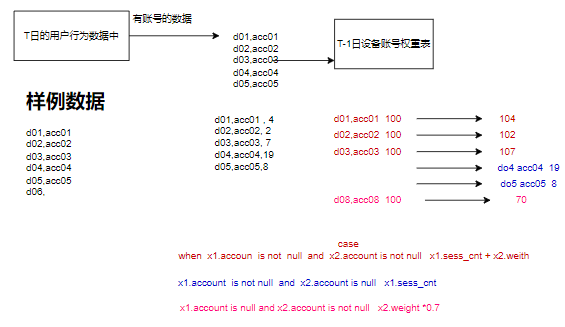

# DataW
## 1 项目综述
### 1.1 项目背景
为了高效利用现有业务产生的业务数据与平台采集的用户行为数据，帮助运营人员更精准的制定营销策略，进行精细化运营，以提升产品营销转化率、增加用户黏度，提高盈利水平。

### 1.2 项目意义
1. 数据的可视化直观的展现了公司的运营状况，使运营人员得以准确的制定营销策略；
2. 通过对用户行为的分析，对用户进行精准推送；
3. 改善公司的运营流程，比如说公司推出了一个优惠券抢购的活动，流程是点击链接》进入活动》登陆注册》抽奖》领取优惠劵》下单，将这个活动的用户行为数据采集转化后进行漏斗分析，发现登陆注册到抽奖这一步转化比有异常，分析认为是登陆环节影响了用户体验，于是调整活动流程，将登陆注册这一步换到领取优惠券后面，调整后再次进行漏斗分析，转化率得到了明显提升。

### 1.3 数据来源
- 采集业务系统的日志服务器上的用户行为数据；
  - 前端埋点
  - 后端埋点
- 抽取业务系统的联机业务数据库MySQL中的业务表数据；
- 从第三方数据结构获取的外部数据；
- 爬虫爬取的数据。

### 1.4 项目需求
1. 各个平台用户行为数据采集
2. 业务数据迁移
3. 各个类型数据,预处理
4. 数据仓库设计和建模
5. 主题分析:页面, 用户,设备,地域,事件,订单,流量等各个主题分析
6. 报表统计 / 报表数据展示
7. 即系查询分析,实时指标分析
8. 元数据管理,数据质量检测
9. 任务调度,告警
10. 用户画像

### 1.5 技术选型
- 数据采集系统: Flume , Sqoop
- 数据存储: Mysql , HDFS ,Hbase
- 数据计算: Hive ,Spark
- 资源调度系统: Yarn
- 快速查询: Presto    快速查询
- 数据看台: SuperSet  展示数据
- 任务调度:  DolphinScheduler    azkaban 
- 元数据管理: Atlas 

### 1.6 项目架构和项目流程

> 页面端与客户端通过埋点收集用户行为数据，存储在日志服务器，业务系统产生的业务数据存储在MySQL数据库，两种数据分别通过flume、sqoop拉取到数据仓库的数据接入层。数据仓库用hdfs做存储，用hive做数仓整体的管理，用spark做底层运算引擎。
> 数仓的ODS层首先会拉取映射进来的数据，经预处理(去重、清洗、集成、session分割、统一字段名与数据类型)后，传入DWD数仓明细宽表层，然后对数据进行建模后传入DWS数仓服务层，对DWS层的数据进行报表开发后再传入ADS应用层，供数据服务层拉取使用。
- 数据采集汇聚层、数据计算层、数据服务层，详细见综合项目背诵稿。

### 1.7 核心概念
#### 什么是数仓
数仓顾名思义就是存储数据的仓库，是一个为数据分析而设计的企业级数据管理系统，它可以集中、整合多个信息源的大量数据，将数据有规则的进行组织与存储，使我们可以借助数据仓库对其中的数据进行分析，从而改进企业的运营决策。

**数仓与数据库区别**
数据库是为捕获数据而设计，数据仓库是为分析数据而设计。
数据仓库是面向历史的,不仅仅是为了存储,管理 , 计算数据, 根据业务构建仓库系统, 针对具体的业务需求设计 ,功能丰富；
数据库(mysql , hbase , redis)是面向业务的， 具有单一性和通用性, 针对业务的数据进行存储和使用。

#### 什么是主题

#### 什么是分层

#### 什么是度量/指标
根据需求得出度量。
度量是一个可以量化衡量的值（指标）（100个、100天）。
#### 什么是维度
统计度量时的约束或者角度。
#### 业务、业务系统、业务流程

### 1.8 数仓构建流程
定义维度->构建总线矩阵-明确维度-> 明确度量
按照事务型事实表的设计流程，选择业务过程->声明粒度->确认维度->确认事实

## 2 日志数据采集
flume是一个分布式、可靠、 高可用的海量日志采集、汇聚和传输的系统，可以从各种各样的数据源（服务器）上采集数据传输（汇聚）到大数据生态的各种存储系统中（Hdfs、hbase、hive、kafka）。

### 2.1 flume核心组件
Flume中最核心的角色是agent，每一个Agent都是一个独立的守护线程（JVM），负责从数据源接收数据发送到目的地，一个个agent连接起来形成flume采集系统。

每一个agent相当于一条数据(被封装成Event对象)传递员，内部有3个核心组件： 
- Source：数据源组件，用于跟数据源对接，获取数据； 
- Channel：传输通道组件（缓冲区），用于协调和解耦source & sink；
- Sink：下沉组件，用于往下一级agent传递数据或者向最终存储系统传递数据。

### 2.2 agent内部架构

#### Event
Event是数据在agent内部流转的封装形式，Event封装对象主要有两部分组成：Headers和Body。header是一个map集合于携带KV形式的元数据；body是一个装载具体的数据内容的字节数组byte[]。

#### interceptor拦截器
Flume在运行时，可以通过拦截器来实现对Event进行修改或丢弃。
source产生的event会被传入拦截器根据需要进行拦截处理，且拦截器可以组成拦截器链，
同时用户也可以自定义拦截器。

> 自定义拦截器的应用：
> 使用本机的当前时间语义创建的目录 , 可能和数据的时间不一致，比如第一天23:59:59产生的日志数据传入本机后被划分
> 到第二天，这时可以自定义拦截器 , 抽取日志中的时间戳 , 转换成指定的时间格式, 将时间存储在事件(Event)头中,据此
> 进行存储。

#### channel selector
一个source可以对接多个channel，则event在这n个channel之间传递的策略，由配置的channel selector决定；  
channel selector有2中实现： replicating（复制），multiplexing（多路复用） 

#### sink processor
event在一个组中的多个sink间如何传递，则由所配置的sink processor来决定；
sink processor有2种： load balance (round robing)和 fail over 
flume安装入门

### 2.3 Transaction：事务机制（数据传递语义）
数据传递的三个语义：
-  At least once  至少处理一次
-  At most once  最多处理一次（可能多采，不会漏采）
- Exactly once    精准处理一次
Flume并没有实现Exactly once
Flume使用两个独立的事务：
-  put操作：source读取数据源并写入event到channel
-  take操作：sink从channel中获取event并写出到目标存储

**容量关系**
batchSize: 每个Source和Sink都可以配置一个batchSize的参数。这个参数代表一次性到channel中put|take 多少个event!
batchSize <= transactionCapacity
transactionCapacity： putList和takeList的初始值
capacity： channel中存储event的容量大小
batchSize <= transactionCapacity <= capacity
transactionCapacity <= capacity

### 2.4 采集集群配置
#### 自定义拦截器使用日志时间
需求：保证指定日期的数据落在当前日期的文件夹下。
实现：自定义拦截器，抽取行为数据中事件数据的时间戳 , 转换成年月日存储在Header中 
1. 添加flume依赖；
2. 定义一个类，实现Interceptor接口；
3. 实现四个方法：initialize、Event intercept、List intercept、close，方法的作用分别是初始化拦截器、拦截每条事件处理、处理所有事件、拦截器结束；
4. 创建一个静态内部类拦截器构建器，因为自定义拦截器的类无法直接new，需要通过flume配置文件调用静态内部类，来间接地调用自定义的拦截器对象；
5. 打包上传到flume所在服务器上的flume/lib下；
6. 配置拦截器。

#### 级联
在实际生产中我们的日志服务器和HDFS集群之间是不能直接访问的，为了保证集群的安全性,可以使用中间层服务器(跳板机)连接通信。

avro传输采用压缩的方式，压缩比为6（0-9）

#### failover模式
在上游配置多个sink , 组成一个失败会自动切换的sink组，同一个sink组中的sink根据配置的sink优先级来进行日志采集﹒优先级别高的sink作为主sink进行处理数据，优先级低的sink作为备用sink。当主sink出现故障时,channel负责切换到备用sink上.在数据采集的过程中会不断地尝试主sink是否恢复。

#### 提升HDFS并发
通过配置选择器，使一个source对接多个channel，实现负载均衡多路复用，多个sink并行执行，提高写hdfs的效率。

采集到HDFS的数据需要以gzip或gz压缩格式储存(log类型hive无法识别数据)，同时agent脚本要设置压缩格式
后缀根据文件的类型
a1.sinks.k1.hdfs.fileSuffix = .gz
a1.sinks.k1.hdfs.codeC=gzip
a1,sinks.k1.hdfs.fileType = CompressedStream 
a1.sinks.k1.hdfs.writeFormat = Text。

## 3 质量监测服务
### 3.1 数据服务系统架构

### 3.2 数据服务系统作用
- 日志上报服务，在对前一天的数据采集工作完成后，日志服务器与hdfs集群会通过脚本统计日志产生与接收的条数，然后通过POST请求数据质量服务平台API，将数据（日志来源、类型、条数、日期）上报到数据质量服务平台，数据质量服务平台通过Mybatis框架将其存储到MySQL表中。
- 是日志条数查询，也就是通过请求数据质量服务平台的API，查询存储日志统计信息的MySQL表并返回日志条数。通过对日志条数的对比，我们可以知道数据是否有重复采集的问题。
### 3.3 数据可视化开发

## 4 日志入库ODS
### 4.1 数据去重
(首先我们会通过脚本请求数据质量服务平台，获取各个日志服务器产生的日志总行数以及HDFS接收到的的日志总行数，对二者进行比较判断是否需要去重。)
如果需要去重，我们可以通过Spark-SQL、Spark-Core或者Hive-SQL进行去重。
如果使用hive的话，我们会先创建一张按日期分区的外部表，将原始日志目录中的数据映射到分区表下，然后使用group by进行去重，通过 insert  overwrite table...select...将去重后的数据(.gz)覆盖掉原来的数据或者输出到去重文件夹中。

### 4.2 数据入库
在对日志数据进行去重以后，会对数据进行入库操作，将其载入ODS层。
首先我们会创建一张按日期分区的外部表(设置压缩格式)，配置JsonSerde使其数据结构按json格式进行映射，然后再通过脚本将去重后的数据加载(load)到指定表的指定分区下，对入库的结果可以使用邮件通知。

### 4.3 hive补充
原始数据是普通文本文件，而文件内容是json格式的记录
在创建hive表结构进行映射时，有两种选择：
1. 将数据视为无结构的string   json_tuple 函数
2. 将数据按json格式进行映射（这需要JsonSerde 的支持）
我们采用: org.apache.hive.hcatalog.data.JsonSerDe 解析json格式

### 4.4 建表与入库
ODS贴源层数据, 是没有经过任何加工(去重)的原始数据，使用json解析。
在入库的时候首先判断数据是否有去重 ,如果去重了那么加载去重后的数据 ,如果没有去重加载原始日志数据即可。
流程: 
1 开启元数据总线服务   
2 执行去重脚本         
3 执行数据入库脚本
4 数据入库前去重
5 数据入库

## 5 数据预处理
### 5.1 数据预处理极其步骤
采集到的原始数据一般都会存在脏数据，为了提高数据的质量并方便后续对数据的操作，是需要对数据进行预处理的。
预处理分为四个步骤：
第一步是数据清洗，主要是使用删除或者替换对一些异常或者缺失的脏数据进行处理；
第二步是数据集成，是将多个数据源合并到一个数据存储中，这里面主要要注意的是一些同名异义、异名同义或者冗余的字段；
第三步是数据变换，主要是通过一些简单的函数变化或者规范化，将数据转换成适当的形式；
第四步是数据规约，是通过如聚集、删除冗余特征等方式，在尽可能保持数据原貌的前提下，来精简数据量，提高运行速度。

### 5.2 需求分析
1 数据预处理是数仓中的重要环节,  提升原始数据的质量, 方便后续数据分析!
2 数据清洗 , 脏数据  , 核心字段缺失 (日志中 没有时间戳, 没有事件ID)
3 统一命名规范和数据类型  
4 统一命口径 , 要求同名同义 , 避免同名不同义 , 同义不同名
5 维度退化 , 集成字段信息  比如根据经纬度或者ip或者手机号  回补地理位置
6 对数据进行精细化加工, 提升数据质量 ,提升计算的准确性。

### 5.3 session分割
**session分割**：由于app会话有会话保持策略，我们接下来会对app端的数据进行一个session分割，我们有对应的spark脚本进行处理，其中的计算逻辑是先按用户分组，组内按时间进行排名，取当前记录与下一条记录的时间求差值，如果差值大于30分钟，就将新字段值记为1，否则为0，然后按用户对标记值进行一个sum累加，将会话号session与sum值进行一个拼接，生成一个新字段new_session作为用户会话的一个判断依据。

### 5.4 集成地理位置
**地理位置集成**：地理位置信息集成本质上是做了一个维度退化，可以减少后续的join运算。我们是依据用户行为日志里的经纬度进行地理位置信息补全的，使用了GEOHASH算法。在本地MySQL库里有地理位置信息表，在进行位置信息补全时，会将这个表中的数据加载出来作为一个数据字典，我们会将日志数据中的经纬度转换成一个GEOHASH值，从数据字典中匹配是否有相应的数据，如果有，就将对应的地理位置补充到日志数据中，如果没有，我们会根据经纬度去查询网络，通过高德的一个API获取到相应的地理位置，将其补充到日志数据中，并且将这条字典中不存在的数据补充到MySQL地理位置信息表中。
像没有经纬度的web端数据以及经纬度获取地理位置失败的数据，我们会根据其ip地址进行位置集成，原理和过程跟经纬度手段差不多。

### 5.5 生成全局guid
**生成全局guid**：为了提高用户行为分析的准确性，我们需要对每个用户的每一条访问记录打上一个全局唯一的用户标识ID。对此我们的设计方案是使用账号和设备进行动态绑定：
对于用户的行为数据，如果有账号，去关联用户信息表，获取用户的uid作为数据的唯一标记；
如果这条数据没有账号，首先去关联设备和账号绑定权重表，取这台设备权重最大的账号的uid；
如果这台设备没有绑定过账号，我们会为这台设备生成一个临时的guid(nvl(max(guid) , 100000000))，并将其加入到空设备临时guid表。然后我们会根据这四个表进行全局唯一guid的开发。

#### 用户注册表开发
每天都有新用户注册 ,用户信息存储在MySQL中. 维护一个自增的user_id字段, hive和MySQL是不同的数据源,使用sqoop和dataX等工具将每天的增量数据导入到hive中。

#### 设备和账号绑定表
记录每台设备登录过的账号信息, 并根据账号的日访问次数(每天的session)和当日是否访问计算设备和账号的权重信息。

计算逻辑  使用 full join 
- 关联条件是设备和账号完全一致
- T日登录 , T-1设备账号绑定表中有数据   权重+
- T日登录 , T-1设备账号绑定表中没有数据   权重新增(新计算)
- T日没登录. T-1的权重数据递减50%

#### 空设备临时guid表开发
对行为日志中出现的设备信息 ,完全没有账号的设备 ,使用设备临时guid表。
 第一步 ,  T日中完全没有出现账号的设备 
 第二步，关联T日设备账号权重表，留下关联不上的  
 第三步，关联空设备临时id表，留下关联不上的
 第四步 ，过去设备临时guid中最大guid  给绝对空设备添加临时guid  

#### 全局唯一GUID开发
guid生成的逻辑
1. 从用户行为数据中获取有账号的数据  关联用户信息表   user_id--> guid
2. 没有账号的数据 , 历史账号(权重最大)  关联用户信息表   user_id--> guid
3. 去空设备临时guid  获取guid数据

### 5.6 dwd明细数据入库
1. 用户注册表、设备和账号绑定表、空设备临时guid表更新完成；
2. 创建DWD明细表；
3. 有账号的数据union没有账号的数据，入库。

## 6 主题
[数仓开发-流量主题](https://jvxlv7umxg.feishu.cn/docx/doxcnicck0od44HfcZNYlOV5eVe)
### 6.1 数仓分层与主题划分
#### 数仓分层
**什么是数仓分层**：
宏观抽象来说，数仓分层是一套让我们的数据体系更有序的数据组织和管理方法。

**数仓分层的作用**：
1. 以空间换时间，提高计算效率；
2. 使数据更加规范有条理，便于后期维护治理；
3. 通过储存的中间层数据，可以对计算结果进行复用，减少重复开发；
4. 通过层与层之间的解耦可以使数据更为安全。

#### 分层标准
- ODS(Operation Data Store)层，贴源数据层(操作数据层),这一层的数据一般来说是与业务库中中的数据保持一致的。
- DWD(Data Warehouse Detail)层，明细数据层。这一层在与原表保持同一粒度的基础上根据业务过程对ODS的数据进行去预处理，按照业务过程对表进行归类和关联，经过ETL得到与业务过程相对应的事实表。
- DIM(Dimension)层，维度数据层。与DWD平行，是对业务中常用维度的建模和抽象，例如常见的地域维度，日期维度，商品品类SKU等维度。所谓的维度也即是我们看数据和分析数据的一种习惯和视角。这一层通常存储的是完整的维度key和维度的名称，而事实表中通常存储的是维度key的字段。
- DWS(Data Warehouse Service)层，数据服务层，通常称其为汇总数据层。数据来源基本上都是DWD和DIM，通常是把DWD中的事实表的key和DIM中的维度key关联，然后对事实按照更高的维度进行上卷的聚合操作，得到在某一维度或者多个维度上的汇总数据或指标。ps:数据在这一层发生了粒度变化，不再是明细的数据，而是聚合后的数据，所有这一层别称为汇总数据层。
- ADS(Application Data Service)层，应用数据服务层，(应用层或者指标层)。这一层的数据来源是DWD层、DWS层。其数据是聚合后的数据。那么它与DWS层的区别是什么呢？DWS通常是对明细数据按照常用的维度所做的较低维度的聚合汇总，而ADS层通常是面向具体应用（报表、接口等）的较高维度的数据指标的聚合汇总。

#### 划分主题
为了更好的计算,管理,维护,分工,将需求的报表根据公共性进行分类，这就是主题。
- 流量基础分析主题
- 用户分析主题   活跃 留存等子主题
- 漏斗转化分析主题
- 事件归因分析主题
- 行为路径分析主题

### 6.2 流量主题
子主题
- 流量概况分析子主题
- 受访页分析子主题
- 来源分析子主题
- 访客分析子主题

#### 受访页分析子主题报表开发
1. 根据需求文档，确定需求的度量和维度
  1) 度量是一个可以量化衡量的指标
  2) 该需求的中心维度(主键/粒度)是受访页
  3) 需求的度量（指标）有：pv、uv、下游贡献数、退出页次数、入口页次数、平均停留时长(口径:访客)、跳出会话次数
2. 确认维度
  1) 维度是计算度量时的角度或者约束
  2) 确定维度的构建手段(可直接提取、引入、手动构建、计算构建)
3. 维度表构建
  1) 根据事实表构建维度表
  3) session粒度的维度表
  4) 用户粒度的维度表
  5) 页面粒度的维度表(没有聚合)
4. 报表开发
  1) 受访页面单一维度报表开发
  2) 受访页面多维度宽表开发

### 6.3 用户主题
拉链表
#### 用户连续登陆
#### 留存
#### 沉默