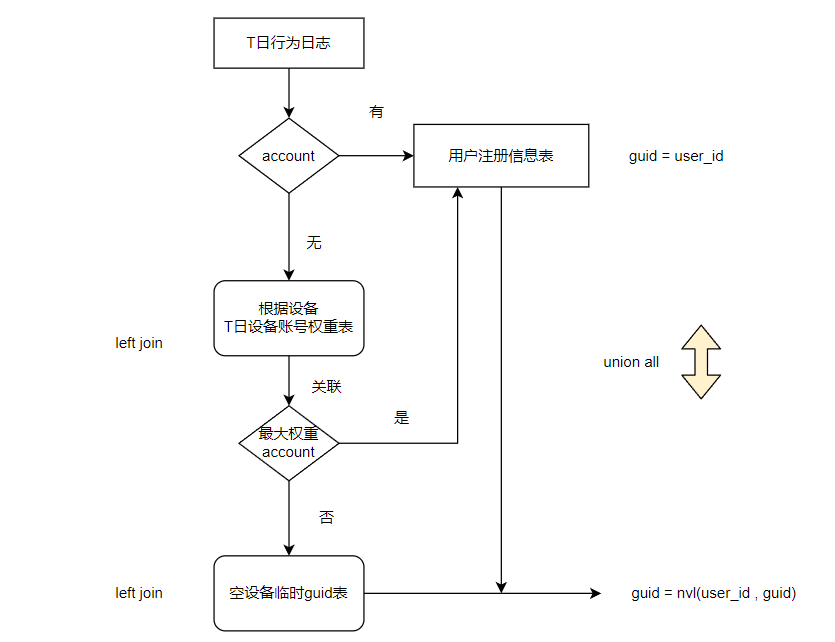

### 7.16
#### 项目背景和项目意义
背景：
为了高效利用现有业务产生的业务数据与平台采集的用户行为数据，帮助运营人员更精准的制定营销策略，进行精细化运营，以提升产品营销转化率、增加用户黏度，提高盈利水平。
意义：
1. 数据的可视化直观的展现了公司的运营状况，使运营人员得以准确的制定营销策略；
2. 通过对用户行为的分析，对用户进行精准推送；
3. 改善公司的运营流程。
#### 项目基本架构
我们项目的架构主要可以分数据采集、数据仓库、数据服务三块：
1. 数据采集：前后端埋点获取用户行为数据存储在日志服务器，业务系统数据库mysql存储业务数据，二者分别通过flume、sqoop传入到数据仓库的数据接入层。
2. 数据仓库主体，我们的数仓分为三层：
    - ODS层（原始数据层）:存放原始数据，直接加载原始日志、数据，保持数据原貌不做处理；
    - DW层（数据仓库层），由DWD、DWS组成：
    - DWD层（明细数据层）：对ODS层的数据进行清洗、预处理，采用一些维度退化手法，将维度退化至事实表中，减少事实表和维表的关联。
    - DWS层（服务数据层）：以DWD层的数据为基础，进行轻度汇总，整合汇总成分析某一个主题域的服务数据，一般是宽表。
    -  ADS层（数据应用层）：根据需求，以DW层的数据为基础，进行报表开发。
3. 数据服务：通过数据查询接口、引擎拉取ADS层的数据，进行分析、可视化，支撑OLAP分析平台。

#### 用到的技术栈
- 数据采集系统: Flume , Sqoop
- 数据存储: Mysql , HDFS ,Hbase
- 数据计算: Hive ,Spark
- 资源调度系统: Yarn
- 快速查询: Presto    快速查询
- 数据看台: SuperSet  展示数据
- 任务调度:  DolphinScheduler    azkaban 
- 元数据管理: Atlas 

#### flume采集本地数据到HDFS，生成一个大文件
```conf
# 默认数据大量的小文件  , 改变输出策略   ,128M滚动一个输出文件
# 默认是30秒滚动生成一个文件  0 禁用时间滚动生成文件
a1.sinks.k1.hdfs.rollInterval = 0
# 默认是1K滚动生成一个文件   128M生成一个文件
a1.sinks.k1.hdfs.rollSize = 134217728
# 默认是10条Event生成一个文件  0 代表禁用以事件个数生成文件的策略
a1.sinks.k1.hdfs.rollCount = 0
```
---

### 7.17
#### 你在项目里主要的核心工作有哪些
主要的工作内容有：1.对接并梳理业务需求,开发数据仓库模型,设计相关主题的事实表和维度表等；2.对原始数据进行转化处理；3.完成业务需求指标。
次要的工作内容有：任务调度脚本的编写、数据质量的监测、元数据的管理。


#### flume的核心组件和功能
Flume中最核心的角色是agent，每一个Agent都是一个独立的守护线程（JVM），负责从数据源接收数据发送到目的地，一个个agent连接起来形成flume采集系统。

每一个agent相当于一条数据(被封装成Event对象)传递员，内部有3个核心组件： 
- Source：数据源组件，用于跟数据源对接，获取数据； 
- Channel：传输通道组件（缓冲区），用于协调和解耦source & sink；
- Sink：下沉组件，用于往下一级agent传递数据或者向最终存储系统传递数据。

#### 拦截器的作用与自定义拦截器的开发步骤
Flume在运行时，可以通过拦截器来实现对Event进行修改或丢弃。

自定义拦截器的开发步骤：
1. 定义一个类，实现Interceptor接口；
2. 实现四个方法：initialize、Event intercept、List intercept、close，方法的作用分别是初始化拦截器、拦截每条事件处理、处理所有事件、拦截器结束；
3. 创建一个静态内部类拦截器构建器，因为自定义拦截器的类无法直接new，需要通过flume配置文件调用静态内部类，来间接地调用自定义的拦截器对象。

#### 你们工作时使用的是什么source、channel,为什么使用他们
source我们用的是Taildir Source，因为它比较可靠的，即使发生文件轮换不会丢失数据。它有一个专门记录每个文件的最后读取位置的JSON格式文件。如果Flume停了，可以从文件的标记位置重新开始读取。另外它读取的规则是先来先走，按照修改时间的顺序来读取。（缺点不支持读取二进制文件。只能逐行读取文本文件）
channel我们用的是File Channel，因为如果使用Memory Channel，虽然说数据吞吐快，但在发生故障时会有数据漏采，而File Channel能通过设置检查点文件,对数据进行恢复。

---
### 7.19
#### flume的事务了解吗? 说一下flume的事务：事务分类,事务的流程,事务效果 
flume的事务有put事务和take事务，能保证数据至少被执行一次。
put事务：
source采集一批数据封装为event后，会开启事务。put事务首先执行doPut方法，将这批event写入到临时缓冲区putList，然后执行doCommit方法检查channel的容量是否足够合并，channel的容量足够则缓冲区的event与channel合并，提交event成功；若channel容量不足，则将对event回滚，将putList中的数据清除掉，告知source数据未采集，重新采集这批数据，开启新事务。
take事务：
调用doTake方法将channel中的event剪切到临时缓冲区takeList，同时也拷贝一份event发送到写往hdfs的IO流中，如果event全部发送成功，调用doCommit方法清除takeList，如果发生过程中出现异常，调用doRollback方法回滚，将takeList中的event全部归还给channel，不过这个操作可能会产生数据重复。

flume的事务仅能保证两个传输阶段的数据不丢，如果channel选用memory channel，一旦channel发生异常，数据仍然可能发生数据丢失，如果采用file channel，虽然数据传输到channel时会落盘，但结合事务能保证整体上数据不丢失，不过也有可能产生数据重复的问题。

#### 什么是flume的failover机制
Flume的failover机制是在上游配置多个sink , 组成一个失败会自动切换的sink组，同一个sink组中的sink根据配置的sink优先级来进行日志采集﹒优先级别高的sink作为主sink进行处理数据，优先级低的sink作为备用sink。当主sink出现故障时,channel负责切换到备用sink上.在数据采集的过程中会不断地尝试主sink是否恢复。

#### flume的内部的主要组件
- Source：数据源组件，用于跟数据源对接，以获取数据； 
- Sink：下沉组件，用于往下一级agent传递数据或者向最终存储系统传递数据；
- Channel：传输通道组件（缓冲区），用于协调和解耦source & sink；
- interceptor拦截器：可以通过拦截器来实现对Event进行修改或甚至丢弃，为用户提供数据处理的逻辑；
- channel selector选择器：一个source可以对接多个channel，channel selector决定event在channel之间的传递策略。选择器有两种实现，默认为replicating（复制），另一种是multiplexing（多路复用），使用多路复用可实现负载均衡、并行输出。

#### 说说flume的优化
1. 事务：保证数据完整性；
2. 级联：保证生产安全；
3. failoverHA：热备模式，提高容错，应对积压问题；
4. 上下游之间的avro传递使用压缩、通过多sink实现多线程；
5. 使用选择器：负载均衡、并行输出，提升数据写HDFS的效率。

---
### 7.20
#### 日志采集系统的优化
1. 使用Taildir Source+File Channel保证数据的完整性；
2. 配置成failover sink组，实现HA模式，防止产生数据积压；
3. 上下游之间的avro传递使用压缩 compression-Type，提高传输效率；
4. 下游agent使用选择器，实现多sink并行输出；
5. hdfs上的数据按照gzip格式存储。
#### 日志采集系统数据积压问题总结
原因：下游出现故障或写出数据跟不上读取速度，导致channel中的数据积压过多。

首先我们的配置采用的是富裕配置，在采集上游配置了failoverHA，避免了上游的积压，
然后在采集下游我们配置了多channel负载均衡，多个sink并行输出，也避免了下游的积压。

#### 数据量问题 业务特征 规模 用户规模  计算 (时长, 事件频次, 日志数据大小 ,用户数据)
5000w用户  日活15%  750w
每天平均访问20分钟，10s产生一条日志，0.5k
每天总数据：750w*20*6*0.5=450000000kb=440000M=430G
平均5M/s,考虑业务高峰期是平时的15倍，高峰期时也就是75M/s
第一层3台flume服务器，每台服务器最大数据25M/s
第二层1台flume服务器，汇聚上层3台服务器数据最大75M/s
我们的服务器采用的是富裕配置，avro sources数据传输速度是150M/s，所以这个数据量是没多大压力的。
此外还配置了failoverHA模式提高容错防止数据积压，并且下游agent还配置了选择器进行多sink并行输出（单个35M/s）。

#### 数据延迟 ,数据丢失 , 数据重复
**数据延迟：**
原因：
1. 数据传输有延迟；
2. 数据是批次处理的，不满足一批不会执行；
3. 网络延迟。

解决：
1. 数据划分以拦截器获取的日志时间为准；
2. 将统计计算任务向后推1h，计算任务在第二天1：00开始；
3. 在3：00的时候检查统计时与此时的数据条数的变化，根据延迟阈值判断是否重新计算。

**数据丢失：**
我们的flume采集是不会丢数据的  
  - 我们第一级采用了taildir source，它实现了flume的事务机制，也记录了数据读取偏移量；
  - 两级agent都采用了file channel，数据落地磁盘 ,并且有checkpoint（内存队列的快照）机制；
  - sink有时事务保证,下游落地后才会conmmit事务

**数据重复：**
我们的flume采集确实会出现数据重复问题，比如sink向channel取数据的事务执行到一半发生了错误，那么这整批event将会再次执行。
数据重复判断：
我们有数据管理平台，可以汇总各个服务器产生以及hdfs接收的日志条数，两者进行对比就可以判断是否有数据重复。 
数据重复应对：在报表计算任务之前判断是否有重复，若有则先执行一个去重计算任务。
行数统计：
本地文本 cat file | wc -l
hdfs hdfs dfs -text filepath | wc -l


---
### 7.23
#### 为什么开发数据质量服务平台
数据质量服务平台主要有两个作用：
一是日志上报服务，在对前一天的数据采集工作完成后，日志服务器与hdfs集群会通过脚本统计日志产生与接收的条数，然后通过POST请求数据质量服务平台API，将数据（日志来源、类型、条数、日期）上报到数据质量服务平台，数据质量服务平台通过Mybatis框架将其存储到MySQL表中。
另外一个作用就是日志条数查询，也就是通过请求数据质量服务平台的API，查询存储日志统计信息的MySQL表并返回日志条数。通过对日志条数的对比，我们可以知道数据是否有重复采集的问题。

#### 数据去重流程
(首先我们会通过脚本请求数据质量服务平台，获取各个日志服务器产生的日志总行数以及HDFS接收到的的日志总行数，对二者进行比较判断是否需要去重。)
如果需要去重，我们可以通过Spark-SQL、Spark-Core或者Hive-SQL进行去重。
如果使用hive的话，我们会先创建一张按日期分区的外部表，将原始日志目录中的数据映射到分区表下，然后使用group by进行去重，通过 insert  overwrite table...select...将去重后的数据(.gz)覆盖掉原来的数据或者输出到去重文件夹中。

#### 数据入库(表有结构)流程
在对日志数据进行去重以后，会对数据进行入库操作，将其载入ODS层。
首先我们会创建一张按日期分区的外部表(设置压缩格式)，配置JsonSerde使其数据结构按json格式进行映射，然后再通过脚本将去重后的数据加载(load)到指定表的指定分区下，对入库的结果可以使用邮件通知。

#### 讲一下数据预处理
采集到的原始数据一般都会存在脏数据，为了提高数据的质量并方便后续对数据的操作，是需要对数据进行预处理的。
预处理分为四个步骤：
第一步是数据清洗，主要是使用删除或者替换对一些异常或者缺失的脏数据进行处理；
第二步是数据集成，是将多个数据源合并到一个数据存储中，这里面主要要注意的是一些同名异义、异名同义或者冗余的字段；
第三步是数据变换，主要是通过一些简单的函数变化或者规范化，将数据转换成适当的形式；
第四步是数据规约，是通过如聚集、删除冗余特征等方式，在尽可能保持数据原貌的前提下，来精简数据量，提高运行速度。

---
### 7.26
#### 数据从ODS层到DWD层的预处理流程：
**清洗过滤**：首先我们会对数据进行一个清洗过滤，主要是过滤掉一些废弃字段、关键字段缺失的记录，再将清洗后json格式的数据打平，解析成ORC格式。
**session分割**：由于app会话有会话保持策略，我们接下来会对app端的数据进行一个session分割，我们有对应的spark脚本进行处理，其中的计算逻辑是先按用户分组，组内按时间进行排名，取当前记录与下一条记录的时间求差值，如果差值大于30分钟，就将新字段值记为1，否则为0，然后按用户对标记值进行一个sum累加，将会话号session与sum值进行一个拼接，生成一个新字段new_session作为用户会话的一个判断依据。
**数据规范化**：在session分割后，我们会进行一个数据规范处理，比如说统一各端日志的日期与布尔值格式，以及将空值统一为null。
**地理位置集成**：地理位置信息集成本质上是做了一个维度退化，可以减少后续的join运算。我们是依据用户行为日志里的经纬度进行地理位置信息补全的，使用了GEOHASH算法。在本地MySQL库里有地理位置信息表，在进行位置信息补全时，会将这个表中的数据加载出来作为一个数据字典，我们会将日志数据中的经纬度转换成一个GEOHASH值，从数据字典中匹配是否有相应的数据，如果有，就将对应的地理位置补充到日志数据中，如果没有，我们会根据经纬度去查询网络，通过高德的一个API获取到相应的地理位置，将其补充到日志数据中，并且将这条字典中不存在的数据补充到MySQL地理位置信息表中。
像没有经纬度的web端数据以及经纬度获取地理位置失败的数据，我们会根据其ip地址进行位置集成，原理和过程跟经纬度手段差不多。
**生成guid标注**：为了提高用户行为分析的准确性，我们需要对每个用户的每一条访问记录打上一个全局唯一的用户标识ID。对此我们的设计方案是使用账号和设备进行动态绑定：
对于用户的行为数据，如果有账号，去关联用户信息表，获取用户的uid作为数据的唯一标记；
如果这条数据没有账号，首先去关联设备和账号绑定权重表，取这台设备权重最大的账号的uid；
如果这台设备没有绑定过账号，我们会为这台设备生成一个临时的guid(nvl(max(guid) , 100000000))，并将其加入到空设备临时guid表。然后我们会根据这四个表进行全局唯一guid的开发。
> - 用户注册表开发
> 用户信息存储在MySQL中，有一个自增的user_id字段，将其中的数据导入hive中，每天对新用户作增量导入。
> - 设备和账号绑定表开发
> 记录每台设备登录过的账号信息, 并根据账号的日访问次数(每天的session)和当日是否访问计算设备和账号的权重信息，计算逻辑：
> T日行为数据 full join T-1设备账号绑定表
> 关联条件是设备和账号完全一致
> T日登录 , T-1设备账号绑定表中有数据   权重+
> T日登录 , T-1设备账号绑定表中没有数据   权重新增(新计算)
> T日没登录. T-1的权重数据递减50%
> 更新数据
> - 空设备临时guid表开发
> 找出T日完全没有出现账号的空设备
> 关联T日设备账号绑定表 过滤没有关联上的
> 再去关联空设备临时guid表  过滤没有关联上的
> 经过两步过滤后留下的是完全没有账号和临时guid的数据 生成临时guid 
>                      原来空设备表中最大guid + row_number的临时guid
> 将结果插入到T日的设备临时guid表中 
> - 全局唯一GUID开发
> 从用户行为数据中获取有账号的数据  关联用户信息表   user_id--> guid
> 没有账号的数据 , 历史账号(权重最大)  关联用户信息表   user_id--> guid
> 去空设备临时guid  获取guid数据


在数据预处理完成以后，将数据导入到DWD明细层。

---

做报表是  有需求  分析度量和维度   确认计算逻辑
发现有些度量不能直接计算,比如(退出页,入口页),或者有些维度(比如访客新老属性)需要计算构建
提前计算出要计算的维度 , 同时观察是否还有未知的维度需要提前计算(比如 : 跳出会话 , 访问来源类型)

- 粒度
