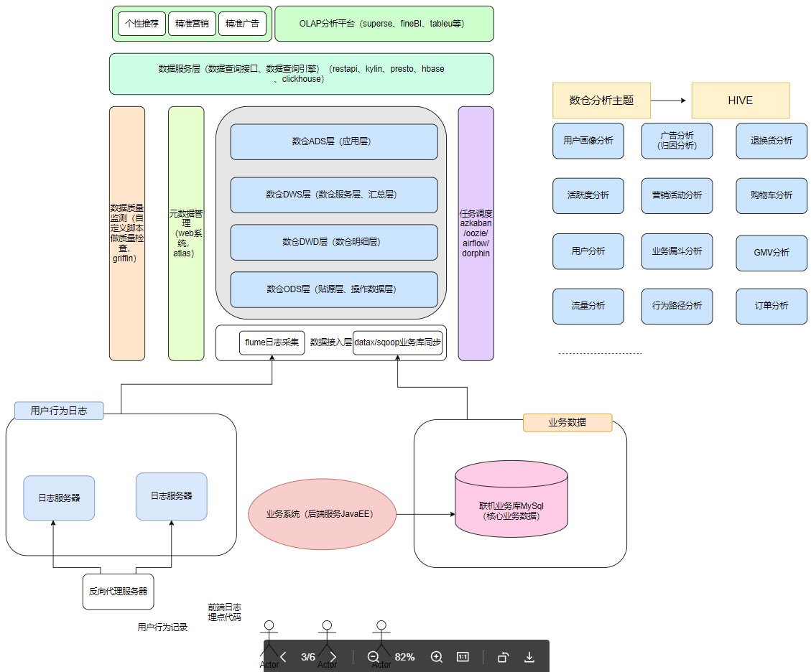
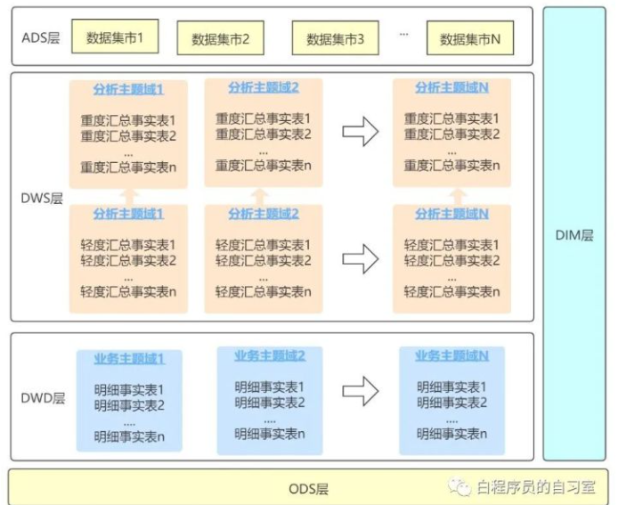
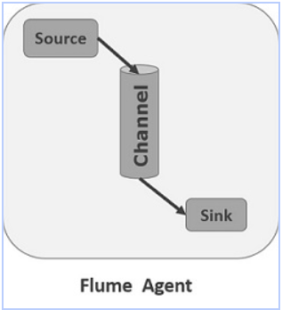
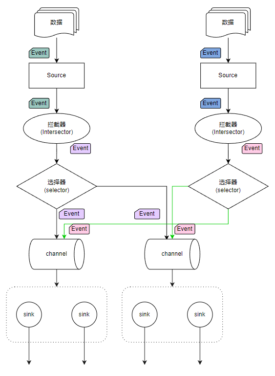

# 离线数仓
## 1 项目综述
### 1.1 项目背景
为了高效利用现有业务产生的业务数据与平台采集的用户行为数据，帮助运营人员更精准的制定营销策略，进行精细化运营，以提升产品营销转化率、增加用户黏度，提高盈利水平。

### 1.2 项目意义
1. 数据的可视化直观的展现了公司的运营状况，使运营人员得以准确的制定营销策略；
2. 通过对用户行为的分析，对用户进行精准推送；
3. 改善公司的运营流程，比如说公司推出了一个优惠券抢购的活动，流程是点击链接》进入活动》登陆注册》抽奖》领取优惠劵》下单，将这个活动的用户行为数据采集转化后进行漏斗分析，发现登陆注册到抽奖这一步转化比有异常，分析认为是登陆环节影响了用户体验，于是调整活动流程，将登陆注册这一步换到领取优惠券后面，调整后再次进行漏斗分析，转化率得到了明显提升。

### 1.3 数据来源
- 采集业务系统的日志服务器上的用户行为数据；
  - 前端埋点
  - 后端埋点
- 抽取业务系统的联机业务数据库MySQL中的业务表数据；
- 从第三方数据结构获取的外部数据；
- 爬虫爬取的数据。

### 1.4 项目需求
1. 各个平台用户行为数据采集
2. 业务数据迁移
3. 各个类型数据,预处理
4. 数据仓库设计和建模
5. 主题分析:页面, 用户,设备,地域,事件,订单,流量等各个主题分析
6. 报表统计 / 报表数据展示
7. 即系查询分析,实时指标分析
8. 元数据管理,数据质量检测
9. 任务调度,告警
10. 用户画像

### 1.5 技术选型
- 数据采集系统: Flume , Sqoop
- 数据存储: Mysql , HDFS ,Hbase
- 数据计算: Hive ,Spark
- 资源调度系统: Yarn
- 快速查询: Presto    快速查询
- 数据看台: SuperSet  展示数据
- 任务调度:  DolphinScheduler    azkaban 
- 元数据管理: Atlas 

### 1.6 项目架构和项目流程

> 页面端与客户端通过埋点收集用户行为数据，存储在日志服务器，业务系统产生的业务数据存储在MySQL数据库，两种数据分别通过flume、sqoop拉取到数据仓库的数据接入层。数据仓库用hdfs做存储，用hive做数仓整体的管理，用spark做底层运算引擎。
> 数仓的ODS层首先会拉取映射进来的数据，经预处理(去重、清洗、集成、session分割、统一字段名与数据类型)后，传入DWD数仓明细宽表层，然后对数据进行建模后传入DWS数仓服务层，对DWS层的数据进行报表开发后再传入ADS应用层，供数据服务层拉取使用。

### 1.7 核心概念
#### 什么是数仓
数仓顾名思义就是存储数据的仓库，是一个为数据分析而设计的企业级数据管理系统，它可以集中、整合多个信息源的大量数据，将数据有规则的进行组织与存储，使我们可以借助数据仓库对其中的数据进行分析，从而改进企业的运营决策。

**数仓与数据库区别**
数据库是为捕获数据而设计，数据仓库是为分析数据而设计。
数据仓库是面向历史的,不仅仅是为了存储,管理 , 计算数据, 根据业务构建仓库系统, 针对具体的业务需求设计 ,功能丰富；
数据库(mysql , hbase , redis)是面向业务的， 具有单一性和通用性, 针对业务的数据进行存储和使用。

#### 什么是主题

#### 什么是分层

#### 什么是度量/指标

#### 什么是维度

#### 业务、业务系统、业务流程

### 1.8 数仓构建流程
定义维度->构建总线矩阵-明确维度-> 明确度量
按照事务型事实表的设计流程，选择业务过程->声明粒度->确认维度->确认事实

## 2 日志数据采集
flume是一个分布式、可靠、 高可用的海量日志采集、汇聚和传输的系统，可以从各种各样的数据源（服务器）上采集数据传输（汇聚）到大数据生态的各种存储系统中（Hdfs、hbase、hive、kafka）。

### 2.1 flume核心组件
Flume中最核心的角色是agent，每一个Agent都是一个独立的守护线程（JVM），负责从数据源接收数据发送到目的地，一个个agent连接起来形成flume采集系统。

每一个agent相当于一条数据(被封装成Event对象)传递员，内部有3个核心组件： 
- Source：数据源组件，用于跟数据源对接，获取数据； 
- Channel：传输通道组件（缓冲区），用于协调和解耦source & sink；
- Sink：下沉组件，用于往下一级agent传递数据或者向最终存储系统传递数据。

### 2.2 agent内部架构

#### Event
Event是数据在agent内部流转的封装形式，Event封装对象主要有两部分组成：Headers和Body。header是一个map集合于携带KV形式的元数据；body是一个装载具体的数据内容的字节数组byte[]。

#### interceptor拦截器
Flume在运行时，可以通过拦截器来实现对Event进行修改或丢弃。
source产生的event会被传入拦截器根据需要进行拦截处理，且拦截器可以组成拦截器链，
同时用户也可以自定义拦截器。

> 自定义拦截器的应用：
> 使用本机的当前时间语义创建的目录 , 可能和数据的时间不一致，比如第一天23:59:59产生的日志数据传入本机后被划分
> 到第二天，这时可以自定义拦截器 , 抽取日志中的时间戳 , 转换成指定的时间格式, 将时间存储在事件(Event)头中,据此
> 进行存储。

#### channel selector
一个source可以对接多个channel，则event在这n个channel之间传递的策略，由配置的channel selector决定；  
channel selector有2中实现： replicating（复制），multiplexing（多路复用） 

#### sink processor
event在一个组中的多个sink间如何传递，则由所配置的sink processor来决定；
sink processor有2种： load balance (round robing)和 fail over 
flume安装入门

### 2.3 Transaction：事务机制（数据传递语义）
数据传递的三个语义：
-  At least once  至少处理一次
-  At most once  最多处理一次
- Exactly once    精准处理一次
Flume并没有实现Exactly once
Flume使用两个独立的事务：
-  put操作：source读取数据源并写入event到channel
-  take操作：sink从channel中获取event并写出到目标存储

