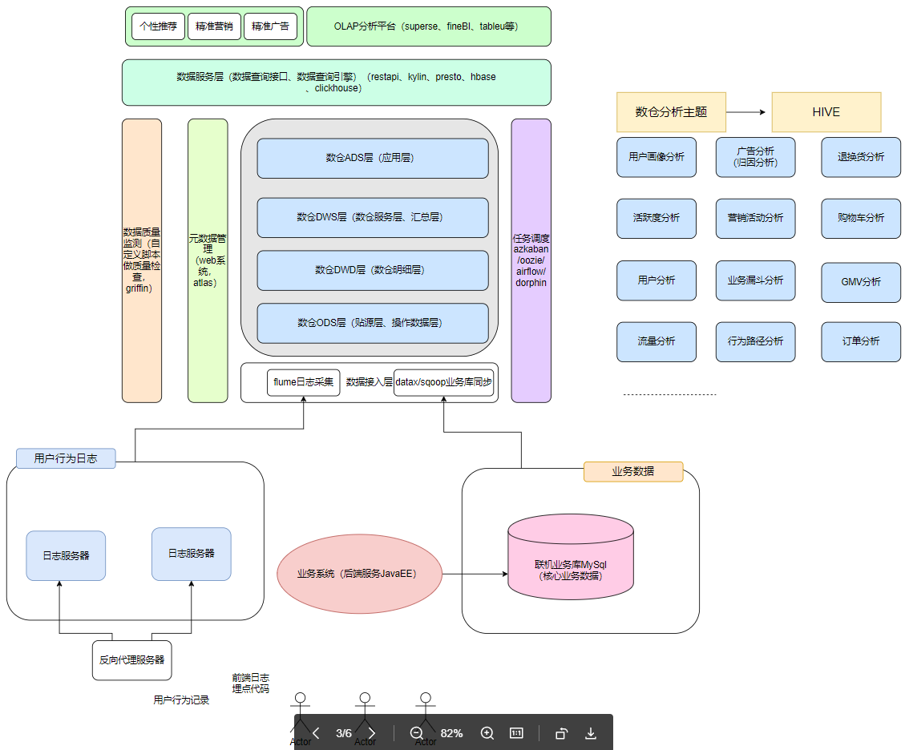

# 离线数仓
## 1 项目综述
### 1.1 项目背景
为了高效利用现有业务产生的业务数据与平台采集的用户行为数据，帮助运营人员更精准的制定营销策略，进行精细化运营，以提升产品营销转化率、增加用户黏度，提高盈利水平。

### 1.2 项目意义
1. 数据的可视化直观的展现了公司的运营状况，使运营人员得以准确的制定营销策略；
2. 通过对用户行为的分析，对用户进行精准推送；
3. 改善公司的运营流程，比如说公司推出了一个优惠券抢购的活动，流程是点击链接》进入活动》登陆注册》抽奖》领取优惠劵》下单，将这个活动的用户行为数据采集转化后进行漏斗分析，发现登陆注册到抽奖这一步转化比有异常，分析认为是登陆环节影响了用户体验，于是调整活动流程，将登陆注册这一步换到领取优惠券后面，调整后再次分析转化率得到了明显提升。

### 1.3 数据来源
- 采集业务系统的日志服务器上的用户行为数据；
- 抽取业务系统的联机业务数据库MySQL中的业务表数据；
- 从第三方数据结构获取的外部数据；
- 爬虫爬取的数据。

### 1.4 项目需求
1. 各个平台用户行为数据采集
2. 业务数据迁移
3. 各个类型数据,预处理
4. 数据仓库设计和建模
5. 主题分析:页面, 用户,设备,地域,事件,订单,流量等各个主题分析
6. 报表统计 / 报表数据展示
7. 即系查询分析,实时指标分析
8. 元数据管理,数据质量检测
9. 任务调度,告警
10. 用户画像

### 1.5 技术选型
- 数据采集系统: Flume , Sqoop
- 数据存储: Mysql , HDFS ,Hbase
- 数据计算: Hive ,Spark
- 资源调度系统: Yarn
- 快速查询: Presto    快速查询
- 数据看台: SuperSet  展示数据
- 任务调度:  DolphinScheduler    azkaban 
- 元数据管理: Atlas 

### 1.6 项目架构和项目流程

> 页面端与客户端通过埋点收集用户行为数据，存储在日志服务器，业务系统产生的业务数据存储在MySQL数据库，两种数据分别通过flume、sqoop拉取到数据接入层，
数仓与数据库区别

离线与实时的区别

项目背景

业务、需求、指标（度量）

报表的表现形式：离线分析、OLAP即时查询

离线数仓的价值和意义

背景与自我介绍：

数据来源（类型）

项目架构

前段埋点、后端埋点

seesion是什么
seesionID的作用、如何处理

日志采集》储存》预处理》建模

flume
flume是一个分布式日志采集系统，可以采集个数形式的源数据，它的核心角色是agent，agent有三个核心组件，
- Source：数据源组件，用于跟数据源对接，以获取数据；它有各种各样的内置实现； 
- Sink：下沉组件，用于往下一级agent传递数据或者向最终存储系统传递数据 
- Channel：传输通道组件（缓冲区），用于协调和解耦source & sink 
  
flume安装入门